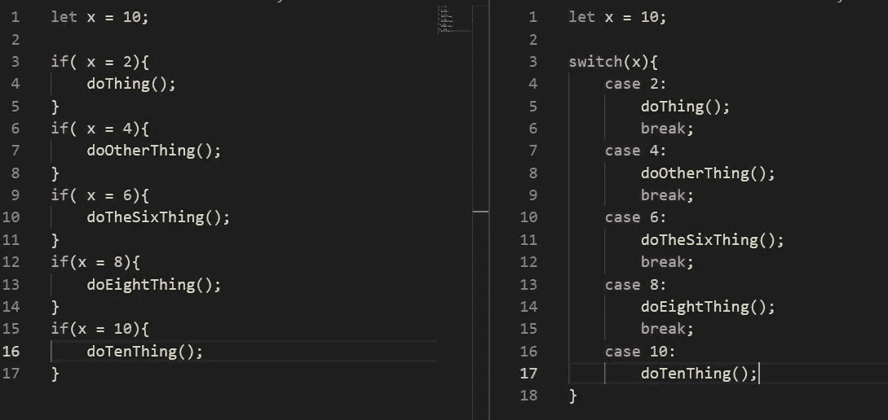

# 即使是真正优秀的程序员也会犯这些错误

> 原文：<https://betterprogramming.pub/common-mistakes-programmers-make-e333cdbd0708>

## 所有程序员都会犯的常见错误，包括编码和理论

照片由 [PxHere](https://pxhere.com/en/photo/1078216) 拍摄

每个人都会犯错，我们程序员也不例外。我们倾向于认为，如果我们的代码运行，我们已经避免了错误，可以拍拍自己的背，享受应得的胜利饮料。

*然而*“刚刚运行”的代码不应该成为我们衡量成功的基准！非破坏性错误仍然是有问题的，特别是对于可维护性。没有人能写出完美的代码，但是作为一个社区，我们特别容易犯一些错误和疏忽。它们是很容易避免的，而且它们对我们的项目质量有明显的影响。

让我们来看看所有技能水平的程序员最常犯的一些错误。我要把列表分成两部分。首先，我们将讨论编码错误。实际的“螺母和螺栓”编码问题普遍存在，但很容易补救。其次，我们将检查一些较大的基于理论的问题，这些问题不太明显，但会影响生产率和可维护性。

# 编码错误

## 遗忘开关存在

让我们以一点争议开始我们的列表。关于`switch` 是否比老式的`if`更好，程序员之间有一些争论。在上面的例子中，你可以看到`switch`语句实际上比`if`多占用了一行代码。我也看到基准测试表明在某些情况下`if`实际上比`switch.`更快

那么，为什么我会完全落入支持切换的阵营呢？因为对我来说，使用`switch`语句比使用多个`if`语句更优雅、更有内涵。它具有更强的可读性——它是实现一个目标的一个清晰的代码块:进行比较并对结果做一些事情。

多个链接的`if`语句感觉是开放式和非结构化的——更像意大利面条式的代码。即使伴随着结束的`else`语句，它们看起来也像是按顺序运行的不相关的操作，因为它们本质上就是这样。

## 不注释代码

注释代码就像为退休储蓄——我们都知道我们应该这样做，但是我们经常不这样做。我们告诉自己以后会回来弥补，但很少会这样做。

良好的代码注释的重要性现在应该是不言而喻的了，但是每天都有数以千计的函数在没有任何上下文或解释的情况下被发布。

对您来说似乎显而易见或不言而喻的事情，对一个希望在项目中实现您的功能的新手来说，可能看起来像是古代拉丁语中的魔法咒语。

花一点时间加入一段代码如何工作或者为什么它是必要的快速描述性注释是非常简单的事情。在编写代码时，花些时间并养成注释代码的好习惯。这不仅减少了你未来的技术债务，而且当你几个月甚至几年后回到一大块代码上，需要理解你写的时候在想什么的时候，这也可以节省你的时间。

## 超大功能

功能膨胀发生了。这是开发过程的自然结果，因为我们知道如何为我们的应用程序实现我们想要的功能。

然而，随着应用程序的成熟，过大的函数会成为一个真正的问题。通常，它们的效率比抽象成多个更小的函数低得多，这会影响应用程序的性能。

除了速度问题，它们也使得维护和改变你的项目更加困难。当一个函数对一段数据做四种不同的事情时，像可变范围或应用程序状态这样的问题会变得更难管理。

# 发展理论的错误

## 使用新的框架只是因为

我以前写过开发者应该[害怕没有框架](https://medium.com/swlh/programming-in-the-time-of-giants-d7c87b140d11)，但这并不等同于说你必须使用每一种让 Github 成为明星的新编码时尚。

在某些情况下，新框架可能会令人兴奋，并提供真正更好的做事方式。评估新的框架是否真的有利于你实现项目的目标是很重要的。通常，你会发现答案是否定的。

无论如何，尝试新的框架，但是不要因为它们很热门就觉得必须围绕它们来设计你的最新应用。

记住，最好的前进道路是让你真正完成项目并交付的道路。花三个月的时间试图把它硬塞进一个新的框架可能会令人沮丧，而且非常低效，往往会导致失败和浪费时间。

## 不打算

新项目可能会令人兴奋。有了一个好主意并立即着手去做，可以建立有价值的动力和能量，但是，在某一点上，项目的范围将开始失去控制。

花些时间在白板或笔记本上写出一些架构是非常有价值的，也是开发人员经常跳过的一步。大胆前进，相信自己会把一切都记在脑子里，这很有诱惑力，但最终是不现实的，会适得其反。

代码&奎尔为这类工作制作了一些令人惊叹的笔记本(没有任何关系，只是一个粉丝)。学会在开发的正确点放慢速度，并做一些规划，可以在保持数据结构和应用程序流程正常的道路上获得巨大的回报。

## 不合作

很少有什么事情能比与其他程序员合作更快地让你成为更好的开发人员。合作让你对问题或潜在的解决方案有了新的思考方式，它能激发灵感。

有时候，另一个程序员会有更好的方法来处理应用程序开发的某些部分。更常见的是，你会发现把他们的想法和你自己的结合起来会产生一个比你们任何一个人独立完成的都要好得多的解决方案。

如果你使用 Visual Studio 代码(我的首选 IDE)，它内置了一个令人惊叹的对等编程解决方案，叫做 [Live Share](https://code.visualstudio.com/blogs/2017/11/15/live-share) 。Live Share 允许你和你的队友同时在一个代码库上工作，而不需要复制 GitHub repos 或者来回发送邮件。它快速、直观、简单。

说到底，每个程序员都有自己的流程。然而，尽管我们有所不同，我们大多数人还是会犯一些同样的错误。其中许多是如此容易补救，值得列出来。

对你的方法做一些小的调整，无论是在代码层面，还是在你如何思考你的架构方面，都可以节省你的时间，让你更成功。

也许有些事情对你来说并不像是错误。这很好，但是对于我们中的许多人来说，做出这些改变可以从根本上提高我们的输出和代码库的可维护性。这给了我们更多的时间去创造下一个神奇的东西！