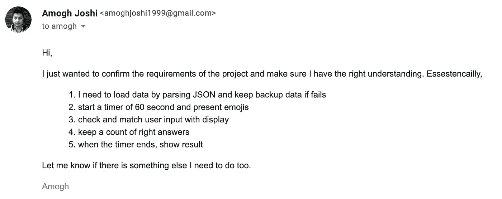

# 在带回家的编程项目中要避免的常见错误

> 原文：<https://betterprogramming.pub/common-mistakes-to-avoid-in-a-take-home-programming-project-bf58e6b048dd>

## 在下次面试中避免这些错误


在 [Unsplash](https://unsplash.com/) 上由[埃斯特·扬森斯](https://unsplash.com/@esteejanssens)拍摄的照片

带回家的项目是我在面试过程中最喜欢的部分。我认为它非常详细地揭示了一个开发人员的编程技巧。

我回顾了 20 多个带回家的项目，发现了一些开发人员反复犯的错误。这里有一个这些错误的综合列表，可以帮助你做下一个带回家的项目。

# 1.错误的理解

如果您误解了需求，您可能会花费很长时间来开发错误的项目，这对您的应用程序毫无帮助。对需求的深刻理解是至关重要的。

有疑问的时候，提问！在你开始编码之前问问题表明你已经花了时间去理解需求，并将实现所需要的。对你需要做的事情做一个五行总结，即使是一个小项目，然后发给给你发送挑战的招聘人员。下面是一封电子邮件示例，



开始“带回家”项目前提问的示例

当设计师向开发人员解释需求时，他们可能会花一周的时间来处理它——缺乏理解可能意味着你要花时间来制作一个超出需求范围的应用程序。这不仅增加了项目的开发时间，也意味着公司付给你一周的工资，因为你做了不需要的事情。

因此，当你有疑问时，在你开始做这个带回家的项目之前，一定要问问题，以确保你对所有的要求都有很好的理解。

# 2.未完成的项目

这是开发人员经常犯的另一个错误:一旦你完成了一个大的功能，你就把项目提交给了新人，遗漏了一些关键的需求。

确保你浏览了整个需求列表，并将你的应用程序的用户界面与实际设计进行了比较。您总是有可能忽略需求。

这样做显示了你的耐心和对细节的关注。错过一个需求可能会延长项目的时间线，并导致开发人员错过一个截止日期，因此冒着一个糟糕的性能评审的风险。

将需求作为一个清单，在提交项目之前最后看一下。

# 3.硬编码字符串！

硬编码字符串是指在代码中的多个位置使用相同的字符串。这是一种糟糕的编程实践，因为如果您决定在代码中的一个地方更改该字符串，您需要手动在代码中的每个地方进行更改，对于大型项目来说，这可能会花费开发人员很多时间。

在评审自己的项目时，高级工程师大多是在寻找你的编码风格。硬编码的字符串很容易被注意到，并立即发出危险信号，所以总是为常量维护一个单独的文件。

这里有一个硬编码字符串的例子，在输入视图控制器的标识符时使用。

```
let vc = self.storyboard?.instantiateViewController(identifier: “SomeViewControllerIdentifier”)
```

如果上面的代码在我们的项目中多次使用，并且我们决定更改标识符的名称，我们将被要求在代码的其他地方也更改这个硬编码的字符串`SomeViewControllerIdentifier`。

更好的方法是为常数创建一个单独的类，并使用对该常数类中的常数的引用来访问硬编码的字符串值。

硬编码字符串的示例解决方案

所以在上面的例子中，如果我们在 constants 类中改变了字符串值`someViewControllerIdentifier`一次，它将在我们项目的其他地方得到更新。

# **4。过度工程**

在需求之外增加功能来展示你的知识通常不是一个好主意。由于一个过度工程化的项目需要更多的时间来评审，评审者可能不会查看你的每一行代码，也无法判断你的编程技能。

此外，由于一个过度工程化的项目没有得到认真的考虑，你甚至可能会浪费时间在那些不需要的功能上。

例如，如果给你一个没有提到本地持久存储(例如:CoreData)或云存储(例如:Firebase)的项目，你就不应该实现它。

*一般来说，如果你发现自己编写的代码扩展了实际需求，你应该花点时间检查一下是否过度工程化。*

有时，需求可能是模糊的，不是非常清楚的，所以在这种情况下，在决定是否应该实现这个特性时，考虑问下面的问题。

这个特性会以一种有意义的方式扩展现有的需求吗？或者我只是因为它看起来很酷而想实现它

如果答案是后者，你就不应该使用这个特性。

**当完成一个带回家的项目时，你的目标是完成“足够好”的要求，以进入下一轮面试。不是唯一的面试阶段，不要把时间都花在上面。**

# 5.重新发明轮子

如果给你一些现有的代码，一个建议的方法，或者一些其他的资源/资产，你应该考虑使用它。使用所提供资源的一些原因如下:

*   这表明您可以在现有的代码基础上工作。
*   你的项目将是轻量级的(更少的代码)。
*   该项目将需要更少的时间来完成。

在开始工作之前，完全了解起始项目的布局总是一个好主意。

例如，假设你有一个创建渐变的扩展——你可以考虑使用这个函数来创建渐变，而不是自己做研究，想出一个不同的解决方案*。*

# 6.乱码

编写干净易读的代码是至关重要的编程良好实践之一。每种编程语言都有特定的工具，并且有通用的编程实践来帮助你编写干净的代码。

下面是一个混乱的代码示例。在这里，我们仅用一行代码就将自己声明为各种协议的代表。因此，很难理解我们的类中每个委托是在哪里实现的。

```
class SomeViewController: UIViewController, SPPermissionsDelegate, DeleteDelegate, PhotoDelegate, UITableViewDelegate, UITableViewDataSource, UITextViewDelegate{    //some code related to that class
}
```

Swift 中更好的方法是使用 extension 关键字，并使用`mark`关键字解释/划分功能。

混乱代码的示例解决方案:使用 extension 和 mark 关键字

其他一些例子可以是没有注释的 800 行代码、没有缩进的代码、重复的代码、五个嵌套的`if and else`语句等等！

编写干净易读的代码需要实践，每种语言都有一些特性/工具和指导方针来帮助开发人员实现这一点。做你的研究——你需要理解你的语言的行业标准，并遵循编写干净代码的一般编程实践。

# 7.未使用的代码和随机打印语句

删除任何不使用的代码是一个好的编程习惯。即使有些功能你可能认为在将来的某个时候会有帮助，或者如果它是你临时注释的一大块代码，当提交你的最终项目时，确保删除任何未使用的代码。

如果未使用的代码需要一定的重型框架，这将影响项目的整体性能。此外，巨大的注释代码块不仅对新开发人员有意义，还会使您的项目看起来杂乱无章。

此外，print 语句打印错误是可以接受的。然而，过度使用的 print 语句会使控制台看起来很混乱，并可能隐藏潜在的错误。打印语句来调试代码是一种幼稚的方法。相反，可以考虑在 IDE 中使用断点/观察点来防止随机打印语句。

*删除不用的代码(并对其进行整体重构)可能看起来是项目的最后一步，但它会对代码的可读性产生巨大的影响。*

# 8.没有评论也没有自述

读英语比代码容易，写评论吧！在处理大型项目时，编写简短、精确且有用的注释并维护详细的代码文档是至关重要的一部分。

在评审自己的项目时，做代码评审，通过注释理解程序员的逻辑变得异常容易。此外，当您重新访问旧项目时，您将能够轻松地浏览您的项目。

# 9.重复代码

重复代码导致代码凌乱，所以考虑尽量避免。每当你发现自己在项目中的两个不同地方写了相同的代码行，考虑重构它。这里有一些关于如何避免重复代码的提示。

*   **使用面向对象的方法**——将你的功能划分为不同的类并使用继承，将代码划分为常见任务的小函数，支持`Any`类型的函数编写通用代码，如果需要的话使用全局变量，使用设计模式(单例设计模式)以及许多其他方式

1.  使用设计模式——用设计模式(比如 MVC)来组织你的代码不仅使它更具可读性，还鼓励代码重用。
2.  **特定于语言的操作**——如果你的编程语言支持某些操作，如三元运算符或`.toggle`或任何其他鼓励代码重用的干净代码方法，请考虑使用它们。

遵循良好的编程实践来重构你的代码，不仅会使你的代码更加简洁，还会使它更加整洁，可读性更好。

# 10.不遵循行业标准

遵循一般的和特定于您的语言的通用标准会使您的代码对其他开发人员来说更容易阅读。如果不遵循，它们就像硬编码的字符串一样容易被注意到。

一个通用标准的例子是在命名类时使用大写字母作为第一个字符。另一方面，Swift 特有的技术可能是`viewdidload`中的方法调用，如下所示。

以上代码是 Swift 中编写`viewDidLoad`功能的标准方式。下面是一个不遵循通常标准的糟糕的编程实践。

花点时间去理解你的行业中最常见的标准，从命名一个变量到常见的 goto 框架。遵循这些实践使代码看起来专业而整洁。

# 结论

总而言之，我发现的最常见的错误是没有遵循良好的编程实践和过度工程化。熟悉通用的和特定于行业的标准当然有助于成为更好的开发人员。

非常感谢您阅读这篇文章。