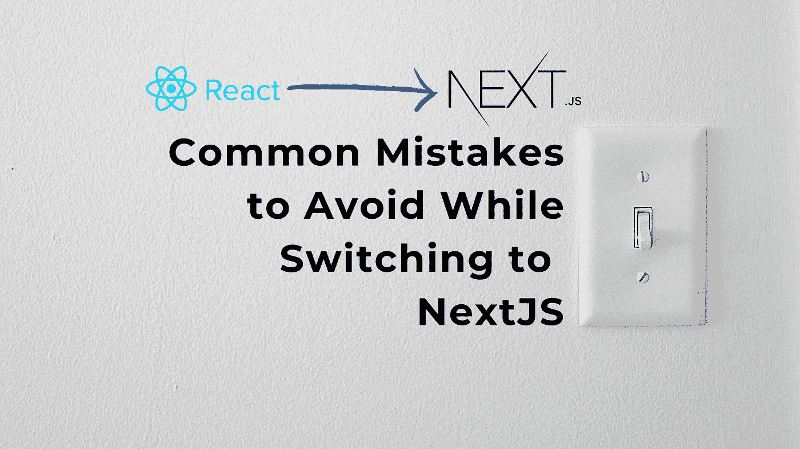

# 切换到 NextJS 时要避免的常见错误

> 原文：<https://betterprogramming.pub/common-mistakes-to-avoid-while-switching-to-nextjs-c06a45abd3bc>

## 如果您从 React 迁移到 NextJS，应该注意的错误

[伊莎贝拉和 Zsa Fischer](https://unsplash.com/@twinsfisch?utm_source=unsplash&utm_medium=referral&utm_content=creditCopyText) 在 [Unsplash](https://unsplash.com/s/photos/switch?utm_source=unsplash&utm_medium=referral&utm_content=creditCopyText) 上的照片

现在是 2022 年，NextJS 不再是一个可以取代 react 并提供一些重要功能的花哨框架，比如用 React 很难实现的 SEO 友好性。NextJS 现在被认为是 React 非常可行的替代品，甚至像网飞和 Deliveroo 这样的公司也在他们的应用程序中使用它

如果你是一名 React 开发人员，现在是时候为你的下一个项目选择 NextJS，或者了解它相对 React 的优势，以成功说服你的公司或客户在正确的项目中使用它。话虽如此，即使你正在使用 Angular 或 Vue 等其他框架，你仍然可以轻松快速地使用 NextJS 并开始在其中创建应用程序。在本文中，我们将讨论开发人员第一次迁移到 NextJS 时可能遇到的一些最常见的问题或错误。

# 1.窗口对象

如上所述，我们都知道 react 是客户端应用，next 是服务器端渲染，所以很明显在 NextJS 中默认情况下 window 对象是不可访问的。这是人们在试图在 NextJS 代码中使用窗口对象属性时最容易忽略的错误之一。例如，根据最大宽度分配一些动态 CSS 类，我们将使用窗口对象，但当您尝试运行应用程序时，它可能不会正确执行。

为了克服这一点，我们必须添加一些检查，以确保在我们试图访问它的属性之前，窗口对象已加载到客户端。我们可以这样做，在`useEffect` hook 中添加使用窗口对象的代码部分，就像这样。

注意——如果你在多个组件中重用这段代码，考虑让它成为一个钩子。

使用 window 对象定义屏幕是否小的示例代码。

# 2.编写媒体查询

众所周知，Media query 是开发人员最常用的基于不同屏幕动态应用 CSS 类的工具。但是对于像这样的媒体查询来说，网页的头部应该包含一个 viewport 的 meta 标签，它是由 react 这样的客户端应用程序自动设置的。在大多数情况下，人们用 NextJS 编写媒体查询，并注意到它们不起作用。这是因为，对于像 Next 这样的 SSR 应用程序，默认情况下不会添加相同的内容。要解决这个问题，只需在下一个/head 的*内的`_app.js`中添加 meta 标签。*

在 _app.js 中为视口添加 meta 标记。

# 3.SEO 标签

就像 viewport 一样，SEO 在抓取您的网页时通常会使用许多其他标签。并且在 react 中设置这些标签，人们习惯于通过修改文档对象属性或使用像 [React 头盔](https://github.com/nfl/react-helmet)这样的外部库来为页面设置这些标签。NextJS 是一个 SEO 友好的框架，允许我们用内置的`next/head`来设置这些标签。您可以直接在 NextPage 中设置属性，使用常量或事件中的公共值编写一个功能组件，该组件将导出所有带有动态值的标签。你可以看到下面的例子-

# 4.链接

在下一个 JS 中，路由之间的客户端转换可以通过由`next/link`导出的`Link`组件来实现。我们可以在 Link 中写一个`<a>`并给它们添加样式，因为我们不能直接给链接添加类。但是所有的链接在默认情况下都会有一个下划线，为了移除它们，我们可以通过 CSS 添加`textDecoration`属性。这可以通过 CSS 类(这是最佳实践)或内联 CSS 来实现。

# 5.在组件中使用 CSS

这是一个愚蠢但棘手的部分。在 React 应用程序中，我们可以编写基于模块的 CSS 并将其导入到组件中，或者简单地导入特定的 CSS 文件并在 className 属性中使用它们。许多人使用后一种方法，因为它允许直接使用没有样式对象的类，用连字符大小写的 CSS 类更容易编写。通常，人们用一个索引文件和一个 CSS 文件为组件创建文件夹，并像这样使用索引文件中的样式，

但是你不能在 NextJS 中遵循同样的模式。所以如果你习惯了上面的方法，你必须注意一些事情

*   创建一个 <filename>.module.css 或 Scss 文件，用于编写基于组件的 CSS。</filename>
*   将组件中的 CSS 作为样式对象导入。
*   使用`className ={styles.className}`应用 CSS。
*   除非您想使用括号符号，否则请使用大小写混合的类名。
*   尝试对一个元素使用单个类名，除非你想对 styles 对象使用字符串插值(不是很干净)

示例代码:-

# 6.使用下一张/图像

每个人都习惯于在网页上显示图片的 HTML ``。但是您会注意到，如果您尝试使用这个传统的 HTML 标记，NextJS 将抛出一个错误，要求您使用内置的 next/image。虽然 **next/image** 提供了更好的性能和自动图像优化，但是设置图像样式有点棘手。

例如，要设置宽度和高度，你必须使用附带的强制属性，而不是 CSS 类，就像我们习惯的那样。如果我们想调整图像的高度和宽度，使其具有响应性，我们必须为它们的高度和宽度属性定义变量，并动态地改变它们。这是推荐的方法。但是如果你想用老方法做事情，另一种方法是添加一个包装元素(div ),像往常一样在该元素上应用所需的 CSS，并为图像应用 `layout=fill`。但是请注意，这有一个缺点，包装 div 应该有`position: relative`。

# 7.静态资产

如果你是 react 开发人员，你可能习惯于将字体文件存储在“src”文件夹中。Create React App 使用`public`目录来存储[条目 HTML 文件](https://create-react-app.dev/docs/using-the-public-folder)，Next.js 使用它来存储静态资产。因此，你的字体和其他图像应该存储在 public 文件夹中，以便在 NextJS 应用程序中正确加载。例如，要在 next 中使用自宿主字体，

1.将字体文件添加到`/public/assets/fonts`

2.在你的`global.css`中声明字体

3.确保 global.css 被导入到您的`_app.js`中。

同样，您必须将任何图像、字体或其他静态资产移动到`public`文件夹，以便在应用程序中使用。

这些只是我在尝试将项目从 React 迁移到 NextJS 时遇到的一些问题。感谢阅读。