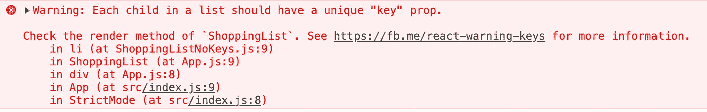
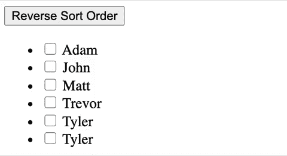

# 反应键的 3 个常见错误

> 原文：<https://betterprogramming.pub/common-mistakes-with-react-keys-384ec8c8044d>

## 使用钥匙的关键

[Jason D](https://unsplash.com/@jasondeblooisphotography?utm_source=medium&utm_medium=referral) 在 [Unsplash](https://unsplash.com?utm_source=medium&utm_medium=referral) 上拍照

刚开始学习时，很容易被简单的错误绊倒。即使是经验丰富的开发人员也会犯错误。

一个经常被误解的地方是当迭代 UI 中要显示的项目时如何使用`key`。

在本文中，我们将研究 React 键的三个错误以及如何避免它们。

# 为什么需要钥匙？

首先，让我们确定我们理解为什么我们使用钥匙。

[React 文档](https://reactjs.org/docs/lists-and-keys.html#keys)解释说“关键字有助于 React 识别哪些项目已经更改、添加或删除。应该给数组内部的元素赋予键，以给元素一个稳定的标识。

因此，键有助于识别元素，尤其是当 React 执行它的 diffing 算法来记录 UI 中的变化时。

有了这个基本的理解，让我们看看我们的第一个错误。

# 错误 1:不使用钥匙

如果您正在迭代一个项目数组，可能是用`Array.map` helper 方法，然后在 UI 中显示这些项目，您必须为每个项目添加一个键。

例如，这个购物清单组件遍历一组食品杂货:

但是，我们忘了给我们的`<li>`元素添加一个键！React 将帮助我们解决这个问题，当忘记一个键时，它实际上会向 JavaScript 控制台添加一个警告:

忘记添加密钥时的错误消息

简单解决方法是在第 9 行的`<li>`元素上添加键，如下所示:

# 错误 2:在错误的地方添加了密钥

即使在使用键的时候，有时候开发人员也会误解键应该放在哪里。例如，如果我们把购物清单分成两个独立的部分:清单本身和清单项目，会怎么样？

你可能会想这样做:

正如您所看到的，这个键被添加到第 3 行的`ShoppingListItem`组件中的`<li>`元素上。

然而，添加键的正确位置是映射或迭代发生的地方。所以在第 11 行添加密钥会更合适:

好多了！

# 错误 3:不使用稳定的标识符作为键，尤其是在处理动态列表时

既然我们知道需要添加一个键以及添加到哪里，那么是时候处理最关键的部分了:键应该是什么。

理想情况下，密钥应该是一个不会改变的唯一标识符。如果您正在迭代从后端检索的对象数组，每个对象可能都有一个您可以使用的`id`属性。在上面的购物清单中，每个购物清单项目的名称都是唯一的，所以名称本身就很好。

如果数据本身没有唯一的标识符，那么使用索引作为键是可以接受的。例如，具有非唯一名称的学生列表:

泰勒是一个如此伟大的名字，我们的同学名单上有两个泰勒。在没有唯一 ID 的情况下，使用索引作为键是一个可接受的解决方案。

但是！这里有一个问题:如果我们的数据是动态的，我们需要小心。例如，如果我们的列表可以排序或过滤，当使用索引作为键时，我们会遇到一些问题。

现在让我们想象一下，我们的同学名单是用来上课点名的。每个学生的名字旁边都会有一个复选框，为了方便老师，名单可以按字母顺序(A-Z)或倒字母顺序(Z-A)排序。

代码如下所示:

现在，让我们看看当我们试着选中一些复选框，然后对我们的列表进行排序时会发生什么。

不稳定的键会导致意外的用户体验

哦不！选中的复选框不能随学生姓名正确移动！首先亚当和约翰在场，但在名单排序后，Z-A，只有泰勒夫妇在场！

因为我们使用了一个索引作为我们的键，所以列表中的前两个条目保持被检查，即使实际的条目数据和文本内容已经改变。

为了解决这个问题，我们需要使用一个稳定的标识符作为我们的密钥。我将修改我们的数据，以便每个学生都有一个我们可以使用的唯一 ID。

我们的代码现在看起来像这样:

注意，我们的字符串数组现在是一个对象数组，每个学生都有一个名字和一个 ID，ID 被用作第 37 行的键。

这是最终的用户体验:

复选框现在会保留正确的名称

整洁！现在，列表排序时，复选框会随着学生姓名一起移动。无论列表如何排序，亚当和约翰都被标记为出席。

# 结论

这就是了。React 键的三个错误和正确使用它们的三种方法。编码快乐！