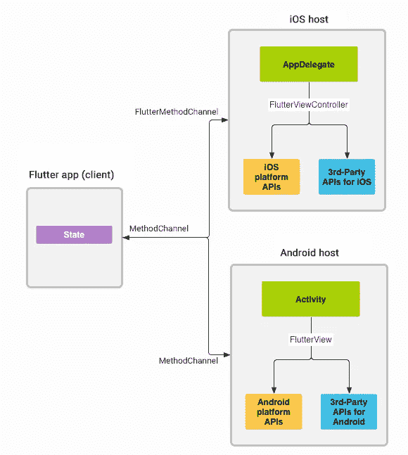

# 使用平台通道在 Flutter 和本机 iOS 代码之间进行通信

> 原文：<https://betterprogramming.pub/communicate-between-flutter-and-native-android-and-ios-code-using-platform-channel-7932f46b6aee>

## 如何在颤振中使用平台通道


照片由[车窗](https://unsplash.com/@windows)上的[挡泥板](https://unsplash.com/)拍摄

在编写 flutter 应用程序时，您发现有一个操作需要本机平台的帮助，您需要编写一个方法来使用本机 API，在 flutter 和本机之间建立连接，并允许数据在我们使用的方法通道之间来回流动

*我在这篇文章中多次提到“本土”。我说的“原生”是指 iOS 和 Android 平台。*

另一个用例是，当您向本机应用程序(flutter addToApp)添加一个 Flutter 模块时，在这种情况下，您希望调用一些本机方法来获取您的 Flutter 模块中的一些信息，您可以使用方法通道。

很多 Flutter 插件内部使用平台通道。

这是一个架构概述:



照片由[扑官方文件](https://docs.flutter.dev/development/platform-integration/platform-channels)

因为我们已经看到了一些用例，所以让我们用一些代码深入研究方法通道的细节。

首先，我们将如下初始化方法通道:

```
static const *platformChannel* = MethodChannel('test.flutter.methodchannel/iOS');
```

所以如果你把它粘贴到你的 IDE 中，你可能会得到一些错误。在调查的同时，你会发现它无法识别`MethodChannel`，所以为了使用 Platform，我们需要导入`service`包。

我们在方法通道初始化器中使用了一个*字符串*，它是方法通道名，你可以传递任何你喜欢的字符串，但是为了标准化，建议使用反向[反向域名表示法](https://en.wikipedia.org/wiki/Reverse_domain_name_notation)。

除了必需的 *name* 参数之外，初始化器还接受两个参数:

*   `codec` —
    如果该区域没有提供值，则使用`StandardMethodCodec`。

> “标准平台通道使用标准消息编解码器，该编解码器支持简单 JSON 类值的有效二进制序列化，如布尔值、数字、字符串、字节缓冲区以及列表和映射。这些值的序列化和反序列化也会在您发送和接收值时自动发生。—正式文件

*   `binaryMessenger(Optional)` —
    `BinaryMessenger`帮助将二进制数据发送到本地平台，
    如果我们不传递它使用的任何东西`defaultBinaryMessenger`，如果你对此感到好奇，它被定义在`binding.dart`文件中。

简而言之，`binaryMessenger`用于在本地平台之间传递二进制数据，而`codec`用于这些值的序列化和反序列化。

现在我们将编写一个方法来获取 iOS 设备模型，如下所示:

让我们浏览一下代码；这很简单。

1.  我们在平台频道上调用`invokeMethod`。
    这个方法接受方法名和一个参数列表，在上面的例子中我们省略了参数列表。
    注意方法名，因为我们必须在本机平台中使用它。
2.  平台可能会抛出一些异常，所以为了安全起见，我们将退回到 catch 块。
    **注意**:在某些特定于平台的异常情况下，抛出 PlatformException。
3.  我们做`setState`，它将重新构建 UI 来显示设备模型。

我们已经完成了颤振方面的工作，将研究 iOS 方面的实现。

在 flutter 工作区中有一个 iOS 和 Android 文件夹，默认情况下它与 lib 文件夹在同一级别，我们将使用这些来编写平台特定的代码。

在 Xcode 中打开 iOS 模块，并按照以下步骤操作:

*   在 finder 中找到您的项目。
*   转到 ios 文件夹，如果你的项目名是`simple_platform_channel`，那么`simple_platform_channel > ios`。
*   在 iOS 文件夹中打开`runner.xcworkspace`

**非 iOS 开发人员注意** : `Runner.xcodeproj`是项目文件，但是作为一个 Flutter 项目模板，默认情况下使用 Cocopods 作为依赖项管理器，它创建一个嵌入依赖项的工作空间文件。

让我们编写本机方法，但是我们要编写它吗？
这里是路径:

```
Runner > Runner > AppDelegate
```

你会看到一些代码已经存在。在做任何修改之前，我们会了解它。

有一个用`@UIApplicationMain,` 标注的`AppDelegate`类，所以基本上从这个程序执行开始，就相当于在 Flutter 中 void `main()`。

现在，如果我们看到类中有一个带参数`didFinishLaunchingWithOptions`的方法`application`，因为它的名字表明这个方法在应用程序启动时就被执行。我们将对此方法进行修改。

> 注意:AppDelegate 使用方法重载，所以有很多名为`application`的方法，但是每个方法都有不同的参数列表。

我们现在将使用我们在颤振中定义的平台通道。

这是代码。看起来吓人也不用担心；我们将一步一步来看:

让我们来理解上面的片段:

1.  我们正在尝试获取`FlutterViewController`，如果你想知道窗口是从哪里进入场景的，它基本上是在`FlutterAppDelegate`中定义的，由`AppDelegate`扩展，`FlutterViewController`被设置为`rootViewController`，所以我们正在尝试访问它。
2.  为什么我们又要创建一个方法通道？
    当我们试图在两个框架之间进行交互时，应该在双方都建立连接。
    **注意** :
    -为了建立连接，我们需要拥有与我们在 Flutter 中定义的相同的通道名。
    - `binaryMessenger`。我们使用的是`FlutterViewController`提供的默认二进制信使。这就是我们拔出`FlutterViewController`的原因。
3.  这里，我们正在准备方法处理程序。它将处理在方法通道上调用的任何方法调用。
4.  我们附加了一个方法回调处理程序，并传递了一个闭包(如果你想知道那是什么，它只是一个匿名函数。如果你在 flutter 中用过`List.forEach`，那么你已经知道了)。
    匿名函数有两个参数:
    -call(FlutterMethodCall)——它提供方法调用的细节，比如方法名及其参数。
    -result(flutteresult)—这是您将返回给 flutter 模块的结果，它被表示为@escaping，这意味着它是一个异步调用，因此您可以执行一些耗时的操作，然后调用结果。
5.  只是检查被调用的方法名是否是`getDeviceModel`。这里检查没有太大意义，但是当有多个方法的时候你需要检查来区分它们。
6.  调用另一个方法来获取设备模型。
7.  我们已经使用 iOS `device` API 得到了结果。
8.  用数据调用`result`，这有助于将数据传回颤振模块。
9.  如果我们从 Flutter 端调用一些本地没有实现的方法，我们抛出`FlutterMethodNotImplemented`。

简单不是吗！

现在我们来看看围绕平台渠道的一些重要问题。

如何将一些数据从 Flutter 传递到 iOS，同时调用一个方法？

记住，我们讨论了接受动态参数数组的 invokeMethod。让我们看一个例子:

```
*platformChannel*.invokeMethod('getDeviceModel',
    {"flutterAppVersion": "0.0.1", "developerName": "XYZ"});
```

如何将数据传回颤振模块？

我们可以在结果中传递任何数据。例如:

```
result( ------ )
```

但是为了简单一点，Flutter 提供了`invokeMethod`的其他选择:

```
1\. Future<T?> invokeMethod<T>(String method, [ dynamic arguments ])
2\. Future<Map<K, V>?> invokeMapMethod<K, V>(String method, [ dynamic arguments ])
3\. Future<List<T>?> invokeListMethod<T>(String method, [ dynamic arguments ])
```

尽管传递给这个方法的参数是相同的，但是返回类型是不同的，所以如果我们想要在结果中返回一个映射，我们可以使用`invokeMapMethod`。

# 摘要

通过五个简单的步骤，您可以在 Flutter 中运行特定于平台的代码:

1.  在 Flutter 中创建一个方法通道。
2.  调用通道上的方法并等待结果。
3.  在 iOS 中创建一个 FlutterMethodChannel，在 application 方法中使用 didFinishLaunchingWithOptions。
4.  在通道上设置回调处理程序。
5.  使用本地 API 执行一些操作并返回结果。

# 资源

平台渠道上的一些有用资源:

*   [不同平台支持的数据](https://docs.flutter.dev/development/platform-integration/platform-channels?tab=type-mappings-swift-tab#codec)
*   [平台渠道:官方文件](https://docs.flutter.dev/development/platform-integration/platform-channels)
*   [Android 平台实现](https://docs.flutter.dev/development/platform-integration/platform-channels?tab=type-mappings-swift-tab#step-3-add-an-android-platform-specific-implementation)