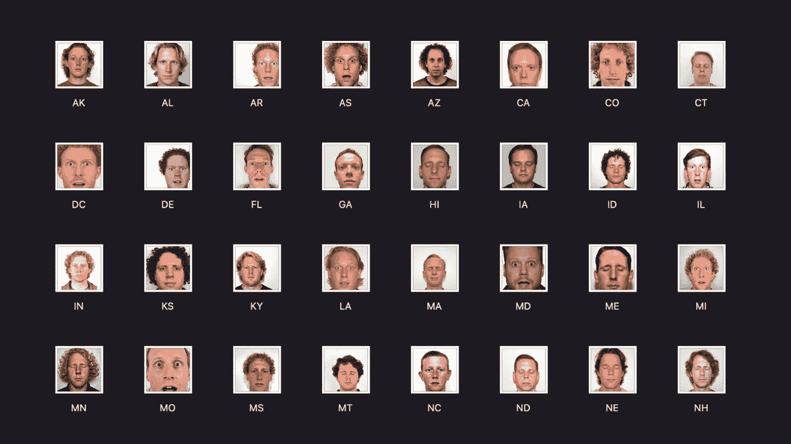
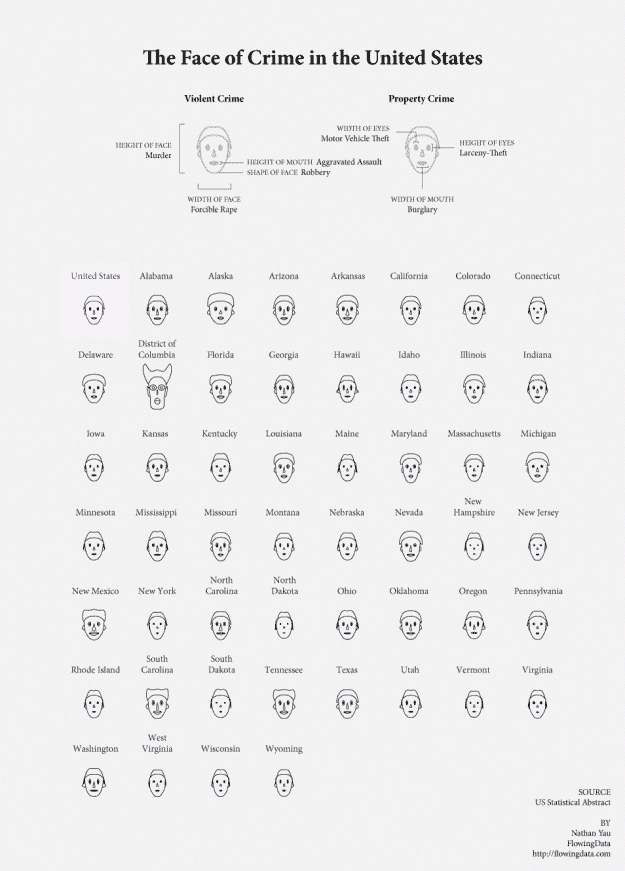
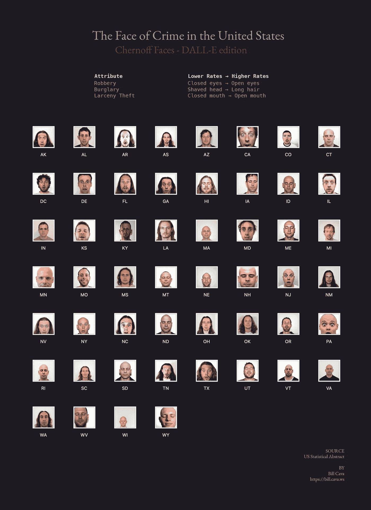

# 使用 DALL-E API 更有效地交流数据

> 原文：<https://betterprogramming.pub/communicate-data-more-effectively-using-dall-e-api-1ffb9250944d>

## 使用 DALL-E API 可视化犯罪数据集并生成逼真的人脸



使用 DALL-E 可视化美国犯罪率

在我的上一篇文章[如何使用 DALL-E 进行数据可视化](https://medium.com/better-programming/using-dall-e-for-data-visualization-59df580e66ab)中，我探讨了文本到图像的生成如何用于数据可视化。

我从 Chernoff Faces 开始，这是一种可视化技术，通过将字段映射到面部特征，以人脸的形状显示多元数据。典型的，切诺夫脸是卡通线条画。

但我很好奇 DALL-E 生成更逼真的人脸的能力是否有助于更有效地传达数据。

# 方法

我决定创建一个简单的 A/B 测试。我首先选择了一个数据集，美国各州的犯罪率，并选择了可用字段的子集:盗窃、入室盗窃和抢劫。

有了数据集，我创建了两个可视化:

*   第一个可视化使用了由 Peter Wolf 使用`[APLPACK](http://cran.r-project.org/web/packages/aplpack/index.html)`(另一个情节包)创建的卡通式 Chernoff 脸。
*   第二种可视化使用通过 Python 脚本生成的文本提示使用 DALL-E 创建的照片级真实感人脸。

# 可视化#1:卡通脸

对于这个过程的这一部分，我使用 R Studio 和`APLPACK`来生成人脸。Nathan Yau 有一篇很棒的文章，记录了如何用 la Chernoff 的卡通面孔来可视化数据，所以我不会重复他写的内容。如果您想继续学习并创建自己的文章，请阅读这篇优秀的文章。

以下是可视化#1 的结果:



内森·尤@[https://flowingdata.com/](https://flowingdata.com/)

# 可视化#2:照片般真实的脸

为了使用 DALL-E 可视化数据集，我创建了一个 Python 脚本，它做了三件重要的事情:

首先，它创建了一个映射，定义了与每个度量相关联的面部部分。在下面的要点中，你可以看到字段`burglary`映射到头发长度，`robbery`映射到眼睛形状，`larceny`映射到嘴。

```
mapping = {
    "robbery": [
        "closed eyes", "relaxed eyes", "scared wide open eyes"
    ],
    "burglary": [
        "shaved head", "short scruffy hair", "long hair"
    ],
    "larceny_theft": [
        "closed mouth", "slightly parted lips", "wide open mouth"
    ],
}
```

其次，它使用`Pandas`打开 CSV 文件，并使用`pandas.qcut`根据映射中标签的数量将值离散化到大小相等的桶中。

这意味着`qcut`试图将数据分成大小相等的仓(每个标签一个)。例如，`robbery`有三个标签:“闭上眼睛”、“放松的眼睛”和“吓得睁大眼睛”，因此`robbery`值将被“装入”这三个桶中的一个。

脚本将这些离散化或“分箱”值存储为数据框中的一个新字段。看起来是这样的:

```
###
# For each key in the dictionary, divide up the underlying data into 
# equal sized bins (one for each label). For more info on Panda's qcut, see:
# https://pandas.pydata.org/pandas-docs/stable/reference/api/pandas.qcut.html

df = pd.read_csv("crime.csv")

for key in mapping:
    df["%s_attr" % key] = pd.qcut(df[key], q=len(mapping[key]), labels=mapping[key])
```

这是数据框子集的输出示例。

第三，对于数据集中的每一行，它从模板中创建提示。模板使用上一步收集的值填充其值。

```
###
# For each key in the dictionary, divide up the underlying data into 
# equal sized bins (one for each label). For more info on Panda's qcut, see:
# https://pandas.pydata.org/pandas-docs/stable/reference/api/pandas.qcut.html

df = pd.read_csv("crime.csv")

for key in mapping:
    df["%s_attr" % key] = pd.qcut(df[key], q=len(mapping[key]), labels=mapping[key])
```

将所有这些放在一起，我们就有了生成提示的最终脚本。运行它会产生以下输出:

随着 [DALL-E API 在](https://openai.com/blog/dall-e-api-now-available-in-public-beta/)的推出，自动生成实际图像的过程变得轻而易举。

```
# Use this as a unique ID for each run
epoch = int(time.time() * 1000)

# For each row, generate a face using the prompt
for index, row in df.iterrows():
    openai.api_key = API_KEY
    response = openai.Image.create(
        prompt=row["prompt"],
        n=1,
        size="512x512"
    )

    # OpenAI gives us back a URL
    image_url = response['data'][0]['url']

    # Request the URL and save it locally
    img_data = requests.get(image_url).content
    with open('%d-%s.jpg' % (epoch, row["short_name"]), 'wb') as handler:
        handler.write(img_data)
```

经过一些试验，我为所有提示添加了“30 岁”和“白人男性”，以尽量使基线照片正常化。我还在提示中添加了“脸部照片”，试图控制这个人的脸在图像中出现的比例。鉴于我们正在处理的数据集，面部照片也很酷。

最后的结果…



# 结论

切尔诺夫使用人脸背后的主要思想是，人类很容易识别人脸，并毫不费力地注意到人脸的微小变化。

可视化的全部意义在于直观地比较数量。在我非正式的 N=1 A/B 测试中，我问自己:生活在哪个州会更不理想？哪个州是最理想的？我似乎比在卡通中更容易注意到照片般逼真的面孔的变化。

当选择一个州居住时，你可能想远离那些满脸恐惧、长头发的州(至少在偷窃、盗窃和抢劫方面)。


田纳西州

在光谱的另一端，你可以看到由睡眼惺忪的秃子代表的州。


康涅狄格州

使用右场→面部特征映射，生成的照片级逼真图像以一种漫画式对等物中没有表达的方式传达情感，使某些面部突出。

存在一些挑战，尤其是在生成的图像中控制特征的能力有限，这使得很难在各个人脸之间画出细微的区别。

但是粗略的发现呢？我觉得可能有用。

你怎么想呢?