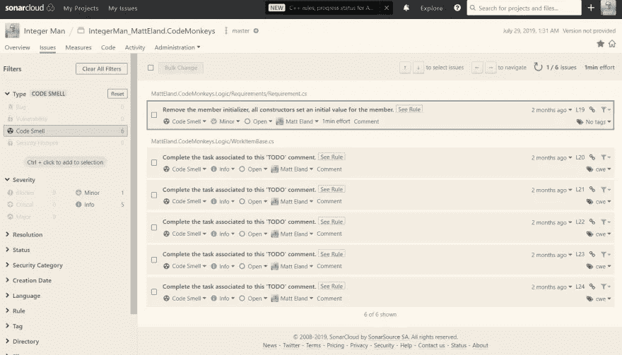
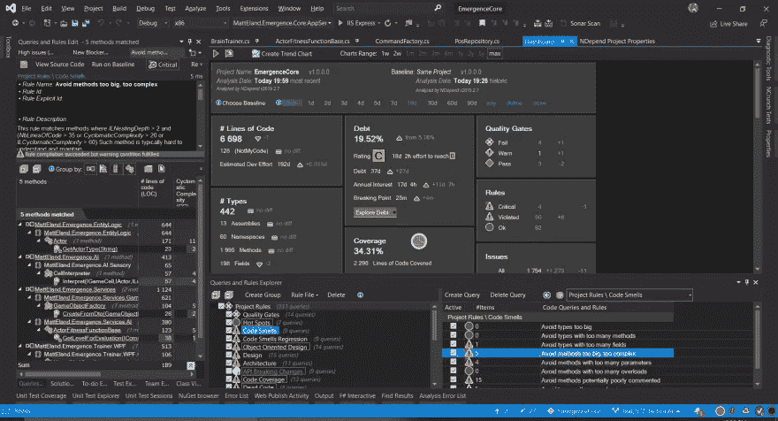
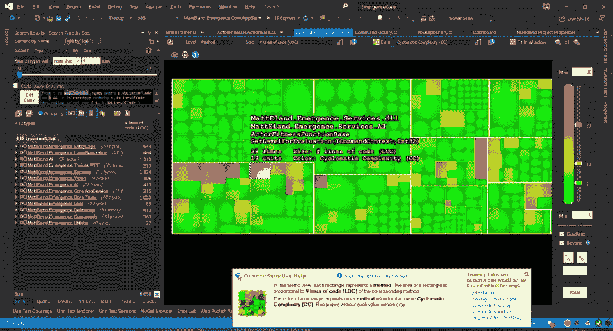

# 沟通技术债务

> 原文：<https://betterprogramming.pub/communicating-technical-debt-82b82dd528d1>

## 我们如何帮助产品管理和业务利益相关者理解技术债务的性质以及无法偿还的成本？

[NeONBRAND](https://unsplash.com/@neonbrand?utm_source=unsplash&utm_medium=referral&utm_content=creditCopyText) 在 [Unsplash](https://unsplash.com/s/photos/debt?utm_source=unsplash&utm_medium=referral&utm_content=creditCopyText) 上拍摄的照片

许多开发人员认为，当我们谈论技术债务时，产品管理和执行领导并不理解。与此同时，如果你问开发人员对项目的长期成功至关重要的因素，偿还技术债务是重中之重。那么，我们如何通过沟通技术债务来弥合这一差距呢？

作为一名开发经理，我工作的一个核心部分是充当产品管理和开发团队之间的桥梁。让我与你分享到目前为止对我来说很有效的方法。

# 技术债务的定义

让我们从韦伯斯特对债务的定义开始:

> *债务:有义务支付或偿还某人或某事以换取某物的状态:欠的状态*

在这种情况下，我们通过临时利用某物而产生技术债务，同时产生偿还债务的义务。

# 技术债务的原则和利息

进一步说，随着时间的推移，我们会为我们的债务支付额外的利息，这意味着一小部分技术债务会随着时间的推移变得更大。

例如，如果我们通过复制一个方法并做一些小的修改来实现一个特性，那么每当我们需要做一个应该修改这两种方法的改变时，我们都会对这个决定感兴趣。

即使实际上只修改了一个方法，修改重复的方法的失败也可能构成一个错误，以一个隐藏的错误等待被遇到的形式将一种形式的质量债务引入应用程序。

在本例中，技术债务的*原则*是初始实施期间节省的时间，而*利息*是该决策产生的额外时间、质量和风险成本，直到该决策被解决。

我特别喜欢谈论技术债务时的财务类比，因为它把一些对商业导向的专业人士来说隐藏和未知的东西放在他们日常工作的术语中。

这也突显出，尽管技术债务在短期内可能是有利的(当支付的利息低于借入的本金时)，但在长期内可能是毁灭性的。

# 技术债务罚款

上面我提到了当技术债务生效时，对未来项目支付的增加的开发时间罚款。这可能是我们作为开发人员谈论的最大形式的技术债务。

此外，我们还提到了脆弱的、不可维护的代码、缺乏单元测试以及在修改代码时导致不一致行为的重复，这些都会导致*质量债务*。这是一种风险形式，当我们处理技术债务繁重的代码领域时，我们将其作为利息来偿还。

我们为技术债务支付的另一种形式的利息是糟糕的应用程序性能。这通常是在技术债务处于设计级别时支付的——因为大多数性能问题最终被证明是系统中设计不良的流程。是的，您可以连续几天甚至几周对代码性能进行战术性的改进，但是在某一点上，除非您在重新设计时考虑到性能，否则很难获得额外的改进。

安全漏洞是另一种形式的风险，我们可能会招致技术债务的利息。不过，独特的是，这不仅仅在代码更改时表现出来，而且风险从漏洞出现的那一天就开始了，一直持续到它被解决。

最后，当开发不合标准的代码时，我们确实会对开发人员的士气造成损失。然而，这并不仅仅局限于开发人员，因为许多开发人员对他们发现的更有趣的代码直言不讳，这影响到了听力范围内的任何人。

我进一步认为，代码库中糟糕的代码会鼓励项目中不合标准的工作，因为它被证明是可接受的工艺水平，所以这种形式的债务会鼓励未来的债务。

# 与企业谈论技术债务

好了，现在我们已经讨论了什么是债务，以及在债务解决之前我们要支付的利息，让我们来讨论一下如何将这些事情传达给商业利益相关者。

首先，产品管理和商业利益相关者不是你的对手。这些是你的重要伙伴。任何关于代码的商业讨论都需要以信任和尊重为核心——来自双方——否则摩擦肯定会发生，成功的可能性也会大大降低。

我会更进一步说，与商业伙伴建立信任、合作和尊重的关系对于一个项目的长期成功比技术债务更重要。

为了与商业利益相关者进行健康而富有成效的对话，你至少需要做以下事情:

*   参加对话，希望增进你和他们之间的了解。你要告诉他们当前和未来的障碍以及过去的决定所付出的代价，你需要倾听和理解他们的需求。
*   你需要非常专业。开发人员喜欢找乐子，但是当我们的行为与业务格格不入时，就不难理解为什么业务可能认为我们没有能力考虑他们所想的事情。
*   有数据和轶事证据来支持你的主张
*   已经确定了几个关键的最高优先级技术债务项目
*   制定灵活的计划来解决可以根据业务需求修改的问题
*   知道解决问题需要多长时间
*   有办法确保技术债务在未来不再成为问题
*   当技术债务被偿还时，准备给出进度状态报告

当与商业利益相关者谈论技术债务的严重程度时，你实质上是一个医生在警告病人健康并发症和未来的后果。你需要说出真相，而不是危言耸听，你需要提供一个计划来补救这种情况，并监控它的发展。

我们稍后会详细讨论这些内容。

# “技术债不是开发者的错吗？”

我有时会从业务中听到这个问题。往往不是恶意的问，甚至有时候是勉强的问。大多数业务人员不了解软件开发或软件项目的本质，因为他们没有为它们开发代码。因此，假设技术债务是开发人员的错是完全合理的。

不幸的是，这个假设的真相是，有时技术债务是我们的错。有时我们没有警告任何人决策的后果，有时我们没有注意到它，直到为时已晚，有时开发人员变得懒惰，犯错误，或者仍然在发展他们需要的全套技能。

然而，我选择相信大多数技术债务不是我们的错，或者发现得太晚而无法在不危及关键业务目标的情况下改变。

在与那些将技术债务归咎于发展的商业利益相关者打交道时，我喜欢打一个来自农业的比方。

在农业中，如果你一季又一季地重复耕种同一块土地，你会通过从土壤中吸取养分而系统地降低土地的肥沃度和生产力。这就是为什么农民们采用了诸如作物轮作(在淡季让田地休耕或空置以补充养分)或不时用肥沃土壤的作物代替贫瘠土壤的作物来帮助田地补充养分的原因。

在这个类比中，它清楚地表明，当开发商在一个又一个项目中致力于企业想要的东西时，缺乏时间来清除田地并让隐喻的土壤重新充电最终会降低作物产量。你最终没有坏农民(开发商)，而是一个以长期生存能力为代价优化最初几个季节产量的耕作策略和时间表。

有时牺牲代码库的长期健康实际上是可以接受的。

有时候，你迫切需要完成一个项目来维持经营。有时，您计划完全重写一个应用程序，或者在多次迭代后淘汰它，以支持替换。在这种情况下，短期内的生产率应该是首要考虑的问题。

其他时候，企业根本不理解。他们生活在关注利益相关者的需求、销售目标、赢得和失去的交易、有风险的合同、支持事件、bug 计数以及其他具体和可理解的事情的世界中，当他们听到“技术债务”时，很容易认为它只是意味着“我不是特别喜欢的代码”，而不是“等待向我们的用户释放大量缺陷的巨大质量风险”

这就是为什么他们需要我们把日常生活翻译成他们能理解的东西。

这意味着我们必须查看指标。有了来自问题跟踪系统、时间跟踪系统、源代码控制、代码分析工具、测试覆盖结果、CI/CD 管道、性能监控工具和其他来源的数据，您可以汇总一些有趣的数据，例如:

*   按应用领域划分的缺陷
*   完成一个功能所需的时间(特别是随着时间的推移，因为这表明生产力的损失)
*   花费在开发和支持活动上的时间
*   一段时间内单元测试覆盖的代码百分比
*   源文件的代码味道
*   代码会随着时间而变臭
*   导致错误的传入请求的百分比

要有创意。对于您的代码来说，确切的度量标准对于您的组织和您当前的技术债务来说是独一无二的。如果你需要分析问题的想法，想出表现问题的方法，看看我在[软件质量的 7 个基本工具](https://dev.to/integerman/the-7-basic-tools-of-software-quality-16i1)上的帖子。

代码分析工具是我绝对会依赖的。这些可以是任何东西，从编译器或 linter 警告到分析代码库并生成建议的专用工具。具体使用的工具将因您使用的编程语言而异，但我将分享对我有效的工具。

我用[sonar qube](https://www.sonarqube.org/)/[sonar cloud](https://sonarcloud.io)扫描各种不同语言的代码。

SonarCloud 代码分析问题

这还可以帮助我以非常直观的方式区分哪些文件最需要关注，以便与业务利益相关方进行沟通:

按可维护性排列的文件 SonarCloud 可视化工具

虽然 sonar cube/sonar cloud 适用于开箱即用的简单跟踪，但更深入和可定制的分析可能是必要的，并且应该来自适合您的编程语言的特定工具。

我用 [NDepend](https://Ndepend.com) 来分析。NET 程序集，并获得关于这些项目的所有错误的详细度量和可视化，以便随着时间的推移区分优先级并跟踪代码味道。

Visual Studio 2019 中的 NDepend 仪表板

尤其是 NDepend，它可以根据大小和复杂性、代码覆盖率等精确定位方法。并生成一些非常有用的图形和图表，用于区分优先级，甚至潜在地交流技术债务。

显示代码文件大小和按圈复杂度给代码文件着色的独立树图

**免责声明:**虽然我之前已经支付了 NDepend 的费用，但我当前的副本是由开发人员提供的。

# 与商业利益相关者沟通的技巧

现在，您已经有了区分技术债务的优先级并进行沟通所需的指标和数据，让我们来谈谈这个话题。

首先，你需要确定这件事有多大。这可以是 30 秒的电梯推销“如果我们可以修复 x，我们真的会更有成效。我可以给你发一封简短的电子邮件，告诉你一些细节，并把它包括在未来的 sprint 中吗？”“我一直在关注我们的代码质量，我有一些担忧想和你分享。我想在本周晚些时候安排一次会议来检查这些问题，并讨论一些可能的解决方案。哪一天对你最合适？”

第二，你需要组织适当层次的交流。一般来说，这可能是一封很长的电子邮件，也可能是一份一两页的报告，或者是一张 5-10 页的幻灯片。您的目标是以一种他们能够理解并公平参与讨论的方式，简明扼要地向他们传达问题，从而确定问题的优先顺序并计划补救措施。

第三，你需要考虑他们的沟通方式。有些人讨厌电子邮件或电话。其他人讨厌正式会议。风格也很重要——一些人想要简洁自信的陈述，没有任何开场白，而另一些人想要在进入正题之前真正与你互动并闲聊。一些人被确凿的事实所激励，而另一些人则被个人如何受到影响的故事所左右。了解你的受众。当你有疑问时，尝试混合使用不同的方法，或者如果你的数据失败了，准备好一些轶事来分享。

我强烈建议你的演讲集中在充分沟通问题所需的最低限度。开会前做好准备，但不要让他们感到厌烦。如果一个主管想要细节，他们会问的。你不是在试图表现得聪明或赢得分数——你是在试图把另一半带进一个他们不擅长的解决问题的世界。

作为陈述的一部分，向他们提出你的补救计划。预计会有人问你需要多少资源，需要多长时间，风险是什么，以及由于资源的损失，企业在短期内无法做什么。

我要告诫不要参加这些会议的另一件事是，许多高管关注的是人们的上班打卡和下班打卡时间，如果你告诉他们你需要花时间来解决技术债务，而开发团队在每天下班时间立即离开，迟到，或花很长时间吃午餐，高管可能很难专注于你所说的话，无论正确与否，这往往是那个级别的许多人的想法。

# 关闭

既然我们已经知道了如何与业务利益相关者沟通技术债务，并有希望获得他们的支持，那么让我们来看看[一些偿还技术债务的策略](https://medium.com/@matteland/strategies-for-paying-off-technical-debt-2de66a76a099)。