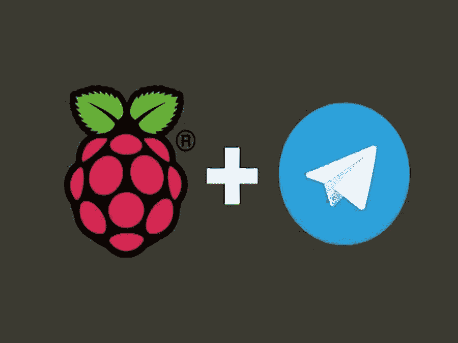
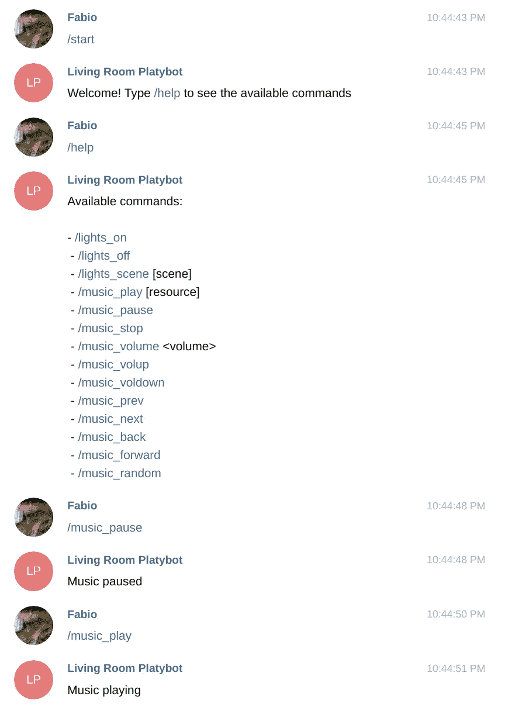

# 建造一个机器人，通过电报与你的智能家居通信

> 原文：<https://betterprogramming.pub/communicating-with-your-smart-home-over-telegram-76850522759>

## 树莓派和电报的力量



*这篇文章的更新版本可以在* [*Platypush 博客*](https://blog.platypush.tech/article/Build-a-bot-to-communicate-with-your-smart-home-over-Telegram) *上免费获得。*

你已经完全设置好了你的智能家居。你经常喜欢和你的朋友炫耀打开灯泡、播放视频和电影并向你的语音助手发出提示、煮咖啡，以及在应用程序上点击一下来调节恒温器是多么酷。恭喜你！

但如果你是一个很少定居的自动化爱好者，你可能已经对你必须下载的应用程序的数量和你必须掌握的控制你的小工具的界面的数量感到沮丧。

你可能会有一个关于灯光的应用程序，一个关于媒体中心的应用程序，一个关于智能窗帘的应用程序，一个关于恒温器的应用程序，还有一个 Google Home 应用程序，它热切地(也无可救药地)试图将所有这些应用程序放在同一个地方。

很可能，这些应用程序中的大多数不会与其他应用程序进行通信，而且如果你与你的小工具不在同一个网络上，它们中的许多可能也不会工作。

如果我们可以从同一个界面控制一切，而不用让我们的手机或电脑塞满大量的应用程序，通过一个既可以从移动设备和桌面设备访问又可以通过外部脚本/集成访问的界面，无论您是在家庭网络中还是在户外，这不是很酷吗？一个既轻便又简单易用的界面？

但是等等，这样的界面不是已经存在一段时间了吗，以消息或聊天的名义？毕竟，通过我们用来向朋友发送猫图片的相同界面，并通过完全根据我们的需求定制的机器人来控制我们的房子、小工具和云服务，而没有第三方机器人通常带来的所有样板文件/挫折，这难道不是很酷吗？

# 基于聊天机器人的智能家居

进入基于聊天机器人的智能家居世界。

在这个故事中，我将向您展示如何在现有的智能家居安装基础上轻松设置命令和例程。本教程中使用的两个主要工具是:

## [电报](https://telegram.org)

有许多消息应用和平台存在，但迄今为止，他们中的许多人(Facebook Messenger，Whatsapp，Hangouts 等)的努力。)在提供可用的开发人员 API 方面的表现令人失望。

每个人都使用 XMPP 或 IRC 作为他们的消息主干的黄金时代已经一去不复返了，它很容易与所有说同一种语言的服务集成:今天的消息应用程序的世界非常分散。

此外，由于创建不与外界交流的围墙花园符合许多大玩家的利益，因此最常用的解决方案没有官方支持的 APIs 开发人员接口。

不仅如此:一些大玩家积极阻止用户使用官方应用程序以外的任何东西与平台互动([邪恶的 Whatsapp，我正看着你](https://news.softpedia.com/news/WhatsApp-Permanently-Bans-Users-of-Unofficial-Clients-475013.shtml))。

在这个由几个互不相连的岛屿组成的极度分裂的世界中， [Telegram](https://telegram.org) 代表了一个受欢迎的例外:他们的[官方 bot API](https://core.telegram.org/bots/api) 得到了很好的记录和支持，任何懂一点编程的人都可以很容易地构建集成。

## [平推](https://github.com/BlackLight/platypush/)

那些已经关注我一段时间的人可能听说过我的自动化极客平台。(对于那些没有看过的人，你可以通过阅读我对 Platypush 的[介绍文章、](https://medium.com/swlh/automate-your-house-your-life-and-everything-else-around-with-platypush-dba1cd13e3f6) [wiki](https://github.com/BlackLight/platypush/wiki) 或[集成文档](https://platypush.readthedocs.io/en/latest/)来结束本文)。

除此之外，Platypush 还带有一个电报[插件](https://platypush.readthedocs.io/en/latest/platypush/plugins/chat.telegram.html)和[后端](https://platypush.readthedocs.io/en/latest/platypush/backend/chat.telegram.html)。

所以，让我们开始做你的第一个家庭自动化机器人吧！

# 创建电报机器人

在 Telegram 上创建一个新的机器人非常容易:

1.  与父亲展开对话。
2.  键入`/start`,然后键入`/newbot`,创建一个新的机器人。给你的机器人一个显示名和用户名。
3.  您将获得一个链接来开始与您的机器人和一个唯一的 API 密钥的对话。把它存放在某个地方，因为我们很快就会用它来配置 Platypush 插件。


用机器人父亲的三个命令创建新的电报机器人。

# 在 Platypush 中配置您的机器人

*   安装 Platypush，包括主扩展和电报集成:

```
pip install 'platypush[http,db,telegram]'
apt-get install redis-server
[sudo] systemctl start redis
[sudo] systemctl enable redis
```

*   如果您还没有这样做，请尝试一下。找到一些你想要管理/自动化的东西——灯光、音乐、媒体、传感器、数据库、机器人、智能插头……并安装/配置相关的扩展。

在本文中，我们将了解如何配置我们新创建的 bot 来控制 Philips Hue 灯、音乐播放和 PiCamera 流。

*   将电报配置添加到您的`~/.config/platypush/config.yaml`文件中:

[后端](https://platypush.readthedocs.io/en/latest/platypush/backend/chat.telegram.html)使您能够接收事件(如新消息、附件、请求等)。)并在其上创建自定义挂钩。

[插件](https://platypush.readthedocs.io/en/latest/platypush/plugins/chat.telegram.html)可以让你写聊天记录，编程发送消息和附件，管理频道等。

假设我们希望机器人实现以下命令:

*   `/start`:欢迎新用户。
*   `/help`:显示可用命令。
*   `/lights_on`:开灯。
*   `/lights_off`:关灯。
*   `/music_play`:播放音乐资源/网址。
*   `/music_pause`:切换播放暂停状态。
*   `/music_next`:播放下一首歌。
*   `/music_prev`:播放上一首歌曲。
*   `/start_streaming`:在 PiCamera 上启动远程流媒体。
*   `/stop_streaming`:停止 PiCamera 上的远程流媒体播放。

我们所要做的就是在 Platypush `config.yaml`中创建事件挂钩。在这种情况下，您需要:

*   安装并配置[飞利浦 Hue](https://platypush.readthedocs.io/en/latest/platypush/plugins/light.hue.html) 、 [mopidy](https://platypush.readthedocs.io/en/latest/platypush/plugins/music.mpd.html) 和 [PiCamera](https://platypush.readthedocs.io/en/latest/platypush/plugins/camera.pi.html) 插件:

```
pip install 'platypush[hue,mpd,picamera]'
```

*   为了让你的`config.yaml`更干净，创建一个名为`~/.config/platypush/include/bot.yaml`的新文件:

*   在`config.yaml`中包含您的 bot 配置:

```
include:
    - include/bot.yaml
```

*   开始平板推:

```
# Manual start
platypush# Service start
systemctl start platypush.service
```

*   通过机器人父亲提供的链接在 Telegram 上打开与您的机器人的对话，并开始玩它:



通过电报聊天控制你的房子

现在，任何人都可以访问这个机器人——你可能不希望这样。您可以配置电报后端，使其仅接受来自特定聊天 id 列表的消息。(在 Telegram 中，`chat_id`既用于私人用户，也用于群组)。

向 bot 发送一条消息并打开 Platypush 日志或检查它的标准输出:您应该会看到如下消息:

```
2020-01-03 19:09:32,701| INFO|platypush|Received event: {"type": "event", "target": "turing", "origin": "turing", "id": "***", "args": {"type": "**platypush.message.event.chat.telegram.CommandMessageEvent**", "chat_id": **your_chat_id**, "message": {"text": "/help", *...*}, "user": {"user_id": **your_user_id**, "username": "****", "is_bot": false, "link": "[https://t.me/](https://t.me/blacklight86)you", "language_code": "en", "first_name": "***", "last_name": "***"}, "command": "help", "cmdargs": []}}
```

在后端配置中复制与您的用户相关联的`chat_id`:

```
backend.chat.telegram:
    authorized_chat_ids:
        - your_user_id
```

如果你试图从一个未授权的用户那里发送信息，机器人将会回复一个错误。


对不起，你不能乱搞我的家

如果你愿意，你也可以邀请你的机器人加入群聊，让你的朋友在你的房子里闪烁灯光！

# 下一步是什么？

在本文中，我们只探讨了电报集成的一个具体特性:机器人对`[CommandMessageEvent](https://platypush.readthedocs.io/en/latest/platypush/events/chat.telegram.html#platypush.message.event.chat.telegram.CommandMessageEvent)`事件作出反应、运行动作和回复文本消息的能力。

从[支持的电报事件列表](https://platypush.readthedocs.io/en/latest/platypush/events/chat.telegram.html)中可以看出，您可以做更多事情，例如:

*   当有人分享联系信息时创建挂钩。有没有想过让机器人自动存储朋友通过聊天发送给你的新联系人？
*   共享照片、视频或图像文件时创建挂钩。例如，将发送到聊天室的所有媒体文件自动下载到您的硬盘或远程 Dropbox 文件夹中。
*   对文本消息运行操作，而不是命令。例如，如果您喜欢键入“打开灯”而不是“/lights_on”，您可以使用`[TextMessageEvent](https://platypush.readthedocs.io/en/latest/platypush/events/chat.telegram.html#platypush.message.event.chat.telegram.TextMessageEvent)`。
*   从相机中拍摄一张照片，并通过`[send_photo](https://platypush.readthedocs.io/en/latest/platypush/events/chat.telegram.html#platypush.message.event.chat.telegram.TextMessageEvent)`动作发送给自己。
*   您还可以部署多个机器人，例如每个设备，这样您就可以通过相关的聊天在特定设备上运行操作，或者使用单个机器人作为入口点，通过 [MQTT](https://platypush.readthedocs.io/en/latest/platypush/backend/mqtt.html) 、 [Kafka](https://platypush.readthedocs.io/en/latest/platypush/backend/kafka.html) 或 [HTTP API](https://platypush.readthedocs.io/en/latest/platypush/backend/http.html) 向其他设备发送消息。

只要有插件，你现在就可以通过你的聊天机器人做到这一点。