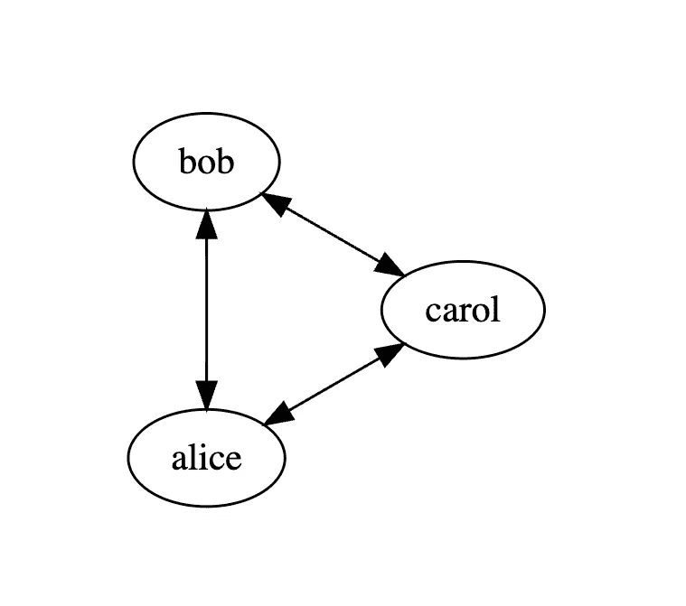
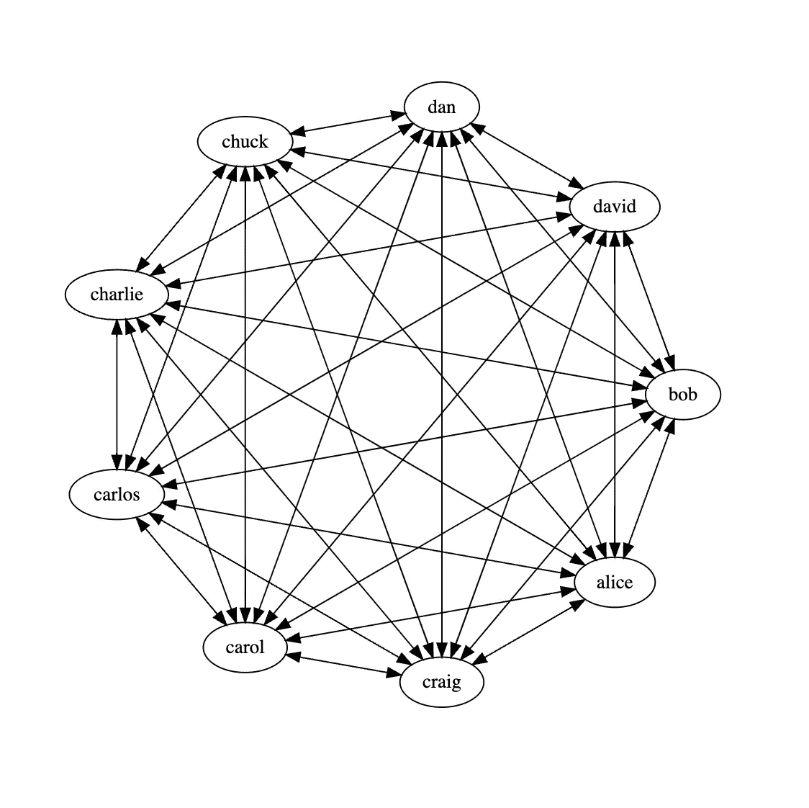
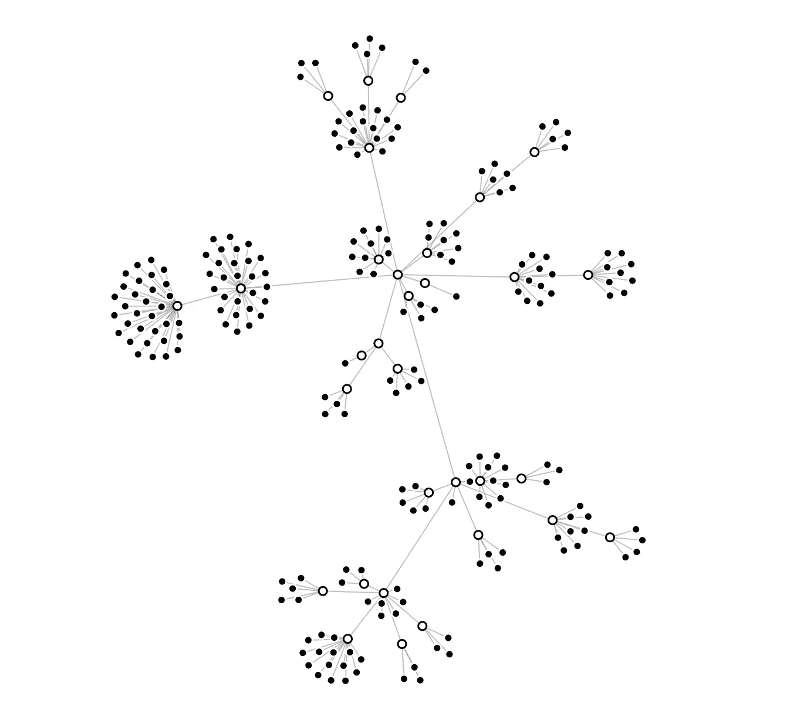

# 沟通模式及其扩展方式

> 原文：<https://betterprogramming.pub/communication-models-and-how-they-scale-a84cf61ffe0d>

## 不同的公司需要不同的设置。


迪伦·吉利斯在 [Unsplash](https://unsplash.com?utm_source=medium&utm_medium=referral) 上的照片

小公司沟通周期短，运行速度快。网络很小，每个人都认识每个人，知道他们在做什么，或者他们的个人生活。每个人都戴着各种各样的帽子，每个人都是可以接触到的

数字显示，随着更多的人参与进来，这个数字还会增长很多。

想象一下，你的整个公司都是𝑛人，他们需要和其他人一对一地见面。如果你把注意力集中在一个人身上，你会看到他们会参加𝑛−1 的介绍。因为有𝑛人，那将导致𝑛(𝑛−1)介绍。爱丽丝遇见鲍勃就像鲍勃遇见爱丽丝做介绍的次数 **𝑛(𝑛−1)/2** 一样。

因此，有了 Alice、Bob 和 Carol，我们就有了 3(3–1)/2 个通道，这 3 个通道还不错。



小团体插图

因此，对于一个标准的 9 人团队来说，肯定可以吃 2 个披萨，我们有 9*8/2= 36 个不同的沟通渠道，就像这样:



九人团队沟通渠道。* *查克不是密码破解者*

所以对于一个只有 25 名员工的小公司，我们有 300 个频道。对于一个拥有 400 名员工的标准中小型公司来说，大约有 798000 个通信频道。


沟通渠道数量与员工数量

布鲁克斯定律从经典的[神话人月，软件工程论文](https://amzn.to/3F1wuoN)中可以看出，在某些条件下，一个增量人员加入到一个已经延迟的项目中，会使它花费更多时间，而不是更少时间。看能看清楚的公地频道。

1.  加入项目的人需要一段时间才能变得富有成效。布鲁克斯称之为“T10”上升时间。软件是复杂的，遗留下来的商业问题越多或越复杂，上升期就越长。
2.  在把所有东西变小之前，公共通道会爆炸，如图所示。
3.  让更多的人参与高度可分的任务，比如打扫房间，可以减少总时间。但是在软件中，我们很少能够这样分割工作。他最著名的名言是:

> “九个女人一个月生不出孩子”

# 快速故事时间

我的想法是，在一个已经很晚的项目中增加人员确实会慢下来，直到我经历了其他事情。这是我以前的经验，很大程度上被布鲁克斯定律所证实。如果你投入无限的资源，你可以在不到 9 个月的时间里造出一个婴儿，至少在软件领域是这样。

我是一个团队的成员，在一家财富 500 强公司的一个高调项目中担任顾问。该项目的前提是 1 月 1 日新的立法开始生效。我们签约在 8 个月内建立一个系统，而这个系统是内部团队在一年前失败的。我们从 15 名开发人员、项目经理等开始。在接下来的 6 个月里，这个群体的人数增加到了 45 人以上。

增加员工确实有所帮助。这需要大量的协调工作，找到分割项目的方法，以便人们可以独立工作。每个工程师的生产率下降了，但项目的总产量增加了。有时在问题上砸钱至少在短期内有所帮助。

## 其他解决方案怎么样？

等等，“在我的公司，我们有团队，他们都做他们自己的事，他们不需要说那么多”。如果可能的话，那太好了。该公司是作为一个自己的小公司组建的，对沟通的需求很小。这将允许公司变大，而没有“大公司”的感觉。

事实上，过去几年有很多基于[创业之路:企业家管理如何改变文化和推动增长](https://www.amazon.com/The-Startup-Way-Eric-Ries-audiobook/dp/B075ZH6SJ1)和整个精益运动的商业推动。一些最大的管理咨询公司乘着这股浪潮赚了不少钱。我可以直接说这些转变是有效的。如果投资回报对公司来说是存在的，或者如果他们能自己做，那么顾问的回答是“看情况”。

《创业之路》确实引用了一些经验:

1.  经典的构建-测量-学习模型。推动实验并通过 MVP 推动快速验证
2.  将团队视为原子工作单元中的初创公司。让团队专注且跨职能
3.  企业家精神是组织中缺失的功能。

通过这种文化和团队组织，你可以优化创新。

团队结构确实有很大影响。就算走在技术端和“制度规则”上。杰夫·贝索斯有一个著名的旧备忘录，关于他如何向他的团队发送备忘录，以限制对后门通信的需求的方式来构建系统。备忘录:

```
1\. All teams will henceforth expose their data and functionality through service interfaces.
2\. Teams must communicate with each other through these interfaces.
3\. There will be no other form of interprocess communication allowed: no direct linking, no direct reads of another team’s data store, no shared-memory model, no back-doors whatsoever. The only communication allowed is via service interface calls over the network.
4\. It doesn’t matter what technology they use. HTTP, Corba, Pubsub, custom protocols — doesn’t matter.
5\. All service interfaces, without exception, must be designed from the ground up to be externalizable. That is to say, the team must plan and design to be able to expose the interface to developers in the outside world. No exceptions.
6\. Anyone who doesn’t do this will be fired.
7\. Thank you; have a nice day!-Jeff Bezos
```

这一切都回到了沟通流程和协调的需要。甚至在技术系统中。在微服务或 SOA 变得很酷或成为下一个最好的东西之前，这就是它背后的想法。

现实是，无论你的公司规模大小，你都有一个“中心资源”。可以是 It 支持，也可以是法律支持、公关、营销、设计、特定平台工程、CxO 或您拥有的任何职能。



组织结构和独立工作的口袋

现在，如果你想把每个小组都视为一个独立的公司，并确保减少交谈的需要，这意味着尽可能多地雇用这些角色，并去中心化。

每个问题领域都有专门的法律、营销和工程师。将它移动到每个域/部落或任何你可能有的巫毒组织结构中。更好的做法是将职能转移到离“工厂车间”更近的地方，成为团队的一部分。

在这整个练习中，虽然成本起着主要作用，但复制将比拥有最具成本效益的设置更受青睐。重要的是不要忘记，归根结底，这些“初创企业”是同一家公司的一部分。拥有共同愿景和使命的一部分，并找到不陷入孤岛的方法，这些孤岛最终仍将具有依赖性。

不同的公司需要不同的设置。一个 25 人的公司需要的不同于 300 人的公司。根据我的经验，几乎任何模型都适用于少于 100 人的团队、独立的运营部门、独立的产品部门和技术部门等。

随着公司规模的扩大，你使用的模式将会改变随之而来的沟通动态和决策速度。