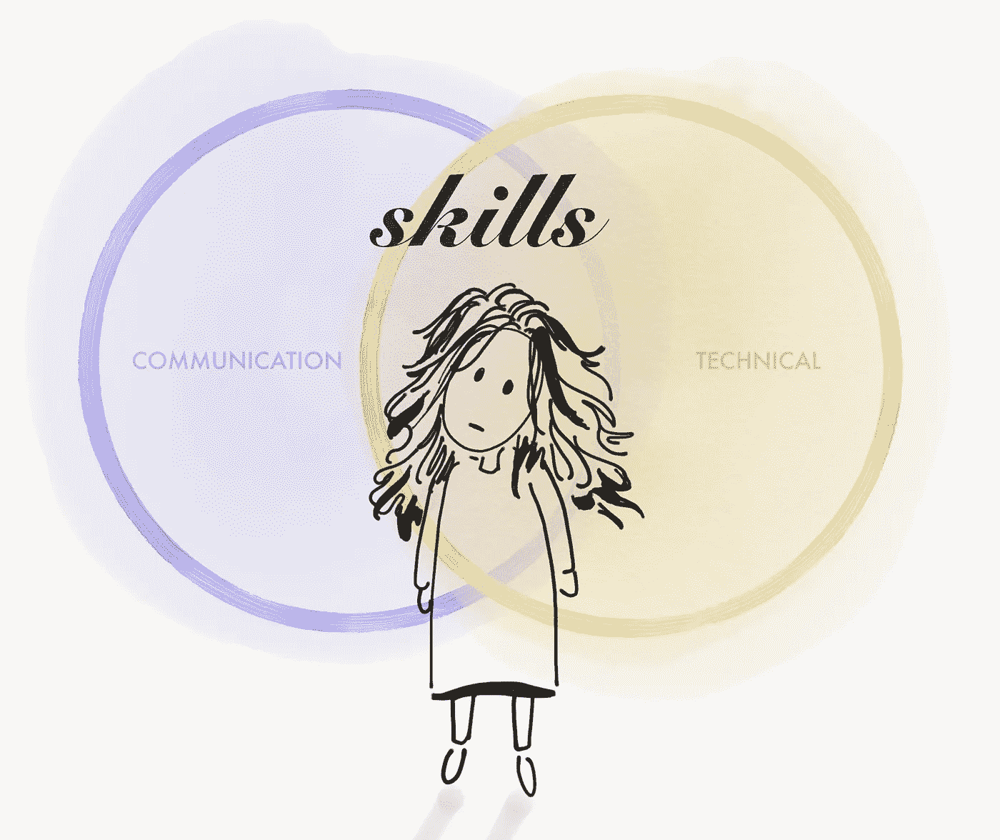

# 阻碍科技发展的错误二分法

> 原文：<https://betterprogramming.pub/communication-vs-technical-skills-the-false-dichotomy-stunting-tech-2910098f36a0>

## 沟通真的是一项技术技能

大多数工程职位描述在被称为技术技能的能力和被称为沟通技能的能力之间画了一个硬边界。前者倾向于表示与软件的设计和实现直接相关的专业知识，而后者意味着在整个过程中传播信息所必需的技能。

沟通技巧让个人能够理解和被理解。他们将自我意识、同理心、积极的倾听、说话和观察结合成一个能力的鸡尾酒，润滑着每一次互动的车轮，但往往未被察觉。分离沟通和技术技能，虽然看起来无害甚至实用，但会造成有害的二分法，阻碍行业的发展。

# 沟通是一项技术技能

这是一个错误的二分法，因为沟通*是*一种技术技能。表达复杂想法的能力是深刻理解的标志。没有相应的能力来形成对他们所生产的东西的连贯描述的技术技能只是没有方向的健美操。

然而，这种分离为决策者提供了一个方便的二元判断基础，导致了快速的思维捷径和适用于复杂问题的粗粒度分类。这最终阻碍了一个更为深思熟虑的招聘、晋升和绩效评估决策的方法。

这种区别在实践中变得模糊，因为大多数软件工程角色都极大地依赖于思想的运动和决策的合理性。这些相互依赖的技能的共存使得它们的解耦感觉是人为的，特别是对于熟悉任何复杂程度或规模的运输代码的日常现实的任何人。

虽然分离定义有助于加强细微差别，并使角色需求更加清晰，但这种特殊的划分不仅仍然明显，而且暗示了两者之间比工作真正代表的更大的差距。更糟糕的是，这种二分法倾向于造成一种低估贡献的社会和经济等级制度，抑制技能谱中较软的一面，惩罚那些沟通良好的人，让他们被解读为“技术含量较低”。

# 把交流的负担放在无报酬的情感劳动上

几年前，当关于无报酬情绪劳动的对话进入主流意识时，它们很快呈现出几种行业特有的表达方式。在技术领域，特别是在工程学科中，大部分讨论都集中在女性相对于男性同行承担着不成比例的非技术工作负担，这不可避免地从更具技术性的机会中减去了时间、注意力和精力。

无报酬情绪劳动的另一种表现形式是，女性被安排到“以人为本”的岗位，或者经常不是因为她们的代码或技术领导力而受到称赞，而是因为她们的同情心、项目管理、协作精神以及在困难和脆弱的社会环境中的平稳导航。换句话说，他们之所以受到称赞，是因为他们不得不处理通常不是他们造成的、也没有多少控制权的残余混乱。

性别化情绪劳动的话题值得更严格的分析，而不是一个匆忙的中等职位所能公正对待的，而且有几个文化和系统原因导致沟通技能不被强调为核心工程能力。然而，我不禁想知道，如果胜任的沟通不是留给某些具有社交倾向的群体去做的杂务，而是被视为软件开发生命周期中同样必要和重要的一部分，那么无报酬情感劳动的灵魂侵蚀现象是否会如此严重。

如果技术团队的总体沟通技能得到提高——让同理心、积极倾听和清晰明了与技术工作一样必要——也许目前由无报酬情绪劳动的无形工作填补的缺口将开始弥合。

# 为什么沟通技巧在技术学科中特别重要

虽然沟通技巧通常是有用的，但它们在 STEM 领域，尤其是软件工程学科中变得尤为重要，原因如下:

## 1.词汇双重预订

正如 Jordan Ellenberg 在“[如何不犯错:数学思维的力量](https://www.amazon.com/How-Not-Be-Wrong-Mathematical/dp/0143127535)”中所展示的，一个令人难以置信的混淆来源是在英语中具有不同于特定领域上下文的含义的单词。软件的基础可以追溯到数学和计算机科学领域，有时不那么直接。来自这些世界的行话并不总是反映普遍使用的英语方言。

例如，对任何一个典型的以英语为母语的人来说，单词*importance*暗指重要或实质性的事情。然而，在统计学中， [*显著性*](https://en.wikipedia.org/wiki/Statistical_significance) 是指拒绝零假设，更具体地说是指 [p 值](https://en.wikipedia.org/wiki/P-value)是某个非零值。在临床试验的情况下，药物的效果可能具有统计学意义，因为它是非零的，并且仍然没有可检测的后果。但是，这种意义的营销方式和向可能没有意识到这种差异的消费者报告的方式可能会扭曲药物的影响，导致错误的结论和掠夺性广告。

这种语言混乱的另一个例子涉及单词*平行*和*并发*。虽然在英语中是同义词，但这些词在编程中有不同的定义，尽管是相关的。[并行程序](https://en.wikipedia.org/wiki/Parallel_computing)是一种使用几个硬件单元(多个处理器内核)来执行计算的程序，其执行速度比单个机器要快。相比之下，[一个并发程序](https://en.wikipedia.org/wiki/Concurrent_computing)在一个处理器上执行计算，但是它的结构是这样的，程序中的任务被分散到多个控制线程中。并发性让共享一些依赖关系的计算异步发生，交错结果。

类似地，韦氏词典不一定将一个 [*对象*](https://en.wikipedia.org/wiki/Object_%28computer_science%29) 定义为一个类的实例，也不会将一个*组定义为共享一个数学属性的元素，即一对中的任何一对事物都可以组合成第三个实体。*

*虽然这些术语的使用在它们被调用的上下文中通常是隐含明确的，但是当行业专家未能检查他们的假设或确保每个人对术语的含义有共同的理解时，重要的细节仍然可能在翻译中丢失。*

## *2.编程是关于人类的*

*抽象、库和语言的设计不仅依赖于技术正确性和性能，还与人类天生的直觉有关。这需要对信息可能被解读的不同方式保持强烈的好奇心。*

*没有比 Donald Knuth 更好的引语了，他说程序不是作者和机器之间的一种交流形式，而是作者和另一个阅读代码的人之间的交流形式:*

> *让我们改变对程序构造的传统态度:与其想象我们的主要任务是指导计算机做什么，不如集中精力向人类解释我们希望计算机做什么—唐纳德·克努特，识字编程*

## *3.解决问题与杂技*

*在一本 1983 年出版的名为“[高产出管理](https://www.amazon.com/High-Output-Management-Andrew-Grove/dp/0679762884)”的乏味的书中，安迪·格罗夫描述了一种他称之为*活动多于产出的现象，*指的是当大量繁忙的工作没有实际成果时会发生什么。这典型地代表了无结果的 [yak-shaves](https://en.wiktionary.org/wiki/yak_shaving) 、 [code golf](https://en.wikipedia.org/wiki/Code_golf) 或专注于重塑项目外围边缘的无限追求的主题，这些项目分散了对具有更高优先级和影响的目标的注意力。*

*不幸的是，在大多数情况下，晦涩难懂的行话往往与技术才能混为一谈。2018 年 9 月，我参加了 [ICFP](https://icfp18.sigplan.org/) 。其中最令人难忘和引人入胜的是尤金妮亚·程(Eugenia Cheng)关于抽象力量的演讲。她讨论了迂腐和精确的区别。*

*迂腐是她所指的噪音——不透明、无效的书呆子-色情对话，通过用行话来混淆含义。这不仅会导致[守门](https://www.urbandictionary.com/define.php?term=Gatekeeping)，还会让无能隐藏在不必要的智能化术语后面。相比之下，精确是程博士所说的信号——清晰地表达出来且不丢失任何细节的工作细节。*

*问题空间通常包含一定程度的不可简化的复杂性，这极大地受益于特定领域语言的使用。那些具有很强沟通技巧的人能够恰当地使用特定领域的语言，同时也能够进行上下文切换以使他们的信息适应他们的受众。*

*这种清晰不仅让我们的工作更容易被理解，而且降低了智力威胁的门槛，为更多的贡献打开了一个给定的问题空间。在一个问题上投入更多的头脑可以更有力地推动世界前进，而不是通过少数人专注于知识生产或技术进步，而是在难以理解的语言背后保护脆弱的自我。*

## *4.失去细微差别*

*正如增加不必要的复杂性会阻碍有意义的交流一样，过度依赖另一端也是如此:不准确的过度简化。*

*当良好的沟通与降低沟通难度混为一谈时，它会保持现状不变，延续一种刻板印象，即选择不参与口头卖弄的个人缺乏智慧或深厚的技术才能。这与事实相去甚远。可悲的是，就像复杂而无意义的信息经常被误认为是良好的沟通一样，简单而无意义的信息也是如此。*

*我称之为“思想领袖箴言”就是这种愚蠢的糟糕沟通的最好例证。这些指的是充斥科技行业的脑残格言:“快速行动，打破常规”，“带着真实的自己去工作。”思想领袖谚语将人和问题简化为一维的数字、比喻和扁平的漫画，易于理解，但没有提供真正的洞察力。事实上，这个行业已经超越了这些狂热的口号。*

*随着我们的注意力范围接近推文之间的无限小空间，我们的词汇有时会超出我们的深度。像“白人特权”或“微侵略”这样的术语曾经存在于超级学术话语的围墙花园里。它们的使用往往伴随着多年研究社会科学领域中出现的细微差别。互联网将这些术语传播到口语中。虽然总的来说，这是一件好事，为更多的人提供了词汇来描述历史上没有名字的社会现象，但这些术语也被严重误解了。当复杂性不是文化上的，而是技术上的，同样的事情也会发生。*

*去年，一篇介绍 PagerDuty 首席执行官詹妮弗·特哈达的文章讨论了她如何将自己的成功归功于她非典型的非技术营销背景所带来的新视角。这篇文章称赞了她将技术观点变得模糊不清以找到问题根源的能力。虽然信息的情感是支持清晰的，但将良好的沟通与简化沟通混为一谈，对良好沟通复杂想法所需的智力技能造成了巨大的伤害。清晰并不意味着沉默，而是，正如 Eugenia Cheng 所说的那样，准确而清晰地识别出一个与上下文相适应的问题。*

*这适用于抽象的设计。糟糕的抽象降低了复杂性，降低了精确度。好的抽象通过创建上下文相关的信息和接口使事情更加精确。*

> *“抽象与模糊是完全不同的……抽象的目的不是模糊，而是创造一个新的语义层次，在这个层次上，人们可以绝对精确。”埃德格·w·迪杰斯特拉*

*任何被编译或运行时错误消息斥责过的人都很熟悉机器所要求的精度，而自然语言的约束更为宽松。作为人和机器之间的接口，技术工作的微妙之处包括取得平衡:警惕地关注细节，同时不失去这些细节服务的核心目的。*

## *5.全球化*

*分布式工作和开源的兴起正在缩小我们的世界。跨越地理和文化界限的思想交流更加多样化。虽然这使得各种各样的想法比这个星球上的历史上任何时候都多，但它也带来了更大的误解的可能性。与那些生活经历和母语大相径庭的人合作解决问题带来了挑战。与严重违反你所有基本假设的人一起工作，需要高度的同理心、理解和一致性。*

# *结论*

*我已经反复强调了沟通技巧的重要性。虽然这种情绪在整个行业得到了粗略的认可，但在我们的文化赶上并真正重视它们之前，这都只是口头上的服务。我们仍然没有很好的方法来理解、衡量或培训那些我们认为是良好沟通的能力的无定形混合物。更糟糕的是，我们远远没有给予他们与所谓的技术技能同等的声望。或许拆除割裂两者的错误二分法是一个开始。*