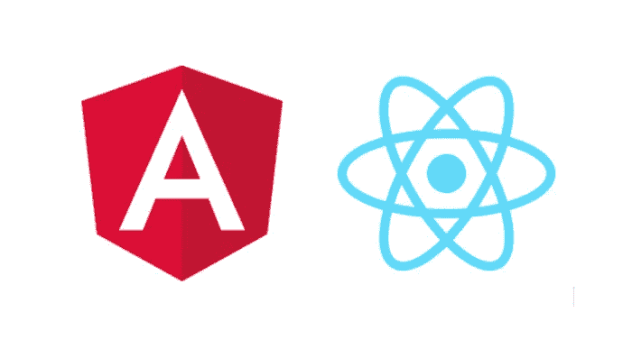
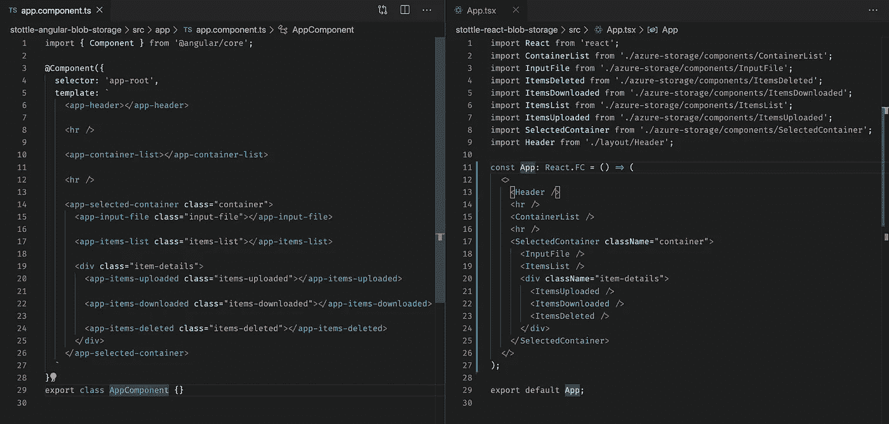
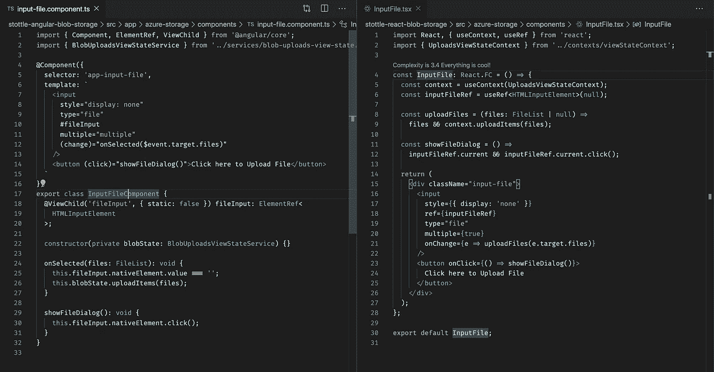
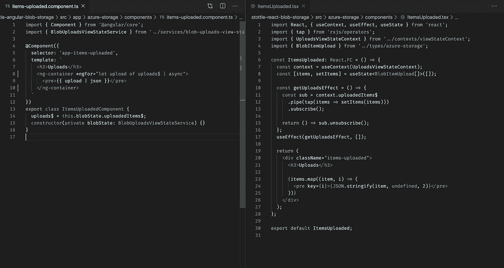

# 比较用 React 和 Angular 编写的相同特征

> 原文：<https://betterprogramming.pub/comparing-the-same-feature-written-in-react-and-angular-3f6ae04ceef6>

该功能的要求是将文件上传到 Azure Blob 存储，然后允许用户列出、删除和下载上传的项目。这两种解决方案都依赖于`[@azure/storage-blob](https://www.npmjs.com/package/@azure/storage-blob)` NPM 包，并且`[rxjs](https://www.npmjs.com/package/rxjs)`已经被添加到 React 项目中。

这些项目使用 TypeScript、React 16.11、Angular 8.2.13 和 RxJS 6.4.0。

# 背景

我最近写了两篇关于使用 [React](https://medium.com/@stuarttottle/upload-to-azure-blob-storage-with-react-34f37805fdfc) 和 [Angular](https://medium.com/@stuarttottle/upload-to-azure-blob-storage-with-angular-8-2ed80dfc6672) 上传到 Azure Blob 存储的文章，并最终创建了两个具有相同组件和服务的项目，它们在两个解决方案中具有相同的名称和相同的功能。所以我认为写一个特定特性的比较比描述高层次的差异更有趣。

您可以在 GitHub 上找到解决方案，这些解决方案是使用相关的 CLI 工具( [Angular CLI](https://cli.angular.io/) 、 [Create React App](https://create-react-app.dev/) )创建的

*   [有角度的](https://github.com/stottle-uk/stottle-angular-blob-storage)
*   [做出反应](https://github.com/stottle-uk/stottle-react-blob-storage)

# 解决方案概述

这两种解决方案都利用了`viewState`服务，并有一个专门的服务将功能包装在`@azure/blob-storage` NPM 包中。我避免了 Redux，因为我不想给项目增加更多的依赖。

当显示数据时，组件订阅`viewState`服务中的 observables，并调用`viewState`服务上的函数来共享捕获的数据。他们的职责很少，不包含任何业务逻辑。

这两种解决方案在结构上的主要区别是:

*   文件命名约定
*   角度解决方案有一个`azure-storage`特征模块，因此可以导入到其他模块中。
*   角度解决方案有一个`token.ts`文件，其中包含为注入令牌创建`BlobServiceClient`的工厂函数
*   React 解决方案有一个上下文文件来管理组件如何与`viewState`服务交互

两个解决方案中使用了相同的样式表，这是非常基本和简单的。

我们将比较解决方案中的几个组件以突出差异，并且我已经包含了一个关于如何在框架中实现类似功能的观点。

同样值得注意的是，除了用于依赖注入的 Angular `@Injectable`装饰器之外，这些服务是相同的。

我不打算讨论依赖注入——如果您还不熟悉这个概念，React 可能是您更好的选择。

# 应用程序组件

app 组件将我们布局的所有组件集合在一起，是特性的入口点。

左边有棱角；向右反应

在 Angular 中，CSS 类被添加到组件中，就像 DOM 中的 HTML 元素一样。

在 React 中，CSS 类是在这个解决方案的组件内部声明的。值得注意的是，如果不改变共享的 CSS 结构，我们无法在 Angular 中做到这一点(CSS 的结构很糟糕——对 Angular 没有限制)。

在我看来，React 组件更直观。它有许多导入，但这更容易找到正在使用的组件(并且拼写错误会很明显)。此外，没有子元素的组件可以用简写语法关闭。

# 文件上传组件

该组件显示一个按钮，单击该按钮将打开输入文件对话框。所选文件随后被提供给`viewState`状态服务上的`uploadItems`功能。

左边有棱角；向右反应

## 引用组件-HTML 元素

在 Angular 中，组件上的`fileInput`属性使用`@ViewChild`装饰器和`#fileInput`属性来引用输入元素。

在 React 中，`inputFileRef` const 被分配给输入的`ref` prop，并使用`useRef`钩子来获取引用。

我不能决定哪种方法是最直观的。

## 处理事件

在 Angular 中，输入上的`(change)`事件被绑定到`onSelected`函数。它使用框架括号约定绑定到事件，并使用`$event`关键字获取对事件数据的引用。

在 React 中，`onChange`事件被绑定到一个函数，该函数使用所选文件调用`showFileDialog`方法。

React 方法对我来说更直观，因为它不依赖于特定于框架的约定，并且都是强类型的。

## 更新视图状态

在 Angular 中，`BlobUploadsViewStateService`被注入到组件中，`onSelected`方法调用服务上的`uploadItems`方法。

在 React 中，我们用`useContext`钩子获得了对`BlobUploadsViewState`服务的引用，以调用上下文中的`uploadItems`方法。

我更喜欢 Angular 方法，因为依赖注入和 Angular 模块倾向于更明显的应用程序结构，因为每个模块都是具有特定功能的特性。

# 项目-上传的组件

该组件显示用户已上传的文件列表以及上传进度。

左边有棱角；向右反应

## 获取视图状态数据

在 Angular 中，组件上的`uploads$`属性被分配给来自`viewState`服务的`uploadedItems$`属性的值。模板中的`async`管道管理对可观察对象的订阅，我们使用特定于`*ngFor`框架的语法遍历每个项目。

在 React 中，我们使用`useEffect.`时，有更多的仪式来管理可观察对象的订阅

不过，我仍然更喜欢 React 版本，因为我们可以创建一个挂钩(或者使用一个[库](https://www.npmjs.com/package/rxjs-hooks))来管理可观察的订阅，并消除围绕效果的仪式。我们还使用 JavaScript 将数组中的项目映射到 HTML/JSX 元素，而不是使用特定于框架的语法/管道。

# 选定容器组件

该组件显示用户在 UI 中选择的 Azure Blob 容器的相关信息。它还呈现依赖于`viewState`服务中容器名称的子组件。

左边有棱角；向右反应

## 显示-子组件

在 Angular 中，`<ng-content>`用于呈现子组件和特定于框架的`<ng-container>`元素，而`*ngIf`用于在用户尚未选择容器时隐藏内容。`selectedContainer$`的订阅由特定于框架的`async`管道管理。

在 React 中，`children` prop 用于呈现子组件，当用户没有在 UI 中选择容器时，将返回特定于库的`<></>`。组件的属性也被设置为一个`HTMLDivElement`类型，这样我们可以在引用组件时添加 HTML 属性。然后用`{...rest}`将属性添加到 div 元素中。

再说一次，我更喜欢 React 版本，因为我们避免了特定于框架的语法，并且效果周围的仪式可以被删除，所以一个小的紧凑的函数组件将会保留。

# 结论

Angular 和 React 对同一个问题提供了不同的解决方法，我做过的 Angular 项目比 React 多，并且首先学习了 Angular，但是我很高兴我知道这两者并且觉得我是一个更好的开发者。

Angular 做了更多的开箱即用的事情，并且是一个带有观点的框架，当遵循它时，可以有助于快速开发。但是您将花费大量时间阅读文档，并且 RxJS 有一个陡峭的学习曲线。如果你不了解 RxJS，你可能无法充分利用 Angular。

React 的启动和运行更简单，Hooks API 也非常有用——但是我认为，如果在项目增长时没有时间进行重构，那么创建一个意大利面项目是非常容易的。

此外，最好理解和欣赏差异，而不是偏袒一方，固执己见。