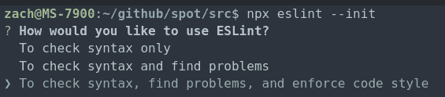
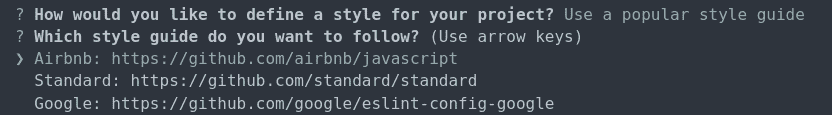

# 比较三大风格指南，并使用 ESLint 进行设置

> 原文：<https://betterprogramming.pub/comparing-the-top-three-style-guides-and-setting-them-up-with-eslint-98ea0d2fc5b7>

## 标准 vs .谷歌 vs. Airbnb


由 [Raphael Schaller](https://unsplash.com/@raphaelphotoch?utm_source=unsplash&utm_medium=referral&utm_content=creditCopyText) 在 [Unsplash](https://unsplash.com/s/photos/character?utm_source=unsplash&utm_medium=referral&utm_content=creditCopyText) 拍摄的照片

网上有很多文章会教你如何建立一个具体的 [ESLint](https://eslint.org/) 风格指南；本文将解释如何在使用 React 时设置 ESLint，以及比较 [Airbnb](https://www.npmjs.com/package/eslint-config-airbnb) 、 [Standard](https://www.npmjs.com/package/standard) 和 [Google](https://www.npmjs.com/package/eslint-config-google) 风格指南。

# 设置 ESLint

注意:本指南假设您想在本地安装 ESLint(推荐安装)。如果你想全局设置 ESLint，确保使用`yarn global`。

根据 [ESLint 设置文档](https://eslint.org/docs/user-guide/getting-started)，ESLint 的一个先决依赖项是 [Node.js](https://nodejs.org/en/) (8.10.0，^10.13.0，或> =11.10.1)构建的 SSL 支持。

要安装 ESLint，您可以运行:

```
yarn add eslint --dev
```

然后，使用以下命令配置 ESLint:

```
yarn eslint --init
```

将出现一个提示，询问您一些配置问题，这些问题的答案取决于您的项目情况。

对于第一个问题，选择第三个选项很重要，这样您就可以实际实施代码风格。



另一个问题是您想要实施哪种样式指南。写这篇文章的时候，目前给出的选项有 [Airbnb](https://www.npmjs.com/package/eslint-config-airbnb) 、[标准](https://www.npmjs.com/package/standard)和 [Google](https://www.npmjs.com/package/eslint-config-google) 风格指南。



决定你想使用哪种风格指南可能有点令人生畏，膝跳反应可能是选择你最喜欢的品牌。

正如我将在下面解释的，当你决定一个风格指南时，你最喜欢的品牌是你最不应该考虑的。

# 比较样式参考线

正如我所说，决定一个风格指南不仅仅是选择你最喜欢的品牌名称的问题。选择风格指南需要更多的思考。

例如，如果你正在开发一个 React 应用程序，那么谷歌的风格指南就不是最好的选择，因为它不支持 React。如果你喜欢你的分号，标准不是一个可行的选择，因为它删除了它们。

我想你明白了，时尚指南不仅仅是与品牌相关的东西。

在比较差异之前，所有的样式指南都执行以下规则:

*   制表符([缩进](https://eslint.org/docs/rules/indent)):两个空格。
*   引号([引号](https://eslint.org/docs/rules/quotes)):单个。
*   控制块的括号样式([括号样式](https://eslint.org/docs/rules/brace-style)):同一行。
*   更喜欢`const` / `let`而不是`var` ( [no-var](https://eslint.org/docs/rules/no-var) ):真。
*   无尾随空格([无尾随空格](https://eslint.org/docs/rules/no-trailing-spaces)):真。
*   数组括号间距([数组括号间距](https://eslint.org/docs/rules/array-bracket-spacing)):没有空格。

注意:此表比较的是规则集特有的规则，而不是与 [ESLint-recommended](https://www.npmjs.com/package/eslint-config-recommended) 一起提供的规则。

以下是它们之间的一些差异:


这些规则只是这些规则集实施的众多规则中的一部分。一个风格指南可以实施超过一百条规则，有些规则是三者共同实施的，而有些则是单独实施的。这完全取决于你想要什么。

同样重要的是要记住，如果你找到了你喜欢的风格指南，但是它执行了你不希望它执行的规则，或者它没有执行你希望它执行的规则，你总是可以通过在`eslintrc`中制定特定的规则来微调它。

要启用风格指南，您可以重新初始化 ESLint(对于最后一个选项，我建议不要安装 npm。相反，我会用 Yarn 手动添加依赖关系)或者不用重新初始化，你可以只手动添加依赖关系，然后编辑`eslintrc`:

## [标准](https://www.npmjs.com/package/eslint-config-standard)

```
yarn add eslint-config-standard --dev“extends”: [“eslint:recommended”, “standard”]
```

## 谷歌

```
yarn add eslint-config-google --dev“extends”: [“eslint:recommended”, “google”]
```

## [Airbnb](https://www.npmjs.com/package/eslint-config-airbnb)

```
yarn add eslint-config-standard --dev“extends”: [“eslint:recommended”, “airbnb”]
```

# 结论

最重要的是选择一个符合你需求的风格指南。如果你不想考虑太多，Airbnb 的风格指南通常被认为是 React 开发的最佳选择。

如果您有任何问题、建议或其他任何事情，请随时发表评论！