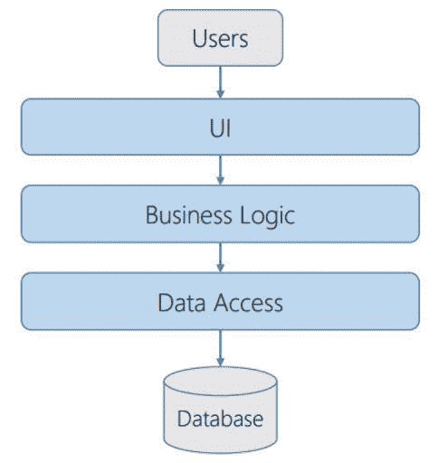
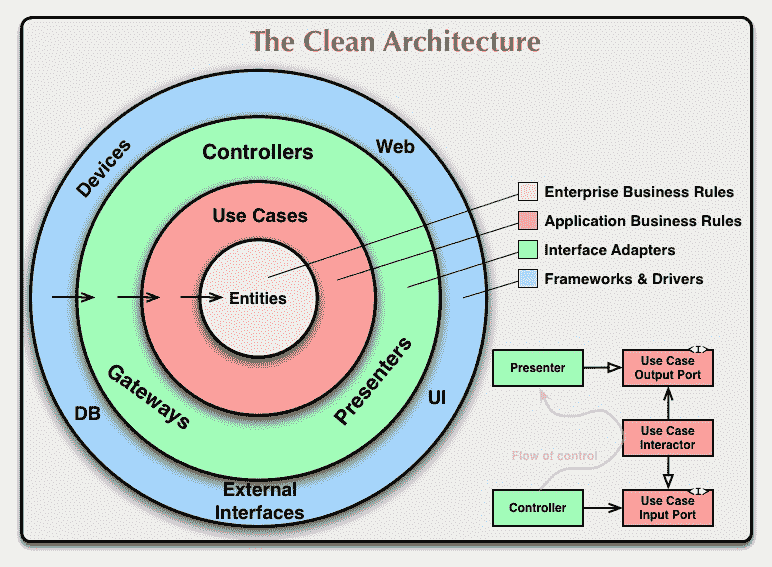
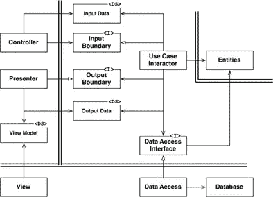
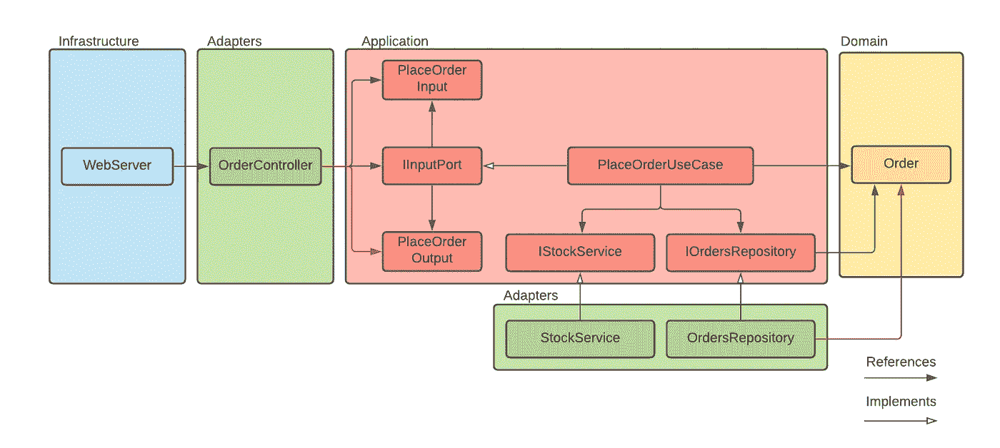

# Web 开发中三层架构和干净架构的比较

> 原文：<https://betterprogramming.pub/comparing-three-layered-and-clean-architecture-for-web-development-533bda5a1df0>

## 最流行的 web 应用程序开发方法

照片由[法库里安设计](https://unsplash.com/@fakurian?utm_source=medium&utm_medium=referral)在 [Unsplash](https://unsplash.com?utm_source=medium&utm_medium=referral) 上拍摄

在本文中，我想比较经典的三层架构和干净的架构。我将尝试回答以下问题:

*   两种风格的精髓是什么？
*   如何实施这些措施？非常简短的概述。
*   区别是什么，何时使用每种方法？

# 什么是三层架构？

我想在一开始就指出，三层架构经常与三层或 n 层架构混淆。该层是您的 monolith 内部的应用程序代码的逻辑分离。该层是物理隔离。这意味着，如果我们谈论一个三层架构，那么应用程序可以分为这些级别:数据库服务器、web 服务器上的 web 应用程序和用户的浏览器。也就是说，每一层都代表一个不同的、独立的物理过程。

但在本文中，我们将分解三层架构。这种架构在逻辑上将您的应用程序代码分为三个部分。让我们看看这些层是什么，它们的职责是什么。

经典三层架构

*   UI 或表示层。这是用户直接与之交互的层。这一层是用户界面，是从用户那里获取输入的机制。它可能包含控制器和视图模型，以及组成用户界面的视图(HTML 静态页面，JavaScript)。
*   业务逻辑层。该层包含一组负责处理从 UI 层接收的数据的组件。它实现了所有必要的应用程序逻辑，所有的计算。它与数据库交互，并将处理结果传递给 UI 层。
*   数据访问层。它存储数据模型。它还承载了使用不同数据访问技术(如 ORM)的特定类。

这里重要的是这些层如何相互依赖。数据访问层独立于其他层；业务逻辑层依赖于数据访问层，UI 层依赖于业务逻辑层。你可以通过上图中箭头的方向看到它。

这意味着数据及其保存方式是应用程序最关键的部分。这是因为大多数应用程序都依赖于数据访问层，对这一层技术的任何更改都需要对其他层进行更改。

除此之外，应该注意表示层不能直接与数据访问层交互。只能通过业务逻辑层来完成。

好了，让我们看看如何用三层实现我们的应用程序。

# 三层架构的实现

让我们以一个 REST API 为例。在这种情况下，我们的 UI 层将是一个以 JSON 格式返回视图模型的控制器。代码如下:

这里，我们对传入的请求以及业务逻辑层交互进行了简单的验证。我们将请求向下传递到下一层。

接下来是我们的业务逻辑层。我们将其抽象成一个`Service`类。

在上面的代码示例中，`OrderService`类是事务脚本模式的一个实现。事务脚本是一个按过程组织业务逻辑的模块，其中每个操作处理单个请求中的指令。

在这里，我们验证客户是否可以下订单，并检查产品是否有货。这些检查是我们的业务逻辑。除此之外，我们通过模型与数据访问层进行交互。代码如下:

在模型中，您定义数据和方法。保存、更新和删除数据是模型的职责。在我们的例子中，这些方法继承自`ORMEntity`。

这种管理数据的模式称为活动记录。简单地说，活动记录是访问模型中数据库的一种方法。

我还应该注意到，使用分层架构涉及到实现依赖注入来使层松散耦合。依赖注入可以通过不同的库或者使用构造函数来实现。

就是这样。现在让我们深入研究一下干净的建筑，然后比较这两种风格。

# 什么是干净的建筑？

干净的架构也是分层的架构。层域(实体)位于应用层(用例)的中心。外层由端口和适配器组成，这些端口和适配器通过控制器、存储库和呈现器使应用程序适应外部系统(web、DB、UI)。

这种架构是以领域为中心的。它将领域模型置于应用程序的中心。领域模型结合了行为和数据，但是没有定义与数据库的交互。领域模型的持久性和表示只是尽可能远的细节。

几种流行的风格实现了以领域为中心的架构——阿利斯泰尔·考克伯恩的六角形架构，杰弗瑞·帕勒莫的洋葱架构。但是我们要打破罗伯特·马丁的清洁建筑。

在中心，我们有一个**域层**，它以实体的形式包含业务的基本逻辑和数据。例如，有一个业务规则，用户可以拒绝订单。`Order`实体将拥有`status`属性和`reject()`方法。

接下来是**应用层**。它定义了应用规则。换句话说，它回答了如何使用我们的实体的问题。例如，我们的业务是销售产品。因此用例可以是下订单。我们需要检查产品是否有货，然后下订单。这些是我们应用的规则。

下面，我们有**适配器层**。с控制器从基础设施层获取输入数据，并将其转换成用例及实体所需的形式。在我们的例子中，来自基础设施的输入数据可以是一个 HTTP 请求。我们的控制器知道如何获得请求体或查询参数，并将它们传递给用例。在执行用例之后，结果被传递给表示器，表示器将模型转换成 HTTP 响应。

**基础设施层**是最后一层。这一层是最不稳定的组件所在:数据库驱动程序、网络库、操作系统、设备等。它尽可能远离稳定畴层。

除了层分离，我们必须记住**依赖规则。**

1.  不能绕过层设置依赖关系。这意味着我们不能在基础设施层中使用应用层内部定义的类，因为我们在它们之间有适配器层。
2.  我们的高层不能依赖于低层。换句话说，在低层定义的类、函数、对象不能出现在高层。该规则在图中用黑色箭头表示。如何实现这一点？通过使用依赖性反转原理。我们在高层定义端口(接口)，在低层实现。

适配器和应用层之间的数据转换由输入和输出端口执行。`Controller`从`InputPort`中调用一个由`UseCase`实现的方法，并在其中传递`InputData`数据结构。然后`UseCase`用`OutputData`数据结构响应`OutputPort`，由`Presenter`实现`OutputPort`。

马丁，钢筋混凝土清洁建筑；第 196 页

这是罗伯特·马丁在他的书中给出的图表。我们可以看到依赖规则——所有穿过层边界的箭头都指向实体层。请注意数据访问的依赖性是如何反转的。我们没有在`Use Case Interactor`中使用`Data Access`的直接实现，而是为它定义了一个接口。

理论够了。让我们尝试将这些原则应用到我们的示例应用程序中。

# 清洁架构的实现

我们的示例应用程序将是一个 REST API。它将接收订单，检查产品是否有货，并将订单存储在数据库中。

我应该指出，这个实现与上图中 Robert Martin 提出的略有不同。

1.  我们不会使用演示者，因为 REST API 中没有 UI。
2.  `OrdersRepository`将指代`Order`实体。这种违反在存储库的上下文中是可以接受的，因为它们从持久数据中构造实体。

与应用程序的交互始于发送给`HTTPServer`的用户请求。`HTTPServer`类位于基础设施层。服务器在其路由中使用`OrderController`方法将 HTTP 请求传递到适配器层。代码如下:

`OrderController`类位于适配器层，它的职责是验证 HTTP 请求并将其转换成应用层可以理解的格式。该格式由`IPlaceOrderInputData`接口在应用层内部定义。代码如下:

`OrderController`类引用了`IInputPort`接口。`PlaceOrderUseCase`是`IInputPort`的一个实现。它通过构造函数方法注入到控制器中。验证后，请求被传递到`PlaceOrderUseCase`。

接下来是我们的`PlaceOrderUseCase`。它通过`IOrdersRepository`和`IStockService`接口与基础设施层交互。代码如下:

重要的一点是应用层依赖于抽象。这些抽象保护它不受较低层变化的影响。我们在应用层定义端口(接口),并将实现委托给适配器层。如果我们需要改变我们的依赖关系，我们只能改变特定的实现。应用层保持不变。例如，我们将产品图像存储在块存储中，然后决定迁移到 AWS S3。

在我们确定产品有货后，我们创建`Order`实体。实体表示与业务相关的数据和方法。例如，如果订单状态已经设置为`ACCEPTED`或`FAILED`，则不能更改。重要的是遵循单一责任原则，不要将一个实体的逻辑与另一个实体的逻辑混淆。代码如下:

之后，实体被`OrdersRepository`类持久化。

让我们假设我们决定使用`pg` lib 来管理数据。`OrdersRepository`通过实现应用层所需的方法来适应`pg.Client`。代码如下:

这里我们在构造函数中提供了`pg.Client`,因为我们需要首先建立连接。数据库是我们的基础设施，所以代码将位于基础设施层。代码如下所示:

这是如何使用干净的架构实现 REST API 的初级版本。完整的代码示例你可以在这里找到。

# 结论

在比较三层架构和干净架构时，我能想到的唯一显著优势是简单性:

*   没有必要支持那么多的抽象。
*   在这样的项目中，很容易找到开发人员并让他们参与进来。
*   整体开发速度比 Clean 架构更快。

但是上面列出的优势在一定程度上是存在的。当业务增长时，它的流程变得更加复杂，因此在基本的 CRUD 操作中实现它们很有挑战性。此外，三层体系结构缺乏抽象性，不允许您灵活地选择技术。

另一方面，干净的架构需要额外的维护开销，但是在后期阶段会有显著的回报。以下是一些要点:

*   独立于库和框架设计业务逻辑使我们能够利用 OOP 的所有功能。例如，我们可以使用领域驱动的设计来建模我们的领域实体。
*   如果我们不确定使用什么技术，我们可以更轻松地替换它。例如，我们可以使用内存进行缓存，然后转移到内存中的数据库，而无需修改我们的域逻辑。我们只是交换了适配器。
*   Clean Architecture 还提供了编写模块化代码的机制，这些代码很容易被模仿和测试。
*   一般来说，干净的架构迫使我们使用可靠的原则。这些工具可以帮助更大的团队维护更复杂的应用程序。

# 选什么，什么时候选？

我们可以清楚地看到，三层架构适用于较小的项目。让我们定义一个属性列表，表明我们应该使用三层架构:

*   一个项目不涉及很多业务逻辑。它可以是电子商务网站、博客、管理面板或简单的 CRUD API。
*   开发必须快速完成。该项目应在短时间内发布。
*   预计不会改变技术并且具有少量集成的项目。
*   一个小的开发团队。

至于 Clean Architecture，当我们看到产品将会很复杂时，我们可以使用它。以下是一些例子:

*   像房地产或银行系统这样的企业项目会有很多复杂的业务规则。
*   这种架构适合超级应用这样的可插拔应用。在不同环境下工作的应用程序，如具有沙箱和生产 API 的支付系统。
*   一个应该发展和调整技术以适应其规模的项目。
*   大型开发团队或一组小型团队。

但是这两种架构并不相互排斥。我会说它们可以一个接一个地使用。

让我们想象一下，我们需要从零开始建立一个产品，一个创业公司。在商业想法验证阶段，我们可以使用三层架构。它会给我们一段时间的开发速度，应该用来寻找产品/市场的契合度。

之后，我们可以转移到一个干净的架构，以便能够支持功能增强。当我们的业务变得越来越复杂时，我们需要处理复杂性，而这种架构为我们提供了工具。

更进一步，我们可以使用领域驱动的设计来将我们的领域划分成具有集合和实体的有界上下文。但那是另一回事了。