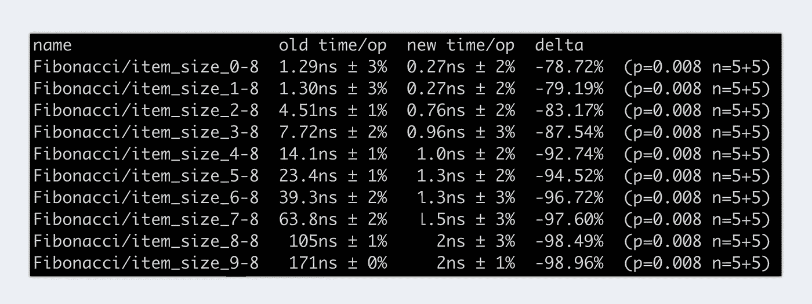

# 比较 Go 1.18 中的两个基准

> 原文：<https://betterprogramming.pub/comparing-two-benchmarks-in-go-1-18-e6161de3757>

## 今天，我们将看看一个工具，它允许我们通过控制台快速、轻松地比较基准


地鼠是由埃贡·厄尔布尔画的。

如果你使用 Go 做过一些开发，你可能已经注意到测试一个函数和检查内存分配是多么容易。Golang 为我们提供了使基准测试变得非常简单的工具和命令。但是在我们对一个函数进行基准测试之后，我们应该做什么呢？

有时比较新旧版本是必要的或有用的。例如，您编写了一个函数，进行了基准测试，发现它非常慢。你上网搜索，找到更好的解决方案。您实现它，并使用您的新逻辑再次运行基准测试。你觉得应该快一点，但是你不确定。

将你的新成绩与旧成绩进行比较该有多好！不幸的是，当我写这篇文章时，Golang 还没有实现这样的特性。但是不用担心。今天，我将介绍一种方法来做到这一点。现在，我不说了。我们走吧。

> 这是我的新系列的第二篇文章。如果你对泛型感兴趣，你可能也会觉得第一篇文章很有趣:[如何用 Go 1.18 编写泛型助手函数](/how-to-write-generic-helper-functions-with-go-d47c52986016)

为了更好地说明，我们实现了两个不同的函数来计算序列中的`nth`斐波那契数。您可以在下面看到我们的第一个实现。

# 简单递归实现

这是一个非常简单的方法。如果`n`小于 2，则返回`n`。在另一种情况下，我们用`n-1`和`n-2`递归调用我们的函数。最后，我们返回两者相加的结果。

# 简单迭代实现

在我们的第二个实现中，如果小于 2，我们直接返回`n`。如果没有，我们循环`n`次，并在每次迭代中对`n-1 + n`的值求和。

# 递归与迭代方法

现在我们有两种不同的实现。检查哪一个性能更好的方法是对这两个函数进行基准测试。然后你把两个结果放在一起，比较它们，瞧，我们有一个赢家。但是，如果能通过控制台来比较它们，并准确地得到两个基准之间的差异，那该多好啊。

几个月前，我偶然发现了一个可以做到这一点的包。叫做 [benchstat](https://pkg.go.dev/golang.org/x/perf/cmd/benchstat) ，非常好用。我将向您展示如何在我们的两个实现中使用它。

# 通过 Benchstat 进行比较

首先，我们需要从我们的第一个和第二个实现中提取基准，并将它们保存到一个文件中。

## **递归方法**

```
go test -bench="BenchmarkFibonacci" -run=^# -count=5 | tee fibunacci_recursive.txt
```

## **迭代方法**

```
go test -bench="BenchmarkFibonacci" -run=^# -count=5 | tee fibunacci_iterative.txt
```

接下来，确保您已经安装了 benchstat。如果没有，请使用以下命令安装它:

```
go install golang.org/x/perf/cmd/benchstat@latest
```

最后，我们只需要从 benchstat 调用命令来比较这两个基准。

```
benchstat fibunacci_recursive.txt fibunacci_iterative.txt
```

因此，benchstat 显示具有不同列的统计信息。在第一列中，您可以看到我们测试的函数名。第二列和第三列显示了两个文件的样本平均时间差和百分比偏差。最后一列叫做 delta。这是 benchstat 显示两个基准之间性能变化百分比的地方。

下面，你可以看到我们比较两种方法的结果。参数值越高，我们的递归变量每次操作花费的时间就越多。而我们的迭代实现几乎是均匀增长的。通过查看 delta，我们可以直接比较这意味着什么。性能上的差异迅速增加。



使用 benchstat 比较两个基准的结果

# 最后的想法

基准测试可能非常有用，但也会产生大量数据。Benchstat 可以帮助分析数据并得出正确的结论。如果你有什么要提的或者有问题，如果你能在评论里留下来，那就太好了。

回头见。

附:这是我计划的新系列的第二篇文章。在接下来的几周里，我将看看各种通用的助手函数、有趣的基准和世界范围内有用的特性。