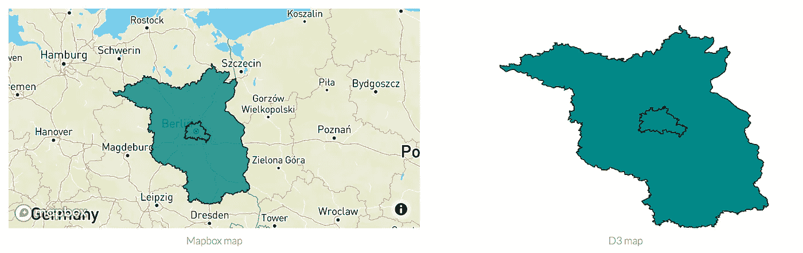

# 比较 Mapbox GL JS 和 D3.js

> 原文：<https://betterprogramming.pub/comparison-of-mapbox-gl-js-and-d3-js-66dc4525b70b>

## 哪个是高级映射库？



当您想要根据您的数据创建在线地图时，有大量的选项可供选择。

当我教 D3 或者和人们谈论他们正在使用的工具时，经常出现的问题是，“D3 和 Mapbox GL JS 相比如何？”

这就是我想用这个帖子回答的问题。我不仅在概念上比较这两个库，也在代码上进行比较。

让我们从一个更令人困惑的方面开始:

# 名字

两个库的定义如下:

> Mapbox GL JS 是一个 JavaScript 库，用于交互式、可定制的网络矢量地图。它采用符合 Mapbox 样式规范的地图样式，将它们应用于符合 Mapbox 矢量切片规范的矢量切片，并使用 WebGL 渲染它们。

Mapbox GL JS 是跨平台生态系统 Mapbox GL *、*的一部分，Mapbox 是一家专注于位置数据的公司。Mapbox GL 是由 Mapbox 工程师创建的。所以上面才会有公司的名字。是基于 fleet . JS，从现在开始我就把 Mapbox GL JS 简称为 Mapbox，以少写。:)

> D3(或 D3.js)是一个 JavaScript 库，用于使用 web 标准可视化数据。D3 帮助您使用 SVG、Canvas 和 HTML 将数据变得生动。

D3.js 和 Mapbox 在概念上是很不一样的。Mapbox 是一个创建所谓的*滑动地图*的库，与传单、OpenLayers 和 GoogleMaps 有着良好的合作关系。

> 一般来说，滑动地图是一个指现代网络地图的术语，它可以让你缩放和平移(当你拖动鼠标时，地图会滑动)。

OpenStreetMap 的这段话很好地解释了这一点:)
尽管使用这个定义，D3 地图也可以是滑动地图。您可以为它们添加缩放和平移功能。

> Slippy Maps 的一个核心组成部分是图像应该作为网格上的图块提供。切片图像是浏览大量栅格和矢量地图数据的有效方法，这些数据太大而无法作为单个地图图像进行渲染。

这个来自行星开发者资源“滑滑地图 101”的解释更具技术性，但也更切题。这些地图(用于)从服务器加载图像，并平铺它们以加快加载速度。如今，矢量图像已经取代了图像，但是它们仍然被用作加载和渲染速度更快的图像。

让我们看一些代码。或者准确地说是渲染上述地图的完整代码。Mapbox 地图在左边，D3 地图在右边。

代码沙箱中的 *mapbox* 代码

沙盒中的 d3 代码

# 代码量

您看到的第一个区别是 Mapbox 的代码几乎是 D3 代码的两倍长。这有点令人惊讶。但这是因为它的样式花费了很多精力，并且是以可读的方式格式化的。

获胜者:D3

# 易于设置

两者都相对容易设置。您要么下载他们的代码并集成它，要么像我在示例中所做的那样使用 CDN。

## 地图框设置:

```
<script src="[https://unpkg.com/mapbox-gl@0.49.0](https://unpkg.com/mapbox-gl@0.49.0)" type="text/javascript"></script>
<link href="[https://unpkg.com/mapbox-gl@0.49.0/dist/mapbox-gl.css](https://unpkg.com/mapbox-gl@0.49.0/dist/mapbox-gl.css)" rel="stylesheet" type="text/css">
```

您需要包含 JavaScript 库代码和用于 Mapbox 的 CSS。样式表对于确保导航元素可见很重要。此外，您需要在[mapbox.com](https://docs.mapbox.com/help/how-mapbox-works/access-tokens/)注册以获得 API 令牌来使用他们的底图。但那是免费的；只是你的电子邮件作为付款。:)

## D3 设置:

```
<script src="https://unpkg.com/d3@5.9.7/dist/d3.min.js" type="text/javascript"></script>
```

对于 D3，你只需要包含库。确保使用最新版本。

获胜者:D3

# 底图

最明显的区别是缺少 *d3* 的底图。但这是我故意做的。 *d3* 的强大之处在于它默认不包含底图。您希望数据成为地图的中心，而不是底图。

这是比较重要的作品之一。你根据自己的需求选择库，D3 和 Mapbox 服务于不同的需求。当您需要更多信息而不仅仅是数据时，如街道位置、更多标注等，Mapbox 和其他基于底图的库会大放异彩。

获胜者:地图盒子

# 预测

第二大区别是地图投影。Mapbox 使用[墨卡托](https://en.wikipedia.org/wiki/Mercator_projection)作为默认设置，并且您不能更改投影。

在 D3 里，你自己选择投影。您可以从 14 个不同的投影列表中选择，也可以创建自己的投影。 [D3 投影资源](https://github.com/d3/d3-geo-projection)

```
var projection = d3.geoEqualEarth();
```

获胜者:D3

# 式样

地图框样式是通过[地图框样式规范](https://docs.mapbox.com/mapbox-gl-js/style-spec/)完成的，而 *d3* 样式是通过普通的 SVG 属性和 CSS 完成的。

你可能已经注意到了，我们需要在 Mapbox 中创建两个图层来设置填充和轮廓的样式。

这是样式规范的诸多限制之一。但是您可以使用样式规范做很多事情，并且不需要过多考虑实现。

在 D3 里，你可以用 SVG 和 CSS 来设计几乎任何东西。而且更方便。

在这两种情况下，您都需要学习如何设计元素的样式。

## 地图框:

```
map.addLayer({
      'id': 'berlin',
      'type': 'fill',
      'source': 'bb',
      'paint': {
        'fill-color': '#088',
        'fill-opacity': 0.8
      }
    });
    map.addLayer({
      'id': 'berlin-stroke',
      'type': 'line',
      'source': 'bb',
      'paint': {
        'line-width': 1,
        'line-color': '#000',
      }
    });
```

## D3:

```
.attr('fill', '#088')
.attr('stroke', '#000');
```

获胜者:D3

# 将地图居中

虽然 Mapbox 依赖于您(创建者)来预先设置缩放、居中等，但是 *d3* 允许您使用您的数据来设置范围。

你可以让 Mapbox 计算出最好的缩放和居中，但是这比较困难，我目前没有包括这个。我将来可能会延长这篇文章。

## 地图框

```
center: [13.79,53.545], 
zoom: 5
```

## D3

```
projection.fitExtent([[20, 20], [width, height]], bb);
```

获胜者:D3

# 你需要学习的概念

使用*地图框*需要学习或理解的概念肯定更少。你只需要知道有层和源，调用适当的函数(看例子和文档:)，阅读 Mapbox 样式规范，你就可以开始了。

有了 *D3* ，你应该知道 HTML 的基础，学一点 SVG，知道调用哪个 D3 函数(看例子和文档)。

获胜者:地图盒子

# 结论

正如我在这篇文章开始时提到的，D *3* 和 Mapbox 的用途有些不同。但它们确实有相似的特征。

那么他们是如何相互竞争的呢？让我们找出答案。

**T5 地图框 2
D3**5

我宣布 D ***3* 为本次比较的获胜者**。但是请记住，如果您需要底图，Mapbox 可能更容易设置。