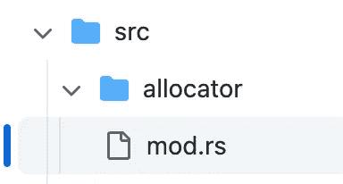

# Rust 中的编译时特征标志:为什么，如何，何时？

> 原文：<https://betterprogramming.pub/compile-time-feature-flags-in-rust-why-how-when-129aada7d1b3>

## 代价是什么？


作者图片

在 Rust 中挑选编译时特性的能力可以提高代码的性能、大小、可维护性、安全性和可移植性。

下面是一些论据，说明为什么您应该在使用依赖项时主动使用特性，并将这些特性提供给其他库用户。

# 表演

在 Rust 中使用特性标志可以提高结果代码的性能。通过只包含特定应用程序所需的代码，您可以避免未使用或不必要的代码的开销。

尽管有编译器优化来移除死代码，但这仍然可以产生更快更有效的程序(并使编译器的工作更容易)。

# 大小

生成的二进制文件的总体大小受到您包含的依赖项以及您如何使用它们的影响。

特性选择可以帮助生成的二进制文件更小，有利于需要分布或部署到资源受限环境中的应用程序。

# 可维护性

我最近有一个中断上游依赖，我很幸运地在一个特性标志下有那个上游中断代码——对于一个我没有使用的特性。

在等待上游库更新的时候，我为我的本地项目删除了这个特性，它又可以很好地构建了。这意味着您可以通过允许开发人员选择性地包含或排除特定功能来提高 Rust 代码的可维护性。

# 安全性

从统计学上来说——您依赖的代码越多，出现安全问题的几率就越高。仅仅依靠你需要的特性来降低安全问题的几率是安全设计思维，而一个“成块”提供自己的板条箱正在帮助实现这一点。

还有一些方法可以根据您对某个实现的安全性的满意程度来选择同一功能的不同实现。例如，与基于 C 的实现相比，你可能更喜欢 Rust-native TLS 实现，因为 Rust 是一种安全的语言，并且像 Reqwest 这样的一些[机箱提供了一系列 TLS 后端。](https://github.com/seanmonstar/reqwest/blob/master/Cargo.toml#L29-L44)

# 轻便

作为一种编译语言，特性标志的一个重要方面是提高代码的可移植性。

您可以有选择地包含或排除特定的功能，以使您的代码在不同的平台和环境之间更具可移植性。

# C/C++如何比较？

历史上，C 和 C++一直是部署到许多平台和 CPU 架构的编译后可移植代码的原型。

C++没有一个内置的特性直接等同于在 Rust 中选择编译时特性的能力。然而， [C++确实有许多预处理指令](https://stackoverflow.com/questions/4469645/dos-and-donts-of-conditional-compile)，可以用来在编译时选择性地包含或排除某些代码。

这可以提供一些与 Rust 中的特性标志相同的好处。尽管如此，无论是作为寻求构建现有代码库的程序员，还是作为寻求启用或禁用功能的消费者，都很难发现这一点。

# 功能标志:构造块


作者图片

要启用特定板条箱的特定特征标志，您可以使用板条箱的`Cargo.toml`文件中的`default-features = false`和`features`属性。

例如:

```
[dependencies]
my-crate = { default-features = false, features = ["my-feature"] }
```

要为一段特定的代码启用特性标志，可以使用`#[cfg(feature = "my-feature")]`属性。例如:

```
#[cfg(feature = "my-feature")]
fn my_function() {
    // Code that is only included when the "my-feature" flag is enabled
}
```

要启用特定模块的特性标志，可以在`mod`声明中使用`#[cfg(feature = "my-feature")]`属性。例如:

```
#[cfg(feature = "my-feature")]
mod my_module {
    // Code that is only included when the "my-feature" flag is enabled
}
```

要使用`derive`为特定的结构或枚举启用特性标志，可以使用`#[cfg_attr(feature = "my-feature", derive(...))]`属性。例如:

```
#[cfg_attr(feature = "my-feature", derive(Debug, PartialEq))]
struct MyStruct {
    // Fields and methods that are only included when the "my-feature" flag is enabled
}
```

以下是如何启用或禁用对特定平台的支持:

```
#[cfg(target_os = "linux")]
mod linux_specific_code {
    // Linux-specific code goes here...
}
```

以及如何启用或禁用特征的特定实现:

```
#[cfg(feature = "special_case")]
impl MyTrait for MyType {
    // Implementation of trait for special case goes here...
}
```

如何启用或禁用特定的测试用例:

```
#[cfg(feature = "expensive_tests")]
#[test]
fn test_expensive_computation() {
    // Test that performs expensive computation goes here...
}
```

下面是启用或禁用特定基准的代码:

```
#[cfg(feature = "long_benchmarks")]
#[bench]
fn bench_long_running_operation(b: &mut Bencher) {
    // Benchmark for a long-running operation goes here...
}
```

要仅在设置了多个标志时启用某个功能，您可以使用`#[cfg(all(feature1, feature2, ...))]`属性。例如，要仅在`my_feature1`和`my_feature2`标志都设置时启用`my_function()`:

```
#[cfg(all(feature = "my_feature1", feature = "my_feature2"))]
fn my_function() {
    // code for my_function
}
```

要仅在设置了多个标志中的一个时启用一个功能，您可以使用`#[cfg(any(feature1, feature2, ...))]`属性。例如，当`my_feature1`或`my_feature2`标志被置位时，启用`my_function()`:

```
#[cfg(any(feature = "my_feature1", feature = "my_feature2"))]
fn my_function() {
    // code for my_function
}
```

# 插图特征标志


作者图片

同一个模块，但是指向不同的实现路径，然后用`pub use`从那个模块中拉出一个函数来公开。

```
//! Signal monitor
#[cfg(unix)]
#[path = "unix.rs"]
mod imp;
#[cfg(windows)]
#[path = "windows.rs"]
mod imp;
#[cfg(not(any(windows, unix)))]
#[path = "other.rs"]
mod imp;
pub use self::imp::create_signal_monitor;
```

参见 `[https://github.com/shadowsocks/shadowsocks-rust/blob/master/src/monitor/mod.rs](https://github.com/shadowsocks/shadowsocks-rust/blob/master/src/monitor/mod.rs)`

当不同的组件具有相同的实现时:您可以提供世界上所有的东西，而没有任何缺点，因为只有选择的特性会被编译进来。

代价是现在你有了一个更大的测试矩阵，它随着每一个新的选择而增长。

在这个例子中，库允许您选择您能想到的任何分配器，因为分配器有一个定义良好的接口，并且不需要您进行交换:



```
//! Memory allocator
#[cfg(feature = "jemalloc")]
#[global_allocator]
static ALLOC: jemallocator::Jemalloc = jemallocator::Jemalloc;
#[cfg(feature = "tcmalloc")]
#[global_allocator]
static ALLOC: tcmalloc::TCMalloc = tcmalloc::TCMalloc;
#[cfg(feature = "mimalloc")]
#[global_allocator]
static ALLOC: mimalloc::MiMalloc = mimalloc::MiMalloc;
#[cfg(feature = "snmalloc")]
#[global_allocator]
static ALLOC: snmalloc_rs::SnMalloc = snmalloc_rs::SnMalloc;
#[cfg(feature = "rpmalloc")]
#[global_allocator]
static ALLOC: rpmalloc::RpMalloc = rpmalloc::RpMalloc
```

在本例中，您将看到如何让您的用户“嵌入”他们需要的功能，您可以选择想要嵌入的深度:

```
//! Service launchers
pub mod genkey;
#[cfg(feature = "local")]
pub mod local;
#[cfg(feature = "manager")]
pub mod manager;
#[cfg(feature = "server")]
pub mod server;
```

在下面的示例中，您可以使用块来“人为地”在某个特性下的整个代码段中限定范围:

```
#[cfg(feature = "local-tunnel")]
{
    app = app.arg(
        Arg::new("FORWARD_ADDR")
            .short('f')
            .long("forward-addr")
            .num_args(1)
            .action(ArgAction::Set)
            .requires("LOCAL_ADDR")
            .value_parser(vparser::parse_address)
            .required_if_eq("PROTOCOL", "tunnel")
            .help("Forwarding data directly to this address (for tunnel)"),
    );
}
```

在这个例子中，我们内联了空的实现，因为如果函数体总是返回一个简单的空值，为什么还要为函数调用付出代价呢？(`Ok(()`)。

```
#[cfg(all(not(windows), not(unix)))]
#[inline]
fn set_common_sockopt_after_connect_sys(_: &tokio::net::TcpStream, _: &ConnectOpts) -> io::Result<()> {
    Ok(())
}
```

# 最后但同样重要的是:权衡是什么？

如果特性如此强大，并且抛弃了许多 C/C++进行条件代码编译的原始方式，为什么不在任何地方、任何时候都使用它呢？这里有一些你应该考虑的事情。

*   **使用太多功能是一件真实的事情。**在想象和极端的情况下，想象你在每个模块和功能上都有一个特性。这将要求您的用户解决一个非常困难的难题，即理解如何从其离散的特性中组合您的库。这就是特性的危险。你希望你提供的功能数量适中，以减少认知负荷，并且这些功能是人们关心的删除或添加的东西。
*   **测试是特性的另一个重要方面。您永远不知道您的用户会选择哪种功能组合，而每种组合都会选择不同的代码集，这些代码段必须在编译过程中顺利地互操作(成功编译)。在逻辑上(不是引入 bug)，你需要测试所有特性与其他特性的组合，并创建一个强大的特性集！**
*   **你可以用** `**xtaskops::powerset**` 来实现自动化——点击这里查看更多:[https://github.com/jondot/xtaskops](https://github.com/jondot/xtaskops)。