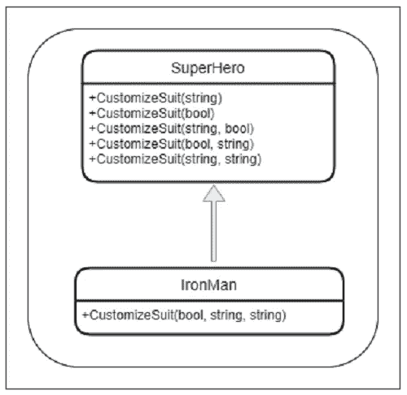
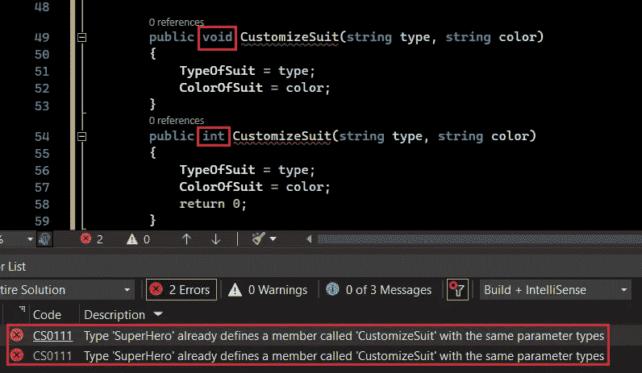
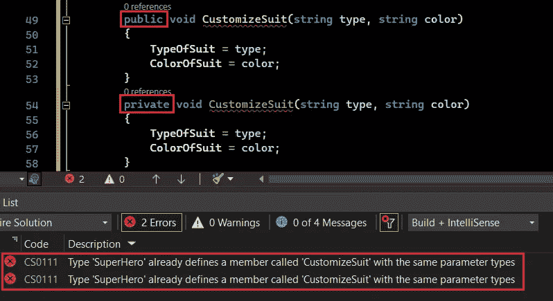
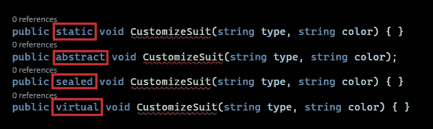
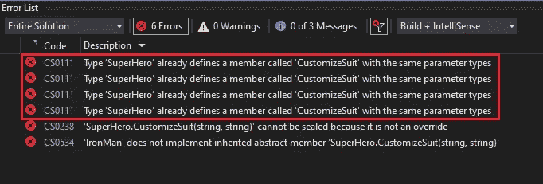
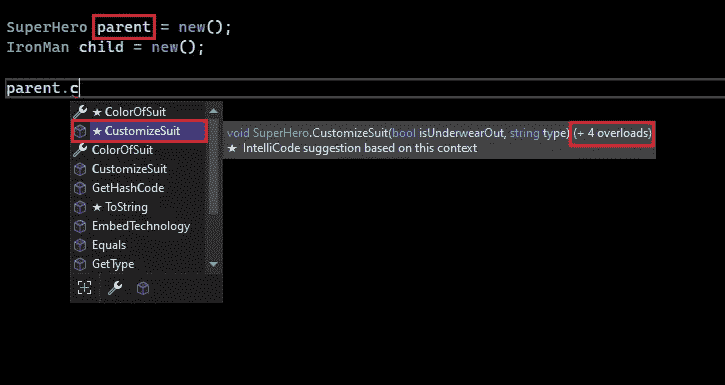
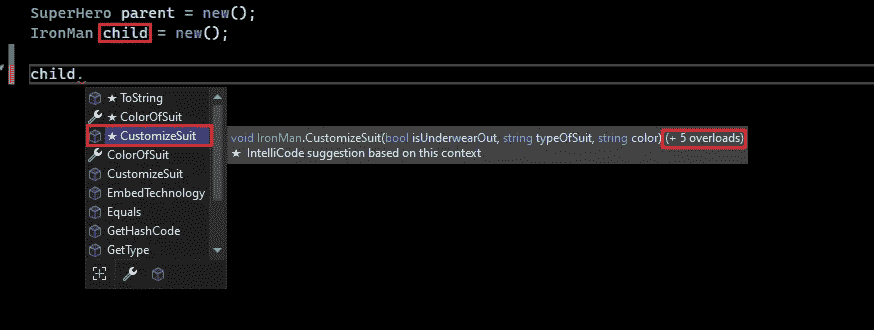
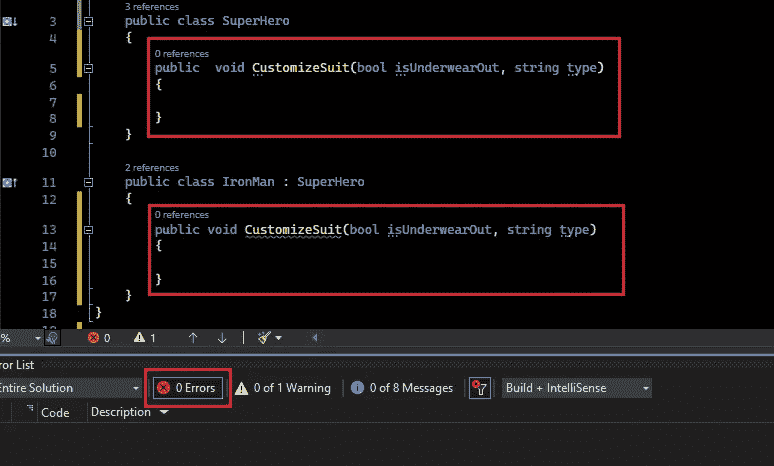
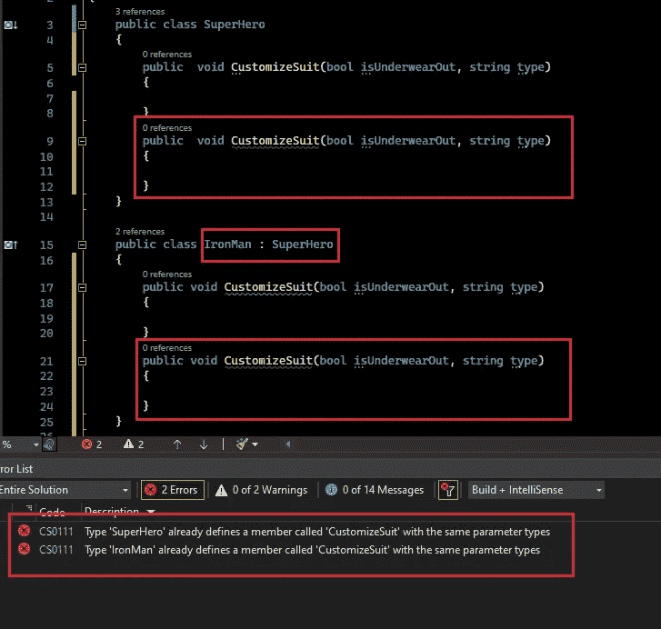

# C#中的编译时多态性

> 原文：<https://betterprogramming.pub/compile-time-polymorphism-in-c-f5ca6934cc55>

## 面向对象编程是一个兔子洞，多态只是洞中的另一根线，让我们看看它能钻多深。


[塔利亚·特兰](https://unsplash.com/@thaliatran?utm_source=medium&utm_medium=referral)在 [Unsplash](https://unsplash.com?utm_source=medium&utm_medium=referral) 上的照片

本文将带您踏上揭开编译时多态之谜的旅程。此外，在`C#`中，我们正好有合适的材料来使它变得更糟，方法重载和覆盖，我们还有方法隐藏的概念，这使多态的整个想法有点令人困惑。这就是为什么我要把这个想法分成三个部分来消除困惑。

这是一个由 3 篇文章组成的系列，我们将在其中深入探讨多态性。以下是拼图的三个部分。

1.  编译时多态性
2.  [运行时多态性](https://medium.com/@RikamPalkar/run-time-polymorphism-in-c-6f9687857ba6)
3.  [方法隐藏/隐藏](https://medium.com/@RikamPalkar/method-hiding-in-c-d653f822ab33)

# 为什么称之为编译时多态性？

因为编译器知道在编译时根据方法的签名调用哪个方法。这种依赖性是在编译时解决的。好吧！这在理论上听起来不错，但让我们看看它实际上是如何工作的。

稍等一下！！，你说的方法签名是什么意思？

任何方法都有四个部分。

1.  方法名称，
2.  返回类型，
3.  参数，
4.  访问说明符

*清单 1:方法签名*

开发者社区之间有一个巨大的争论，返回类型是否应该是方法签名的一部分！！

我们从微软那里澄清这个困惑怎么样？

> 按照微软的说法，“方法的返回类型不是方法重载的方法签名的一部分。但是，在确定委托和它所指向的方法之间的兼容性时，它是方法签名的一部分。

简而言之，当“覆盖一个方法”时，返回类型被认为是方法签名的一部分。

当“重载一个方法”时，它就被忽略了。

让我们通过实际的编码一步步理解多态性，通过编码示例，我们将学习支持上述论点的行为。

# 所以深呼吸，和我一起踏上这段旅程。

重载方法时，有几个规则需要注意。

1.  `Type`的参数应该是不同的，参数的名称并不重要。
2.  参数的数量应该不同。
3.  参数的顺序应该不同。
4.  最后但并非最不重要的是，`return-type`、`access specifiers`或任何其他花哨的关键字，如`static`、`abstract`、`sealed`、`virtual`都不会被考虑在内。

为了演示这些规则，我将在整篇文章中遵循 UML 进行编码，这将触及方法重载的几乎所有方面。



# 让我们为一些我们喜欢的超级英雄设计一些服装？

假设我们正在设计一个`class superhero`，我们的任务是定制一套服装。可能会有不同的争论，衣服的颜色，衣服的类型，或者英雄是否喜欢穿内裤等等。让我们继续设计一个类来实现这些要点。

在下面的代码片段中，我们正在为一个“超人”设计一套衣服。

*清单 2:职业超级英雄*

只要你想让你默认的超级英雄成为超人，这段代码就能起作用。但是让我们面对现实吧，他没那么好。所以为了给另一个超级英雄定制一套衣服，我们可以单独造一套`method CustomizeSuit()`。

假设我有`typeOfSuit`，我想定制它，它可以是皮革或金属套装。为了对此进行编码，我可以简单地创建一个接受一个参数`string type`的方法，该参数将是`typeOfSuit`。

*清单 3:带有一个参数的方法定制套件*

> **规则#1:** 参数的类型应该不同，参数的名称无关紧要。

我的超级英雄表达了对金属套装的兴趣，现在他显然不能在上面穿内衣。所以我可以简单地重载`CustomizeSuit() method`来接受不同类型的参数。在这里，我们重载了一个接受`boolean type`的方法，如果这个参数的值为`true`，那么我们的英雄将会在外面穿上一件内衣。

*清单 3:带有布尔参数*的重载方法 CustomizeSuit

> **规则#2:** 参数个数应该不同。

一些用户想要定制服装类型或者决定内衣的位置，但是其他用户可能对两者一起改变感兴趣。我们可以简单地通过用不同数量的参数重载一个方法来实现这一点。

*清单 4:带有两个参数 string 和 boolean 的重载方法 CustomizeSuit】*

> **规则#3:** 参数的顺序应该不同。

你可以有相同数量的参数，但顺序必须不同，例如我可以从`listing 4`中获取代码并这样做。

*清单 5:带有两个参数 boolean 和 string 的重载方法 CustomizeSuit】*

***清单 5 解释:*** 我只是互换了清单 5 中参数的顺序。编译器查找参数的索引及其类型。如果`Type`在同一个索引处不同，那么它是一个有效的重载方法。

另一种变化可能如清单 6 所示

*清单 6:带有两个参数 string 和 string 的重载方法 CustomizeSuit】*

> **规则#4:** 最后但同样重要的是，返回类型、访问说明符或任何其他花哨的关键字，如 static、abstract、sealed、virtual，都没有任何意义。

让我们全力以赴，好吗？

> **规则#4.1** :不考虑返回类型。

在下面的例子中，除了`return-type`，两个方法之间的一切都是一样的。如果您有两个签名相同但`return-type`不同的方法，则不认为是方法重载。编译器将抛出编译时异常。

*清单 7:具有相同签名但不同返回类型的重载方法定制套件*

**异常:**类型`‘SuperHero’`已经定义了具有相同参数类型的成员`‘CustomizeSuit’`。



图 1:返回类型被忽略的异常快照

> 规则#4.2: 访问说明符被忽略

规则 4.1 很酷，现在对于规则 4.2，我们需要改变访问说明符。

*清单 8:具有相同签名但不同访问说明符的重载方法定制套件*

同样好的例外！！



图 2:忽略访问说明符的异常快照

> 规则#4.3: 特殊关键字被忽略

在下面的截图中，您会看到，没有一个关键字使用重载方法。所以用这些关键字装饰一个方法对重载的概念来说毫无意义。

注意:对于抽象方法，我已经将 class 标记为 abstract。



图 CustomizeSuit 方法上不同装饰者的几个例子

以上所有方法都属于同一例外。

类型`‘SuperHero’`已经用相同的参数类型定义了一个名为`‘CustomizeSuit’`的成员



图 4:编译时异常

我们在方法重载方面已经走了很长一段路，有一个更重要的概念我想在这里作为加分。

# 用继承重载方法

下面的代码片段是一个父`class SuperHero`。它包含了我们到目前为止讨论过的所有重载方法。

*清单 9:具有 4 个重载方法的超级英雄类*

让我们创建一个继承父类`class SuperHero`的子类

跟随`class IronMan`的是`class SuperHero`的孩子。它非常优雅地用 3 个参数重载了一个`CustomizeSuit() method`。

*清单 10:具有 1 个重载方法的 IronMan 类*

## 耶！！你没听错，方法重载并不局限在同一个类中。

我已经创建了父类和子类的实例。看看下面的图片 5，我用父对象得到了 4 个重载的方法。



图 5:显示重载方法 CustomizeSuit 数量的父对象

让我们看看当我们试图用一个孩子的对象调用`CustomizeSuit()`时会得到什么数字。正如您在图 6 中看到的，子类 A.K.A. `IronMan`多了一个额外的计数，它引用了我们刚刚在清单 10 中创建的方法。因此，事实证明，你可以从不同的类重载一个方法。



图 6:显示数字重载方法 CustomizeSuit 的子对象

尽管我可以在子类中重载父类的方法，但仍有一件事我们应该知道。

> ***注:*** *我上面说的四条规则只适用于同一类内。*

我们不要在这里混淆！让我用一个例子来说明这一点。看看下面两张图 7 和 8。

在下图中，`CustomizeSuit() method`在`class SuperHero`中定义，同样的方法在`class IronMan`中再次定义，看起来编译器对此没有问题。

`class SuperHero`的对象将调用它自己的`CustomizeSuit() method`版本，而`class IronMan`的对象将有额外的 count 重载方法，但它仍将调用自己的`CustomizeSuit() method`实现。

> 要点是，只有当你处于不同的类型时，你才能拥有重载方法的相同签名。



图 7:两个类有相同签名的方法

> 但是在同一类型中不能有相同的签名。

请看图 8 中编译器的反应。当我在同一个`class`中重载一个具有相同签名的方法时，它给我一个错误。所以请记住，这四条规则适用于同一个`class`。



图 8:具有相同签名的方法在相同的类型中定义

# 结论

是的，当我们试图涵盖所有的可能性时，方法重载可能会令人难以招架，但是一旦你清楚了基本原理，你将能够理解它在面向对象编程中的用途。在本文中，我们通过不同的例子深入探讨了各个方面，以理解在编译时多态性方面什么是可接受的，什么是不可接受的。

```
**Want to Connect?**Hit me up on [LinkedIn](https://www.linkedin.com/in/rikampalkar).
```