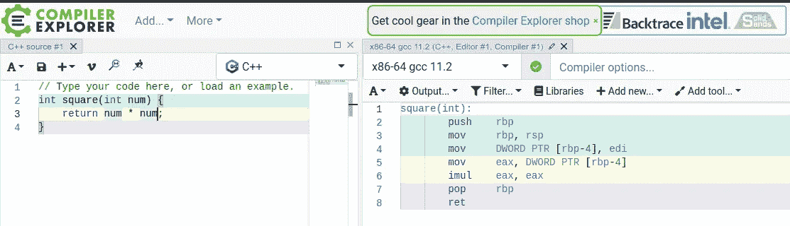
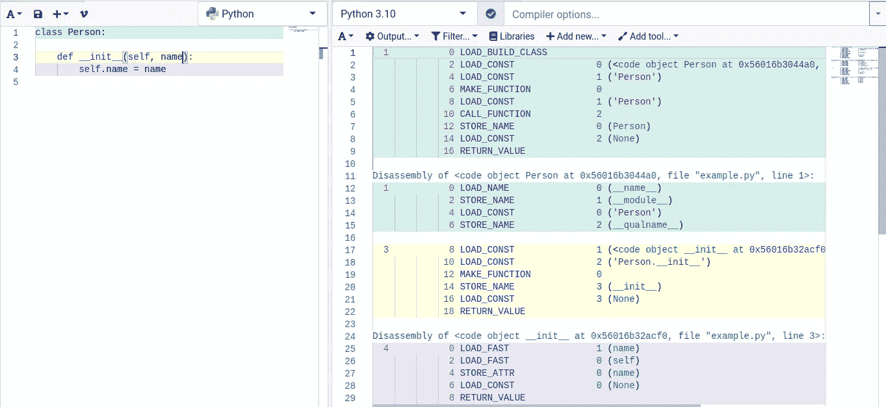
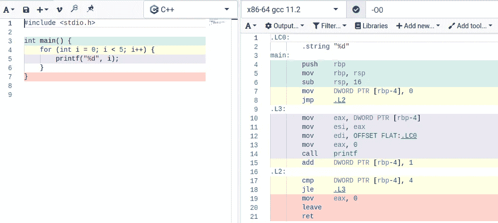
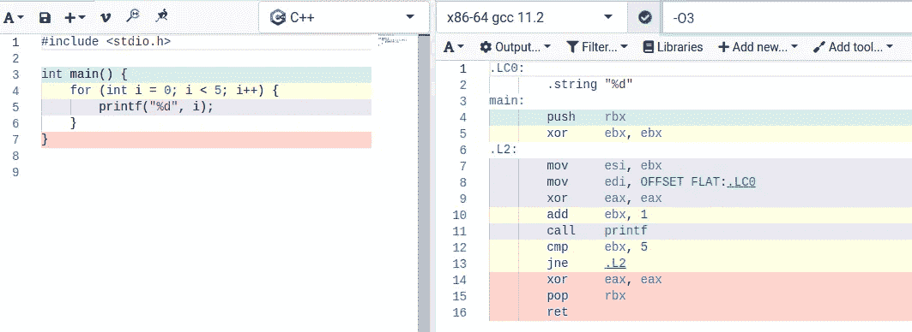
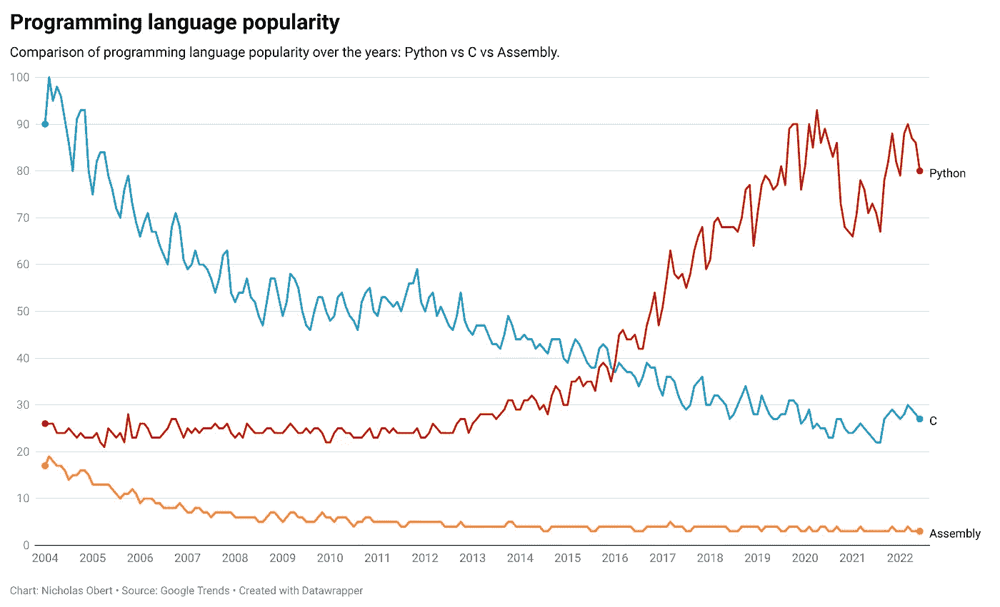
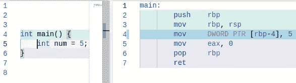

# 编译器资源管理器:软件开发人员的必备工具

> 原文：<https://betterprogramming.pub/compiler-explorer-a-must-have-tool-for-software-developers-98e7f4d6e94c>

## 从一个舒适的浏览器选项卡中轻松分析、比较和优化源代码

[霍利·曼达里奇](https://unsplash.com/@hollymandarich?utm_source=medium&utm_medium=referral)在 [Unsplash](https://unsplash.com?utm_source=medium&utm_medium=referral) 拍摄的照片

你有没有想过你的计算机实际上是如何看到你的源代码的？无论您只是好奇还是对分析编译后的二进制文件感兴趣，您都应该查看编译器资源管理器。

**免责声明**:我不隶属于编译器资源管理器，也不受其赞助。我只是相信他们提供了值得分享的伟大产品。

# 什么是编译器资源管理器？

来自编译器资源管理器的 [GitHub 页面](https://github.com/compiler-explorer/compiler-explorer) : [编译器资源管理器](https://godbolt.org/) r 是一个免费的开源网站，它允许你交互式地编写、编译和反汇编你的源代码，所有这些都来自一个舒适的浏览器标签。

一开始是一个`tmux`会话，其中`vi`在一个窗格中运行，而`watch gcc -S foo.cc -o -`在另一个窗格中运行。从那时起，它已经成为一个公共网站，每周提供大约 3，000，000 份汇编。

编译器资源管理器允许你从各种各样的编译器和语言标准中进行选择，并且目前支持 38 种编程语言。此外，您可以根据需要指定编译标志。

那么像 Python 这样的解释型语言呢？Python 源代码实际上被编译成字节码，以便在 [Python 虚拟机](https://www.geeksforgeeks.org/internal-working-of-python/)上运行。

因此，您可以看到您的源代码对于 Python 解释器来说是什么样子，就像汇编语言一样。

编译器资源管理器界面

上图显示了一个编译成[x86–64](https://en.wikipedia.org/wiki/X86-64)指令的 C++函数。

这是一个 Python 类，编译成 Python 字节码:

# 使用编译器资源管理器

那么，为什么要使用编译器资源管理器呢？首先，你可以探索你的源代码被编译成什么样。虽然任何编译器都能够做到这一点，但编译器资源管理器会准确地告诉您每一行被翻译成哪些指令。

由于这个特性，你可以很容易地看到你的计算机是如何解释你的代码的。

编译器资源管理器的主要用途之一是研究低级性能优化。通过了解您的计算机如何执行每一行代码，您可以分析它们如何影响执行速度。

例如，我使用编译器资源管理器来研究 [Python 的 match-case 语句是如何实现的，以及为什么它们比字典](/pythons-match-case-is-too-slow-if-you-don-t-understand-it-8e8d0cf927d)慢。

除此之外，您可能只是好奇如何为不同的系统架构编译您的源代码，并使用不同的编译器选项和优化级别。

## 比较编译选项和体系结构

您可以分析编译器优化如何影响生成的二进制文件。下面的截图显示了一个没有使用优化(`-O0`)编译的 C++函数。

零优化

下面的截图显示了相同的 C++函数，只是它是使用`-O3`优化选项编译的:

优化级别 3

如您所见，`gcc`编译器生成了不同的二进制输出。您也可以选择不同的系统架构，如下所示:

编译成 ARMv7-a 架构指令的源代码

编译器资源管理器最好的一点是它非常通用和方便，因为它允许你在一个浏览器标签中做许多与编译器相关的事情。

## 进入低级编程的好方法

随着时间的推移，程序员进入底层世界的可能性越来越小。现在，高级编程语言和框架造就了类似计算机的算法思维技能。

此外，人们通常不愿意学习汇编语言，因为它有很难理解和很少实际应用的名声。

编程语言流行多年

然而，即使是现在，学习至少基本的汇编语言也能让你很好地了解计算机是如何工作的。正如他们所说，如果你想像主人一样使用你的工具，你必须非常了解它们。

通过考虑工具的优势和劣势，更深入的了解可以让您做出更好的决策并选择正确的方法。

正如我之前所说的，编译器资源管理器允许您清楚地看到每一行源代码被编译成了哪些指令。由于这个特性，您不必成为汇编专家来分析编译输出。

因此，编译器资源管理器允许您慢慢开始，并随着您对汇编语言的熟悉程度逐渐提高，因为您不必完全理解每条指令就能掌握代码的功能。

演示编译器资源管理器如何告诉你哪一行编译成哪一条汇编指令。

根据我的经验，在我开发我的第一个编译器时，编译器资源管理器在我自己学习汇编语言和理解编译器如何工作方面帮助了我很多。

# 结论

总而言之，无论您是想进入汇编编程或编译器开发等低级领域，还是对研究代码优化技术感兴趣，编译器资源管理器都是一个非常棒的工具。

使用正确的工具可以让你把精力集中在最重要的事情上:更聪明地工作，而不是更努力。

 [## 10 个非常棒的免费开发工具和网站

### 检测内存错误，创建令人惊叹的用户界面，等等

better 编程. pub](/10-awesome-free-productivity-tools-and-websites-for-developers-47310707fda2)