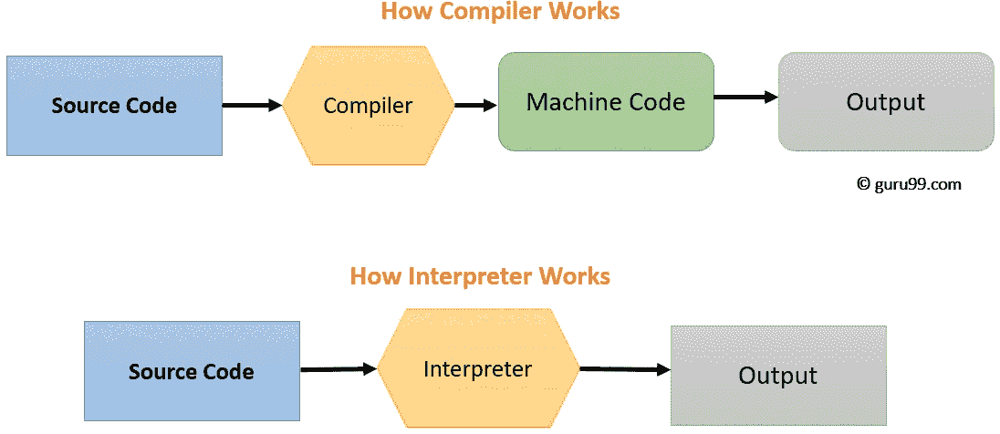
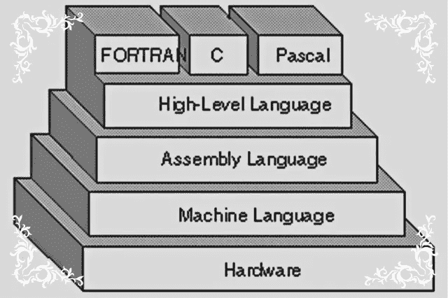
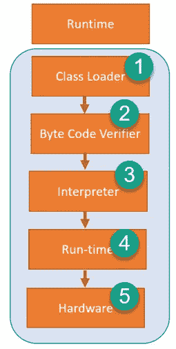
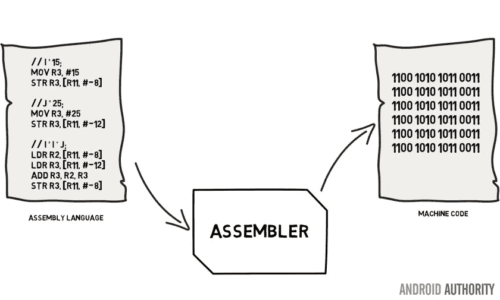

# 编译器与解释器:了解它们的区别以及何时使用它们

> 原文：<https://betterprogramming.pub/compiler-vs-interpreter-d0a12ca1c1b6>

## [软件工程](https://rakiabensassi.medium.com/list/software-engineering-7a179a23ebfd)

## 编译器和解释器的类型和用例

照片由[Cookie Pom](https://unsplash.com/@cookiethepom?utm_source=medium&utm_medium=referral)在 [Unsplash](https://unsplash.com?utm_source=medium&utm_medium=referral) 上拍摄

我仍然记得和我的一个同事的一次讨论，我说，“那是 transpiler，”他回答:“Trans…什么？”

如果你从未听过这个名字，你并不孤单。作为开发人员，我们都习惯于用人类可以理解的高级语言编写代码。然而，计算机只能理解用二进制系统编写的程序，即机器代码。

为了用非人类语言与计算机对话，我们提出了两种解决方案:解释器和编译器。讽刺的是，我们大多数人对它们知之甚少，尽管它们属于我们的日常编码生活。

在这篇文章中，我将深入探索将高级语言翻译成可执行的机器代码的过程。我将关注这个游戏中两个关键角色的内部工作——编译器和解释器——并分解相关的概念。

# 从高级语言到低级语言的旅程

编译器和解释器长期以来被用作转换代码的计算机程序。但是它们以不同的方式工作:

*   编译器将高级编程语言编写的代码翻译成低级语言，如汇编语言、目标代码和机器代码(二进制 1 和 0 位)。它在程序运行之前提前转换代码。
*   当程序运行时，解释器逐行翻译代码。你可能在工作生涯的某个时候不知不觉地使用过口译员。

[编译器 vs 解释器](https://www.guru99.com/difference-compiler-vs-interpreter.html)

编译器和解释器都有优点和缺点:

*   编译器需要整个程序和大量的时间来分析源代码，而解释器只需要一行代码和很少的时间来分析它。
*   编译的代码运行得更快，而解释的代码运行得更慢。
*   编译器会在编译后显示所有错误。如果您的代码有错误，它将无法编译。但是解释器会逐个显示每一行的错误。
*   解释并不能完全取代编译。
*   出于优化的原因，编译器可以包含解释器，比如更快的性能和更小的内存占用。

[汇编语言](https://www.bitforestinfo.com/blog/12/20/subroutine-example-of-assembly-language.html)

高级编程语言通常被称为“编译语言”或“解释语言”然而，在实践中，它们可以同时具有编译和解释的实现。例如，C 被称为编译语言，尽管存在 C 解释器。第一个 JavaScript 引擎是简单的解释器，但出于性能原因，所有现代引擎都使用实时(JIT)编译。

# 解释器的类型

早在 1952 年，解释器就被用来简化编程，还被用来在低级机器语言之间进行翻译。第一种解释型高级语言是 Lisp。Python、Ruby、Perl 和 PHP 是使用解释器的其他编程语言的例子。

以下是解释器类型的非排他性列表:

## 1.字节码解释程序

字节码解释和即时编译的趋势模糊了编译器和解释器之间的区别。

> 在字节码解释器中，每条指令都以一个字节开始，因此字节码解释器有多达 256 条指令，尽管并不是所有的指令都能被使用。一些字节码可能需要多个字节，并且可能是任意复杂的。”
> 
> — [维基百科](https://en.wikipedia.org/wiki/Interpreter_(computing))

## *2。线程代码解释器*

与字节码解释器不同，线程代码解释器使用指针而不是字节。每条指令都是指向一个函数或指令序列的一个字，后面可能还有一个参数。不同指令的数量受到可用内存和地址空间的限制。

第四个代码——用于[开放固件](https://en.wikipedia.org/wiki/Open_Firmware)系统——是线程代码的经典例子。源代码被编译成称为“F 代码”的字节码，然后由虚拟机解释。

## 3.抽象语法树解释程序

如果你是一个 [TypeScript](https://medium.com/better-programming/typescript-new-release-19f1238c6a68) 开发者，并且对 [TypeScript 架构](https://medium.com/better-programming/angular-10-new-features-dbc779061dc8)有一些了解，你可能听说过抽象语法树的缩写 AST。

[TypeScript Transpiler 架构](https://github.com/ikatyang/angular-html-parser/blob/master/packages/compiler/design/architecture.md)

AST 是一种将源代码转换成优化的抽象语法树的方法，然后按照这种树结构执行程序，或者使用它来即时生成本机代码。

AST 保持全局程序结构和语句之间的关系。这允许系统在运行时执行更好的分析，并使 AST 成为实时编译器比字节码表示更好的中间格式。

但是，对于解释器来说，AST 会导致更多的开销。遍历抽象语法树的解释器比生成字节码的解释器要慢。

## 4.即时编译

实时编译(JIT)是一种在运行时将中间表示编译成本机代码的技术。

# 编译器的类型

## **1。交叉编译器**

一种运行在计算机上的编译器，该计算机的 CPU 或操作系统不同于它所产生的代码运行的计算机。

## **2。本地编译器**

一种编译器，它产生的输出可以在与编译器本身相同类型的计算机和操作系统上运行。

## **3。引导编译器**

用它要编译的语言编写的编译器。

## **4。反编译器**

反编译程序将代码从低级语言翻译成高级语言。

## **5。源到源编译器(Transpiler)**

这是一个在高级语言之间翻译的程序。这种类型的编译器也称为转换编译器或传输编译器。

示例:

*   Emscripten:将 C/C++转换成 JavaScript。
*   Babel:将 JavaScript 代码从 ES6+传输到 ES5。
*   cfront:c++的原始编译器(大约从 1983 年开始)。它使用 C 作为目标语言，创建了没有缩进风格的 C 代码，也没有漂亮的 C 中间代码，因为生成的代码通常不适合人类阅读。

## 6.语言重写者

这通常是一个不改变语言的程序翻译表达形式。

## 7.字节码编译器

将高级语言翻译成可以被字节码解释器或虚拟机解释的中间简单语言的编译器。

例子:Java 和 Python 的字节码编译器。

## 8.实时编译器(JIT 编译器)

JIT 编译器将编译推迟到运行时。它通常在解释器中运行。

示例:

*   最早出版的 JIT 编译器归功于 1960 年的 *LISP* 。
*   后一种技术出现在 20 世纪 80 年代的 Smalltalk 等语言中。
*   然后，JIT 编译在 Java 等现代语言中获得了主流关注。 NET 框架、Python 和最现代的 [JavaScript](https://medium.com/better-programming/javascript-history-and-future-71b0ceb737aa) 实现。

[JRE (Java 运行时环境)功能](https://www.guru99.com/difference-between-jdk-jre-jvm.html)

在 Java 中，源文件首先被编译并转换成包含 Java 字节码(高度优化的指令集)的`.class`文件，然后字节码解释器执行字节码，稍后 JIT 编译器将字节码翻译成机器码。

Java 字节码既可以在运行时由虚拟机解释，也可以在加载时或运行时编译成本机代码。现代 JVM 实现使用编译方法，因此在初始启动时间之后，性能相当于本机代码。

## 9.AOT 汇编

超前(AOT)编译是在运行时之前编译高级编程语言或 Java 字节码等中间表示的方法。

示例:

Angular 框架使用一个[提前](https://angular.io/guide/aot-compiler) (AOT)编译器在构建期间将 HTML 和类型脚本代码转换为 JavaScript 代码，以便在代码运行时在浏览器上提供更快的呈现。

## 10.一名*装配员*

汇编程序将人类可读的汇编语言翻译成机器代码。这个编译过程称为汇编。将机器代码转换成汇编语言的逆向程序称为反汇编程序。

[汇编程序](https://www.androidauthority.com/assembly-language-and-machine-code-678230/)

[汇编语言](https://en.wikipedia.org/wiki/Assembly_language)(缩写为 ASM)是一种依赖机器代码指令的低级编程语言。这就是为什么每一种汇编语言都是为一种特定的计算机体系结构而设计的。

# 外卖食品

编译器和解释器都是将高级语言编写的代码转换成计算机可以理解的低级代码或机器代码的计算机程序。然而，它们在工作方式和使用时间上有所不同。

即使您不打算实现下一个编译器或解释器，这些见解也应该有助于提高您作为开发人员每天使用的工具的知识。

🧠💡我为一群聪明、好奇的人写关于工程、技术和领导力的文章。 [**加入我的免费电子邮件简讯，独家获取**](https://rakiabensassi.substack.com/) 或在此注册 Medium [。](https://rakiabensassi.medium.com/membership)

*你可以在 Udemy 上查看我的* ***视频课程****:*[*如何识别、诊断、修复 Web Apps 中的内存泄漏*](https://www.udemy.com/course/identify-and-fix-javascript-memory-leaks/) *。*