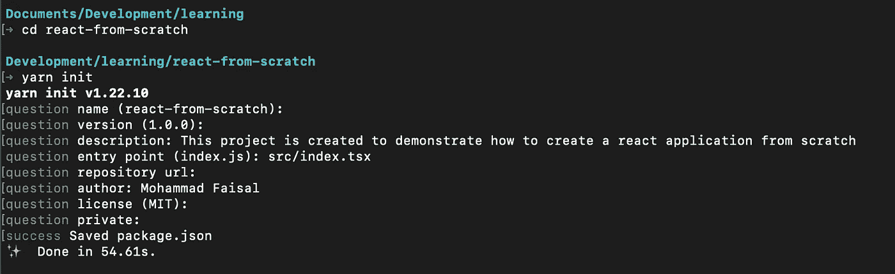
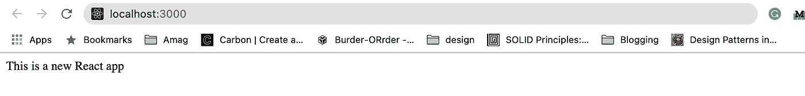

# 从头开始使用 TypeScript 创建现代 React 应用程序的完整指南

> 原文：<https://betterprogramming.pub/complete-guideline-to-creating-a-modern-react-app-with-typescript-from-scratch-cebbb5817d8>

## 你将会更加喜欢创建-反应-应用程序


来自 [Pexels](https://www.pexels.com/photo/amazed-formal-male-looking-at-laptop-screen-3760809/?utm_content=attributionCopyText&utm_medium=referral&utm_source=pexels) 的 [Andrea Piacquadio](https://www.pexels.com/@olly?utm_content=attributionCopyText&utm_medium=referral&utm_source=pexels) 的照片

进入任何框架都有两个好处。它使你成为一个更好的开发人员，并提高你对你正在做的工作的理解。

它还可以帮助您理解这些框架在幕后所做的我们认为理所当然的事情。

我想深入 React 内部，通过在本地复制应用程序来了解它是如何工作的。

今天，我将带你一起踏上这段旅程。我会尽量让这些概念对初学者友好。你不需要和我一起编码。但是如果你做了，那就太棒了！

我们开始吧。

## 更新(2021 年 11 月 27 日)

我已经用最新版本的`webpack`更新了这篇文章。其当前在`5.64.4`上并且`webpack-cli`在`4.9.1`上。

# 初始化项目

首先，在机器上的任意位置创建一个空文件夹。

```
mkdir react-from-scratch
```

# 用纱线初始化项目

然后通过运行下面的命令初始化一个 npm 项目(推荐 yarn)。

```
yarn initornpm init
```

这是我用纱线输出的样子。



纱线初始化命令

# 主要设置

然后我们将创建两个文件夹。`src`是保存我们的项目文件，`build`将用于保存 bundle 文件(我们在构建项目后得到这些)。

```
mkdir src build
```

在`src`文件夹中，创建一个`index.html`文件。这是我们项目中唯一的 HTML 文件。这就是为什么我们的应用程序将被称为*单页面应用程序* (SPA)。

```
cd src
touch index.html
```

我们`index.html` 的内容如下:

唯一需要注意的是带有`id="root"`的`div`标签。这是我们的应用程序稍后将连接的 div。

# 安装 React

好了，现在我们将 React 和 [ReactDOM](https://reactjs.org/docs/react-dom.html) 作为依赖项安装，因为如果没有 React 库本身，创建 React 应用程序将非常困难:P

```
yarn add react react-dom
```

你可能会问 react-dom 在这里做什么。嗯，根据广泛的研究(即谷歌搜索):

> “react-dom 包提供了特定于 dom 的方法，这些方法可以在应用程序的顶层使用，并在需要时作为脱离 react 模型的出口”——React DOM[文档](https://reactjs.org/docs/react-dom.html)

这意味着 react-dom 充当 dom 和 react 之间的中间人。

# 创建索引文件

现在在`src`文件夹中创建一个名为`index.tsx`的新文件。

```
touch index.tsx
```

使用`react-dom`库中的`render`方法将`index.html`文件的内容连接到您的应用程序。

这个呈现方法接受两个输入:

*   一个`jsx`组件(目前为普通的`div`)
*   来自 dom 的真实元素(我们之前在`index.html`中添加的带有`id="root”`的 div)

很简单。但是我们还没有添加 TypeScript。就这么办吧！

# 安装 TypeScript

现在让我们设置我们的 TypeScript 依赖项，因为现代的 React 应用程序应该是用 TypeScript 构建的。

```
yarn add -D typescript [@types/react](http://twitter.com/types/react) [@types/react-dom](http://twitter.com/types/react-dom)
```

## 配置 TypeScript

现在让我们在项目根目录下(在`src`之外)创建一个名为`tsconfig.json`的新文件。

```
touch tsconfig.json
```

增加以下内容:

该文件中的注释解释了每个选项的作用。你可能想在这里或那里调整一些小东西来满足你的需求。

# 安装巴别塔

现在我们需要将 [Babel](https://babeljs.io/) 安装到我们的项目中。这是因为我们的浏览器除了 JavaScript 什么都不懂，所以如果我们想让浏览器理解我们的`jsx`或`tsx`文件，我们需要一些编译器。

巴贝尔会为我们做的。让我们安装一些依赖项:

## 说明

默认情况下，需要前三个库。我们需要 preset-typescript 来编译 typescript，需要 preset-react 来编译 react 特定的文件。

如果我们想要额外的 async/waits 支持，我们将需要添加两个额外的库。

这些将有助于编译 async/await 语法，这在这一点上是必须的。

## 配置巴别塔

我们将在项目的根文件夹中创建一个名为`.babelrc`的新文件。

```
touch .babelrc
```

在那里添加以下配置。

# 安装 webpack

为了让 webpack 工作，我们需要安装一些依赖项。

## 配置 webpack

然后在根文件夹中创建一个名为`webpack.config.js`的新文件。

```
touch webpack.config.js
```

在那里添加以下内容。

网络包.配置. js

相当困惑？不完全是。如果您熟悉 webpack，那么这个配置应该是有意义的。

如果你想了解更多关于这个设置的解释，你可以参考下面的文章。这里暂时不赘述。

[](/6-webpack-concepts-for-advanced-react-developers-d016da2cad52) [## 面向高级 React 开发人员的 6 个 Webpack 概念

### 帮助您理解从内部做出反应的概念

better 编程. pub](/6-webpack-concepts-for-advanced-react-developers-d016da2cad52) 

# 添加脚本

现在进入`package.json`文件，添加下面的脚本来启动应用程序。

package.json

打开终端并运行以下命令:

```
yarn start
```

您应该会看到浏览器上正在运行的应用程序。



应用程序运行

类似地，如果您想为生产而构建，您可以运行

```
yarn build
```

恭喜你！您已经成功地建立了自己的 React 应用程序。但是如果你对好的标准感兴趣，这里有额外的部分。

# 安装更漂亮

为[漂亮的](https://prettier.io/)安装以下依赖项。

## 配置更漂亮

在根文件夹中创建一个名为`.prettierrc.js`的文件。

```
touch .prettierrc.js
```

增加以下内容:

# 安装 ESLint

要安装 [ESLint](https://eslint.org/) ，首先安装以下依赖项:

## 配置 ESLint

然后在根文件夹中添加一个名为`.eslintrc.js`的文件。

```
touch .eslintrc.js
```

增加以下内容。

# 林特和更漂亮的剧本

现在再添加两个脚本来运行**prettle 和 ESlint。**

**就是这样。现在，您已经有了一个带有 TypeScript 的全功能 React 应用程序。这里是存储库。**

**[](https://github.com/Mohammad-Faisal/react-typescript-template-from-scratch) [## Mohammad-fais al/react-type script-template-从头开始

### 通过在 GitHub 上创建一个帐户，为 Mohammad-fais al/react-typescript-template 从头开始的开发做出贡献。

github.com](https://github.com/Mohammad-Faisal/react-typescript-template-from-scratch) 

想象一下，通过创建-反应-应用程序，有多少事情变得简单了。我希望你能从这篇文章中学到一些东西。

祝您愉快！:D

```
Get in touch with me via LinkedIn or my Personal Website.
```

[](https://javascript.plainenglish.io/20-essential-parts-of-any-large-scale-react-app-ee4bd35436a0) [## 任何大型 React 应用程序的 20 个基本部分

### 如果您正在编写企业级代码，您需要了解这一点

javascript.plainenglish.io](https://javascript.plainenglish.io/20-essential-parts-of-any-large-scale-react-app-ee4bd35436a0) 

# 资源

[2021 年从零开始构建现代 React 应用](/building-a-modern-react-app-from-scratch-in-2021-d2071c31c98)作者 Yakko Majuri**