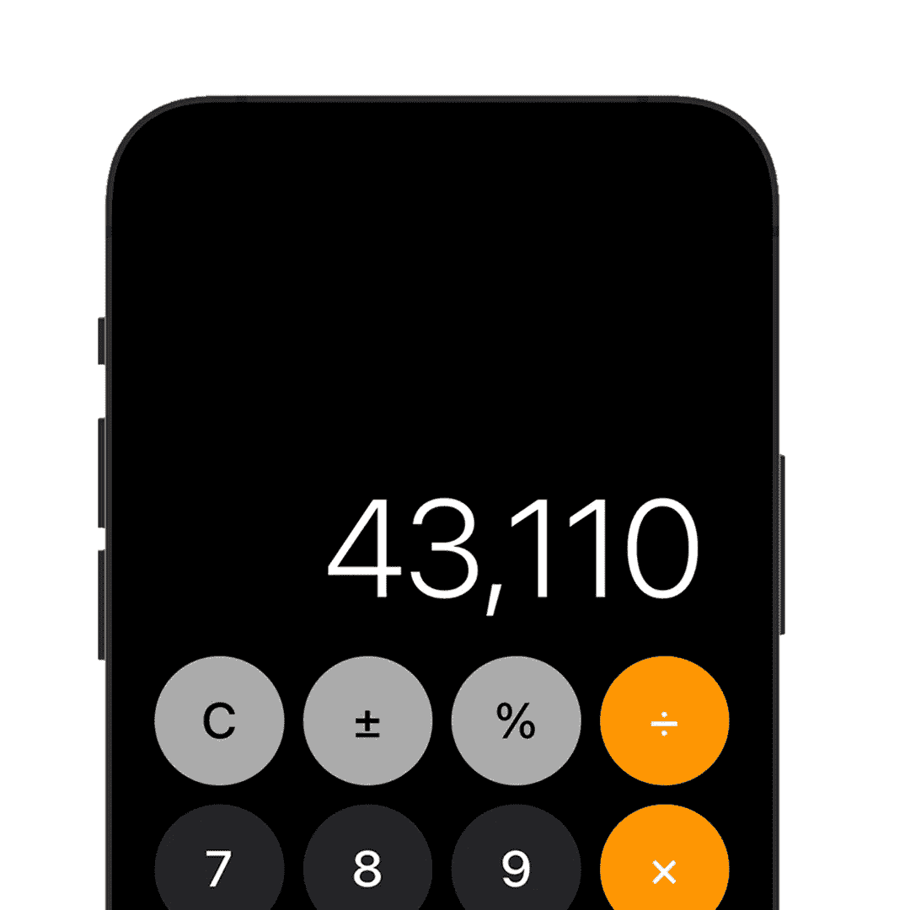
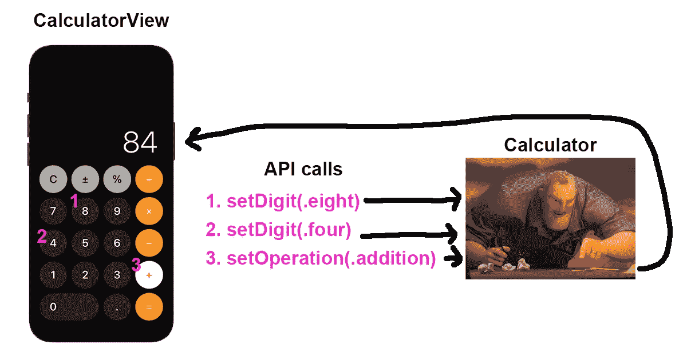
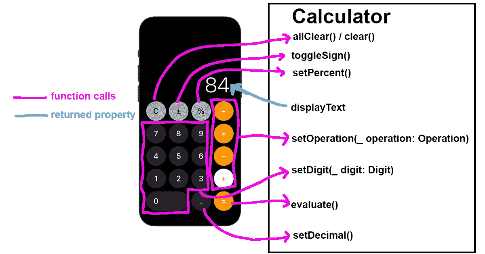
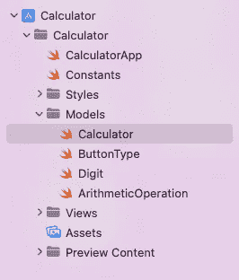
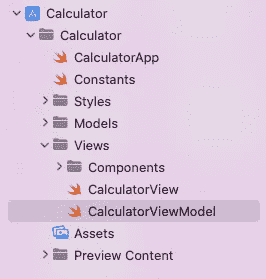
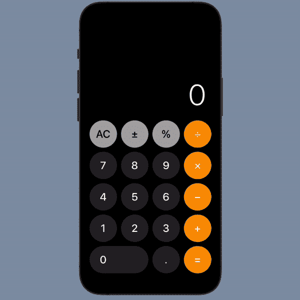
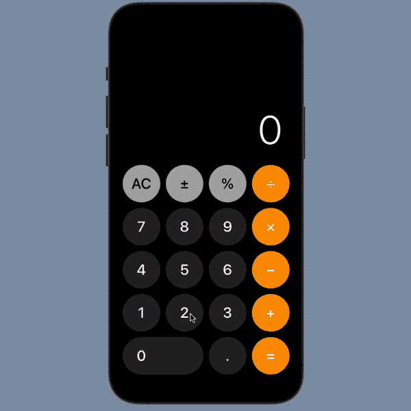
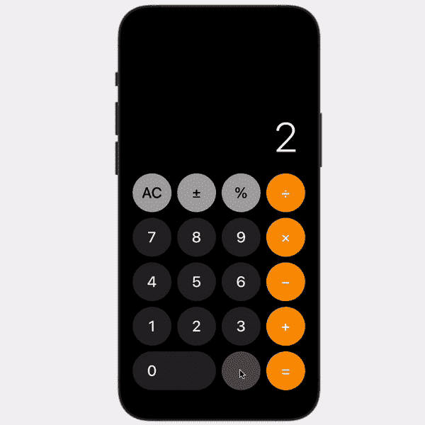
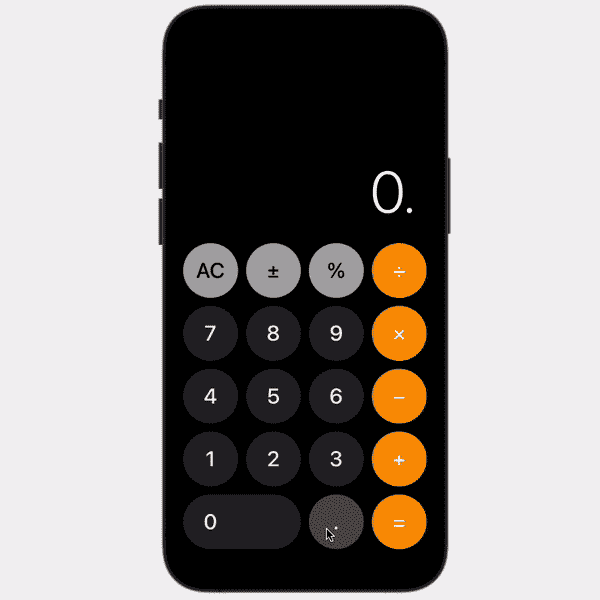
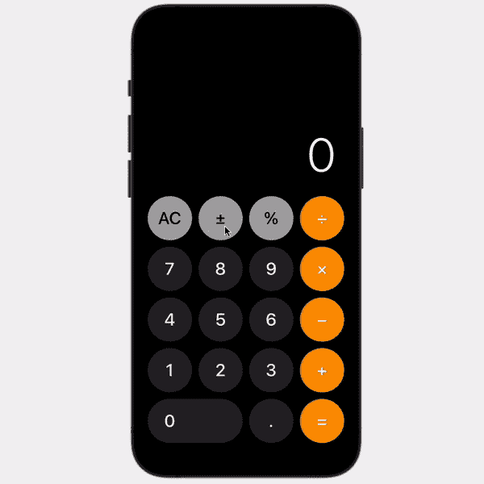

# 使用 MVVM 在 SwiftUI 中完成苹果计算器

> 原文：<https://betterprogramming.pub/complete-the-apple-calculator-in-swiftui-using-mvvm-99571a5875b4>

## 第 2 部分—业务逻辑



在今天的教程中，我们将在 Swift 中使用 MVVM 模型构建计算器的业务逻辑，并牢记最佳实践。

构建视图在第 1 部分的[中介绍。](/build-the-apple-calculator-in-swiftui-2fad61285dc8)

此外，如果您对构建视图不感兴趣，从这里开始也很好。继续并[下载启动项目**。**](https://github.com/ricardomongza99/Calculator/tree/part1)

# 计算器应用编程接口

我们的目标是让`Calculator`模型完全独立。

根据[单一责任原则](https://en.wikipedia.org/wiki/Single-responsibility_principle)，每个模块、类或函数都应该有一个单一的责任。

计算器执行计算；所以它应该只专注于接收输入、计算和返回结果。它不负责任何与视图相关的内容。

这给了我们在任何事情上使用`Calculator`的能力。我们可以在我们已经存在的`CalculatorView`中、在单元测试中、在另一个完全不同的计算器视图中、在 CLI 中使用它，等等。

为了实现这一点，我们需要声明一个 API。——在之外的*可以访问哪些功能和属性来使用我们的计算器？*



让我们想一想之外的*需要哪些属性和功能才能完全操作一个计算器(这些将是我们的`public`属性和功能)。—使用真正的*计算器，我们能得到什么？

对于属性，我们需要一种方法来读取当前显示的数字。

对于函数，我们需要为每个`ButtonType`案例执行一个动作。



我们开始吧。

在`Models`中，创建一个名为`Calculator`的新 Swift 文件



添加以下样板代码:

# 视图模型

在继续进行`Calculator`之前，让我们首先连接我们的视图，这样我们可以马上开始测试它。

在`CalculatorView.swift`下面，创建一个名为`CalculatorViewModel`的新 Swift 文件:



在`CalculatorViewModel.swift`中，创建一个符合`ObservableObject`协议的`final class`名称`ViewModel`，并且在我们的`CalculatorView`中

我们的`ViewModel`将包括`buttonTypes`订单和`Calculator`模型的一个实例。我们还需要添加必要的属性和功能来操作`Calculator`。

这里是`CalculatorViewModel.swift`的代码:

在`CalculatorView.swift`中，添加一个新的`@EnvironmentObject`私有属性来引用我们的`ViewModel`。

确保更新`displayText`和`buttonPad`组件以获得`viewModel.displayText`和`viewModel.buttonTypes`。

代码如下:

现在，我们需要在计算器按钮被按下时通知`ViewModel`。

在`CalculatorButton.swift`中，添加 ViewModel 作为环境对象，并为按钮的动作添加`viewModel.performAction(for: buttonType)`

最后，在`CalculatorApp.swift`中，创建一个`ViewModel`的实例作为`environmentObject`

*环境对象使我们能够访问所有子视图中的视图模型*

现在我们的`View`和我们的`ViewModel`完全连接了！`View`通知`ViewModel`有按钮被按下，`ViewModel`更新`View`显示的显示文本。

# 计算器

我们现在开始添加业务逻辑来使`Calculator`工作。我们将一个接一个地添加我们的每个 API 函数。

## 设定数字

回到`Calculator.swift`

在开始设置数字的逻辑之前，我们将需要这些属性，所以在顶部添加它们:

在底部，添加以下助手函数

设置数字时，我们需要:

1.  检查是否可以添加数字(01 应该不可能)。
2.  将十进制转换成字符串
3.  将`digit`追加到字符串末尾，将字符串转换回十进制，并将其新值赋给`newNumber`

下面是设置数字的代码:


我们可以按数字按钮来设置计算器中的数字

## 集合运算

我们需要创建一个新的结构名`ArithmeticExpression`来促进算术表达式的计算。

将这个结构添加到您的`Calculator`模型中:

添加`expression`和`result`属性，并更新`number`计算属性

现在，为了设置操作，我们需要:

1.  检查是否有我们可以使用的数字(`newNumber`或之前的`result`)并将其赋给一个新变量`number`
2.  检查是否已经有一个`existingExpression`，如果有，使用`number`对其进行评估，并将结果赋给`number`
3.  将带有`number`和`operation`的新`ArithmeticExpression`分配给`expression`
4.  复位`newNumber`

代码如下:

现在我们的计算器适用于数字和运算。让我们添加更多的可视化队列来了解操作当前是否是活动的。

如果用户刚刚按下操作按钮，我们将突出显示它。

将以下辅助功能添加到`Calculator.swift`

将以下辅助功能添加到`CalculatorViewModel.swift`

最后，向`CalculatorButton.swift`添加以下帮助函数

在同一个文件中，更新`CalculatorButton`按钮样式的`foregroundColor`和`backgroundColor`以从刚刚添加的助手函数中获取

我们现在有操作按钮高亮显示！



我们现在可以设置按下时高亮显示的操作

## 评价

这个很简单。

要进行评估，我们需要:

1.  展开`newNumber`和`expression`(表达式包含前面的数字和操作)
2.  用`newNumber`评估`expression`并分配给`result`
3.  复位`expression`和`newNumber`

代码如下:


我们现在可以使用等于按钮来计算表达式

## 设置百分比

要设置百分比，我们需要:

1.  检查`newNumber`或`result`是否正在使用
2.  除以 100 并指定新值

代码如下:



我们现在可以使用百分比按钮

## 切换标志

`toggleSign()` 与`setPercent()`非常相似，因为我们需要检查`newNumber`或`result`当前是否被使用，并应用一个操作(在这种情况下添加负号)。

然而，有一个棘手的部分。—我们不能给 0 加上负号。

解决办法？

我们可以给字符串加上一个负号，特别是`displayText`。我们只需要知道什么时候不要插入负号。

和初等数学一样，我们要用进位(9 + 8 = 17，进位 1)。

将此属性添加到顶部的`private var result: Decimal?`下

```
private var carryingNegative: Bool = false
```

因此，如果`newNumber`或`result`存在，则应用负号，否则，使`carryingNegative`属性**为真。**(将保持为真，直到新编号被设置)

将此代码添加到`toggleSign()`

`carryingNegative`属性用于辅助函数`getNumberString()`

还记得当`newNumber`、`expression.number,`和`result`为零时，默认值是 0 吗？由于有了`carryingNegative`属性，我们可以将负号字符串插入到 0 中以返回“-0”`displayText`，就像负号处于活动状态的可视队列一样。

用以下代码更新`getNumberString()`:

最后，当`newNumber`置位时，我们需要禁用负进位。

将此代码添加到`newNumber`:


我们现在可以切换负号并等待，直到一个数字被设置

## 设置小数

设置小数可能是最棘手的部分。

我们现在需要将进位逻辑添加到两件事情中。到小数点和小数点后的零。

# **小数点**

我们的`newNumber`属性属于`Decimal`类型。所以没有所谓的`5.`或`15.`，那些都是整数。但是，如果用户按下 decimal 按钮，我们需要提供一个可视化的队列来显示正在设置的小数。我们需要更新`displayText`，直到我们可以将`newNumber`设置为其各自的十进制数。为此，我们将使用一个名为`carryingDecimal`的新属性。

让我们运行一个输入`5.2`的快速示例

1.  设定数字 5 ( `newNumber = 5`、`carryingDecimal = false`和`displayText = “5”`)
2.  设置小数(`newNumber = 5`、`carryingDecimal = true`和`displayText = “5.”`)
3.  设置数字 2 ( `newNumber = 5.2`、`carryingDecimal = false`和`displayText = “5.2”`)

添加`carryingDecimal`属性

添加`containsDecimal`计算属性

实际设置十进制函数非常简单:

1.  检查`number`是否已经包含小数，如果包含，返回
2.  使`carryingDecimal`属性`true`

代码如下:

最后，当`newNumber`置位时，复位`carryingDecimal`



我们现在可以用十进制设置非零数字

# **小数点后的零**

现在，我们有一个类似的问题要解决。当在 de 小数点后设置 0 时，我们的`newNumber`属性是`Decimal`类型的，永远不会添加它们。至于`5.40000`将总是被转换回`5.4`，因为它不是`String`。

与我们对小数点所做的类似，我们需要创建一个名为`carryingZeroCount`的新属性，来跟踪小数点后的零，并在设置非零数字时追加它们。同时，我们还将在`displayText`中显示零，以提供可视化队列。

让我们通过一个例子让它更清晰。我们要输入`2.003`

1.  设置数字 2 ( `newNumber = 2`、`carryingDecimal = false`、`carryingZeroCount = 0`、`displayText = “2”`)
2.  设置十进制(`newNumber = 2`、`carryingDecimal = true`、`carryingZeroCount = 0`、`displayText = “2.”`)
3.  设置数字 0 ( `newNumber = 2`、`carryingDecimal = true`、`carryingZeroCount = 1`、`displayText = “2.0”`)
4.  设置数字 0 ( `newNumber = 2`、`carryingDecimal = true`、`carryingZeroCount = 2`、`displayText = “2.00”`)
5.  设置数字 3 ( `newNumber = 2.003`、`carryingDecimal = false`、`carryingZeroCount = 0`、`displayText = “2.003”`)

我知道这有点令人困惑，但是通过这样做，我们可以完全避免使用字符串操作来输入，这带来了相当多的问题和复杂性。

添加`carryingZeroCount`属性

将`setDigit()`功能更新为:

如果包含小数且数字为零，则递增零计数

最后，向`getNumberString()`添加进位零



我们现在可以用十进制设置零

## 全部清除

清除一切很简单。我们只需要重置所有当前使用的属性

代码如下:


我们现在可以清除所有

## 清楚的

注意当使用苹果计算器时，AC(全部清除)按钮在设置一个数字或十进制后立即变为 C(清除)按钮？这些按钮可能看起来做同样的事情，将显示重置为 0，但实际上，它们有不同的功能。

全部清除复位一切包括`newNumber`、`expression`、`result`和进位。

Clear 只重置最后一个条目，在我们的例子中，`newNumber`及其进位。

所以，假设你想计算 5 + 3。你输入 5+2——哎呀！按清除键(5 +仍保存)，输入 3，结果= 8。一切都好。

让我们开始吧，但是首先，添加`pressedClear`属性，我们将需要它。

类似于我们的`allClear()` 函数，将这段代码添加到`clear()`

我们没有重置表达式或结果

并且更新`newNumber`，以便当它被设置时，我们重置`pressedClear`

为了更好的用户体验，我们给`number`加个小改进吧。

如果用户只是按了 clear 或 decimal，让我们显示一个 0，即使有一个结果或表达式是活动的。

用以下代码更新`number`属性:

# **在我们的视图中显示 AC 或 C 按钮**

现在，为了知道在我们的视图中显示两个透明按钮中的哪一个，我们需要创建一个计算属性。

添加`showAllClear`计算属性:

返回到`CalculatorViewModel.swift`并更新`buttonTypes`计算属性:


清除和全部清除按钮现在相应地切换

## **最终计算器**

这是我们最后一个`Calculator`模型的代码:

# **总结**

我们终于完成了苹果计算器的制作。谢谢你挺过来了。

我们成功地将每个组件封装到各自的功能中。`ViewModel`不负责进行计算，它只是通知`Calculator`用户正在输入什么并询问结果。

我们创建的`Calculator`模型现在可以用于任何视图。我们甚至可以在不涉及任何其他文件的情况下创建单元测试。



决赛成绩

你可以在这里找到这部分[的源代码。](https://github.com/ricardomongza99/Calculator/tree/part2)

感谢您的阅读，如果您能跟上，我将不胜感激，这样我就能继续创作更多这样的内容:)

## 资源:

*   您可以在这里找到第 1 部分，创建视图
*   你可以在这里找到 Github 库