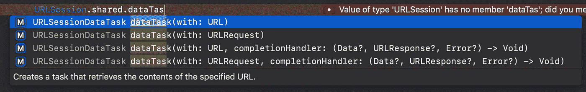
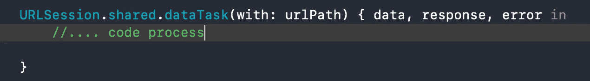
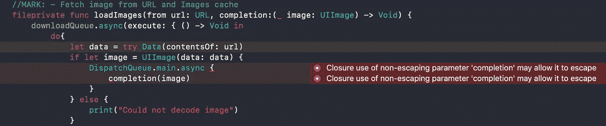

# Swift 中的完成处理程序

> 原文：<https://betterprogramming.pub/completion-handler-in-swift-4-2-671f12d33178>

## 完成块及其语法有什么变化？


照片由 [La-Rel Easter](https://unsplash.com/@lastnameeaster?utm_source=unsplash&utm_medium=referral&utm_content=creditCopyText) 在 [Unsplash](https://unsplash.com/s/photos/blocks?utm_source=unsplash&utm_medium=referral&utm_content=creditCopyText) 上拍摄

我们将大部分时间花在处理 web API 和项目中的其他异步任务上。在这篇开始使用 Swift 中的[完成处理程序](https://developer.apple.com/documentation/foundation/operation/1408085-completionblock)(块语法)的文章中，我将向您展示一种利用块帮助的更好的方法。

这段代码我们已经见过很多次了:



URLSession 方法

写完代码再来看看:



URL 请求的 URLSession 代码

在上面的代码中，我们正在借助`URLSession`调用一个 web URL。在这个块中得到一个响应后，我们如何处理这个代码？如果我们必须在不使用任何全局变量和其他函数的情况下传递它或在另一个函数中返回它，我们该怎么做呢？

# 让我们看看如何创建块

写下您的完成模块:

```
func **requestForUserDataWith(**_ parameters: **[**String: String**]**, **completionHandler**: (_ result: **[**String: Any**]**, _ error: **Error**) -> Void**){**
     //.. Code process
**}**
```

在主任务中执行操作后，它将如何在此函数中返回我们的数据:

```
func **requestForUserDataWith(**_ parameters: **[**String: String**]**, **completionHandler**: (_ result: **[**String: Any**]**, _ error: **Error**) -> Void**){**
     //.. Code process 
     **completionHandler**(result, error) // return data & close 
**}**
```

当您调用该函数时，您的代码将如下所示:

```
**requestForUserDataWith**(parameters) **{** result, error **in**
     //.. Code process
**}**
```

# 用其他东西试试，让它更高级

例如`ImageProvider`类，这里用的为`Completionhandler`。它将从图像 URL 异步下载图像。

```
struct **ImageProvider**: **RequestImages** **{**fileprivate let **downloadQueue** = **DispatchQueue**(label: "Images cache", qos: **DispatchQoS**.background)//MARK: - Fetch image from URL and Images cache
func **loadImages**(from url: **URL**, completion: @escaping (_ image: **UIImage**) -> Void) **{**
   **downloadQueue**.async**(**execute: **{** () -> Void in
      do**{**
         let data = try **Data**(contentsOf: url)
         **if** let image = **UIImage**(data: data) {
            **DispatchQueue**.main.**async** { **completion**(image) }
         } **else** { **print**("Could not decode image") }
      **}**catch **{** **print**("Could not load URL: \(url): \(error)") **}**
   **})**
  **}**
**}**protocol **RequestImages** {}extension **RequestImages** where **Self** == **ImageProvider{**
  func **requestImage**(from url: **URL**, completion: @escaping (_ image: **UIImage**) -> Void)**{** //calling here another function and returning data completion**loadImages**(from: **url**, completion: **completion**) 
  **}**
**}**
```

我们通过使用`CompletionHandler`在其他请求函数的帮助下调用下载图像的函数。在下面的代码中，我们可以看到它将如何为我们工作:

```
let imageProvider = **ImageProvider**()imageProvider.**requestImage**(from: **url**) **{** image **in**
   //code process
**}**
```

# 什么是@escaping 和@nonescaping CompletionHandler？

如果你看过我使用`loadImages`的代码，你会发现在功能块内部类型是`escaping`。在 Swift 3.0 之后，块(在 Swift 闭包中)默认是不可转义的。

那么这两者的主要区别是什么呢？那么在函数内部执行任何异步任务，比如`URLSession`，或者使用 GCD 块来执行任何操作，在 SQL 或核心数据中存储离线数据呢？

在这种情况下，它会向您显示错误，以便您可以修复它。它不接受非转义类型块。你必须使用一个转义块来修复它。



@转义闭包

# 结论

在本文中，您了解了如何在 Swift 中创建完成处理程序块语法。这使得在项目内部执行异步代码变得非常容易。现在，您已经了解了如何使用块来管理具有返回类型的函数，以及之后如何在代码中使用它。这会使你的工作更容易。借助块语法，您可以创建任何方法或包装器。例如，在您的项目内部，要执行 web API 调用和存储数据库操作**、**您可以制作包装器。

我还介绍了`completionHandler`的高级用法。现在你理解了转义和非转义块。

感谢阅读！我希望你喜欢这首曲子。你对本教程有任何疑问，或者你知道一个更简单的方法或有任何额外的补充吗？请通过问题、反馈或评论让我知道。