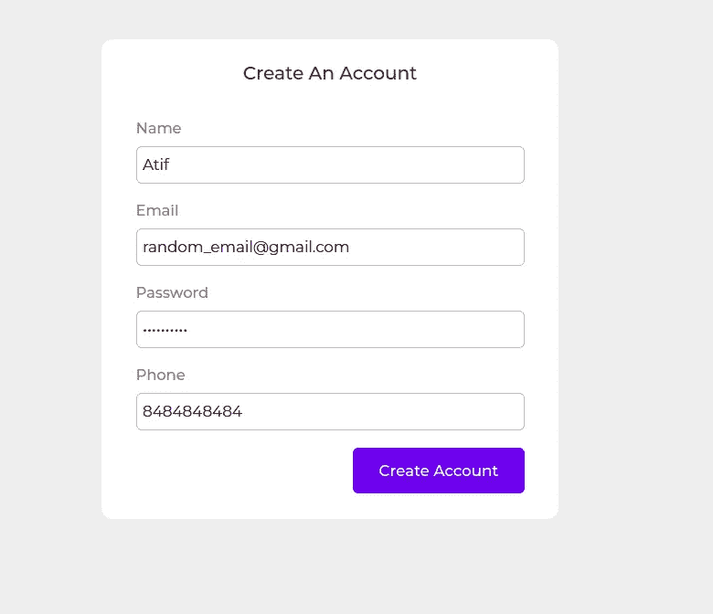
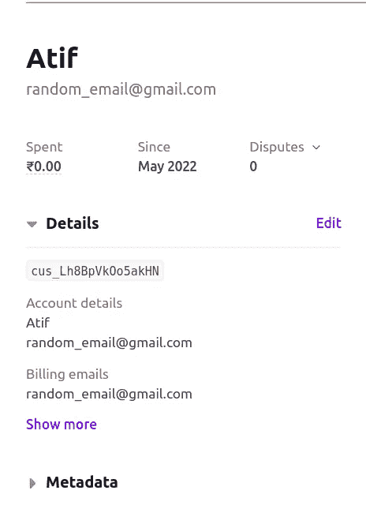
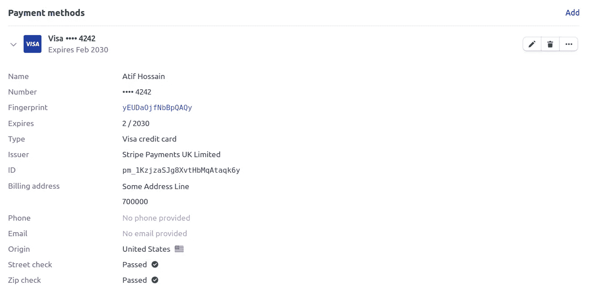
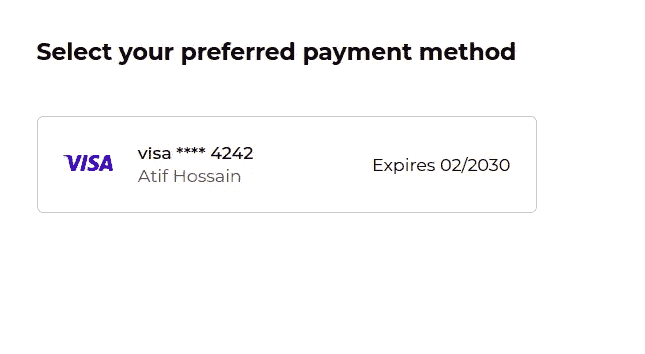

# 使用条纹支付意图的复杂支付流程——ReactJS 和 NodeJS 指南

> 原文：<https://betterprogramming.pub/complex-payment-flows-using-stripe-payment-intents-a-reactjs-nodejs-guide-5835f4c004cf>

## 集成条纹支付意图 API 并完成支付流程


作者图片

Stripe Checkout 提供了一种接受用户付款的简单方法。它提供了一个预建的结帐页面，并能够添加一个标志或改变你的品牌颜色的主题。但是 Checkout 并不能完全控制。

例如，您不能在您的应用服务器上确认付款；相反，确认是在前端完成的。你不能只从 Stripe Checkout 建立一个定制的支付流程。您需要使用付款意向 API。本教程将指导您如何在 React.js 前端和 Node.js 后端集成支付意图 API。

首先，从 Stripe 仪表板中获取 API 密钥。在 Stripe 上创建一个帐户，并访问他们的仪表板(在测试模式下)以获得“可发布密钥”和“秘密密钥”。您可以在不激活/验证您的商业帐户的情况下使用测试密钥。

# 付款流程

整个付款流程分为两个部分:预付款和付款。在允许用户开始支付之前，我们将收集他们的数据和他们首选的支付方式。然后提示他们选择一种方式来完成支付。

让我们进一步分析一下:

## **提前还款**

1.  用户在您的 web 应用程序上注册。用户同时也在 Stripe 上注册为“客户”。
2.  用户被询问他们喜欢的支付方式。详细信息存储在磁条上(贴在客户身上)。
3.  付款前，用户会看到他们保存的付款方式列表(来自 Stripe)。他们选择一个继续。

## **付款**

从这里开始，前端(React app)和后端(Node app)之间有一个来回的通信。大致是这样的:

1.  React 通过向您的服务器发送包含所选支付方式的`id`(以及附加信息)的 POST 请求来启动该过程
2.  Node 使用 Stripe 的付款意向 API，通过输入`amount`、`currency`、付款方式`id`、客户`id`、`description`和其他详细信息来创建付款意向。
3.  一旦创建了意图，如果需要，您可以将细节存储在您自己的数据库中。所有事务信息都由 Stripe 存储，并且可以由它们的 API 访问，但是如果您有特定的用例，您可以将意图的细节存储在您自己的数据库中。Stripe 创建的 intent 对象作为响应发送回来。
4.  使用从后端获得的支付意向客户端机密(不要与 Stripe API 客户端机密混淆), react 将生成支付结帐表单。用户输入 CVV/CVC 以确认支付。
5.  React 发送包含相关详细信息的意向确认 POST 请求，以确认付款。
6.  节点使用 Stripe 的支付意向 API 来确认意向，并发送确认对象作为响应。这个确认对象包含一个`next_action`字段，它告诉前端流程是完成了还是有未完成的动作。
7.  React 使用响应中的`next_action`字段来决定是结束流程还是继续。在后一种情况下，Stripe 提供了一个`handleCardAction()`方法来执行任何需要的动作(例如 3DS flow)。
8.  一旦动作被执行，确认意图 API 被再次调用，同样的过程继续，直到不再有`next_action`剩下。(循环中的步骤 6、7、8)
9.  如果在上面的任何步骤中出现错误，可以进行适当的错误处理来通知用户哪里出错了。如果不是，则交易已经成功执行，并且可以向用户显示成功界面。

# **设置**

我将保持教程主要集中在支付集成上，省略其他任何东西，如添加用户、获取价格或更新支付状态的查询。我假设您已经设置了 react 和 node 应用程序。

## **节点 app**

从 npm 安装“Stripe”(除了其他必需的依赖项，如 express 或 bcrypt)。你可以通过[这篇教程](https://medium.com/gen-y/custom-role-based-auth-mechanism-for-nodejs-d40e5efdd140)来学习如何在 NodeJS 上建立一个认证系统。此外，获取您的 API 密钥(可发布密钥和秘密密钥),并最好将它们存储在. env 文件或配置文件中。

```
npm install stripe
```

## **React app**

这些是您需要的唯一与条带相关的包。我还安装了一堆其他的包，用于创建 UI(国家-州-城市、反应-支付-输入)、格式化日期-时间(日期-fns)和发出请求(axios)。你可以随意使用任何漂浮在你船上的东西。

```
npm install @stripe/react-stripe-js @stripe/stripe-js
```

# 预付款

概括一下:

1.  创建用户和条带客户。
2.  允许用户添加付款方式。
3.  用户注册

## *前端*

你需要的第一件事是在前端收集用户数据，如电子邮件，姓名，电话，密码，出生日期和性别的注册表单。您将用户信息存储在自己的数据库中，同时也在 Stripe 上创建了一个客户。



注册. js

我创建了一个简单的注册表单。你可以在文末链接的 [GitHub](https://github.com/athoifss/Stripe-Payment-Intent) repo 中找到完整的代码。接下来，我们将创建 API 来链接这个表单。

## 后端

注册 API

Stripe 需要配置您帐户的密钥(以`sk_`开头)。从 config 或 env 文件中导入它，并要求 Stripe 具有您在这行中看到的键值。

```
const stripe = require(“stripe”)(require(“./config.json”).stripeSecretKey);
```

然后在用户注册 API 中，使用`stripe.customers.create({ })`创建一个 Stripe 客户(同时，在您自己的数据库中创建一个用户记录)。返回的对象包含客户`id`,您必须将该客户存储在数据库中。关于创建用户的所有参数的列表，您可以在这里查看 API 参考。



条带仪表板上的客户

如果您前往 Stripe 仪表板，可以看到刚刚添加的用户详细信息。下一步，我们给用户添加付款方式的选项。

# **2。添加付款方式**

一旦创建了客户，您必须创建 UI 以允许客户添加付款方式。您可以通过各种方式(卡、数字钱包等)接受付款。).Stripe 允许客户添加支付方式并保存以备后用。

**注意:**我们不会在自己的数据库中存储任何支付方式信息。一切都存储在 Stripe 中，并通过 Stripe 的 API 进行检索。有关付款方式的更多信息，您可以浏览本指南。

## *前端*


AddPayMethod.js

我使用了 t̶h̶e̶̶c̶o̶m̶p̶o̶n̶e̶n̶t̶̶'̶r̶e̶a̶c̶t̶-̶p̶a̶y̶m̶e̶n̶t̶-̶i̶n̶p̶u̶t̶s̶'̶`CardElement`(来自 Stripe)和`country-state-city`来构建 UI。你可以设计你想要的，我们只需要一个表格，用户可以添加有关他们的支付方式的细节。

**编辑:**事后看来，将卡的详细信息发送到后端，然后创建支付方式可能不是最好的方法。更好的替代方法是首先在前端创建支付方法，获取支付方法`id`，将此`id`发送到后端，并将此方法附加到后端的 Stripe 客户。

要在前端采集卡片细节，必须使用 Stripe 提供的`CardElement`。你可以在 [GitHub](https://github.com/athoifss/Stripe-Payment-Intent) repo 中找到更新的代码。

我已经编辑了`AddPayMethod.js`和支付方式附加 API 来反映这一变化，并对之前的代码进行了评论以保持透明。

## *后端*

从前端获取数据，并调用 Stripe 的`attachMethod()` API，该 API 会将此支付方法附加到所提供的客户`id`。这里，我硬编码了客户`Id`(上面我们创建的用户)。根据您的设置，您需要获取您的用户的客户 id。如果成功，您可以在 Stripe dashboard 上查看附加到用户的付款方式。



条纹仪表板:添加到客户的付款方法

# 支付

既然客户和支付方式都准备好了。是时候付款了。但首先，我要谈谈付款意向。

## **付款意向**

为了构建定制的异步支付流，Stripe 提供了一组 API 来创建和确认支付意图。这些 API 帮助您处理动态支付(例如 3D 安全认证)并跟踪支付状态。

来自 Stripe 的文档:

> 构建与支付意图 API 的集成涉及两个动作:创建和确认支付意图。每个 PaymentIntent 通常与应用程序中的单个购物车或客户会话相关。PaymentIntent 封装了有关交易的详细信息，如支持的支付方式、收款金额和所需的货币。

当用户点击支付按钮时，意图就产生了。它保存了有关交易的所有必要信息，如支付方式、支付金额、货币、条形客户`id`和描述。Stripe 使用 intent 对象来呈现用于收集卡信息、处理任何附加动作以及最后确认卡的 UI。有关意向及其各个阶段的详细信息，您可以查看这些条纹文档:[付款意向](https://stripe.com/docs/payments/payment-intents)和[意向](https://stripe.com/docs/payments/intents)。

继续这个过程。我们现在让用户开始支付过程。

概括一下:

1.  获取并列出当前用户以前保存的付款方式。
2.  提示用户选择一种支付方式(或添加一种)。当用户选择一种方法时，调用意向创建 API (/payment/create)来创建并返回付款意向对象。
3.  使用意向对象，为用户创建一个付款结帐表单，以输入 CVV/CVC 来确认付款。
4.  列表付款方式

## *前端*

ListPaymentMethods.js



## *后端*

Stripe 的`listPaymentMethods()` API 获取附加到给定客户 id 的所有支付方式。同样，为了简单起见，我对客户`id`进行了硬编码。你必须用你自己的方式去获得用户的顾客`id`。

请注意，每种支付方式都有一个唯一的`id`，用于在以后的交易中识别支付方式。

# **2。用户选择付款方式**

## *前端*

来自 PaymentScreen.js

当用户选择一种方法时，`POST`请求被发送到 NodeJs，带有支付方法`id`和产品`id`等附加信息，您可以使用这些信息从您的数据库中获得支付金额。API 创建并返回支付意向对象，该对象保存关于支付的所有信息，包括金额。您需要存储此付款意向。React 将使用`paymentIntent`和`paymentMethod`数据进一步处理支付。

## *后端*

创建付款意向

同样，如何获得 Stripe 客户`id`取决于你。此外，获取用户想要支付的金额。然后我们使用`paymentIntents.create({})` API 创建一个支付意向。confirmation_method 键设置为“手动”,这允许通过在支付时提供额外的验证步骤来提供额外的欺诈保护。你可以在这里阅读更多关于这个[的内容。](https://stripe.com/docs/payments/3d-secure)

如果需要，您可以将此支付会话的记录添加到您的数据库中。付款意向对象作为回应发送。该对象包含交易的所有细节。

# 3.创建结帐表单

接下来，您将创建结帐表单并提示所选卡的 CVV/CVC，然后确认付款。您不需要用户输入其他卡的详细信息，因为它们已经保存，可以从 intent 对象的 payment_method 字段访问。

## **前端**

我试图让这里的代码尽可能简洁，去掉大部分 JSX。你可以在 [GitHub](https://github.com/athoifss/Stripe-Payment-Intent) repo ( `PaymentForm.js`)中找到完整的代码。使用之前得到的`paymentMethod`和`paymentIntent`对象，你可以渲染大部分的卡片。使用@stripe/react-stripe-js 和@stripe/stripe-js 提供的实用程序来创建 UI 和功能的其余部分。

Stripe 使用`CardCvcElement`收集用户的 CVC/CVV，然后使用`stripe.createToken()`方法进行验证。如果成功，调用带有 paymentIntent 和 paymentMethod 字段的意向确认 API (/payment/confirm)。

当 API 返回成功时，将返回的 JSON 传递给函数`*handleServerResponse()*` *。*该函数检查是否有进一步的动作要做(`next_action field`)，然后用相同的 JSON 调用另一个函数`*handleAction()*` 。

`handleAction`函数随后执行所需的任何动作(例如，打开 3D 安全流)，并在完成所述动作后，再次调用 POST /payment/confirm API。这个过程循环运行，直到不再有`next_action`需要处理。

## **后端**

只需使用付款意向 id 和付款方式 id，通过`stripe.paymentIntents.confirm()`确认意向。成功确认后，在您自己的数据库中更新付款状态，以便关闭。作为响应，发送回包含`next_action`字段的确认响应对象，React 使用该字段来决定是结束事务还是处理动作。

# 结论

给你。现在，您已经成功集成了 Stripe 支付意向 API，并完成了包括 3DS security 在内的支付流程。我在这里省略了对您自己的数据库的大部分查询和调用。

例如，我在任何地方都硬编码了`customer_id`。实际的方法将取决于您的系统是如何设置的。您可以决定将整个过程的哪些细节保存到数据库中。

一切都保存在 Stripe 上，可以使用它们的 API 获取。我建议不要存储支付方式细节(保存的卡),而使用 Stripe 的 API 来获取它们。

您可以在这里找到所有代码:

[](https://github.com/athoifss/Stripe-Payment-Intent) [## GitHub-athoifss/Stripe-Payment-Intent:使用 Stripe 支付意图的复杂支付流程

### 此时您不能执行该操作。您已使用另一个标签页或窗口登录。您已在另一个选项卡中注销，或者…

github.com](https://github.com/athoifss/Stripe-Payment-Intent) 

希望这对你有帮助。祝开发愉快！