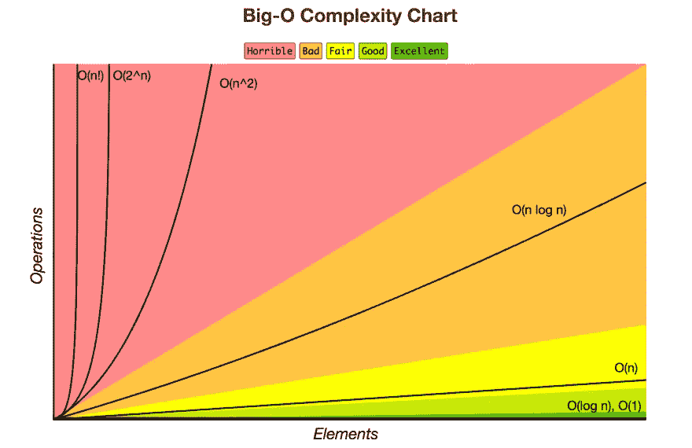
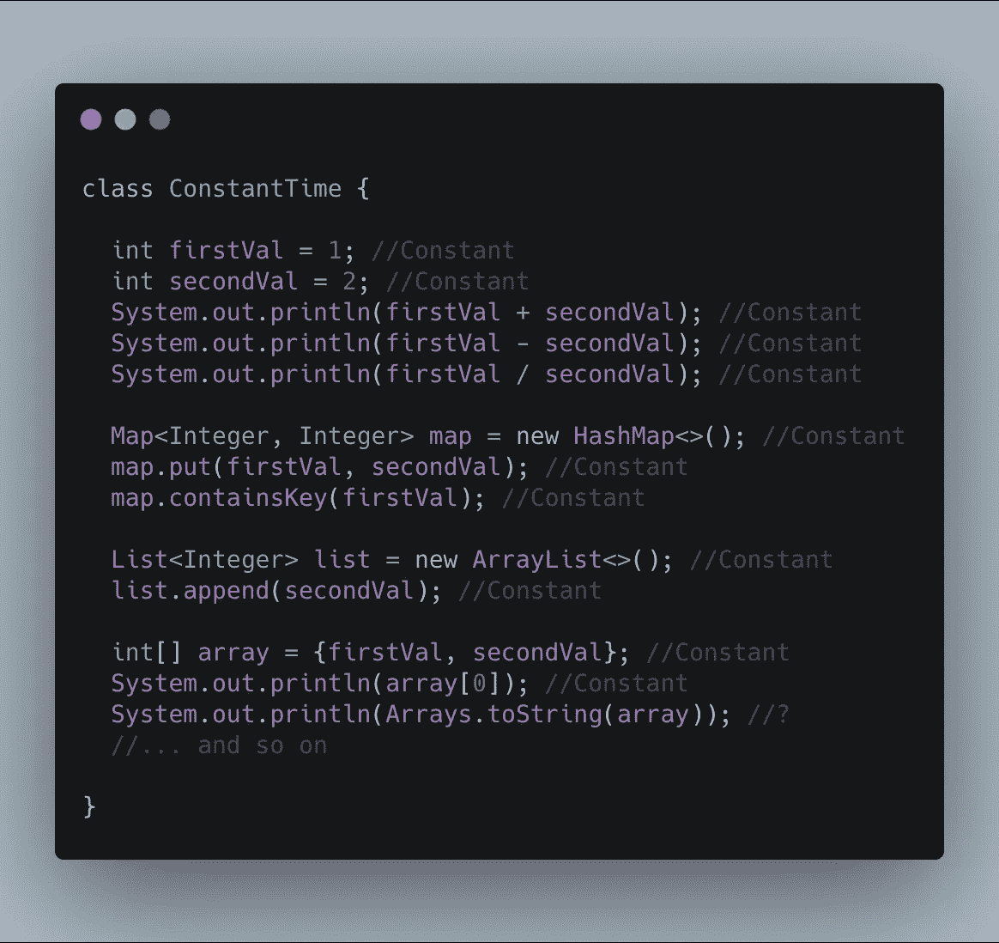
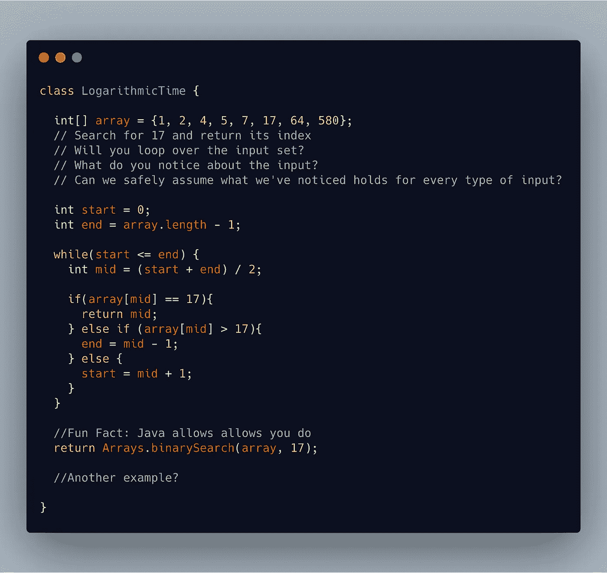
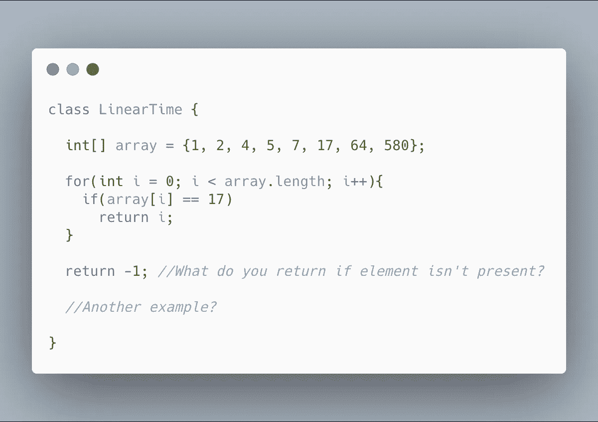
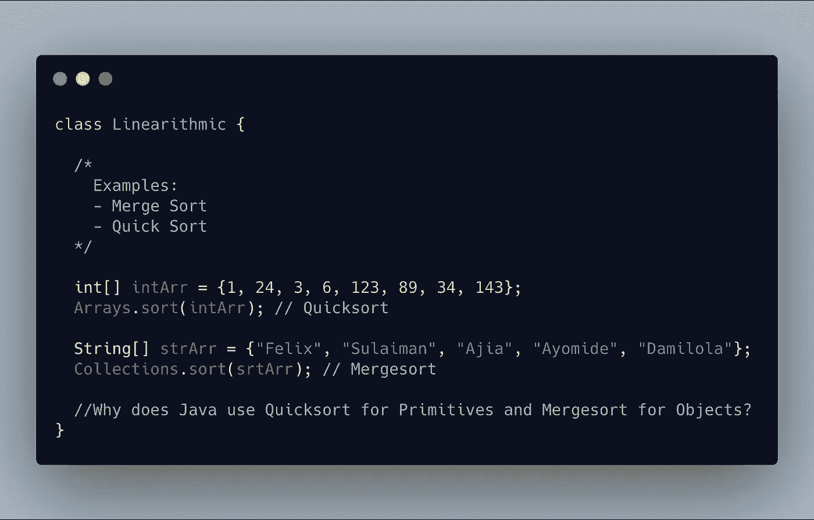
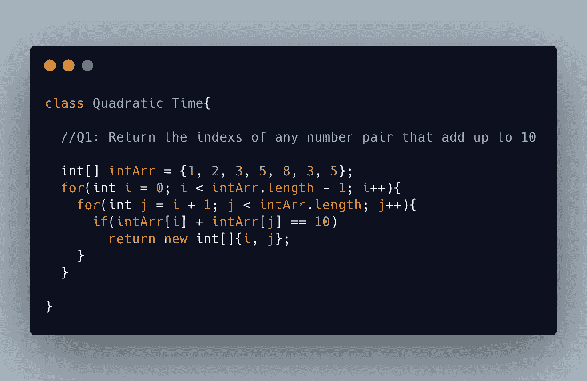
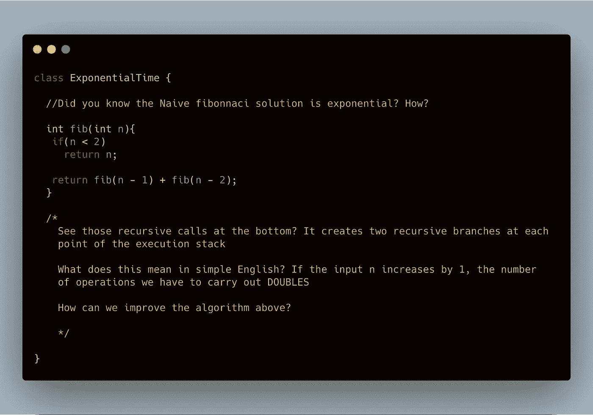
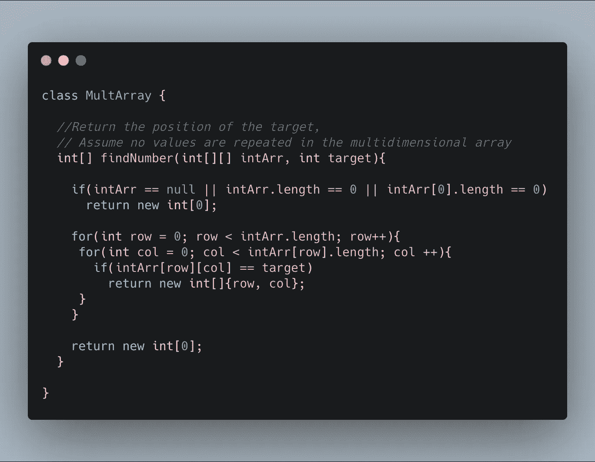
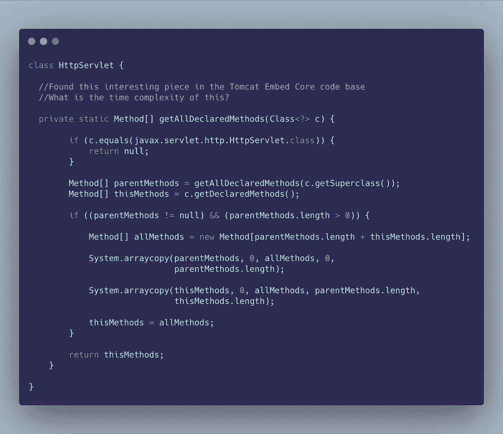
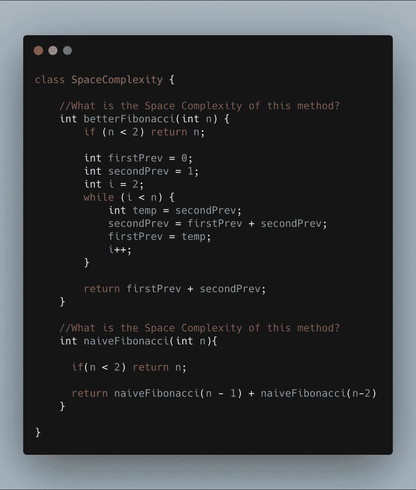

# 复杂度:你的算法运行需要多少时间和空间？

> 原文：<https://betterprogramming.pub/complexity-how-much-time-and-space-does-your-algorithm-take-82598873541f>

## 更好地理解你的算法，这样你就可以改进它们

我创造的形象。https://www.flaticon.com/的图标

我对这篇文章很兴奋，因为这是我的第一篇。经过多年的推迟，我终于开始这样做了。我希望你喜欢这本书，但更重要是，我希望你也能学到一些东西。

这篇文章关注的是一个算法使用多少时间和空间。虽然有很多数学可以帮助我们计算这些东西，但我们将专注于一种直观的方式来了解这些测量。

如果你喜欢数学并且想尝试一下，我会在最后贴上链接，但是首先，让我们回忆一下基础知识。

> “几乎在每一种计算中，过程的各种安排都是可能的。重要是选择能尽量减少计算所需时间的安排—阿达·洛芙莱斯

# 回归基础

## **什么是 a *算法*？**

算法(或方法)是从输入产生可预测输出的有限指令序列。这意味着，如果一个指令序列没有定义的开始和结束，它就不适合被称为算法(引用我的话……)。

## 什么是 c *复杂度*？

不，我不是问你的算法是不是很难读，lol。复杂度是算法的*时间*或*空间*的度量。

> “算法对于计算机程序就像菜谱对于菜肴一样。不同的食谱可以帮助你做一顿特别的饭，但它们并不总是产生相同的效果。
> 
> 它们并不总是有相同的步骤和成分，也不需要相同的时间。有些食谱比其他的更快，效果更好。莎拉·奇马

# 时间复杂度

时间复杂度表示为 *T(n)* ，是一个方法在输入大小为 *n* 的情况下运行所需的时间。

对于一个算法，T(n) 可以有不同的值吗？是的，但是怎么做呢？让我们看一个简单的例子。

假设我们需要整理一副牌。

我们假想的一副牌——图片来自[https://www.flaticon.com/](https://www.flaticon.com/)

我们有三个潜在的案例:

1.  最佳情况-输入需要最少数量的操作。认为:甲板已经排序。
2.  最坏情况-输入需要最大数量的操作。认为:甲板完全没有排序。
3.  平均情况-输入需要平均数量的操作。思考:甲板部分排序。

然而，除非另有说明，我们只关心时间复杂度的最坏情况。我们使用 *big-O (big-oh)符号*来衡量最坏的情况。

r 到 L:最好的时间到最坏的时间。*来源:*[*【https://www.bigocheatsheet.com】*](https://www.bigocheatsheet.com)

为了在实践中理解这一点，让我们看几个例子:

## 1.O(1) —常数时间

恒定时间。思考:赋值和数组索引访问。图像拍摄于[https://carbon.now.sh/](https://carbon.now.sh/)

## 2.O(logn) —对数时间

对数时间。如果每次迭代后搜索空间减少一半，那么它是对数的。图像制作于[https://carbon.now.sh/](https://carbon.now.sh/)

## 3.O(n) —线性时间

线性时间。想想:在最坏的情况下，我们需要访问输入中的所有元素。图像制作于[https://carbon.now.sh/](https://carbon.now.sh/)

## 4.O(nlogn) —线性时间或对数线性时间

线性时间。高效的排序算法在线性时间内运行。谷歌其他例子，有一些相当有趣的。图像制作于[https://carbon.now.sh/](https://carbon.now.sh/)

## 5.O(n ) —二次时间

二次时间。如果我们需要访问输入中的每一个元素，那么它就是二次的。图像制作于[https://carbon.now.sh/](https://carbon.now.sh/)

## 6.O(2^n) —指数时间

指数时间。评论解释的很好。这种解释如何延伸到 3^n、4^n 或 5^n(等等)？图像制作于[https://carbon.now.sh/](https://carbon.now.sh/)

## 7.O(n！)—阶乘时间

阶乘时间。思考:找出一个字符串的所有排列。谷歌其他例子也在这里。有些问题(如一些 NP 完全问题)有时只能在阶乘时间内解决。图像制作于[https://carbon.now.sh/](https://carbon.now.sh/)

# 让我们试一些例子

以下算法的时间复杂度是多少？你同意我的答案吗？

## 1.遍历多维数组

这在 O(n)中运行，因为我们只访问输入(多维数组= n)中的每个元素一次。在[https://carbon.now.sh/](https://carbon.now.sh/)拍摄的图像

## 2.Tomcat 嵌入式核心 getAllDeclaredMethods 方法

这在 O(l*k)中运行，其中 l =继承类的总数& k =方法的总数。图像制作于[https://carbon.now.sh/](https://carbon.now.sh/)

# 空间复杂性

关于空间复杂性的(可理解的)材料并不多；它不太受欢迎，但同样重要。

空间复杂度是一种衡量一个算法需要多少计算机内存(RAM)来执行的指标。我们也可以用 big-O 来表达。

让我们看看返回第*n*个斐波那契数的两种实现——递归(无记忆)与迭代。

betterFibonacci 的空间复杂度是 O(1 ),这意味着即使输入增加，空间量也不会改变，而 naiveFibonnaci 由于递归堆栈需要 O(n)空间。在 https://carbon.now.sh/[拍摄的图像](https://carbon.now.sh/)

我希望你喜欢这个，回头见！

# **资源与延伸阅读**

*   《计算机科学精粹:学习解决计算问题的艺术》
*   [big-O 符号介绍](https://dev.to/sarah_chima/the-big-o-notation-an-introduction-34f7)
*   [为什么 Java 的数组排序方法对 diff 使用两种不同的排序算法？](https://stackoverflow.com/questions/3707190/why-does-javas-arrays-sort-method-use-two-different-sorting-algorithms-for-diff)
*   [准线性时间—维基百科](https://en.wikipedia.org/wiki/Time_complexity#Quasilinear_time)
*   [YouTube 视频](https://www.youtube.com/watch?v=KXAbAa1mieU)(给你点数学。)

欢迎在下面给我更多的技术链接，我会把它们添加到帖子里！)

特别大声喊出来:Wladston，你是一个不可思议的传奇！