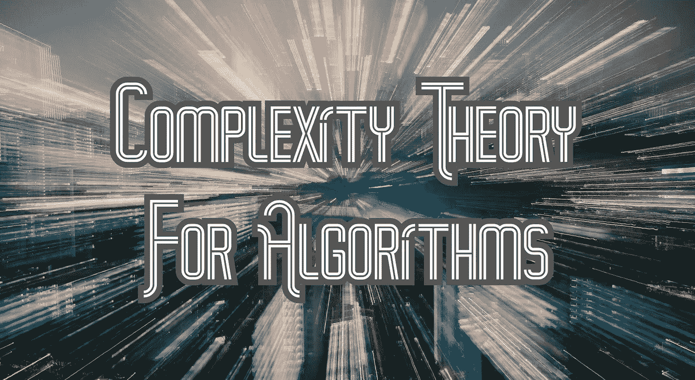
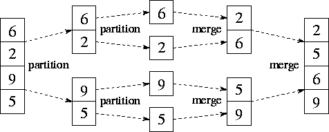
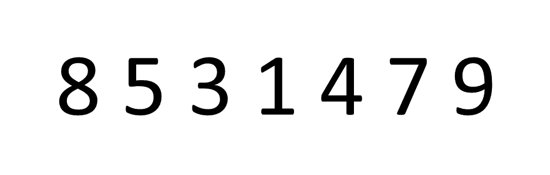
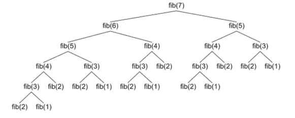

# 算法的复杂性理论

> 原文：<https://betterprogramming.pub/complexity-theory-for-algorithms-fabd5691260d>



由 [Unsplash](https://unsplash.com/photos/eH_ftJYhaTY) 上的 [chuttersnap](https://unsplash.com/@chuttersnap) 拍摄的图像

## 软件工程

## 我们如何测量算法的速度

*复杂性理论*研究算法运行所需的时间，作为输入大小的函数。这对软件开发人员理解非常有用，这样他们就可以高效地编写代码。有两种类型的复杂性:

**空间复杂度**:一个算法需要运行多少内存。
**时间复杂度**:一个算法需要运行多少时间。

我们通常更担心时间复杂度而不是空间复杂度，因为我们可以重用算法运行所需的内存，但我们不能重用运行所需的时间。买记忆比买时间容易。如果你需要更多内存，你可以从亚马逊、谷歌或微软等提供商那里租用服务器空间。您也可以购买更多的计算机来增加更多的内存，而无需租用服务器空间。本文的剩余部分将介绍我们如何优化时间复杂度。

# 我们如何度量时间复杂度？

新电脑通常会比旧电脑快，台式机通常会比智能手机快——那么我们如何真正知道一个算法花费的绝对时间呢？

为了测量绝对时间，我们考虑算法执行的操作数量。任何算法的构建块都是 if 语句和循环。他们回答问题: *(1)什么时候应该做运营？(2)我们应该做多少次*？我们希望在任何机器上使用尽可能少的 if 语句和循环来编写代码，以获得最高的效率。

为了分析算法，我们考虑输入大小*n*——输入项目的数量。我们想好好猜测一下算法的运行时间与输入大小 *n.* 这是*增长顺序:*给定输入大小 *n.* 算法将如何扩展和表现

```
**1\. Input 10 items -> 10 ms
2\. Input 100 items -> 100 ms (Good, linear growth)
3\. Input 1,000 items -> 10,000 ms (Bad, exponential growth)**
```

在上面的例子中，当我们输入 10 个条目时，运行需要 10 毫秒。当我们输入 100 个条目时，需要 100 毫秒——这很好，因为输入的增长与运行时间成比例。

然而，在下一步中，我们输入 1，000 个项目，需要 10，000 毫秒。相对于输入大小的增加，我们现在需要 10 倍的时间来运行 *n.* 现在，我们的运行时呈指数增长，而不是线性增长。为了更好地理解不同的增长顺序，我们将介绍一下 *Big-O 符号。*

# 大 O 复杂度图


big-o 符号描述了当运行时趋向于特定值或无穷大时算法的限制行为。我们用它来根据算法对输入大小变化的反应来对算法进行分类。我们将输入大小表示为 *n* ，对输入执行的操作数表示为*n。*我的例子将用 Python 编码。

我们更喜欢在输入方面具有增长顺序即*线性算法*或更快的算法，因为较慢的算法不能扩展到大的输入大小。以下是运行时复杂性从低到高的列表:

*   O(1) : **恒定时间复杂度**
*   O(log(n)) : **对数复杂度**
*   O(n) : **线性复杂度**
*   O(n * log(n)) : **线性算法复杂度**
*   O(n^k) : **多项式复杂度**(其中**k**t42】1)
*   O(c^n) : **指数复杂度**(其中 **c** 为常数)
*   O(n！):**阶乘复杂度**

# 恒定时间复杂度:O(1)

如果运行时间被一个不依赖于输入大小的值所限制，则算法在*常数时间*内运行。

常数时间算法的第一个例子是交换两个数的函数。如果我们改变函数定义，接受一百万个数字作为输入，而函数体保持不变，它仍然只执行同样的三个操作和一个返回语句。运行时不会根据输入大小而改变。

```
def **swapNums**(num1, num2):
   temp = num1
   num1 = num2
   num2 = temp
   return (num1, num2)
```

在第二个例子中，我们将首先检查输入消息是否为`“Hello World!”`，如果是，则将消息更改为另一个值。之后，它将循环三次，执行另一个将打印消息 100 次的循环，这意味着消息将被打印 300 次。尽管进行了所有这些操作，但由于该函数不会根据输入大小执行更多的操作，因此该算法仍然以恒定的时间运行。

```
def **printMessage300Times**(message):
   if(message == "Hello World!")
      message = "Pick something more original!"
   for x in range(0, 3):
      for x in range(0, 100):
         print(message)
```

# 对数时间复杂度:O(log(n))

对数算法具有很强的可扩展性，因为当输入大小 *n* 增加时，运算数量 *N* 与输入大小 *n* 的比率会降低。这是因为对数算法不会访问其输入的所有元素——我们将在*二进制搜索算法中看到。*

在二分搜索法，我们试图在一个排序列表`num_list`中找到我们的输入号码`num`。我们的输入尺寸 *n* 是`num_list`的长度。

由于我们的列表已经排序，我们可以将我们正在搜索的`num`与列表中间的数字进行比较。如果`num`大于中点值，我们知道我们的`num` 只能在列表的较大一侧——所以我们可以完全丢弃列表的较低端，因为不需要处理它而节省时间。

然后，我们可以在列表的另一半上递归地重复这个过程(其行为很像一个循环),每次迭代时丢弃剩余的一半`num_list`。这就是我们如何实现对数时间复杂度。

```
def **binarySearch**(num_list, left_i, right_i, num):
   if right_i >= left_i:
      midpoint = left_i + (right_i - left_i)/2
      if num_list[midpoint] == num:
         return midpoint
      elif num_list[midpoint] > num:
         return binarySearch(num_list, left_i, midpoint-1, num)
      else:
         return binarySearch(num_list, midpoint+1, right_i, num)
   else:
      return "Number not in collection"
```

# 线性时间复杂度:O(n)

当运行时间与输入 *n* 的大小成比例增加时，算法在*线性时间*内运行。如果我们将输入乘以 10，运行时也应该乘以 10 或更少。这是因为在线性时间算法中，我们通常对输入的每个元素运行操作。

在未排序的数字集合中寻找最大值是我们可以创建的在线性时间中运行的算法，因为我们必须检查一次输入中的每个元素才能解决问题:

```
def **findMaxNum**(list_of_nums):
   max = list_of_nums[0] for i in range(1, len(list_of_nums.length)):
      if(list_of_nums[i] > max):
         max = list_of_nums[i] return max
```

在`for`循环中，我们迭代输入中的每个元素 *n* ，如果需要的话，在最后返回最大值之前更新我们的最大值。线性时间算法的更多例子包括检查无序列表中的重复项或查找列表的总和。

# 线性时间复杂度:O(n * log(n))

Linearithmic-time 算法比线性时间的算法略慢，但仍可伸缩。

这是一个中等的复杂度，在线性时间内浮动，直到输入达到足够大的规模。在*线性时间*中运行的算法的最流行的例子是排序算法，如`mergeSort`、`quickSort`和`heapSort`。我们再来看`mergeSort`:

```
def **mergeSort**(num_list): 
    if len(num_list) > 1: 
        midpoint = len(arr)//2
        L = num_list[:midpoint] # Dividing "n"  
        R = num_list[midpoint:] # into 2 halves 

        mergeSort(L) # Sort first half 
        mergeSort(R) # Sort second half 

        i = j = k = 0

        # Copy data to temp arrays L[] and R[] 
        while i < len(L) and j < len(R): 
            if L[i] < R[j]: 
                num_list[k] = L[i] 
                i+=1
            else: 
                num_list[k] = R[j] 
                j+=1
            k+=1

        # Checking if any element was left in L
        while i < len(L): 
            num_list[k] = L[i] 
            i+=1
            k+=1 # Checking if any element was left in R
        while j < len(R): 
            num_list[k] = R[j] 
            j+=1
            k+=1
```

## “合并排序”的工作原理是:

*   递归地划分`num_list`,直到元素为两个或更少
*   对每一对项目进行迭代排序
*   迭代合并我们得到的数组



使用这种方法，我们可以实现线性时间，因为整个输入 *n* 必须迭代，并且这必须发生 *O(log(n))* 次(输入只能减半 *O(log(n))* 次)。使 *n* 个项目迭代 *log(n)* 次会导致运行时间 *O(n * log(n))* ，也称为线性时间。

# 多项式时间复杂度:O(n^c)其中 c > 1

如果运行时间对于所有输入大小 *n* 以相同的指数 *c* 增加，则算法在*多项式时间*内运行。

这一次的复杂性和随后的复杂性不成比例！这意味着随着输入大小的增长，运行时最终会变得太长，使算法不可行。有时我们会遇到无法快速解决的问题，我们需要创造性地限制输入的大小，这样我们就不会经历多项式算法将会产生的长处理时间。一个例子*多项式*算法是`bubbleSort`:

```
def **bubbleSort**(num_list):
    n = len(num_list)
    for i in range(n):
        # Last i elements are already in place
        for j in range(0, n-i-1):
            # Swap if the element found is greater
            # than the next element
            if num_list[j] > num_list[j+1] :
                temp = num_list[j]
                num_list[j] = num_list[j+1]
                num_list[j+1] = temp
```

`bubbleSort`将一遍又一遍地遍历列表中的所有元素，当发现相邻的数字顺序不对时，就交换它们。只有当它发现所有的数字都按正确的顺序排列时，它才会停止。

在下图中，我们只有七个项目。该算法在整个集合中迭代三次来对数字进行排序——但是如果是 100 个数字，很容易看出运行时间会变得很长。*这个不成比例。*



# 指数时间复杂度:O(c^n)其中 c 是常数

当运行时间随着输入数据集的每次增加而加倍时，算法以指数时间*运行。递归计算斐波那契数列是指数时间算法的一个例子:*

```
def **fibonacci**(n): 
    if n == 0:
        return 0
    elif n == 1:
        return 1
    else: 
        return fibonacci(n-1) + fibonacci(n-2) 
```

这个算法在最后一行调用自己两次——一次用 *n-1* 调用，一次用 *n-2 调用。*这意味着如果我们从 *n=7 开始，*我们将总共调用该函数 25 次！随着输入的增长，运行成本非常高。



# 阶乘时间复杂度:O(n！)

最后，如果算法对输入 *n* 迭代的次数等于 *n* 乘以所有小于 *n* 的正整数，则该算法在*阶乘时间* 内运行。这是我们将在本文中讨论的最慢的时间复杂度，它主要用于计算集合的排列:

```
def **getListPermutation**(items_list):
   results = []
   i = 0
   l = len(items_list)
   while i < l:
      j, k = i, i + 1
      while k <= l:
         results.append(" ".join(items_list[j:k]))    
         k = k + 1
      i = i + 1
   print results
```

# 结论

感谢阅读！我很乐意听到您的反馈或回答您的任何问题。