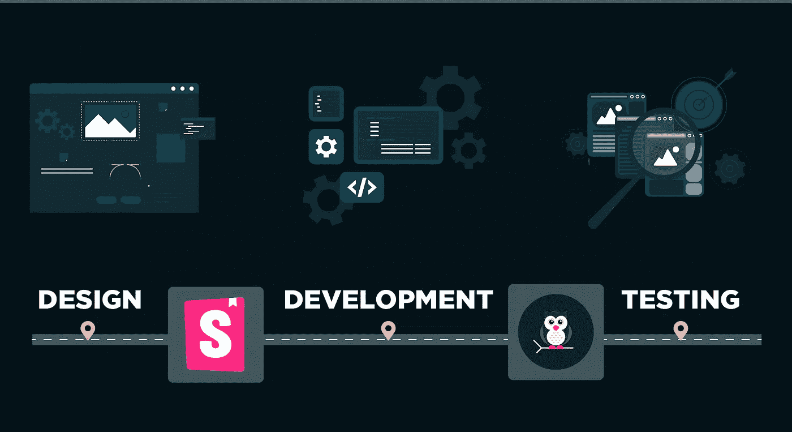
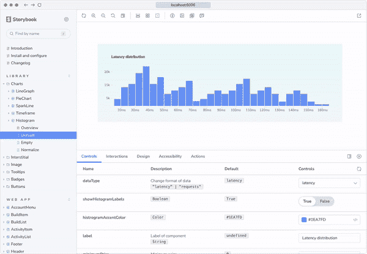
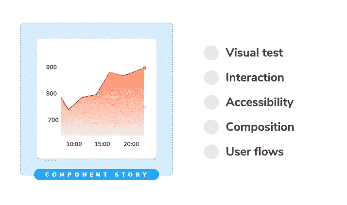
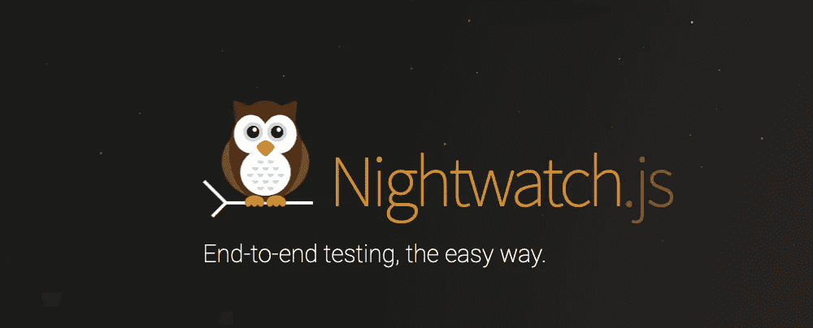
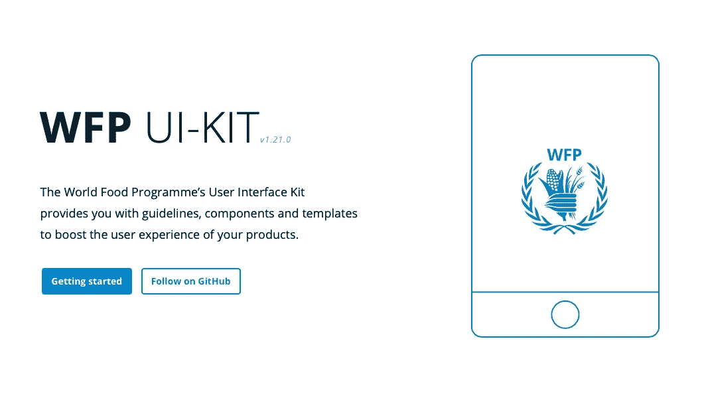
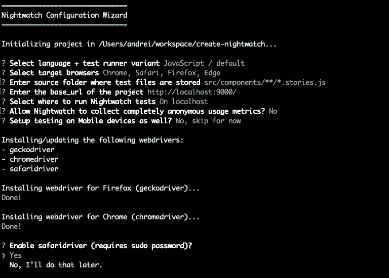
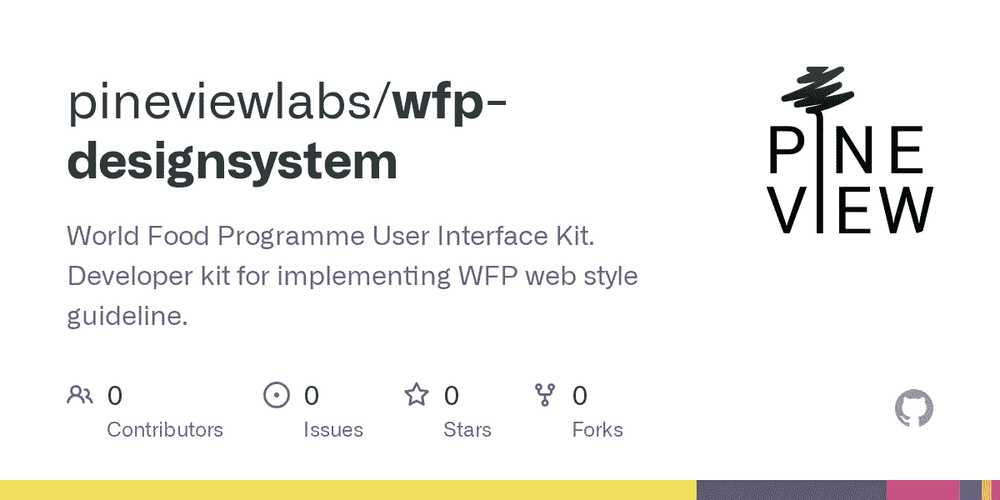

# 用故事书和守夜人进行组件驱动的开发

> 原文：<https://betterprogramming.pub/component-driven-development-with-storybook-and-nightwatch-c5805cb499a7>

## 将 Nightwatch 与 Storybook 集成，并开始编写高效、简单的组件和端到端测试



用[故事书](https://storybook.js.org/)和[守夜人](https://nightwatchjs.org/)进行组件驱动开发

# 介绍

Storybook 可以说是目前最受欢迎的组件库，React 拥有稳定的用户基础，Vue、Svelte、Angular 和其他 UI 库的社区也在不断增长。它被世界上成千上万的团队用来构建具有可重用组件的 ui。

Storybook 的流行可能是因为它确定了前端开发人员今天的一个基本需求。为了构建现代复杂的 UI，前端团队需要能够独立地设计、构建和测试 UI 组件。Storybook 称这种技术为组件驱动开发(CDD)。

# 组件驱动开发

Storybook 旨在通过提供引人注目的文档和测试工具来提供管理大型组件库的完整解决方案。每个组件都以其不同的状态和需求被隔离呈现。

具有各种属性和参数的组件的每个表示被称为一个故事，属于特定组件的所有故事被收集在一个`.stories.js[x]`(或`.ts[x]`)文件中。故事是用声明性语法编写的，每个故事通过用一组特定的道具和模拟数据呈现组件来模拟特定的组件变体。

下面是一个基本的组件故事示例:

```
// Histogram.stories.js|jsx

import React from 'react';

import { Histogram } from './Histogram';

export default {
  title: 'Histogram',
  component: Histogram,
};

const Template = (args) => <Histogram {...args} />;

export const Default = Template.bind({});
Default.args = {
  dataType: 'latency',
  showHistogramLabels: true,
  histogramAccentColor: '#1EA7FD',
  label: 'Latency distribution',
};
```

Storybook 是作为一个节点 web 应用程序分发的，该应用程序加载现有的故事，并在一个复杂的管理界面中显示它们，该界面带有用于记录和测试组件的集成工具。



按作者分类的图片和 gif

故事书应用程序可以在本地运行，也可以部署在 web 服务器上。许多流行的组件库[对公众](https://storybook.js.org/showcase)可用。

# 如何测试组件故事

Storybook 主要用作前端开发人员和设计人员之间的协作工具，以记录 UI 组件甚至整个页面。

这一切都很好，直到测试出现并使一切变得复杂。这才是真正的乐趣所在，因为要有效地开发 UI 组件，还需要一种简单有效的测试方法。

需要对组件进行自动化测试，以确保使用指定的道具和模拟数据正确呈现所有的故事。此外，更复杂的组件可能有需要模拟用户动作和验证行为的故事。

Storybook 提供了对组件的几种测试策略的内置支持:

*   [视觉测试](https://storybook.js.org/docs/react/writing-tests/visual-testing)
*   [互动测试](https://storybook.js.org/docs/react/writing-tests/interaction-testing)
*   [无障碍测试](https://storybook.js.org/docs/react/writing-tests/accessibility-testing)
*   [快照测试](https://storybook.js.org/docs/react/writing-tests/snapshot-testing)



图片致谢:[https://story book . js . org/docs/react/writing-tests/introduction](https://storybook.js.org/docs/react/writing-tests/introduction)

因此，有一个内置的测试支持和一个 [CLI 测试运行器](https://storybook.js.org/docs/react/writing-tests/test-runner)，它在引擎盖下使用了剧作家和笑话。然而，在整个 web 应用程序开发领域，它的优势仍然更多地停留在设计方面。

为了对您构建的组件的代码质量有很强的信心，您将需要通过对组件测试的额外支持来扩展故事，或者将故事导入到其他测试中。

# 将守夜人融入你的故事书



https://nightwatchjs.org

[Nightwatch](https://nightwatchjs.org/) 是 Node.js 领先的端到端测试框架之一，它通过`[@nightwatch/storybook](https://nightwatchjs.org/guide/component-testing/storybook-component-testing.html)`插件支持从 v2.4 开始的故事书集成，目前可用于 React。

Nightwatch 可以帮助填补 UI 组件设计+开发和 QA+测试之间的空白。要在故事书环境中添加对组件自动化测试的支持，您只需要添加 install Nightwatch，并用测试功能扩展您现有的故事。

在下一节中，我们将尝试这样做。我们将采用现有的故事书，它在 GitHub 上公开提供，我们将经历以下步骤:

1.  安装和配置守夜人
2.  使用 Nightwatch 运行现有的组件故事
3.  扩展一个复杂的故事，并带有夜间监视测试功能

那么让我们开始吧。我们将使用位于[https://github.com/wfp/designsystem](https://github.com/wfp/designsystem)的 Github 上的[世界粮食计划署](https://www.wfp.org/)的 Ui 套件。



[wfp.org/UIGuide](http://www.wfp.org/UIGuide)

## 安装依赖项

我们首先得放弃这个项目。我自己的叉子位于[github.com/pineviewlabs/wfp-designsystem](https://github.com/pineviewlabs/wfp-designsystem)。我将在本地克隆项目并安装现有的依赖项:

```
git@github.com:pineviewlabs/wfp-designsystem wfp-designsystem 
cd wfp-designsystem
npm install --legacy-peer-deps
```

安装一些旧的依赖项需要使用`--legacy-peer-deps`标志。如果您收到`npm audit`消息，您可以暂时忽略它们，因为这只是一个教程。

## 运行故事书

一旦所有东西都安装好了，你就可以试着在本地运行 Storybook 了。为此，请运行:

```
npm run storybook
```

这将构建故事书文件，并在您的本地主机上运行项目。

在编写本指南时，WFP 设计工具包中使用的故事书版本是 6.2。您可以尝试将其升级到至少 6.5 版，但我已经尝试过了，并得到了一堆错误，所以目前，我坚持使用 6.2 版，以使一切都一起工作。

## 安装守夜人

只需一个命令就可以安装 Nightwatch:

```
npm init nightwatch@latest
```

这将提示您安装浏览器和测试文件的位置。我选择了 Chrome，Firefox，Safari 和 Edge。Edge 需要单独安装，但是 init 工具会生成 Nightwatch 中需要的配置。



对于源文件夹位置，输入以下内容:

```
src/components/**/*.stories.js
```

对于基本 URL，输入以下内容:

```
http://localhost:9000/
```

我们还需要为 Nightwatch 安装故事书插件:

```
npm install @nightwatch/storybook
```

如果你在更新的 NPM 版本上，你可能需要再次通过`--legacy-peer-deps`。

最后一步是在 Nightwatch 中加载和配置插件。为此，编辑`nightwatch.conf.js`并在`src_folders`后添加以下内容:

```
// nightwatch.conf.js
module.exports = {
  // .. other settings
  plugins: ['@nightwatch/storybook'],
  '@nightwatch/storybook': {
    start_storybook: false, 
    storybook_url: 'http://localhost:9000/'
  }
}
```

在测试运行期间，Nightwatch 可以自动为我们启动/停止 Storybook，但由于这个特定版本的 Storybook 需要一点时间来加载，我们保留了`start_storybook`到`false`，我们将手动运行它。

# 在《守夜人》上发表报道

`@nightwatch/storybook`插件被设计成这样工作，组件测试可以被添加到现有的组件故事之上，而不是期望用户在测试中导入故事。用故事书搭配 Nightwatch 的时候，测试的是`.stories`文件本身。

在我们的例子中，我们将运行现有的`src/component/**/*.stories.js`文件作为测试。但在此之前，我们需要配置最后一件事。

## 自定义 esbuild

Nightwatch 在幕后使用`esbuild`解析 JSX 文件，这个项目包含一些默认情况下`esbuild`不支持的语法特性。然而，我们可以通过使用`babel`启用编译来支持它们。

为此，编辑`nightwatch.conf.js`并在包含`'@nightwatch/storybook'`的行后添加以下内容:

```
// nightwatch.conf.js
module.exports = {
  // other settings here...
  esbuild: {
    babel: {
      filter: /\.[cm]?js$/
    }
  }
}
```

## 添加巴别塔

添加一个包含以下内容的`babel.config.json`文件，以便`esbuild`可以找到它:

```
{
  "exclude": ["node_modules/**"],
  "presets": [
    "@babel/preset-env",
    "@babel/preset-react"
  ],
  "plugins": [
    "@babel/plugin-proposal-export-namespace-from",
    "@babel/plugin-proposal-export-default-from"
  ]
}
```

## 运行守夜程序

现在是运行组件故事的时候了。该项目已经有一些用 Jest 编写的单元级组件测试，并且使用了 Enzyme。我们不打算接触它们，而是使用实际的`.stories`文件。

我们将使用 Chrome 进行一次探索性的测试，我们将在`--serial`模式下进行，这样我们可以观察浏览器:

```
npx nightwatch --env chrome --serial
```

以串行模式运行项目中的所有故事可能需要一段时间。但我们可以尝试并行运行它们(你可以用“firefox”、“safari”或“edge”来替换“chrome”，这取决于你安装了哪些浏览器)。

默认情况下，它会根据 CPU 内核的数量来挑选测试工作人员的数量，但我们会将其设置为`4`。我们还将在`--headless`模式下运行它，这样浏览器就不会弹出来分散我们的注意力(注意，Safari 中没有 headless 模式):

```
npx nightwatch --env chrome --workers=4 --headless
```

所以到现在为止，希望我们能在 WFP 故事书项目中有一个可以工作的守夜人装置。目前，故事将只被渲染，Nightwatch 将执行可见性检查，以确保一切正常。

下一步是扩展其中一个故事，并添加一些特定于 Nightwatch 的功能。

# 用守夜测试扩展故事

我们将在项目中选择一个较大的故事，并添加额外的测试功能。就复杂性而言，似乎`src/components/Form/Form.stories.js`是一个很好的候选，所以我们要用它。

我们先分别运行一下:

```
npx nightwatch src/components/Form/Form.stories.js -e chrome
```

文件中有四个不同的故事，输出应该如下所示:

```
[Form.stories.js component] Test Suite
───────────────────────────────────────────────────────────────────────
  Using: chrome (107.0.5304.110) on MAC OS X.

Running "Default" story:
───────────────────────────────────────────────────────────────────────
  ✔ Passed [ok]: "components-forms-form--default.Default" story was rendered successfully.
  ✨ PASSED. 1 assertions. (1.078s)

  Running "Detailed Form" story:
───────────────────────────────────────────────────────────────────────
  ✔ Passed [ok]: "components-forms-form--detailed-form.DetailedForm" story was rendered successfully.
  ✨ PASSED. 1 assertions. (583ms)

  Running "Login" story:
───────────────────────────────────────────────────────────────────────
  ✔ Passed [ok]: "components-forms-form--login.Login" story was rendered successfully.
  ✨ PASSED. 1 assertions. (411ms)

  Running "Contact" story:
───────────────────────────────────────────────────────────────────────
  ✔ Passed [ok]: "components-forms-form--contact.Contact" story was rendered successfully.
  ✨ PASSED. 1 assertions. (513ms)

  ✨ PASSED. 4 total assertions (5.768s)
```

## 添加守夜人文件上传测试

Nightwatch 可以运行故事书[交互测试](https://storybook.js.org/docs/react/writing-tests/interaction-testing)和[可访问性测试](https://storybook.js.org/docs/react/writing-tests/accessibility-testing)，同时支持 hooks API。然而，在本文中，我们将只探索 Nightwatch 在[组件故事格式](https://storybook.js.org/docs/react/api/csf)之上添加的`test()`功能。你可以在[夜视文档](https://nightwatchjs.org/guide/component-testing/storybook-component-testing.html)上阅读更多关于故事书集成的内容。

我们将扩展`DetailedForm`故事，所以让我们继续编辑`src/components/Form/Form.stories.js`，并在带有`export const Login`的那一行之前添加以下内容(在第 400 行周围):

与受浏览器沙箱限制的`play()`函数相反，`test()`函数在节点上下文中运行，因此它可以访问文件系统。

`test()`函数接收 Nightwatch `browser` API(可以用来发布命令和运行断言)和一个`component`对象，该对象指向故事中的根元素，并且它与 Nightwatch 命令和断言兼容。

这个例子将模拟使用 Nightwatch 的`uploadFile()` API 命令上传文件，我们将验证文件放置区元素是否已经更新。

```
// src/components/Form/Form.stories.js
DetailedForm.test = async (browser, {component}) => {
  await browser.uploadFile('input[type="file"]', require.resolve('./README.mdx'));

  const fileElementContainer = await browser.findElement(`.${settings.prefix}--file-container`);
  browser.strictEqual(await browser.hasDescendants(fileElementContainer), true, 'The file dropzone element has been populated.');
};
```

此外，将此导入添加到文件的顶部:

```
// src/components/Form/Form.stories.js
import settings from '../../globals/js/settings';
```

我们现在只能运行`DetailedForm`故事:

```
npx nightwatch src/components/Form/Form.stories.js -e chrome --story=DetailedForm
```

希望一切正常，输出应该如下所示(顶部可能会有一些警告，但不是关键的):

```
[Form.stories.js component] Test Suite
───────────────────────────────────────────────────────────────────────
  Using: chrome (107.0.5304.110) on MAC OS X.

Running "Detailed Form" story:
───────────────────────────────────────────────────────────────────────
  ✔ Passed [ok]: "components-forms-form--detailed-form.DetailedForm" story was rendered successfully.
  ✔ Passed [strictEqual]: The file dropzone element has been populated.
  ✨ PASSED. 2 assertions. (1.217s)
```

# 结论

目前差不多就是这样。我可能会用不同的公共故事书库写另一篇类似的文章。或者也许你想贡献一个？Storybook 的伟大人物最近开始在他们的[组件百科全书](https://storybook.js.org/showcase)中收集公共故事书库，因此有很多机会进行实验，甚至可能做出开源贡献。

您可以在 GitHub 上找到代码，网址是



【https://github.com/pineviewlabs/wfp-designsystem】

如果您已经完成了本教程的学习，我向您致敬！你现在已经准备好为一个正在联合国使用的开源项目做贡献，这很了不起。

感谢你的阅读，别忘了随心所欲地戴上你的帽子——室内还是室外。

*原载于 2022 年 11 月 16 日*[*https://labs . pineview . io*](https://labs.pineview.io/supercharge-your-storybook-with-nightwatch-testing/)*。*