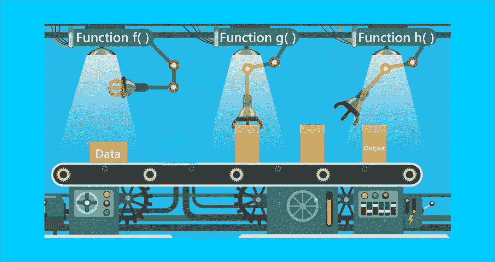

# 在 JavaScript 中合成和管道

> 原文：<https://betterprogramming.pub/compose-and-pipe-in-javascript-medium-d1e1b2b21f83>

## 函数式编程:JavaScript 中的**组成**和**管道**是什么？


Neil Daftary 在 [Unsplash](https://unsplash.com?utm_source=medium&utm_medium=referral) 上拍摄的照片。

`Compose`和`Pipe`是 JavaScript 函数式编程中最强大的概念。然而，它们可能很难理解。本文将帮助您更好地掌握这些功能。

# **作曲**

在代数中，函数组合允许你将一个函数应用于另一个函数的输出。


作者照片。

在这个例子中，函数`g`被应用于将函数`f`应用于`x`的结果。正如我们所看到的，函数组合是从右向左工作的。

使用`compose`在 JavaScript 中也可以得到同样的结果:


作者照片。

好吧…真的很困惑。让我们看一个例子。

让我们假设我们想得到一个用户的名字，并把它大写。首先，我们必须编写一个提取用户名的函数:

```
const user = {name: 'Gianmarco', password: 1234}
const getUserName = (user) => user.name
getUserName(user)
// 'Gianmarco'
```

然后是一个大写字符串的函数:

```
const upperCase = (string) => string.toUpperCase()
upperCase('Gianmarco')
// 'GIANMARCO'
```

现在，我们可以将这两个函数组合成一个函数来执行这两个操作:获取名称并将其大写。

我们可以使用之前看到的`compose()`的实现:

这个`compose()`实现的问题是它只接受两个函数作为参数(在我们的例子中，`upperCase()`和`getUserName()`)。

假设我们想添加另一个返回字符串前四个字符的函数:

```
const firstFour = (string) => string.substring(0,4)
firstFour(‘GIANMARCO’);
// 'GIAN'
```

如何一次编写两个以上的函数？

我们可以用`Compose`和`[reduceRight()](https://medium.com/javascript-scene/reduce-composing-software-fe22f0c39a1d)` 的方法:

```
const compose = (...functions) => x => functions.reduceRight((acc, fn) => fn(acc), x);
```

在这个实现中，`compose()`采用 *rest 参数*(任意数量的参数——在这个例子中，任意数量的函数)并返回一个采用初始值`x`的函数。然后，它使用`[reduceRight()](https://medium.com/javascript-scene/reduce-composing-software-fe22f0c39a1d)` 方法从右向左迭代`functions`中的每个函数`fn`，并依次将其应用于累加值`acc`。

更简单地说，`compose()`将任意数量的函数从右向左应用于前一个函数的输出。

有了这个新的`compose()`实现，我们现在可以创建一个函数来获取用户名，大写，并只返回它的前四个字符:

很酷，对吧？

它就像一个从右到左工作的命令列表(从数学符号的意义上来说)。当我们调用`compose()`时，函数`getUserName()`是最后一个参数，因为它是要执行的第一个函数。

# **管道**

`Pipe`和`compose()`一模一样，但是是从左到右工作的。我个人更喜欢它而不是`compose()`，因为你可以把它想象成一系列事件。

如果我们想用`pipe()`重新创建上面的`compose()`函数，我们可以使用这个实现:

```
const pipe = (...functions) => x => functions.reduce((acc, fn) => fn(acc), x);
```

正如你注意到的，我们现在使用`[reduce()](https://medium.com/javascript-scene/reduce-composing-software-fe22f0c39a1d)` 而不是`[reduceRight()](https://medium.com/javascript-scene/reduce-composing-software-fe22f0c39a1d)`，因为函数从左到右迭代。

我们的最终结果将是:

作为一系列事件，`pipe()`将`getUserName()`应用于我们的初始数据，然后将`upperCase()`应用于将`getUserName()`应用于我们的初始数据的结果。最后，它会将`firstFour()`应用到将`upperCase()`应用到将`getUserName()`应用到初始数据的结果的输出中。

# 结论

希望这篇文章能澄清你的一些疑惑，帮助你掌握`Compose`和`Pipe`的潜力。

现在，您可以创建像工厂传送带一样接收数据的函数，这些数据经过所有这些不同的函数，直到我们最终获得输出。



作者照片。

*考虑* [***成为中等成员***](https://ebelinggianmarco.medium.com/membership)**如果你喜欢看这样的故事，并且想帮助我这个作家。每月 5 美元，你可以无限制地访问媒体内容。如果你通过* [***我的链接报名，我会得到一点佣金。***](https://ebelinggianmarco.medium.com/membership)*