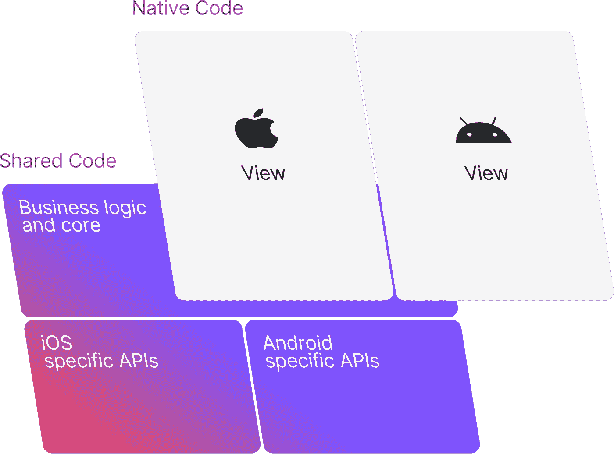

# Compose 和 SwiftUI:使用 KMM 处理视图模型事件和状态

> 原文：<https://betterprogramming.pub/compose-and-swiftui-viewmodel-event-and-state-handling-using-kmm-3f39f8dce4fe>

## 使用在 Jetpack Compose 和 SwiftUI 之间共享的视图模型的 KMM 实现


[菲利普·米舍夫斯基](https://unsplash.com/@filipthedesigner?utm_source=unsplash&utm_medium=referral&utm_content=creditCopyText) @ [Unsplash](https://unsplash.com/es/s/fotos/boring?utm_source=unsplash&utm_medium=referral&utm_content=creditCopyText)

我知道，我知道。有很多文章在讨论 [Kotlin 多平台移动](https://kotlinlang.org/lp/mobile/)和 SwiftUi 与 Compose 之间的视图模型共享。我读过一些。作者带来了很好的解决方案，但在我看来，其中许多非常复杂(或者可能不是最新的)。经过几天的研究，我找到了我个人的解决方案，我想分享一下。

就跨平台解决方案而言，我们可能希望在代码可重用性和本机抽象之间找到一个好的位置。在我看来，[多操作系统引擎](https://multi-os-engine.org) * (MOE)和 [Kotlin 多平台【移动】](https://kotlinlang.org/lp/mobile/)完成了这项工作。不像 [Flutter](https://flutter.dev) 或 [Xamarin](https://dotnet.microsoft.com/en-us/apps/xamarin) *，你得到的是用本地语言编写的真正的本地代码。

> *在这里查看我关于 MOE [的帖子，或者在这里](https://martppa.com/2018/10/10/java-clean-way)直接进入应用的代码[。Xamarin 多平台文章也](https://github.com/martppa/java-clean-architecture)[这里](https://martppa.com/2018/10/23/net-clean-architecture/)或者直接访问代码[这里](https://github.com/martppa/dotnet-clean-architecture)。

## 内存管理

这种集成最重要的部分是 JetBrains 开发的新内存管理。这将允许您的 Swift 代码收集`viewmodel`的状态流。要启用内存管理，请在您的`gradle.properties`中添加以下代码行:

```
kotlin.native.binary.memoryModel=experimental
```

# 代码可重用性

如果你正在阅读这篇文章，那么你可能知道 ViewModel 共享的真正目的。在所有平台之间保持一个共同的代码将减少开发时间和精力，也可能共享错误。

我们的目标是在所有平台之间开发共享代码，并保留特定于平台的用户界面代码。



## 视图模型

假设您正在为全新的 IO 设备编写一个应用程序。客户将使用此应用程序来选择 Wifi 网络并设置他们的设备。将`HomeViewModel`视为主屏幕的`viewModel`。

`HomeViewModel`只要屏幕打开，就会跟踪所有发现的网络(假计数器)。一旦用户点击“下一步”按钮，`WifiScreen`就会出现。`ViewModel`公开了一个简单的接口:一个通知“下一步”按钮被点击的方法和一个 UI 状态对象。

## 用户界面状态

状态对象指的是声明性 UI 的状态。在您的应用程序中，`HomeState`保持着`HomeScreen`的状态。

`counter`保存 UI 中呈现的计数器值。`navigateToNext`举办导航的活动。

## 事件

事件是只能使用一次的对象。事件被放在 UI 状态中等待使用。

> 提示:为了简单起见，HomeState 包含一个专用的类成员 navigateToNext，其唯一目的就是导航。如果您考虑在屏幕上有多个事件，一个好的解决方案可能是使用一个通用的事件对象，并在 UI 端使用多态性，而不是成员的复制。这有什么坏处吗？嗯……它会给用户界面增加一些逻辑。

# 平台特定代码

既然已经编写了通用代码，就可以开始在各种平台上使用它了(这里是 iOS 和 Android)

## 机器人

在 Android 中，您的`HomeScreen`看起来会像这样:

`HomeScreen`收集其状态，显示计数器并使用导航事件。

## ios

iOS 实现也很类似。SwiftUI 本身无法区分 Kotlin 中状态流的一般类型。要解决这个问题，您必须创建自己的收集器来强制进行这种转换。

正如您在上面看到的，您的收集器将其功能扩展并委托给 Kotlin 的流收集器。它将强制转换和发射非空值。

一旦定义了您的自定义收集器，iOS 中的`HomeScreen`遵循与 Android 中完全相同的原则:

一旦视图出现，它将开始通过自定义收集器收集`viewModel`的状态。注意`navigateToNext`事件就像在 Android 中一样被使用。

# 就这样

这是我对这个话题的一点简单的意见。希望它能对这种情况下的任何人有所帮助。[这里是完整的代码](https://github.com/martppa/kmmex)。