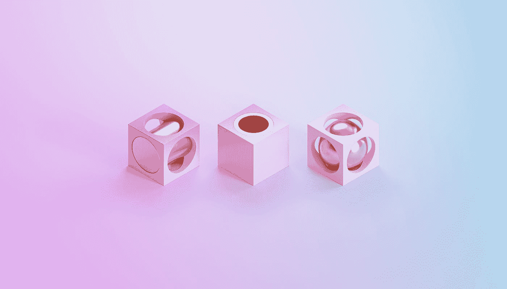
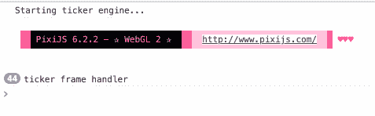
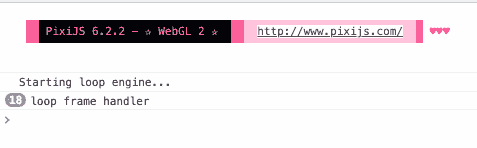

# 构建强大的类型脚本接口

> 原文：<https://betterprogramming.pub/composing-powerful-typescript-interfaces-ba549ec6c49f>

## 以游戏渲染场景为例



照片由 [Rodion Kutsaev](https://unsplash.com/@frostroomhead?utm_source=medium&utm_medium=referral) 在 [Unsplash](https://unsplash.com?utm_source=medium&utm_medium=referral) 上拍摄

TypeScript 通过接口从多种类型组合行为的能力是一个强大的功能。这些契约提供了一种抽象，只通过接口进行交互，而不考虑类。

由于类可以实现多个接口，这通过基类减轻了继承链的复杂性。

接口还定义了多态性，使多个类能够实施与实现无关的行为。实现相同接口的类可以互相替换。

# 可用接口

。NET 框架中关于能力接口的约定总能引起我的共鸣——像`IEquatable`或`IComparable`这样的东西通过添加“能力”后缀将接口的动作变成了一个形容词。

例如，假设您有一个由实体组成的绘图应用程序，这些实体将执行自己的谨慎呈现操作。

这个`render()`功能将存在于一个`IRenderable`接口中:

```
export interface IRenderable {
  render(): void;
}
```

多个类可以实现这个接口，比如`Circle`和`Rectangle`:

```
export class Circle implements IRenderable {
  render(): void {
    console.log("Circle rendering code here...")
  }
}

export class Rectangle implements IRenderable {
  render(): void {
    console.log("Rectangle rendering code here...")
  }
}
```

但是这里的功能是通过接口类型消除对那些具体类的关注。例如，假设您想要引用单个形状:

```
const shape: IRenderable = new Circle();
shape.render();
```

或者，将类实例更改为不同的类，该类强制执行接口指定的相同协定:

```
let shape: IRenderable;

shape = new Circle();
shape.render();

shape = new Rectangle();
shape.render();
```

这方面的一个实际例子是将形状添加到集合中，稍后您将整个集合呈现到画布上:

```
const shapes: IRenderable[] = [
  new Circle(), 
  new Rectangle()
];

for (let shape of shapes) {
  shape.render();
}
```

一个完整的例子，利用 PIXI 绘画:

```
export interface IRenderable {
  render(graphics: PIXI.Graphics): void;
}

export class Circle implements IRenderable {
  public radius: number = 100;

  render(graphics: PIXI.Graphics): void {
    graphics.drawCircle(0, 0, this.radius);
  }
}

export class Rectangle implements IRenderable {
  public width: number = 100;
  public height: number = 100;

  render(graphics: PIXI.Graphics): void {
    graphics.drawRect(0, 0, this.width, this.height);
  }
}// Define shapes and graphics context to render upon
const shapes: IRenderable[] = [new Circle(), new Rectangle()];
const graphics = new PIXI.Graphics();

for (let shape of shapes) {
  shape.render(graphics);
}
```

# 编写界面

假设你想用渲染引擎合成一个游戏场景——让我们看看 Pixi 的内置 ticker vs 一个自定义动画循环。

我们的游戏场景界面将接受一个通用类型的引擎:

```
export interface IGameScene<T> {
  engine: T;
}
```

我们的引擎接口只需要一个`start()`函数来启动渲染引擎进程:

```
export interface IEngine {
  start(): void;
}
```

我们的第一个引擎将使用 Pixi 提供的默认`Ticker`——我们称之为`TickerEngine`,它将实现`IEngine`接口:

```
export class TickerEngine implements IEngine {
  start(): void {
    console.log("Starting ticker engine...");
    const renderer = new PIXI.Renderer();
    const scene = new PIXI.Container();
    const ticker = new PIXI.Ticker();

    ticker.add(() => {
      console.log("ticker frame handler");
      renderer.render(scene);
    }, PIXI.UPDATE_PRIORITY.LOW);

    ticker.start();
  }
}
```

我们的第二个引擎将使用一个定制的动画帧处理器——我们称之为`LoopEngine`,它也实现了`IEngine`接口:

```
export class LoopEngine implements IEngine {
  renderer = new PIXI.Renderer();
  scene = new PIXI.Container();

  start(): void {
    console.log("Starting loop engine...");
    requestAnimationFrame(this.frameHandler);
  }

  private frameHandler = () => {
    console.log("loop frame handler");
    this.renderer.render(this.scene);
    requestAnimationFrame(this.frameHandler);
  };
}
```

现在是游戏场景——它将实现类型为`IEngine`的`IGameScene`接口。这使我们能够指定想要使用的引擎，并在构建时自动启动引擎:

```
export class Scene implements IGameScene<IEngine> {
  engine: IEngine;

  constructor(engine: IEngine) {
    this.engine = engine;
    this.engine.start();
  }
}
```

让我们试一试，从 ticker 引擎开始:

```
const scene = new Scene(new TickerEngine());
```



接下来，自定义循环引擎:

```
const scene = new Scene(new LoopEngine());
```



这种方法使我们能够将行为与公共契约组合在一起，建立熟悉的代码形式。

# 进一步封装

假设您正在评估游戏的两个物理引擎，并希望在它们之间进行交换。在你的应用程序的动画帧处理器中，你想简单地调用`step()`来调用物理引擎计算的一个步骤。首先将您的 API 定义为:

```
export interface IPhysicsEngine {
  step(): void;
}
```

假设您找到了一个与您的图形框架一起工作的[盒子 2D](https://github.com/kripken/box2d.js) 物理引擎库——创建一个包装器来执行框架步骤:

```
export class Box2DPhysicsEngine implements IPhysicsEngine {
  step(): void {
    // Box 2D physics engine world step implementation
  }
}
```

也许您想与 [Planck](https://piqnt.com/planck.js/) 的 Box2D 的类型脚本重写进行比较，Box2D 也适用于您的图形框架——创建一个包装器来执行框架步骤:

```
export class PlanckPhysicsEngine implements IPhysicsEngine {
  step(): void {
    // Planck physics engine world step implementation
  }
}
```

在你的游戏中，从你的包装器中实例化任何物理引擎，并简单地引用帧处理器中的接口`step()`:

```
export class GameScene {
  private physicsEngine: IPhysicsEngine;

  constructor(physicsEngine: IPhysicsEngine) {
    this.physicsEngine = physicsEngine;
  }

  private frameHandler = () => {
    this.physicsEngine.step();
    requestAnimationFrame(this.frameHandler);
  };
}
```

用 Box2D 试试你的游戏:

```
const game = new GameScene(new Box2DPhysicsEngine());
```

或者，用普朗克的话说:

```
const game = new GameScene(new PlanckPhysicsEngine());
```

当然，根据依赖组件所需的 API 和意识，交换核心功能可能从复杂到不可能。通过 bean 风格的封装来探索 JEE 或 Spring 设计模式、控制反转以及与泛型和接口一致的依赖注入将会很有趣。

比如通过两个不同的 3D 框架构建模型——我会在以后的文章中尝试一下。

# 降低复杂性

用类型描述连接有助于简化代码，因为它只需要特定实现步骤所需的接口。

考虑一个小行星风格的游戏，多边形漂浮在欧几里得空间，由笛卡尔坐标和旋转映射。也许在点击测试后多边形的边数减少了。

我们将保留`IRenderable`界面，因为这些多边形会自己渲染:

```
export interface IRenderable {
  render(graphics: PIXI.Graphics): void;
}
```

我们的形状将有 2D 点的位置和旋转角度，我们将定义需要边数和半径的多边形。让我们将它们定义为独立的接口。

```
export interface IPosition {
  x: number;
  y: number;
}export interface IRotation {
  angle: number;
}export interface IPolygon {
  sides: number;
  radius: number;
}
```

我们的`Shape`类将实现位置和旋转，而不考虑形状是如何呈现的:

```
export class Shape implements IPosition, IRotation {
  x: number = 0;
  y: number = 0;
  angle: number = 0;
}
```

具体的`Polygon`类将继承带有接口`IPosition`的`Shape`和带有`IRenderable`实现的`IRotation`添加`IPolygon`接口:

```
export class Polygon extends Shape implements IPolygon, IRenderable {
  sides: number;
  radius: number; constructor(sides: number, radius: number) {
    super();
    this.sides = sides;
    this.radius = radius;
  } render(graphics: PIXI.Graphics): void {
    let step = (Math.PI * 2) / this.sides;
    let start = (this.angle / 180) * Math.PI;
    let n, dx, dy; graphics.moveTo(
      this.x + Math.cos(start) * this.radius,
      this.y - Math.sin(start) * this.radius
    ); for (n = 1; n <= this.sides; ++n) {
      dx = this.x + Math.cos(start + step * n) * this.radius;
      dy = this.y - Math.sin(start + step * n) * this.radius;
      graphics.lineTo(dx, dy);
    }
  }
}
```

这些多边形可以实例化为:

```
const triangle = new Polygon(3, 100);
const square = new Polygon(4, 100);
const pentagon = new Polygon(5, 100)
const hexagon = new Polygon(6, 100);
```

或者，定义为类:

```
export class Triangle extends Polygon {
  constructor(radius: number) {
    super(3, radius);
  }
}export class Square extends Polygon {
  constructor(radius: number) {
    super(4, radius);
  }
}export class Pentagon extends Polygon {
  constructor(radius: number) {
    super(5, radius);
  }
}
```

既然我们已经定义了这些接口，我们可以简单地忘记所有这些复杂性，专注于特定任务所需的契约。

我们的渲染管道实际上只关心`IRenderable`接口:

```
const shapes: IRenderable[] = [triangle, square, pentagon, hexagon];
const graphics = new PIXI.Graphics();for (let shape of shapes) {
  shape.render(graphics);
}
```

也许在点击测试函数中我们需要计算多边形的面积——我们可以使用`IPolygon`接口来访问`radius`和`sides`的相关属性:

```
/** Calculate area of a polygon */
export const area = (polygon: IPolygon): number => {
  const r = polygon.radius;
  const n = polygon.sides; return (n * Math.pow(r, 2)) / (4 * Math.tan(Math.PI / n));
}; const polygons: IPolygon[] = [
  new Triangle(100),
  new Square(100),
  new Pentagon(100)
];for (let polygon of polygons) {
  console.log(`Area: ${area(polygon)}`);
}
```

也许多边形每被击中一次，边数就减少一个，直到被摧毁。如果命中成功，`IPolygon`接口提供所需的数据:

```
const hit = (shape: IPolygon) => {
  shape.sides -= 1; if (shape.sides < 3) {
    console.log("Enemy destroyed!");
  }
};
```

也许鼠标点击只需要访问形状的位置——这可以通过`IPosition`界面实现:

```
export const onMouseDown = (position: IPosition) => {
  console.log(position.x, position.y);
};
```

鼠标坐标与`IPosition`接口有相似的形状，能够比较鼠标事件和形状位置之间的 x，y 坐标。

接口有助于分离逻辑，简化和增加连接代码之间契约的清晰度。

没有什么是不可能的，但可能不值得投资。

> 计算机科学中的所有问题都可以通过另一种间接方式来解决。
> –大卫·惠勒