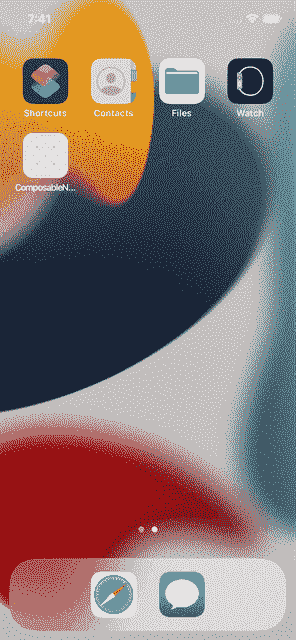
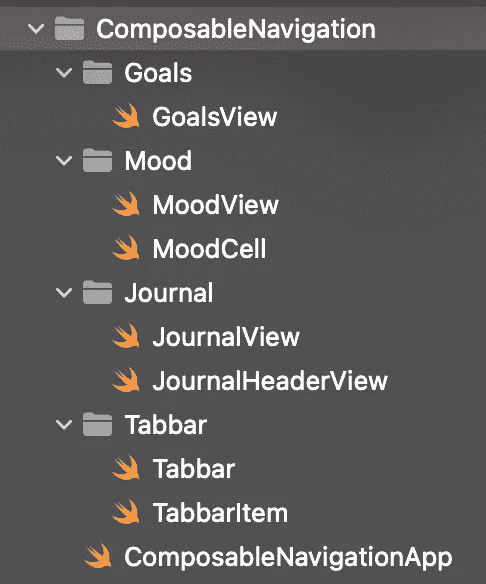
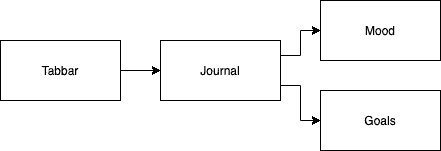
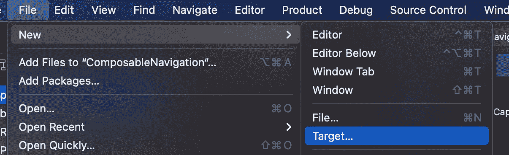
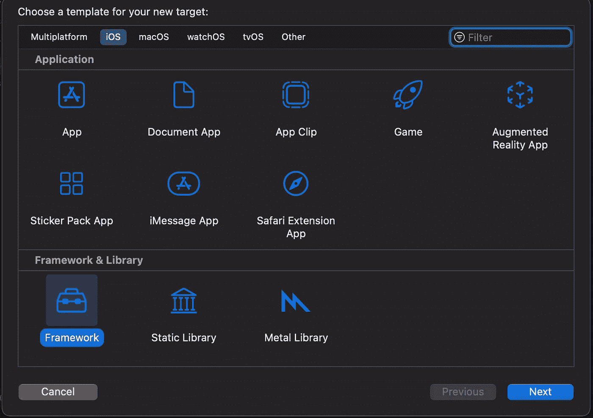
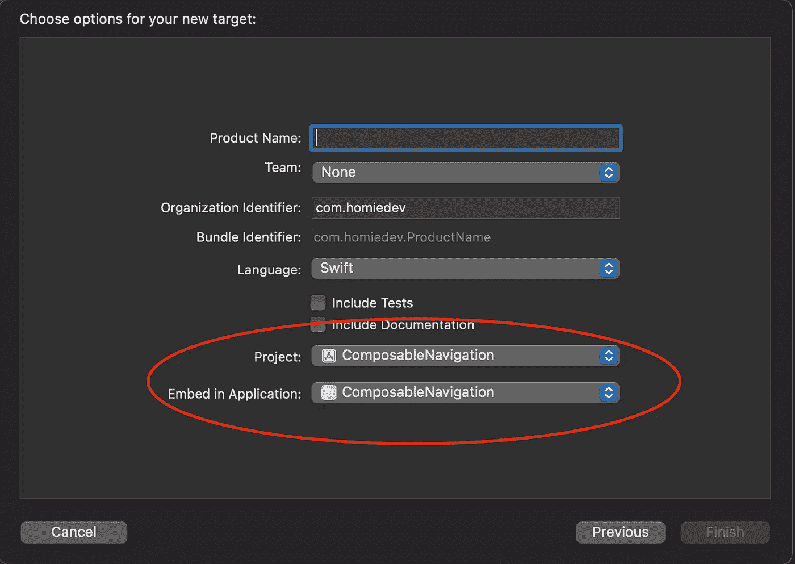
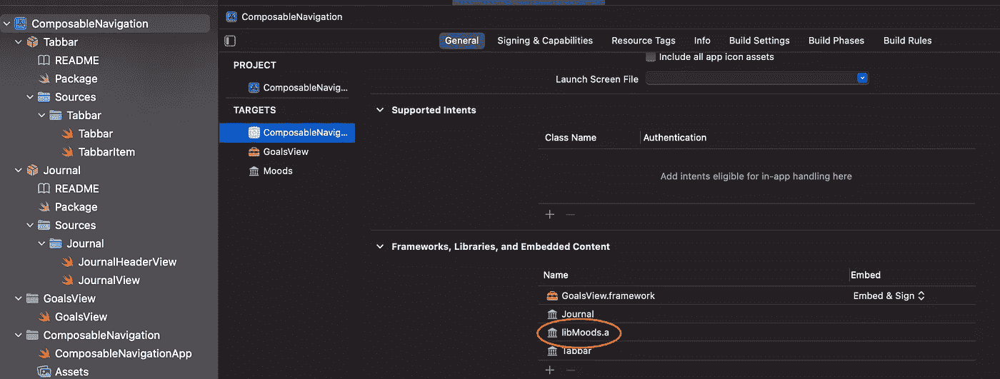
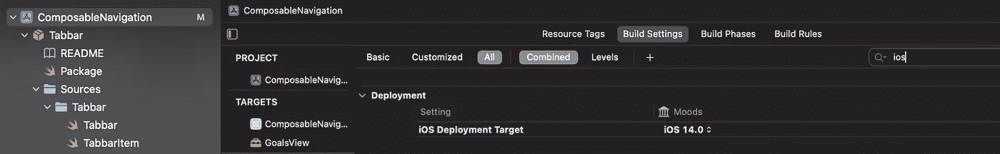
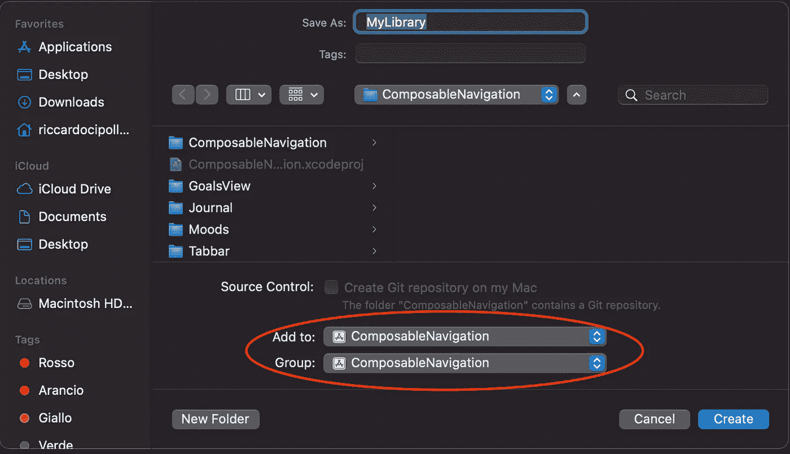
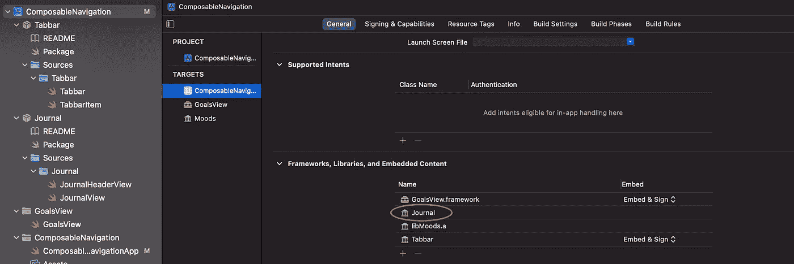

# 编写 SwiftUI 导航

> 原文：<https://betterprogramming.pub/composing-swiftui-navigation-3d67198b6acb>

## 将你的应用程序放在模块中，在根级别构建应用程序

照片由[亚辛·哈尔法利](https://unsplash.com/@yassine_khalfalli?utm_source=medium&utm_medium=referral)在 [Unsplash](https://unsplash.com?utm_source=medium&utm_medium=referral) 拍摄

我们日常使用的应用程序随着每个版本的发布变得越来越复杂。它们有更多的功能，而且更加精致。更大的应用程序意味着更长的构建时间和不容易管理的内在复杂性。

许多这些问题的解决方案是一种叫做 [*分治*](https://en.wikipedia.org/wiki/Divide-and-conquer_algorithm) 的问题解决技术。在移动应用程序领域，这是通过编写模块化应用程序来实现的。

模块化应用程序有几个好处:

*   **缩短构建时间。** Xcode 可以缓存模块，避免重新编译那些没有改变的模块。
*   **平行发展。不同的团队成员可以独立地处理不同的模块。这意味着冲突数量的减少。**
*   **孤立发展。每个模块都独立存在，因此我们可以忽略系统的其余部分。**
*   **更好地分离关注点。**每个模块体现一个单一的特征或服务。它的责任应该永远是明确的。

然而，编写模块化应用程序并不容易。我们需要正确地设计我们的应用程序，我们需要尽可能地分离模块。

在今天的文章中，我想展示我们如何在 SwiftUI 应用中实现这一点。模块化的主要障碍之一是导航:`NavigationLink`和`Tabbar`要求我们在层次结构中声明一个特定的目的地`View`，这可能会将两个不同的模块耦合在一起。

我们从一个经典的 SwiftUI 应用程序开始，逐步将其分成多个模块。我们探索创建模块的各种备选方案以及如何连接它们。

# 启动应用程序

我们要模块化的 app 是下面这个。

应用程序已经被组织在文件夹中，但是每个组件都知道所有其他组件的存在。目标是为每个文件夹创建一个单独的模块。

让我们检查主要的 SwiftUI 视图，分析它们是如何连接的。让我们从`Tabbar`开始:

`Tabbar`的主体中有一个`TabView`,其中包含一些视图。每个视图都有一个图像和一个名称来定制选项卡。`tabbarItem`修改器是一个自定义修改器，以避免重复代码:它使用标准的`.tabItem`，其中有一个`VStack`、`Image`和`Text`视图。

我们可以看到`Tabbar`有两个硬编码的视图作为选项卡内容:一个`JournalView`和一个`Text`。这意味着`Tabbar`组件依赖于`JournalView`组件。

现在让我们来探索一下`JournalView`。

主`body`由三部分组成:`moodSection`、`goalSection`和`gratitudeSection`。每个部分都由一个计算属性创建，以保持`body`小且可读。每个部分的内容彼此相似:它们都有一个硬编码的`content`(为了保持示例简单)和一个`header`。

`header`是一个定制的 SwiftUI 视图，接受标题、图像和目的地作为参数。`moodSection`与`MoodView`相联`goalsSection`与`GoalsView`相联。这是另外两个硬编码的依赖关系:`JournalView`明确地依赖于`MoodView`和`GoalsView`。

最终的依赖关系图如下:

# 模块化

本文的目标是解耦所有的模块:它们中的任何一个都不应该知道其他任何一个。只有`ComposableNavigationApp`知道所有的组件，它会把整个应用程序组合在一起。

在整篇文章中，我们将尝试使用闭包来解耦各个模块。我们将看到`SwiftUI`的`View`协议如何阻碍这一进程，但我们将看到如何解决它。

然后，我们必须为每个组件创建一个单独的模块。创建模块有四种不同的方法:

1.  我们可以在 Xcode 中创建一个动态框架
2.  我们可以在 Xcode 中创建一个静态库
3.  我们可以使用 Swift 软件包创建一个动态框架
4.  我们可以使用 Swift 包创建一个静态库

## 静态库与动态框架

**静态库**和**动态框架**都是用来达到同样的效果:将一些逻辑封装在我们可以重用的模块中。

这两种方法的主要区别在于它们在应用程序启动时的行为，而选择的方法会影响应用程序的大小或启动时间。

不涉及太底层的细节，**动态框架**被编译成一个扩展名为`dylib`的文件:它代表动态库。当应用程序启动时，启动器将所有动态框架加载到内存中，并在运行时将它们链接到应用程序。

**静态库**被压缩到一个扩展名为`.a`的档案中。它们是应用程序的一部分，在运行时不需要动态加载和链接。

两者之间的主要区别是**动态库**更小，但它们使应用程序的启动过程更慢；**静态库**让你的应用程序更大，但不需要更多的时间来启动应用程序。一如既往，在选择您需要什么时，请考虑这种权衡。

网上有许多文章更详细地描述了它们的优缺点:

*   [苹果动态库](https://developer.apple.com/library/archive/documentation/DeveloperTools/Conceptual/DynamicLibraries/100-Articles/OverviewOfDynamicLibraries.html)
*   [静态和动态框架的运行概述](https://www.runtastic.com/blog/en/frameworks-ios/)
*   [瓦丁·布拉文在 iOS 中的静态和动态库和框架](https://www.vadimbulavin.com/static-dynamic-frameworks-and-libraries/)

## 使用框架创建模块

让我们首先将`Goals`文件夹提取到一个`GoalsView`框架中。`Goals`不依赖于任何东西，所以我们不需要改变代码库来提取它。

*   点击`File`菜单，然后选择`New`和`Target`

*   选择对话框中的`iOS`选项卡，向下滚动直到我们在`Framework and Library`部分找到`Framework`项目

*   在文本字段中键入`GoalsView`名称，并确保将`Project`选项和`Embed in Application`选项设置为 app 值(在我的示例中为`ComposableNavigation`)。然后点击`Finish`。

Xcode 将创建一个名为`GoalsView`的文件夹，其中包含一个`GoalsView.h`文件:这是 Objective-C 所需框架的头文件。我们可以安全地删除它。

然后，让我们将`GoalsView.swift`文件从应用程序移动到模块中。如果我们现在尝试构建应用程序，它将会失败:`JournalView`正在尝试创建一个`GoalsView`，但是它不知道它是否存在。

为了解决这个问题，我们必须将新模块导入到`JournalView.swift`文件中。我们来补充一个`import GoalsView`语句。让我们尝试构建，我们将观察到另一个失败:仍然无法到达`GoalsView`。我们需要使它成为`public`:组件现在存在于一个单独的模块中，我们需要使用正确的可访问性修饰符来访问它。

最终的`GoalsView`是这样的:

在单独的模块中移动 SwiftUI 视图时，我们需要创建三个元素`public`:

1.  视图类型。
2.  `body`计算变量。
3.  一个`init`让客户端初始化组件。

通过这些更改，应用程序将会成功构建。

## 使用静态库创建模块

现在是时候将`Mood`组件移动到静态库中了。

该过程与我们对框架遵循的过程完全相同，但是在这种情况下，我们应该在**目标**对话框中选择**静态库**而不是**框架**。

一个**静态库**需要一个额外的步骤:我们需要手动将其嵌入到项目中。为此:

*   在`Project Navigator`中选择项目。
*   在中央面板中选择应用程序
*   选择`General`标签
*   向下滚动到`Frameworks, Libraries, and Embedded Content`
*   点击`+`按钮，添加`libMoods.a`静态库。

同样在这种情况下，我们需要设置一些元素为`public`:`MoodView`，它的`body`属性和它的`init`。最后，我们需要在`JournalView`文件中导入新模块。

**注意:**确保您的应用程序始终具有相同的部署目标。您可以通过选择`Moods`目标及其**构建设置**来更新它。然后你可以过滤掉 **iOS 部署目标**并更改它。

## 使用静态包

现在来看看我们的`JournalView`吧。代码如下所示:

`import`部分是最有趣的部分。它显式声明了这个模块的依赖关系。

我们的目标是打破这种依赖，这样我们就可以从一个更高层次的组件定制导航，让`JournalView`不知道它的目的地。有不同的方式来实现这一点:工厂，关闭和其他模式。为了简单起见，我们将只使用闭包。

这个想法是传递一个闭包，它可以在`JournalView`的`init`中返回任何类型的视图。该闭包将填充`destination`字段，因此当用户试图导航时，闭包被调用，目的地被创建。闭包封装了实际的目的地，因此`JournalView`不必依赖于任何具体的`View`。

然而，我们不能简单地拥有一个返回`View`的闭包:SwiftUI 的`View`协议有一个使用`Self`的关联类型。我们只能把它作为约束而不能作为类型。我们甚至不能有一个返回 opaque `some View`的闭包，因为 opaque 类型需要在编译时已知，而我们无法确保这一点。

为了解决这个问题，我们可以使用泛型。我们知道在这个例子中`JournalView`将由两个部分组成，所以泛型类型的数量是固定的。我们可以更新我们的`JournalView`来接受两种不同的泛型类型:`Goals`和`Moods`。这两种类型都符合`View`协议。

有了这个改变，我们可以定义返回泛型`View`的闭包。代码如下所示:

注意，我们能够删除`import` s 语句:`JournalView`不再依赖于其他模块。然而，这一改变破坏了 SwiftUI 预览和`Tabbar`视图，因为`JournalView` init 已经改变。我们需要为 init 参数提供一些合适的值。

预览可以用一些返回虚拟视图的闭包来更新。必须通过导入`Moods`和`Goals`模块并创建正确的闭包来更新`Tabbar`。代码如下所示:

既然`JournalView`不依赖于任何其他模块，我们可以为它创建一个包。为此:

1.  选择`File`菜单，然后选择`New`和`Package…`
2.  给包命名为`Journal`,并确保将它添加到正确的项目中。

Xcode 在项目中创建包。然而，我们的工作还没有完成。我们需要支持正确的 iOS 版本。为此，让我们打开`Package.swift`文件并对其进行更改:

在第 5 行，我们添加了`platforms`字段来声明我们只为 iOS 构建。

最后，我们需要将包添加到我们的应用程序中。为此:

*   在`Project Navigator`中选择项目。
*   在中央面板中选择应用程序
*   选择`General`标签
*   向下滚动到`Frameworks, Libraries, and Embedded Content`
*   点击`+`按钮，添加`Journal`静态库。

最后一步是将`Journal`文件从应用程序移动到模块。确保`JournalView`，它的`init`，和它的`body`属性都是`public`。

`init`必须接受我们作为参数引入的两个闭包。上面的`JournalView`已经正确配置，并且`init`可以在第 8 行和第 14 行之间找到。

新的包打破了`Tabbar`，现在必须导入`Journal`模块才能正常工作。让我们添加`import Journal`语句来构建我们的应用程序。

## 使用动态包

我们现在拥有了所有互不依赖的模块。`Tabbar`是将所有东西粘合在一起的组件。我们可以将`Tabbar`视为我们的组合根:在这种情况下，我们完成了模块化工作。

然而，还有一个元素更适合作为复合根，即`App`对象。这创造了添加另一个模块的机会:我们可以使`Tabbar`更加灵活，并与应用程序的其余部分分离。

为了对`Tabbar`去耦，我们可以采用与`JournalView`相似的方法。我们可以创建几个泛型类型，每个选项卡一个，我们可以使用闭包在运行时创建它们。

然而，这对于`Tabbar`是有限制的:使用泛型，我们需要预先指定我们将拥有多少个选项卡。标签也需要一个名字和一个图标，我们不能用一个简单的类属来指定它们。所以，一般的方法不能满足所有的需求。

我们可以想到的另一种方法是使用协议。但是，选项卡需要是`View`，并且`View`协议将`Self`作为关联类型。我们只能把它作为约束，不能作为类型。这种方法并不完全有效。

另一个(可行的)解决方案是使用一个`struct`来保存我们需要的`Tabbar`项的属性。该结构还将包含一个闭包来提供`View`。假设我们希望将这些结构存储在一个数组中，我们不能使用泛型结构:每个结构都是不同的类型。相反，我们可以声明一个返回`AnyView`类型的闭包。这种类型是一个不透明的盒子，可以包含任何种类的`View`。

一般不建议在 Swift 中使用`Any`。然而，在这种情况下，我们永远不需要将这些`View`转换成它们的特定类型。我们想要的是一种以通用方式表示 SwiftUI 视图的方法。

有了这个助手，我们可以重写`Tabbar`:

多亏了这种概括，我们设法去掉了所有的`import`。然后，我们声明了一个数组，我们的新结构。

在`body`中，我们使用了一个`ForEach`来遍历提供者以创建所有的选项卡，并且我们使用了 struct 属性来定制`Tabbar`项。

我们终于可以为`Tabbar`创建一个包了。该程序与我们对`JournalView`所遵循的程序完全相同。要创建一个动态包，我们只需要更新产品部分的`Package.swift`文件:

在第 8 行，我们指定包的`type`是`dynamic`。

现在我们可以将`Tabbar`文件复制到这个新包中。记得将包添加到`Frameworks, Libraries, and Embedded Content`列表中，并使`public`成为`struct` s、它们的`init` s 和`body`属性。

这一变化迫使我们更新`App`组件和`Tabbar`的预览。类型的变化是最有趣的:我们需要导入应用程序的所有模块，并且我们需要配置导航。

最终结果如下:

我们创建一个带有两个选项卡的`Tabbar`。每个选项卡都由它自己的提供者描述，提供者返回`TabView`内容的特定视图。鉴于闭包必须返回一个`AnyView`，我们创建了一个小的`erased`实用程序来将特定视图转换为`AnyView`。

我们最终可以从`App`类型组合我们的应用程序。这是应用程序唯一知道所有模块的地方。我们最终将所有模块相互分离。

# 结论

在今天的文章中，我们探讨了如何模块化使用 SwiftUI 的现有应用程序。

我们通过使用四种不同的技术创建四个模块来完成这个过程。我们简单讨论一下**静态库**和**动态框架**的区别。

然后我们探索了如何使用闭包来解耦模块。闭包作为我们需要的类型的匿名工厂工作。当我们知道需要注入的视图数量时，我们可以使用泛型。否则，我们可以使用`AnyView`擦除类型作为闭包的返回类型。

最终的结果是一个模块化的应用程序，带有完全解耦的模块，我们可以从`App`组件中组合这些模块。这是了解和使用所有模块的唯一地方。

整个代码(重构前)可以在[主分支](https://github.com/cipolleschi/ComposableNavigation)中找到。模块化后的代码可以在`[composableNavigation](https://github.com/cipolleschi/ComposableNavigation/tree/composableNavigation)` [分支](https://github.com/cipolleschi/ComposableNavigation/tree/composableNavigation)中找到。