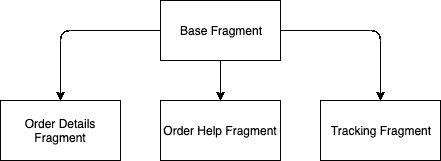
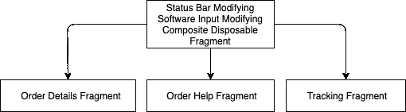
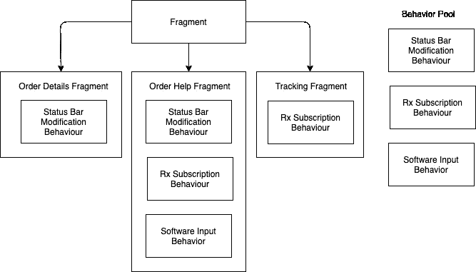

# 继承之上的组合

> 原文：<https://betterprogramming.pub/composition-over-inheritance-9929af861546>

## 利用科特林为作曲提供动力


由[哈维·卡夫雷拉](https://unsplash.com/@xavi_cabrera)在 [Unsplash](https://unsplash.com/) 拍摄

转向单活动架构包括将代码从活动转移到片段，以确保最大的可重用性和可读性。应用继承`BaseFragment`是这样开始的:

碱基片段



## **这些片段的功能行为**

*   订单明细片段:有静态数据
*   订单帮助片段:必须进行网络调用来填充数据
*   跟踪片段:必须进行网络调用来填充数据

## **这些片段的视觉行为**

*   订单细节片段:修改状态栏颜色
*   Order Help 片段:修改状态栏的颜色，当软键盘出现时，可以调整布局的大小
*   跟踪片段:没有额外的视觉要求

# **攻关**

## 可能的解决方案


(照片由[卡森·阿里亚斯](https://unsplash.com/@carsonarias)在 [Unsplash](https://unsplash.com/) 上拍摄)



通用行为定义(可读性噩梦)(由 [AlisonDrawsStuff](https://drawception.com/player/737219/alisondrawsstuff/) 绘制)

[致命的钻石问题](https://en.wikipedia.org/wiki/Multiple_inheritance#The_diamond_problem)平息了你对为什么 Java 不允许多重继承的思考。

这仅仅是开始，我们还有几个令人惊讶的需求片段随时准备扑向我们。

除此之外，我们还必须采用像 [Dagger](https://dagger.dev/#:~:text=Dagger%20is%20a%20fully%20static,have%20plagued%20reflection-based%20solutions) 和数据绑定这样的框架，能够在访问频率较高的页面上应用框架之前，先在访问频率较低的页面上测试框架

> ****来继承遗产的人往往要支付丧葬费。****

# ***科特林接口来救援***

*[Kotlin](https://kotlinlang.org/) 中的[接口](https://kotlinlang.org/docs/reference/interfaces.html)与 Java 8 中的接口非常相似。它们可以包含抽象方法以及方法实现的声明。*

*听起来很有希望？让我们试一试。*

*这是修改状态栏颜色的样板文件:*

```
***interface** StatusBarModificationBehavior {

    **var oldStatusBarColor**: Int
    **val statusBarColor**: Int

    **fun** getContext(): Context?

   **fun** onAttach() {
        getContext?.*takeIf* **{** context **is** FragmentActivity **}**?.*apply* **{
            oldStatusBarColor** = StatusBarUtils.changeStatusBarColor(ContextCompat.getColor(**this**, **statusBarColor**), **this as** FragmentActivity)
        **}** }

    **fun** onDetach() {
        getContext()?.*takeIf* **{ it is** FragmentActivity **}**?.*apply* **{** StatusBarUtils.changeStatusBarColor(**oldStatusBarColor**, **this as** FragmentActivity)
        **}** }
}*
```

*这是正确处理 Rx 订阅的样板文件:*

```
***interface** RXSubscriptionBehavior {

    **var subscriptions**: CompositeDisposable

    **fun** onDestroy(){
        **subscriptions**.clear()
    }

}*
```

****

*精确和可扩展的行为定义。(图片来源: [Pinterest](https://www.pinterest.com.au/pin/650910952367828421/?autologin=true) )*

*使用合成的片段:*

*订单详细信息片段*

*订单帮助片段*

*随着时间的推移，我们已经在架构和外观方面创建了许多这样的接口，我们的一些片段定义看起来类似于以下内容:*

```
***class** OrderHelpFragment : Fragment(),
    DataBindingViewModelArchitecture<FragmentOrderHelpBinding, OrderHelpViewModel>,
    DependencyInjectionArchitecture,
    ToolbarBehavior, StatusBarModificationBehavior, RXSubscriptionBehavior, SnackbarBehavior*
```

# *内部构件*

*Kotlin 是如何实现这个超级接口语法糖的？反编译 Kotlin 字节码揭示了一个使用静态类成员的简单解决方案。*

*StatusBarModificationBehavior 生成的类*

*这种方法为我们提供了与通用定义方法相当的可伸缩性，并极大地增加了可读性。*

*注意:本文虽然是在 Android 应用程序架构的背景下撰写的，但概述了可以使用 Kotlin 等现代编程语言应用的一般设计原则。*