# 利用秩 K 逼近压缩小狗图像

> 原文：<https://betterprogramming.pub/compressing-puppy-image-using-rank-k-approximation-a-doodle-explanation-c19de5dfd951>

## 解释图像压缩、秩和奇异值分解的涂鸦方法

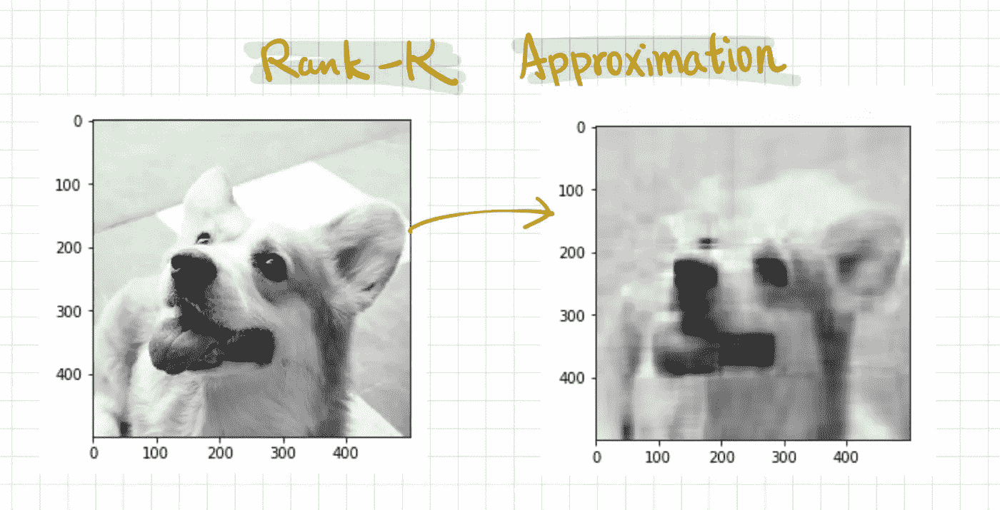

图片来源:作者

# Bitesize 机器学习— Bite #1

有很多图像压缩算法，但本文将重点讨论秩 K 近似。本文涵盖的概念将作为其他常见机器学习问题的基础，如 PCA(主成分分析)、矩阵补全和降噪。(详见最后一段。)

通过图像更容易理解 Rank-K 近似。为了简单起见，让我们假设我们只处理灰度图像，所以每个数据点位于 0 和 1 之间，白色为 0，黑色为 1。

# 等一下。我们所说的压缩是什么意思？

在深入算法和数学之前，让我们对正在解决的问题有一个直觉。压缩一个矩阵是什么意思？或者在这种情况下，压缩一幅图像意味着什么？

近似的关键思想是找到一个与原始矩阵/图像“相似”并且占用更少空间的矩阵/图像。(我们稍后将定义“相似的”。目前，我们只需要一种直觉。)

让我们首先想象我们有一个 500 x 500 的灰度图像。在这种情况下，我们需要存储至少 250，000 个数据点来显示图像。

这里有一个问题:如果压缩图像应该占用更少的存储空间，这是否意味着我们必须缩小原始图像的宽度和高度才能得到压缩图像？如果我们缩小宽度和高度，那就不是真正的压缩了，不是吗？这就是图像裁剪。因此，是否有可能存储更少的数据点，同时仍然保持相同的图像大小(在本例中为 500 x 500)？

这就是令人困惑的地方。如果我们仍然希望压缩图像为 500 x 500，这意味着我们仍然需要 250，000 个数据点来显示。我们如何存储不到 250，000 个数据点，但最终仍然有 250，000 个数据点？听起来很矛盾！

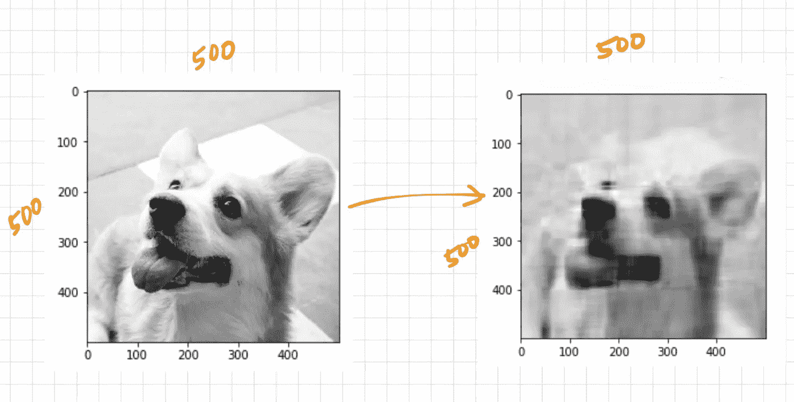

最终的压缩图像仍然具有与原始图像相同的像素数。

# **玩具场景**

让我们想象一个玩具场景，它会使矩阵压缩变得容易。

为了简单起见，假设我们有一个图像矩阵。

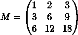

乍一看，似乎我们别无选择，只能存储总共九个数据点。然而，这个矩阵有一些特殊之处，它总共只需要六个数据点来存储。你看到了吗？(先不要向下滚动查看解决方案。)

如果我们看 M 的三个列向量，我们意识到它们是线性依赖的。在其他情况下，列向量是彼此的倍数。

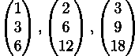

这意味着我们可以将矩阵`M`分解成一个列向量乘以三个标量倍数:

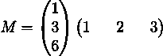

在这种情况下，原本会占用九个数据点的图像现在只占用六个数据点。我们所要做的就是对这两个向量进行矩阵乘法，就可以得到原来的 9 个数据点。万岁，压缩在工作！

如果所有的图像都有上述相似的属性就好了…

# 但是他们有！什么是等级？

上面提到的玩具矩阵被定义为*秩 1 矩阵*。这意味着矩阵的所有列都是彼此的倍数。

形式上，秩 1 矩阵被定义为可以由列向量乘以行向量来表示的矩阵。

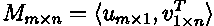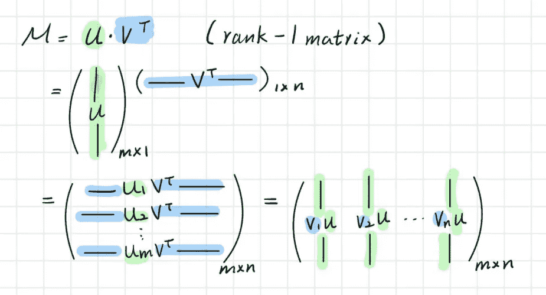

秩 1 矩阵

定义了秩为 1 的矩阵后，我们现在可以定义更高秩的矩阵:

A *秩为 2 的矩阵*可以表示为两个秩为 1 的矩阵之和，A 本身不是秩为 1 的矩阵:

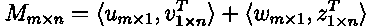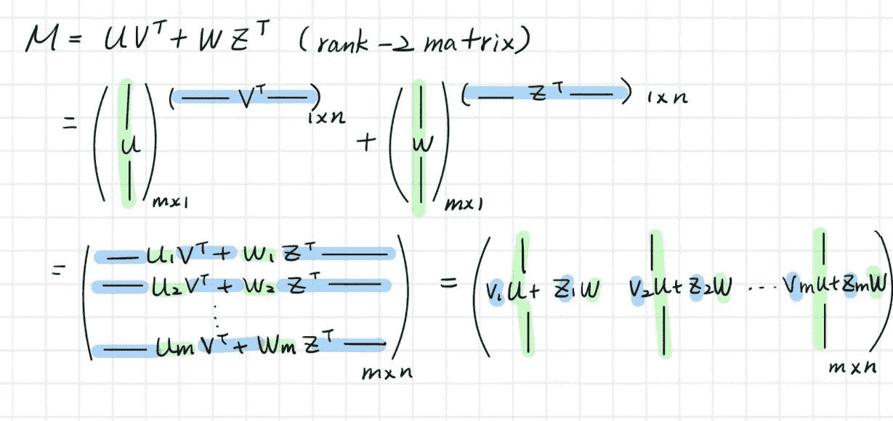

秩 2 矩阵

按照相同的逻辑，秩为 k 的矩阵可以写成 k 个秩为 1 的矩阵的和，而不是秩为 1、秩为 2、…、或秩为-(k-1)的矩阵。

# **奇异值分解**

在上面的玩具例子中，由于完美的线性依赖，在压缩中没有信息丢失。事实上，完美的线性相关性在图像中很少见，因此我们允许在压缩过程中丢失一些数据。

任何形状的矩阵都可以分解成它的 SVD(奇异值分解)形式。

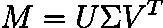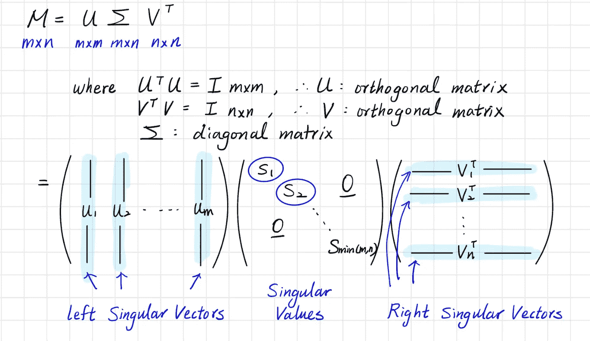

带有 S 的条目:

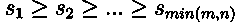

我们可以选择前 k 个奇异值:

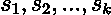

和 k 个右奇异向量来逼近原始矩阵。换句话说，我们已经找到了原始矩阵的“秩 k 近似”。

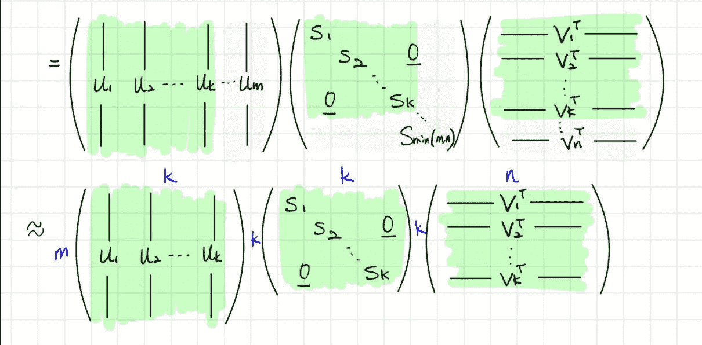

直觉上，我们在矩阵中寻找“最重要”或“最具代表性”的向量，并使用这些“最具代表性”的向量来重建整个矩阵。在 K 秩近似中，我们寻找 K 个最有代表性的向量。

事实证明，原本会占用`m x n`个数据点的图像现在只占用`m x k + n x k = k (m+n)`个数据点。令人惊奇的是，最终的图像仍然是一个`m x n`图像。我们没有为了压缩而缩小图像。

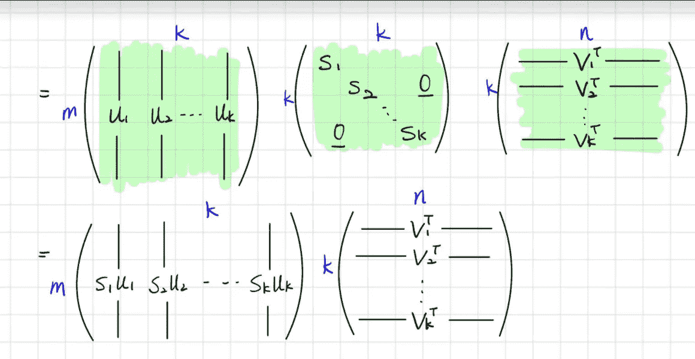

我们只需要 k(m+n)个数据点来表示一个 mxn 矩阵

最后一行显示矩阵`M`可以近似写成 k 秩矩阵。因此得名——秩 K 近似。

# 利用秩 K 近似压缩小狗图像

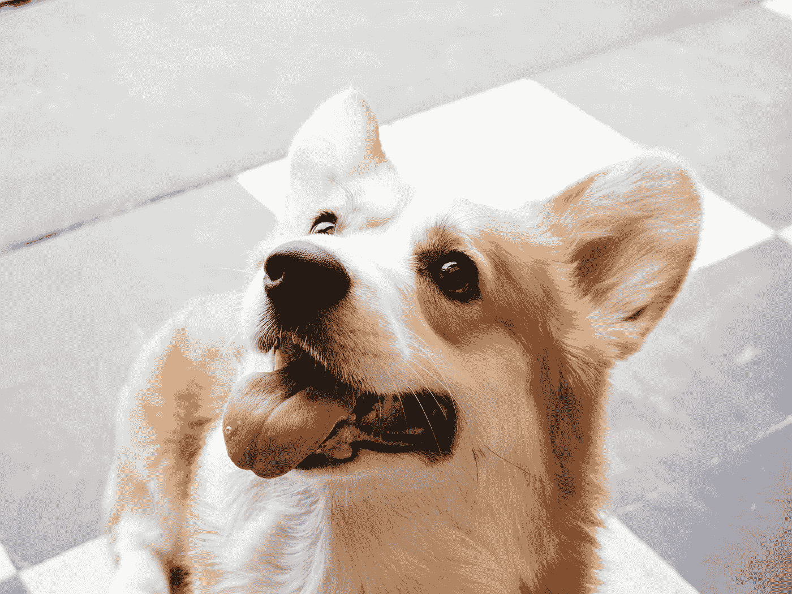

由[弗洛伦西亚·波特](https://unsplash.com/@florenciapotter?utm_source=unsplash&utm_medium=referral&utm_content=creditCopyText)在 [Unsplash](https://unsplash.com/s/photos/corgi?utm_source=unsplash&utm_medium=referral&utm_content=creditCopyText) 上拍摄的照片

## 第一步。将图像转换为灰度

为简单起见，让我们将图像转换为灰度。

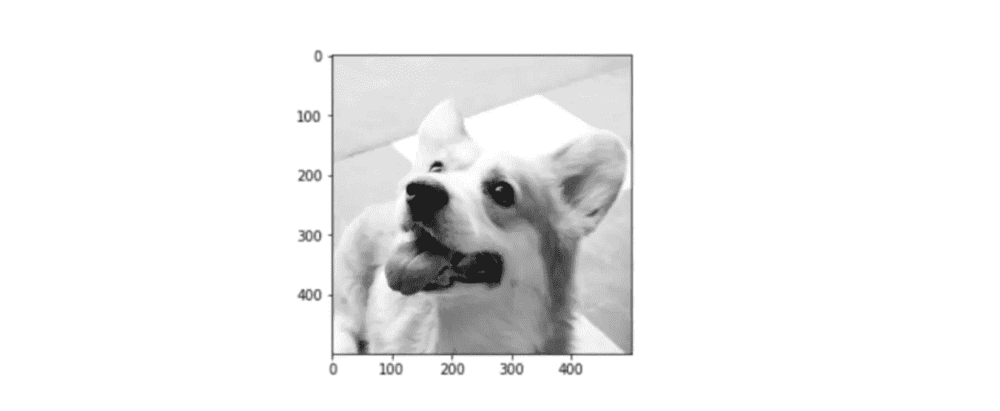

注意:记住在`plt.imshow()`中设置`cmap='gray'`以查看灰度图像。

## 第二步。用`numpy.linalg.svd`计算奇异值分解

注:对于图像，`full_matrices`可以设置为`True`或`False`。

## 第三步。选择前 K 个奇异值和相应的 K 个左奇异向量和 K 个右奇异向量

## 第四步。重构秩 K 近似

## 用不同的 K 秩重建图像的结果

让我们用不同的 k 值来重建图像:

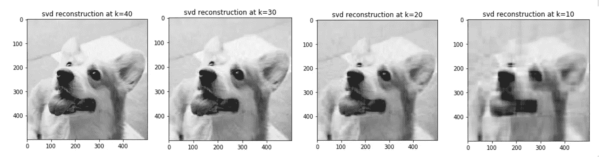

k = [40，30，20，10].0

我们可以看到，随着 k 值的降低，图像变得更加模糊。直观地说，这意味着我们正在从不太重要的向量中重建图像。

## 这些近似值有多好？

我们想知道压缩图像与原始图像有多相似。

在统计领域，这是通过标准差来衡量的。

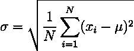

两个矩阵之间的相似性可以通过 Frobenius 范数来测量，该范数定义为:

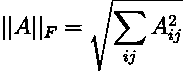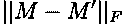

`M`:原始图像矩阵

`M'`:压缩图像矩阵

## 完整的 Python 代码

# **进一步的应用**

1.  **主成分分析(PCA)** :利用奇异值分解(SVD)的性质降低数据维数
2.  **矩阵填充**:当一个矩阵中有数据缺失时，我们可以利用秩 K 近似来填充缺失的数据。
3.  **降噪**:当我们想要消除数据矩阵中的噪声时，我们可以使用前 k 个最重要的向量来重建矩阵。