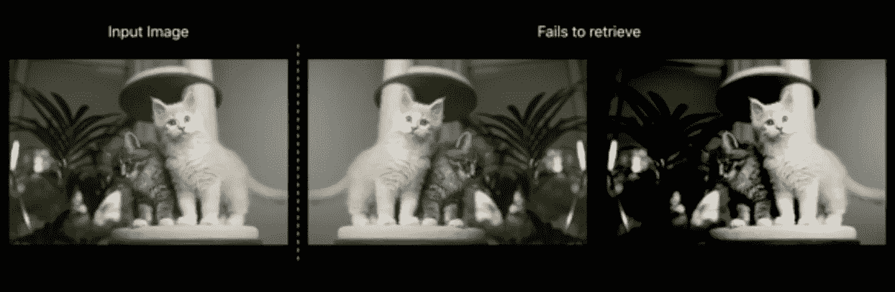
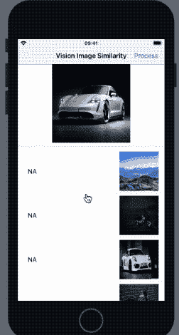
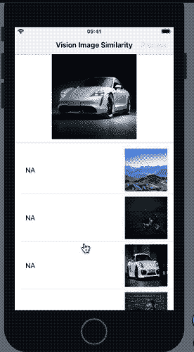

# iOS 中基于特征指纹的视觉图像相似性

> 原文：<https://betterprogramming.pub/compute-image-similarity-using-computer-vision-in-ios-75b4dcdd095f>

## 使用图像的特征印迹确定图像之间的欧几里德距离


内森·杜姆劳在 [Unsplash](https://unsplash.com?utm_source=medium&utm_medium=referral) 上的照片

在 2019 年 WWDC 奥运会期间，苹果通过增加大量进步，为其愿景框架提供了重大推动。从扩大其图像分类请求的类别数量(术语*分类法*用于此),到其人脸技术和文本识别请求的改进，苹果正在为 iOS 带来一些真正有趣的计算机视觉改进。

WWDC 2019 的主要新增内容之一是在视觉框架中引入了图像相似性请求。图像相似性不同于图像分类，我们将很快看到如何相似和为什么相似。但首先，让我们看看图像相似性有用的一些应用:

*   **签名验证** —用于确定一个人的签名是否与签名匹配，从而使您的应用程序在设备上实时检测伪造时更加智能。
*   **重复图像查找器** —筛选大量图像，无论是在数据集还是照片库中。有了这个新的视觉请求，通过创建一个自动化任务来过滤掉重复的图像变得更加容易。
*   **分组或查找相似图像** —就像文本相似性使用语义来标记一样，图像相似性在分组或查找呈现相似上下文(如风景、地点、人物、形状等)的图像时非常方便。
*   **人脸验证** —图像相似性在视觉识别等情况下极其重要。

现在，我们已经很好地了解了确定图像相似性很方便的各种用例，让我们在构建一个基于 SwiftUI 的 iOS 应用程序来实现这一特性的同时更深入地挖掘它。

# 我们的目标

*   理解图像分类不同于图像相似性。
*   了解图像相似性在苹果视觉框架中的工作原理。
*   构建一个应用程序，计算图像与参考图像的相似程度，并对它们进行排序。我们将使用 SwiftUI 框架来构建我们的 iOS 应用程序。

# 视觉图像相似性

图像相似性和分类是不同的，因为类别标签并不表示相似性。图像分类模型通常返回生成的标签作为输出，而图像相似性请求负责计算两幅图像之间的相似性。

分类请求属于*监督学习*，因为它们遵循来自输入的一组指令来返回输出目标结果。另一方面，图像相似性是*无监督的*，因为输入没有一组指令，并且依赖于特征提取来寻找图像之间的相关相似性。

计算图像相似性的技术有很多，比较图像像素值是最琐碎和无效的一种。不同照明/阴影下的相同图像将给出不同的像素，并且将被确定为与源图像不同，尽管内容非常相似。WWDC 视频中的下图描述了这一点:



## 视觉特征印刷品

幸运的是，视觉框架由一个分类网络组成，该网络经过训练可以确定图像在最上层模型中的特征描述符。这使我们不必创建自己的模型来从图像中提取特征，因为 Vision 已经在其 API 中提供了特征打印。`FeaturePrint`是图像的矢量描述符。

以下代码展示了如何从视觉请求中确定特征印迹，并计算图像之间的欧几里德距离。距离决定了图像在欧氏图上的远近。距离越小，图像越相似。

```
let requestHandler = VNImageRequestHandler(cgImage: image.cgImage!, options: [:])let request = VNGenerateImageFeaturePrintRequest()do {try requestHandler.perform([request])let result = request.results?.first as? VNFeaturePrintObservation
var distance = Float(0)
try result?.computeDistance(&distance, to: sourceResult)}catch{}
```

在上面的代码中，`VNGenerateImageFeaturePrintRequest`返回一个`VNFeaturePrintObservation`，用于计算与源图像的浮点距离。

接下来，在下一节中，我们将开发一个 iOS 应用程序，该应用程序使用图像的特征打印来按照相似性对它们进行排序。

# 履行

首先，我们将设置我们的 SwiftUI 视图，它包含一个源图像(参考图像)和一个图像列表。这个想法是在每个图像上运行`VNGenerateImageFeaturePrintRequest`,并计算它们与源图像的特征打印的距离。随后，我们将对 SwiftUI 列表进行排序，以在顶部显示最相似的图像。

下面是我们 UI 的初始状态:



所以我们在 SwiftUI 列表中保留了一张汽车图片作为源图片，以及一些随机图片(包括同一汽车模型不同姿势的图片)。我们很快就会看到，在计算图像的特征打印时，Vision 的图像相似性有多准确。但是首先，让我们建立我们的列表和它的模型。

## 为 SwiftUI 列表创建模型

我们的 SwiftUI 列表将在一个结构中保存图像和相对于源图像的计算距离，如下所示:

```
struct ModelData : Identifiable{public let id: Intpublic var imageName : Stringpublic var distance : String = "NA"}
```

符合`Identifable`协议对于列表中的元素拥有唯一的标识符是很重要的。

## 构建我们的 SwiftUI 视图

接下来，我们将设置 SwiftUI 视图来保存`modelData`和源图像，如下所示:

这里我们的`modelData`被定义为一个状态变量。对`modelData`或其属性的任何更改都会再次更新视图。按下`NavigationBarItem`会触发视觉请求。让我们看看它是如何工作的。

# 运行愿景请求

以下代码计算`modelData`和`sourceImage`的每个图像之间的距离，并使用 map 函数转换数组，然后按距离排序:

因此，当运行上述请求时，我们在应用程序中得到以下结果:



在上面的结果中，最相似的图像是与参考图像具有最相似姿势的图像。视觉特征印迹比较也考虑了显著性(因此更显著的自行车获得了更高的等级)。

对于用于计算相似性的图像与源图像相同的情况，返回的距离为 0.0。此外，如果视觉请求不能提取特征印迹，它将抛出一个错误。

# 结论

在本教程中，我们探讨了苹果的视觉框架如何通过一个易于使用的 API 抽象复杂的计算机视觉算法，使 iOS 开发人员更加轻松。

通过提取图像的特征指纹，我们可以分析图像之间的相似性。接下来，您可以尝试使用多个参考图像来计算图像，例如判断图像是否模糊、暗/亮等。看看视觉请求在这种情况下有多准确会很有趣。本文的完整源代码可以在这个 [GitHub 资源库](https://github.com/anupamchugh/iowncode/tree/master/iOSImageSimilarityUsingVision)中找到。

这一次到此为止。我希望你喜欢阅读。