# 用于商品识别的计算机视觉

> 原文：<https://betterprogramming.pub/computer-vision-and-goods-recognition-ebfae3200375>

## 探索计算机视觉变革零售业的方式

稳定扩散生成的图像

计算机视觉通过创造创新产品和流程，如智能城市、无人驾驶交通和生产分析，彻底改变了各个行业。例如，在超市领域，计算机视觉使各种任务自动化成为可能，包括估计队列长度、监控产品的清洁度和质量、检查价格等等。

在本文中，我们将深入探讨产品识别的一般原则，这些原则对于检查布局、监控货架库存水平和控制浪费至关重要。在过去的七年里，我们的团队定期进行这些项目，并积累了大量宝贵的经验，我们希望与您分享。

# 常见的方法、问题

识别货架内容的任务提出了几个复杂的数学挑战:

*   产品可以放置在一起，也可以相互重叠。
*   产品目录可能包含成千上万的项目，定期添加或删除新项目。
*   类别可能是不平衡的，一些类型有很多例子，而另一些很少。
*   拍摄照片的环境可能光线不足或角度困难，使识别过程更具挑战性。

在设计货架识别算法时，需要考虑这些因素。此外，它需要复杂的数学技术和可靠的数据收集方法来准确识别和分类货架上的商品。

单一的神经网络可以用来解决上述问题吗？理论上，这是可能的( [YOLO9000](https://github.com/philipperemy/yolo-9000) )，但是平衡数据集并获得满意的结果并不容易。因此，任务通常分为两个主要部分:

1.  检测:在这种情况下，所有产品通常被分配到一个类别
2.  检测产品的分类

此外，在许多项目中，还有两个额外的标准任务:

*   质量评估网络
*   后加工

网络和方法的选择应该基于特定的任务。我们将在本文的后面深入探讨这个主题。

# 侦查

我们第一次遇到识别货架上产品的挑战是在 2015 年，当时 SSD 和 Yolo-v1 等锚定检测器相对较新。当许多小物体在一个区域时，这些方法被证明是无效的。

直到 2016 年，我们已经放弃了这个任务，因为我们不确定我们是否能达到足够的精度。然而，我们偶然发现了一篇名为“[拥挤场景中的端到端人员检测](https://arxiv.org/pdf/1506.04878.pdf)”的文章，该文章讨论了密集包装对象的问题。本文介绍了一个循环网络，它可以生成许多检测，而不依赖于锚点。

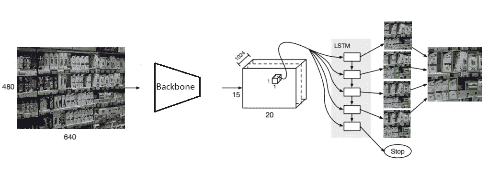

2016 年文章的管道。图片作者。

我们发现这篇文章很有帮助，可以获得更好的检测结果。我们改编了想法，重写了一切(原始代码非常令人毛骨悚然)。目前，存在各种方法来解决这个问题(例如，在 2020 年，我们使用了 [IterDet](https://github.com/saic-vul/iterdet) )。

一般来说，大多数现代最先进的探测器都是有效的。我见过 Yolov5x 处理这项任务并给出令人满意的检测质量的例子。但它通常不适用于包和密集包装的对象。也就是说，如果目标是检测一些简单的包装(瓶子、家用化学品、化妆品)，这可能就足够了。

如果您想要处理复杂的情况，并在对象相交时获得额外的准确性，那么关注处理拥挤和密集对象的模型是有意义的。

现代最先进的检测器通常在物体检测方面是有效的。但是，一些模型可能会在密集包装或拥挤的场景中挣扎。如果您需要检测简单的物体，如瓶子或盒子，像 Yolov5x 这样的模型可能就足够了。

另一方面，如果您需要检测复杂的情况或对重叠的对象要求更高的准确性，则可能值得考虑专门处理拥挤或密集场景的模型:

1.  [宽视野上的物体检测](https://paperswithcode.com/sota/object-detection-on-widerperson)
2.  [人群计数](https://paperswithcode.com/task/crowd-counting)
3.  [人体(全身)上的物体检测](https://paperswithcode.com/sota/object-detection-on-crowdhuman-full-body)
4.  [SKU-110k 上的密集物体检测](https://paperswithcode.com/sota/dense-object-detection-on-sku-110k) —这个任务是关于货架上的商品！但是第一项的网络质量更高。

简而言之，现代算法使用:

*   假设选择的迭代方法
*   处理低可信度的假设
*   变压器和大数据集最大限度地提高准确性

# 分类

商品分类有几种方法。如果您有几个不变的稳定类别(例如，香烟或几十个类别的小集合)，最简单的方法是训练分类器。拿你最喜欢的 [timm-model](https://github.com/rwightman/pytorch-image-models) 来教教吧。

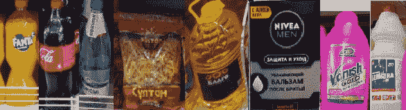

图片作者。

但在实践中，结果有些不同:

*   班级人数可能上万。
*   有些类可能在数据集中表现不佳，或者根本不表现。
*   在实践中，有些类可以很快改变。

对于这种情况，不要使用分类网络，而是使用创建嵌入的网络。例如，里德网络公司:

*   [人员重新识别](https://paperswithcode.com/task/person-re-identification)
*   [GitHub — person 里德基线 PyTorch](https://github.com/layumi/Person_reID_baseline_pytorch)
*   [GitHub —开放式度量学习](https://github.com/OML-Team/open-metric-learning)

简单地解释一下什么是嵌入，它类似于散列。这两个产品越相似，它们的散列之间的距离就越近。类似的方法被用来通过人脸识别一个人。

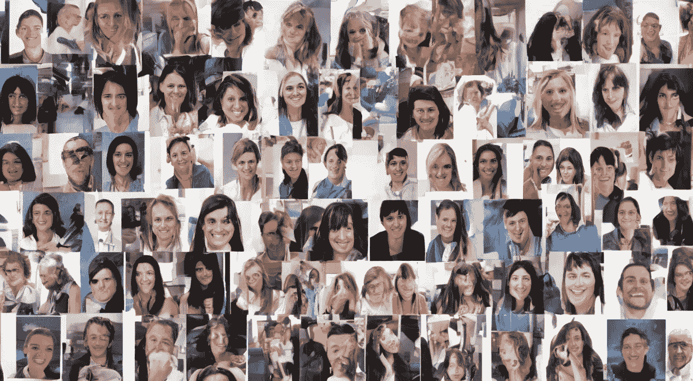

重新鉴定。作者形象与稳定扩散。

该方法的优点:

*   一张图足以让你认出产品。当然，如果有 2-3 张图片就更好了，但通常一张也可以。
*   网络可以训练一次。如果原始数据集足够有代表性，那么增加 100-200 个产品进行再培训几乎不会提高质量。

减

*   相似的产品即使不同也会有很小的距离。比如不同香味的洗衣粉。或者这里:

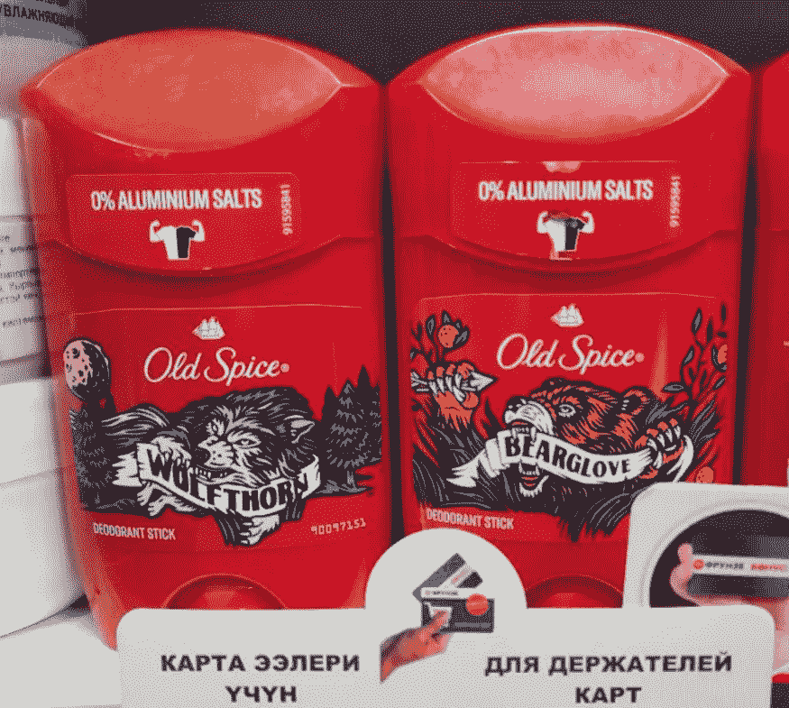

图片作者。

*   尺寸不同但形状相同的商品会有相同的等级:

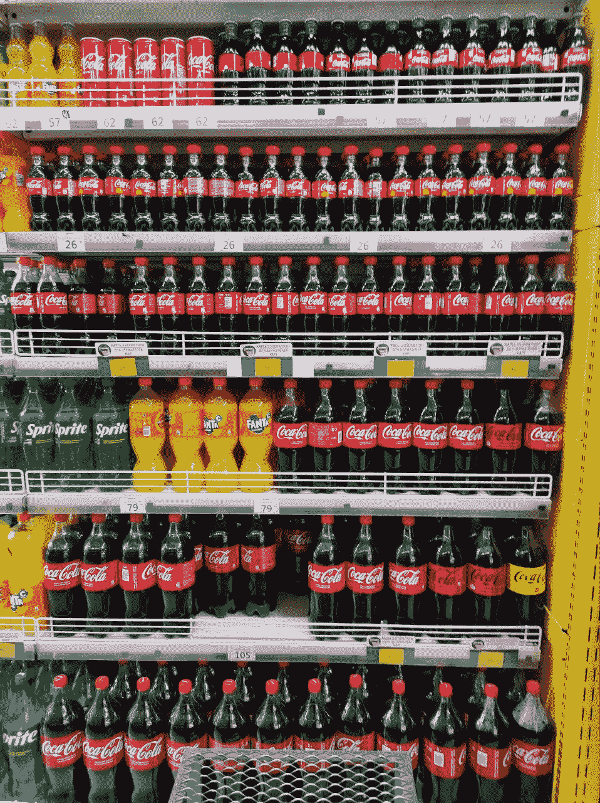

图片作者。

通常这些缺点可以从产品端或者附加算法端弥补，下面我们会讨论。

对了，英伟达最近发布了用于产品识别的[神经网络](https://developer.nvidia.com/metropolis-microservices)。

但在我看来，离生产质量还差得远。

# 其他神经网络和算法

除了使用分类网络之外，利用其他算法来提高对象检测性能可能是有益的。

一种方法是分析输入图像的质量。如果帧质量很差，最好忽略它，因为它会对识别精度产生负面影响。一种方法是训练一个单独的网络来识别模糊、过亮、曝光不足或角度不正确等问题。

另一个策略是执行重叠分析，主要是如果您使用自动摄像机或摄像机的位置远离货架。这有助于检测可能阻挡视线的物体，如人或手推车。分割网络可以被训练来将这些对象识别为特定的类别。

拼接还有助于检测货架上距离较小的物品。由于视角的变化，这可能具有挑战性，并且可能需要更高级的算法，如强力胶。

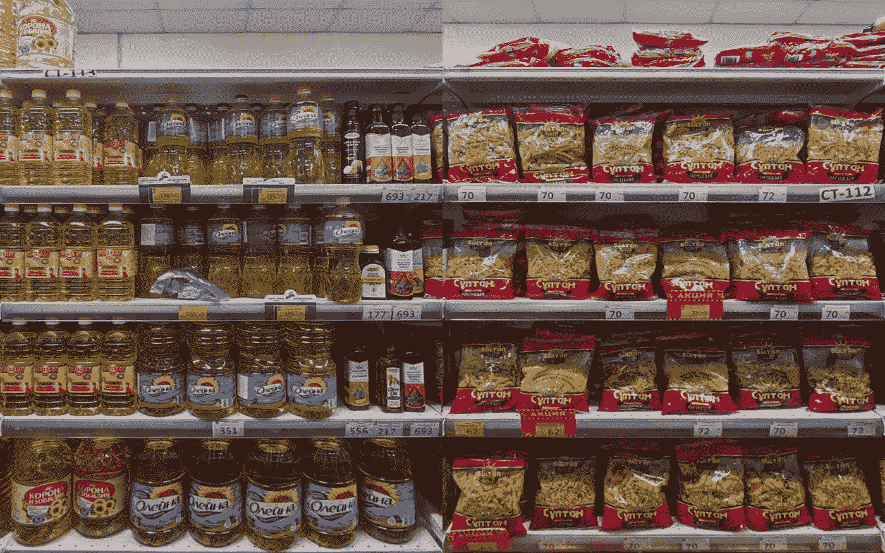

经典视差拼接问题。图片作者。

尺寸分析也有助于区分不同尺寸的相似物体。例如，如果您知道橱柜或周围物品的大小，您可以使用此信息来估计检测到的对象的大小。这可以通过逻辑而不是单独的网络来实现。

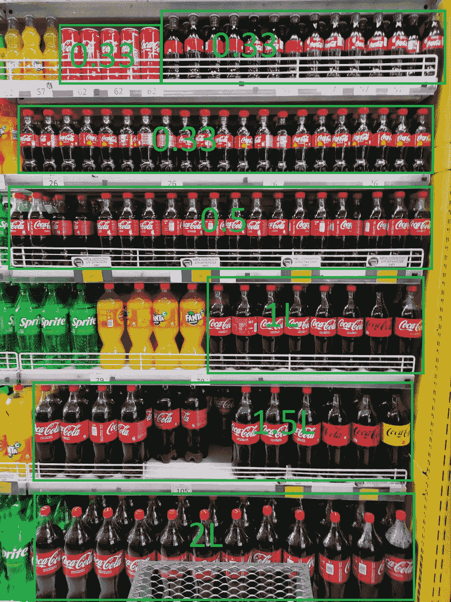

图片作者。

# 任务

先简单说一下算法是如何成为一个产品的。什么是产品？我知道几个任务:

布局控制。一名采购员走进商店。他必须确保货架上有 20 件产品 X 和 10 件产品 Y。或者他可能会混淆货物。要确保一切都是正确的:

*   售货员拍了一张照片。系统识别属于类别 X 和 y 的所有货物。评估必要的布局量
*   跟单将货物放在货架上。
*   做最后的分析:出现了多少新货。

这种方法使系统完全自动化。1-2 类确定商品的识别质量通常很高。但是具体的逻辑通常依赖于具体的边界条件:哪些数据是可用的，布局程序是如何安排的。

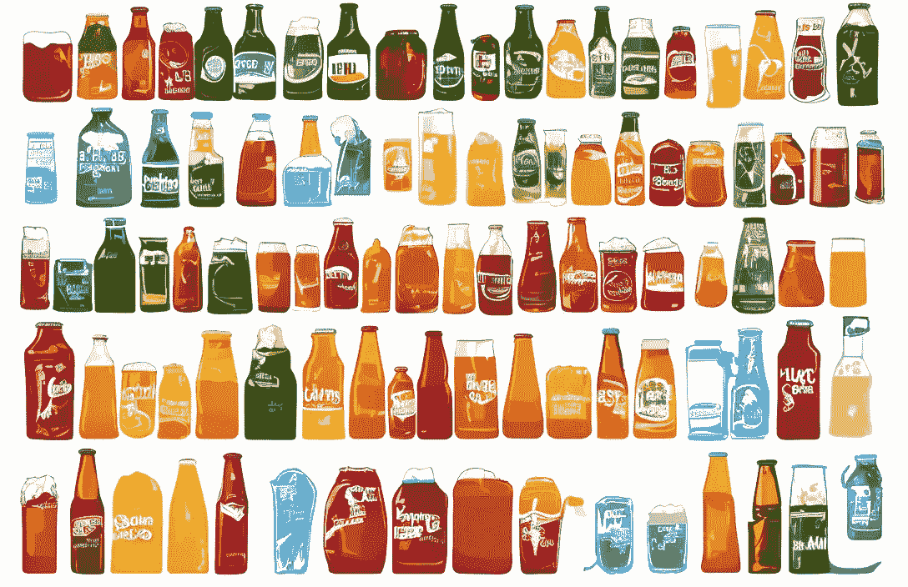

平面图。图片作者。

商品控制是一种用于分析产品和展示竞争对手质量的方法。在这种方法中，没有关于产品的先验知识，这可能导致难以准确识别货架上的大多数产品。这可能需要使用人在回路中的方法来提高准确性。

有时，不需要识别单个产品，而是识别产品、产品类别或品牌所占据的区域。这类似于“货物控制”方法，但可能允许组合类别(如不同大小和口味的可口可乐)。并不总是需要更高的精度，百分之几的误差可能并不重要。

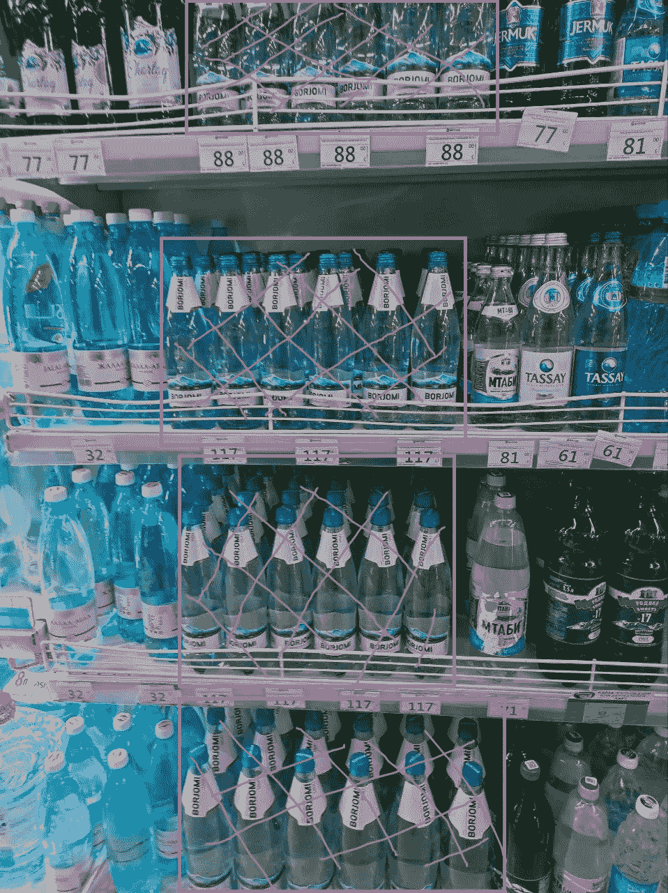

占领区。图片作者。

商店可以使用自动分类控制系统来监控高流通货架上产品的消失，并在新产品需要重新进货时向管理层发出信号。在这些情况下，可能没有必要识别特定的产品，因为缺少商品就足以触发补货过程。

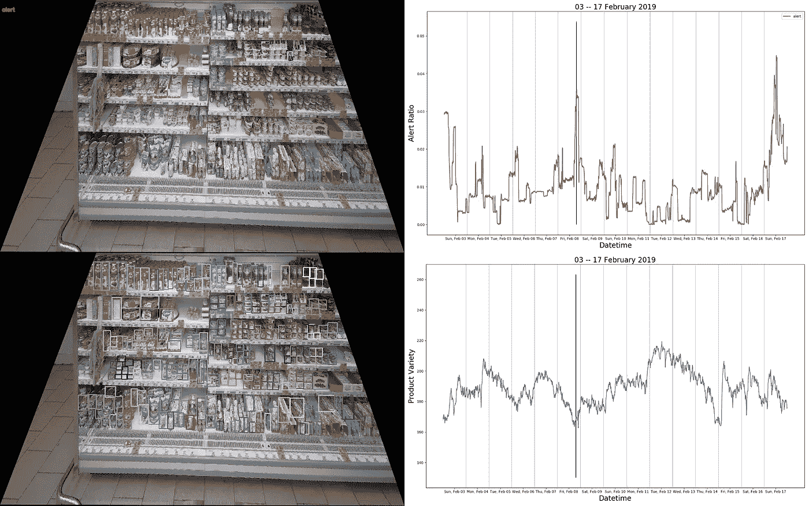

图片由阿图尔·库津在他的许可下拍摄

检查货架图。只有当系统可以访问这些货架图时，才可以检查货架图。奇怪的是，在许多商店中访问这些数据几乎是不可能的。货架图让识别变得非常容易。认识到你不需要 1:N，其中 N 是商店里的全部商品量，或者 1:1，或者 1:M，其中 M 是货架上的本地邻居。

也就是说，在通过货架图进行识别时，您需要掌握一些技巧:

*   您很可能需要识别您正在工作的货架(或者用户必须输入货架号)
*   如果货物在一个产品中以跳过货物/转移的方式摆放，通常这并不违反规定。这就是为什么为序列邻近性评估(本质上是具有文本邻近性的 NLP 任务)制定算法是必要的。

逐个解析产品包括从数据库中识别特定产品，这在自动收银机或智能推车中经常使用。这个过程可能需要跟踪摄像机视野内的货物移动，识别算法类似于上面讨论的算法。

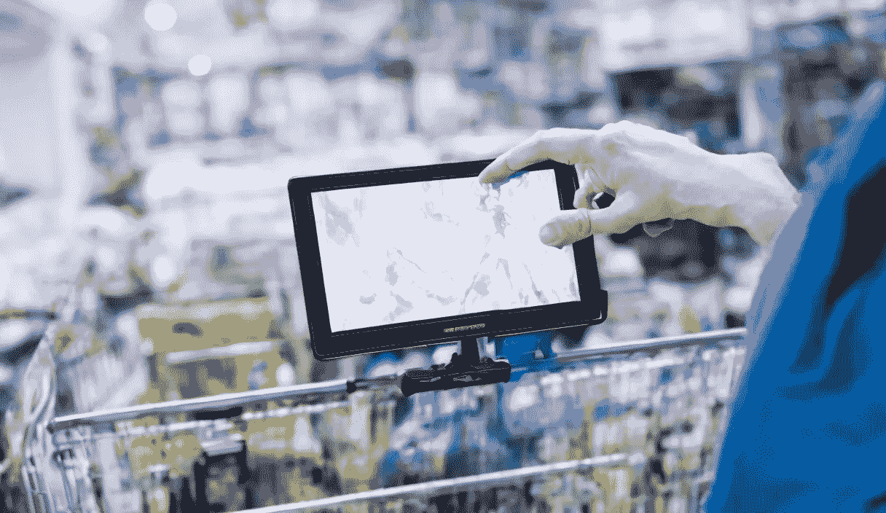

稳定扩散生成的图像

价格识别通常在与产品识别相同的模块中执行，甚至可能使用相同的神经网络。然而，用于识别价格标签的算法通常不同于用于识别产品的算法。关于这个主题的更多信息，你可能想读一篇关于[车牌识别](https://medium.com/@zlodeibaal/guide-for-license-plate-recognition-in-2022-e583dc5a7adb)的文章，它使用了类似的逻辑。

在没有收银员的商店里，产品识别只是整个系统的一部分。可能还需要计算安装在可见位置(如货架内部)的摄像机的产品数量。你可以观看[关于这个主题的视频](https://youtu.be/xTzvpqlKXvU)进行详细讨论。

机器人越来越多地被用于安排货架上的商品，这一过程涉及到商店地图、SLAM 算法和跟踪等具体挑战。虽然一些尝试已经解决了这些任务，但是还没有开发出通用的解决方案。我们的[机器人](http://rembrain.ai/)也许最终能够在未来应对这些挑战。但我们可能会在未来开始朝这个方向努力。

想象一下这个机器人把商品放到货架上。作者和他的朋友的视频。

# 后处理和数据库搜索

好的。现在我们有了检测流程和产品分类流程。接下来，就要基于它们做一个产品。为此，您通常需要考虑以下几点:

*   检测模块的错误
*   产品分类模块中的错误
*   捕获点的错误

在计算机视觉中，我们总是用算法错误(产品可能在灯泡上被检测到)来处理不完整的数据(产品不可区分)。解决方案必须始终是以下之一:

*   改变目标，使低于 100%的准确率对最终目标(区域、销售解决方案)有效。
*   使用更好的图像(特写镜头、智能结账)
*   引入人在回路中
*   添加一些先验数据(平面图、UWB 等。)这将提高工作质量并防止错误。

所有这些逻辑元素都可以改变后处理。但一般情况下，是数据库哈希搜索。这里有什么窍门可以帮助你:

*   明确规定相近的产品(如品牌)。并且基于不同品牌的接近程度，输出可靠性(例如，如果是 1.5/2 升的可口可乐，则为 50/50)。
*   在基底中使用一个以上的图像(例如，每侧使用几个示例)。如果例子太多，也会降低质量。
*   利用货架上相邻产品的知识。通常情况下，类似的产品是彼此靠近的。这可以优化质量。
*   如果你有室内超宽带导航——你可以只选择附近的商品。

# 硬件实现

这部分我不想深究，但还是忍不住要涉及一下。你在哪里识别的？在服务器、手机上，一块[单独的板子](https://medium.com/@zlodeibaal/choosing-computer-vision-board-in-2022-b27eb4ca7a7c)连接到本地摄像头上？

我的逻辑通常是这样的。电话识别不允许大量的检测网络。但是，如果商品陈列良好，人们仔细拍摄，现代 YOLO 的质量可能就足够了。减去手机上的识别——你需要在那里上传数据库。或者发送到服务器的最终散列(它否定了电话的意义)。另外，在电话里，你不能加入胡曼。

服务器端识别是基本的方法。90%的系统都是这样做的。这使您可以将额外的培训集成到系统中，提高识别质量，并监控生产质量。

在相机或个人设备上的识别是一种利基方法，取决于任务。例如，智能购物车或智能收银机。我很确定这是商业自动化的未来。但是如果要从生产中收集数据就不好了。

我希望你觉得有趣。关于更详细地描述什么主题有什么想法吗？

你可以在[ [LinkedIn](https://www.linkedin.com/in/maltsevanton/) 、 [YouTube](https://www.youtube.com/@AntonMaltsev/videos) 上连接。

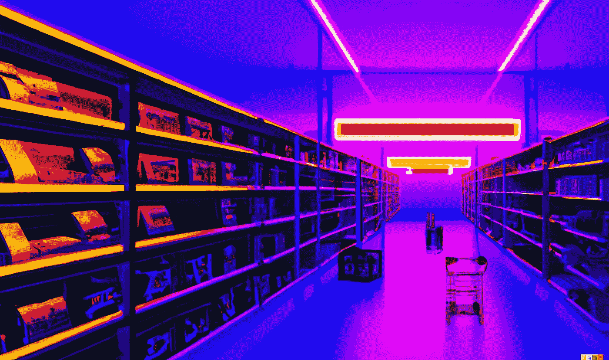

用 DALL-E 生成