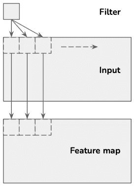

# 计算机视觉:如何建立你的 CNN 架构

> 原文：<https://betterprogramming.pub/computer-vision-how-to-set-up-your-cnn-architecture-229c014db7fb>

## 了解如何为您的下一个计算机视觉项目设计架构，并查看 PyTorch 中的示例代码


美国宇航局在 [Unsplash](https://unsplash.com?utm_source=medium&utm_medium=referral) 拍摄的[照片](https://unsplash.com/@nasa?utm_source=medium&utm_medium=referral)

在创建一个新的计算机视觉项目时，您必须做出许多决定，这些决定将最终影响您的模型的最终性能。您可以在不同类型的图层之间进行选择，例如卷积图层、池化图层、完全连接图层、softmax 图层和分离图层。此外，同一类型有多个层是很常见的。

此外，大多数不同类型的图层都可以自定义，通常需要设置输入和输出节点的数量，以及其他参数。本文将帮助您为不同类型的图层选择合适的数量，并设置合理的参数值。

# 卷积层

卷积层执行卷积，卷积是在输入图像上移动过滤器的操作，计算结果特征图中的值。



作者图

一个卷积层通常由多个滤波器组成，这将产生多个特征图。在 CNN 的训练期间，该模型将学习将什么权重应用于不同的特征图，并且因此能够识别要从输入图像中提取哪些特征。

通过增加 CNN 中卷积层的数量，该模型将能够检测图像中更复杂的特征。

然而，随着层数的增加，训练模型将花费更多的时间，并增加过度拟合的可能性。在设置一个相当简单的分类任务时，两个卷积层通常就足够了。然后如果结果精度太低，可以增加层数。

节点的适当数量也高度依赖于图像和手头任务的复杂性。通过改变节点的数量和评估结果的准确性，该模型可以运行多次，直到获得满意的结果。

在完成多个计算机视觉项目后，开发人员将能够更好地猜测某个特定类型的项目需要多少个节点，从而减少所需的迭代次数。

使用 PyTorch，卷积层通常在开发人员定义的 CNN 模型类的`__init__`函数中定义。将`torch.nn`作为`nn`输入，可以这样定义两个卷积层:

```
self.conv1 = nn.Conv2d(1, 10, 3)
self.conv2 = nn.Conv2d(10, 32, 3)
```

# 汇集层

池层是一个减少模型计算成本的层，通过减少其输入的维度来帮助防止过度拟合。有不同类型的池层:

*   **最大池:**选择矩阵中的最大值
*   **最小池:**选择矩阵中的最小值
*   **平均池:**选择矩阵中值的平均值

在池层中，滤镜应用于图像的不同区域。窗口大小和步幅将决定输出的大小以及滤波器如何在输入矩阵上移动。最常见的是选择窗口大小`(2, 2)`和步幅`2`。

对于应该多长时间应用一个池层，没有教科书上的答案，开发者将再次被鼓励迭代，直到达到一个可接受的答案。然而，众所周知的计算机视觉模型 VGG-16 在池层之间使用两到三个卷积层，而 VGG-19 使用多达四层。

使用 PyTorch，池层通常在开发人员定义的 CNN 模型类的`__init__`函数中定义。将`torch.nn`作为`nn`导入，可以这样定义一个池层:

```
self.pool = nn.MaxPool2d(2, 2)
```

# 全连接层

完全连接的层将其输入转换为所需的输出格式。在分类任务中，这通常包括将图像特征矩阵转换为 *1xC* 向量，其中 *C* 是类的数量。

对于在 CNN 模型中应该选择多少个完全连接的层，不一定有正确的答案。然而，对于大多数模型，从一个或两个完全连接的层开始就足够了，以后根据最终的性能调整数量。

使用 PyTorch，完全连接的层通常定义在开发人员定义的 CNN 模型类的`__init__`函数中。将`torch.nn`作为`nn`导入，可以像这样定义两个完全连接的层:

```
self.fc1 = nn.Linear(20*32*5*5, 120)
self.fc2 = nn.Linear(120, 60)
```

# Softmax 层

softmax 层通常在完全连接的层之后应用。这一层接受一个大小为 *1xC* 的向量作为输入，其中 *C* 是类的数量，所有的数字加起来是 1。

然后，softmax 层使用该向量并创建一个新向量，其中每个输入表示图像属于该特定类别的概率。因此，softmax 主要用于分类任务。

对于大多数计算机视觉项目，一个 softmax 层就足够了。

# 脱落层

丢弃层涉及在训练期间以概率 *p* 随机关闭节点。这种层特别有助于在非常复杂的模型中防止过度拟合。

脱落层可以方便地应用于全连接层和卷积层。

# 原则

适当的层数和节点数通常通过应用以下一组方法来找到:

*   **实验:**尝试不同的层数和节点数
*   **直觉:**利用以前的经验选择层数和节点数
*   **追求深度:**深度神经网络通常比浅层神经网络表现更好
*   **借鉴思路:**从描述类似项目的文章中借鉴思路
*   **搜索:**创建一个自动搜索来测试不同的架构

# 资源

【1】[Yash Upadhyay](https://medium.com/u/d2800f290ddf?source=post_page-----229c014db7fb--------------------------------)。*[计算机视觉:不同 CNN 架构及其应用研究*(2019 年 1 月)*](https://medium.com/alumnaiacademy/introduction-to-computer-vision-4fc2a2ba9dc)*。**

**杰森·布朗利。"[卷积层在深度学习神经网络中是如何工作的？"(2019 年 4 月)。](https://machinelearningmastery.com/convolutional-layers-for-deep-learning-neural-networks/)**

**[3]堆栈溢出。"如何决定用于图像分类的卷积神经网络的参数？"(2014 年 8 月)。**

**[4] [阿迪特·德什潘德](https://medium.com/u/d1cc5ee46383?source=post_page-----229c014db7fb--------------------------------)。"[理解卷积神经网络的初学者指南第二部分"(2016 年 7 月)。](https://adeshpande3.github.io/A-Beginner%27s-Guide-To-Understanding-Convolutional-Neural-Networks-Part-2/)**

**杰森·布朗利。[如何配置神经网络的层数和节点数(2018 年 7 月)。](https://machinelearningmastery.com/how-to-configure-the-number-of-layers-and-nodes-in-a-neural-network/)**