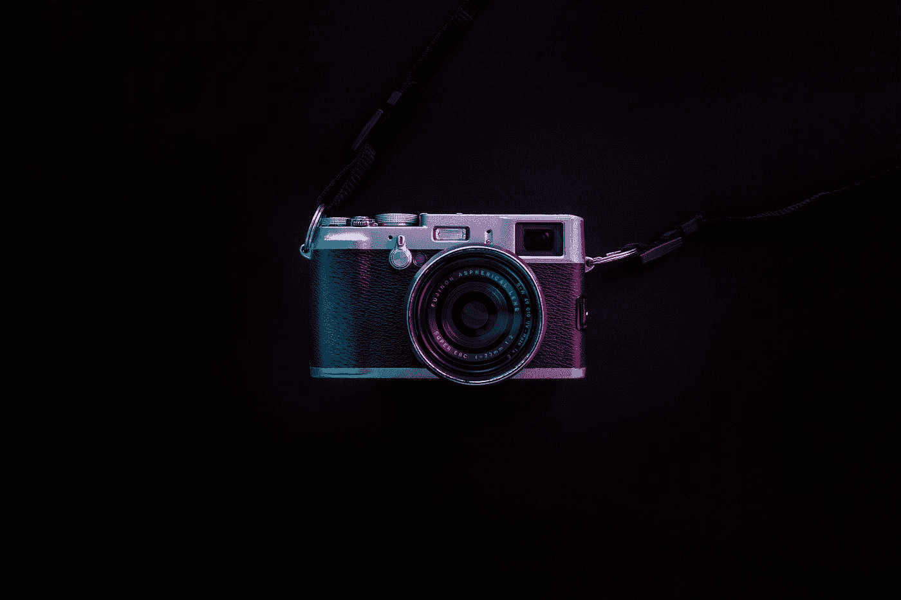
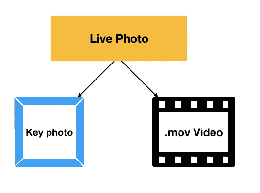
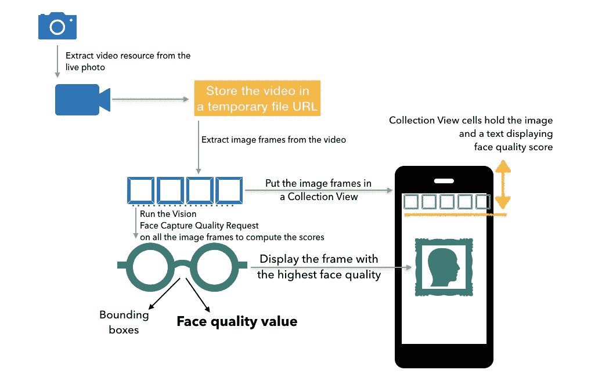
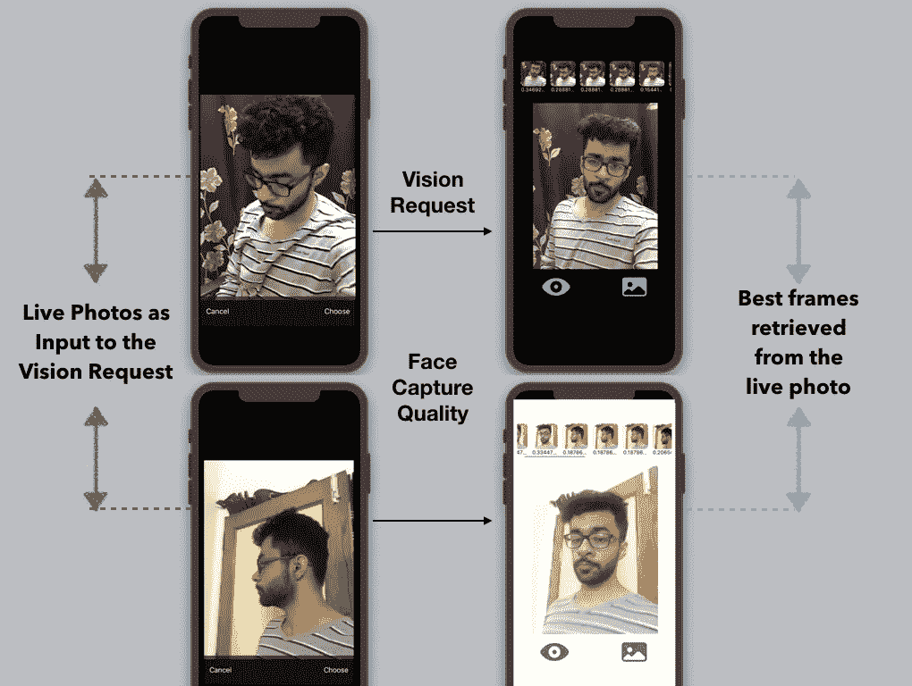

# iOS 中的计算机视觉:确定现场照片中的最佳面部表情

> 原文：<https://betterprogramming.pub/computer-vision-in-ios-determine-the-best-facial-expression-in-live-photos-452a2eaf6512>

## 视觉框架新的人脸捕捉质量要求的 iOS 实现



罗伯特·舒涅夫在 [Unsplash](https://unsplash.com?utm_source=medium&utm_medium=referral) 上的照片

在 WWDC 2019 期间，苹果公司为其愿景框架带来了许多令人兴奋的新发展。他们不仅改进了人脸跟踪和图像分类，还引入了有趣的新功能，如[显著性](https://medium.com/better-programming/cropping-areas-of-interest-using-vision-in-ios-e83b5e53440b)、[内置动物分类模型](https://medium.com/swlh/ios-vision-cat-vs-dog-image-classifier-in-5-minutes-f9fd6f264762)，以及用于处理核心 ML 分类模型的增强 API。在较新的版本中，在一组图像中比较面部捕捉质量的能力是今年最有前途的功能之一。

人脸捕捉质量的引入极大地推动了 Vision 的人脸技术。它展示了苹果公司在计算机视觉领域的投资，以使照片捕捉和处理比以往任何时候都更加智能和简单。

面部捕捉质量指标使用一个在各种图像(不同的曝光、光照、面部表情等)上训练过的模型。视觉请求分析一个镜头中的图像，并为其分配一个度量分数。分数取决于面部表情(消极的表情得分较低)、光线、焦点和图像的模糊程度。

使用这些度量分数，我们可以比较不同的图像，以找到面部看起来最好的图像。这是许多基于自拍的定制应用程序即将实现的功能。

面部捕捉质量不仅有助于构建更智能的基于摄像头的应用，如[文档](https://developer.apple.com/documentation/vision/selecting_a_selfie_based_on_capture_quality)中所示，而且还有助于将机器学习智能引入视频处理。本文的目标是通过在我们的 iOS 应用程序中利用面部捕捉质量，使实时照片(稍后将详细介绍)更加智能。

实时照片是 iPhone 6s 在 iOS 中引入的，是相机最受欢迎的模式之一。它通过提供实时运动效果，重新定义了我们看待静态图像的方式。

# 范围

这个想法是从有人脸的现场照片中找到最好的帧。我们将使用新的`VNDetectFaceCaptureQualityRequest`类来运行我们的视觉请求，处理大量故意在糟糕/模糊状态下捕捉的实时照片，以便从中提取最佳帧。

但是，您也可以将相同的代码和概念扩展到视频。现场照片本质上包含视频，我们接下来会看到。

# 现场照片:引擎盖下



实时照片由一幅图像和一个视频带组成，视频带包含在捕获图像期间执行的操作。这给人一种观看时身临其境的感觉。

在引擎盖下，现场照片由与视频资源资产文件配对的关键照片组成。我们可以通过在照片应用程序的预览编辑模式中选择任何视频帧来更改关键照片。

为了访问代码中的关键照片或视频，您需要使用保存资产资源的类`PHAssetResourceManager`。在接下来的几节中，我们将在我们的实现中使用它。

# 行动（或活动、袭击）计划

在我们深入研究实现之前，让我们规划一下蓝图。我们将在应用程序的不同阶段使用以下类和组件:

*   一个`ImagePickerController`，用于从相机或照片库中选择实时照片。
*   `PHAssetResource`检索视频资源并存储在临时的`FileManager`目录中。
*   使用`CollectionView`显示视频帧以及来自视觉请求的面部质量度量值。
*   最后，我们将在`UIImageView`中显示具有最高面部捕捉质量的帧。

下图从较高层面概述了实施的关联方式，从实时照片捕捉到视频提取，再到视觉人脸捕捉质量要求:



将这些点连接起来

现在我们已经制定了行动计划，让我们通过设置用户界面来启动实施。

# 设置用户界面

以下代码在我们的`ViewController.swift`文件中建立了按钮和图像视图:

如果上面的代码看起来很大，那是因为我没有使用故事板，而是以编程方式构建了 UI。

# 设置我们的图像拾取器

前面提到的一个按钮负责启动图像拾取器，而另一个按钮完成视觉请求，我们将在后面看到。

```
@objc func onButtonClick(sender: UIButton){let imagePicker = UIImagePickerController()imagePicker.sourceType = .photoLibraryimagePicker.mediaTypes = [kUTTypeImage, kUTTypeLivePhoto] as [String]imagePicker.delegate = selfpresent(imagePicker, animated: true, completion: nil)}
```

在上面的代码中，我们设置了`ImagePickerController`来访问照片库中的实时照片。为了使`ImagePicker`正常工作，请确保您已经在 info.plist 文件中添加了“照片使用”的隐私使用描述。

# 现场照片的视频提取和处理

现场照片属于`PHLivePhoto`类型。以下代码用于处理从图像拾取器中选择的实时照片:

在上面的代码中，我们通过检查返回的结果是否包含`info` 字典中的`PHLivePhoto`实例来过滤图像拾取器结果，以便返回实时照片图像。

在`processLivePhoto`函数中，我们将从现场照片中提取视频资源，保存在`FileManager`中的临时 URL 中，并从视频中提取图像帧。

`PHAssetResourceManager.default().writeData`负责将视频缓冲区写入 URL。一旦资源被写入`videoUrl`，由于属性观察器的作用，`imagesFromVideos`函数就会被触发:

```
var videoUrl : URL? {
        didSet{
            DispatchQueue.global(qos: .background).async {
                guard let videoURL = self.videoUrl else{ return }
                self.imagesFromVideo(url: videoURL)
            }
        }
}
```

# 从视频中提取帧

以下代码提取一定数量的帧(基于视频持续时间)并将它们放入一个数组中:

`generateCGImagesAsynchronously`负责在指定的`NSValue`(时间)内从视频中异步提取多个帧。

通过使用`asset.duration`和`numberOfFrames`，我们确定提取的每帧之间的时间间隔。目前，`numberOfFrames`被设置为 12 来限制我们将要执行的视觉请求的数量。对于不超过 3 秒的现场照片来说，这似乎很好，尽管如果你正在进行视频处理，你可以使用这个数字。

在上述代码片段的开头，我们定义了一些属性。`setCustomData`用来填充我们的`CollectionView`。为此，我们需要首先设置我们的`CollectionView`。

在我们开始构建我们的`CollectionView`之前，让我们先来看一下处于中间阶段的应用程序:


忽略昏昏欲睡的我。跳转到 CollectionView。

当然，在上面的屏幕记录中看到的水平集合视图还有待实现。

# 设置集合视图

在开始设置其他 UI 组件时，我们跳过了`setupCollectionView`函数。是时候实施了。

在上面的代码中，我们设置了一个水平集合视图，并在其上注册了一个`CustomCell`类，它保存了`UICollectionViewCell`的布局

## 集合视图单元格、数据源和委托方法

下面的代码通过添加一个`UIImageView`和一个`Label`来设置集合视图单元格。

`CustomData`类保存每个单元格的数据。这是我们`CollectionView`的数据来源。下面的代码定义了它:

```
public struct CustomData {var faceQualityValue: String = ""var frameImage: UIImage}
```

接下来，我们需要定义我们的`CollectionView`的委托方法:

现在，是处理视觉请求的时候了。

# 设置愿景请求

我们的视觉处理器将从`CollectionView`中获取每一幅图像，并对它们运行`VNDetectFaceCaptureQualityRequest`以获得`faceCaptureQuality`分数度量。我们将简单地在`UIImageView`中显示具有最高面部捕捉质量的图像。

当按下按钮(带有眼睛图标的按钮)触发选择器方法时，以下代码运行视觉请求:

我在几张现场自拍照片(故意模糊，姿势和表情怪异)上运行了上述视觉要求，以确定最佳帧。结果如下:



上述结果说明了视觉如何帮助自动确定从给定的一组图像(即视频帧)中捕获的最佳人脸。对于持续时间较短的视频，面部捕捉质量视觉要求非常快速和准确，就像我们对实时照片的要求一样。

# 结论

因此，我们讨论了 iOS 13 和 macOS 15 中 Vision 人脸技术的新变化(特别是人脸捕捉质量)，并从头创建了一个完整的 iOS 应用程序，在实时照片上使用这一新功能。完整的源代码可以在这个 [GitHub 资源库](https://github.com/anupamchugh/iowncode/tree/master/iOSVisionFaceQualityLivePhoto)中找到。

面部捕捉质量是一项令人兴奋的功能，有多种使用案例，从照片编辑到异常检测(找出视频/直播照片是否有人脸)。

只有时间才能证明苹果是否决定在其内置的实时照片功能中引入这一功能，以进行智能编辑。在此之前，您可以尝试在上述应用程序的基础上即兴创作，也许可以将最佳帧存储为现场照片的关键帧(显示在照片库中)。

这就结束了。我希望你喜欢阅读。