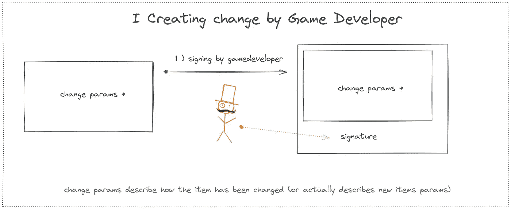
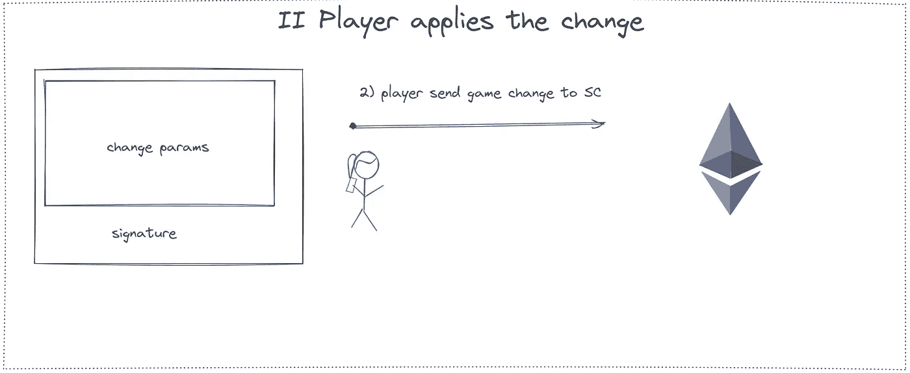
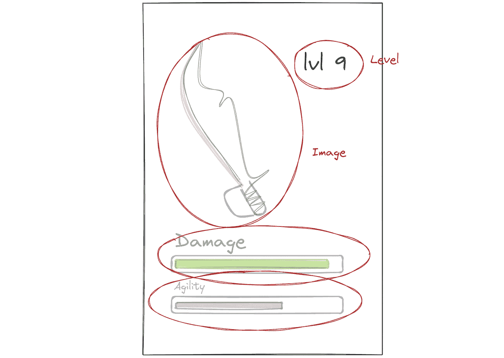

# 了解更改令牌链上属性的概念

> 原文：<https://betterprogramming.pub/concept-of-changing-tokens-on-chain-attributes-bd8d4ccdae3f>

## 通过插图解释


由[泰佐斯](https://unsplash.com/@tezos?utm_source=medium&utm_medium=referral)在 [Unsplash](https://unsplash.com?utm_source=medium&utm_medium=referral) 上拍摄的照片

一个快速的提醒——在这个系列中，玩家将会在游戏世界中使用游戏道具。用它们杀怪物在游戏世界(实时)和链上世界(以按需方式节省汽油)都给了它们更好的物品属性。让我们来讨论制定一个合理公平的机制，允许用户改变游戏战利品属性。关键规则应该是:

*   用户**不能**自己创造改变(否则他们将可以不公平地提高游戏道具参数，而不会在游戏中反映出来)
*   游戏所有者**不能**对用户的战利品进行任何改变

# 创建更改记录

因此，我们在这里看到的概念是这样的，游戏所有者基于玩家在游戏中的成就产生一个描述变化(哪些属性值应该增加)的文件，但是不能应用它(因为他们不拥有战利品，也不愿意为交易付费)。



# 应用变更记录

类似地，玩家可以*从游戏中下载*一个更改记录，并决定是否应用它，然而，玩家不能自己产生一个更改记录并应用该更改，因为智能合约将检查该更改是否合法——如果它来自游戏和智能合约所有者。



# 原子变化范围

从一开始，这个概念就是以描述所有参数变更的方式来设计变更——用户可以选择完全执行变更或完全拒绝变更。



概念变化记录

```
{ "attributes": { "Level" : NEWlevel, "Damage" : NEWdamage, "Agility": NEWagility }, "image": "ipfs://content-based-path-to-NEW-image", "signature": "some way of proving the change is legit" }
```

如果所有参数都存储在链上，上面的例子就可以了。但是唯一存储在链上的是 URI，所以没有必要把变化描述成那些参数。

变化只是分配了一个新的 URI，它本身存储了上面给出的所有参数。所以事实上，事实上的变更记录应该是:

```
{ "newURI" : "ipfs://new-uri-here", "signature" : some way of proving the change is legit }
```

# 使用 EIP-712 签署交易

已经声明玩家只能应用最初由 SC 所有者创建的更改，我们需要有可能让所有者创建更改记录并**签署它，以便稍后当玩家应用它时，它被识别为来自智能合同所有者/游戏开发者的有效更改。**

另外(或者作为第一个测试，它可以测试 tx 发送者是否是物品所有者)

有效变更的整个生命周期如下所示:


# 变更签名的手动界面

在现实生活中，游戏开发者不需要做任何事情。跟踪玩家进度的服务器应该签署更改并允许玩家应用它。

在我们的情况下，不会有自动机制。游戏开发人员将手动签署变更(他/她想什么时候签署都行)。它允许更好地理解变更签名如何与元掩码一起工作:)

要了解与签名和验证相关的一切，请查看我的[其他博客文章](https://rotynski.dev/signing-transactions-with-eip-712/)

*原载于*[*https://rotynski . dev*](https://rotynski.dev/plan-for-changing-tokens-on-chain-attributes/)