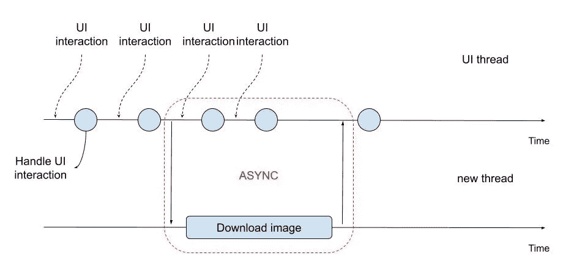
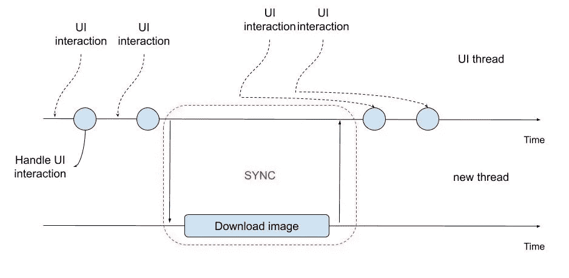
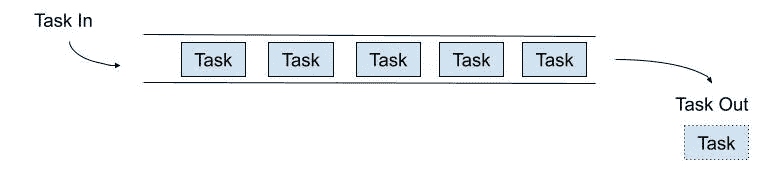
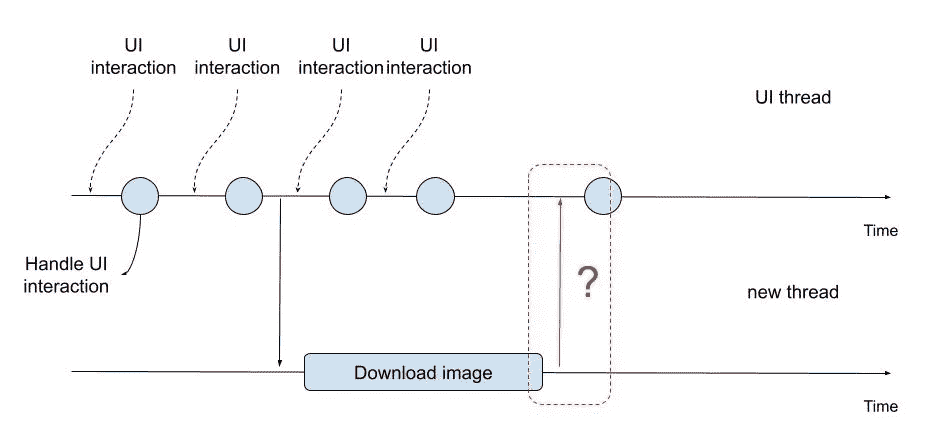
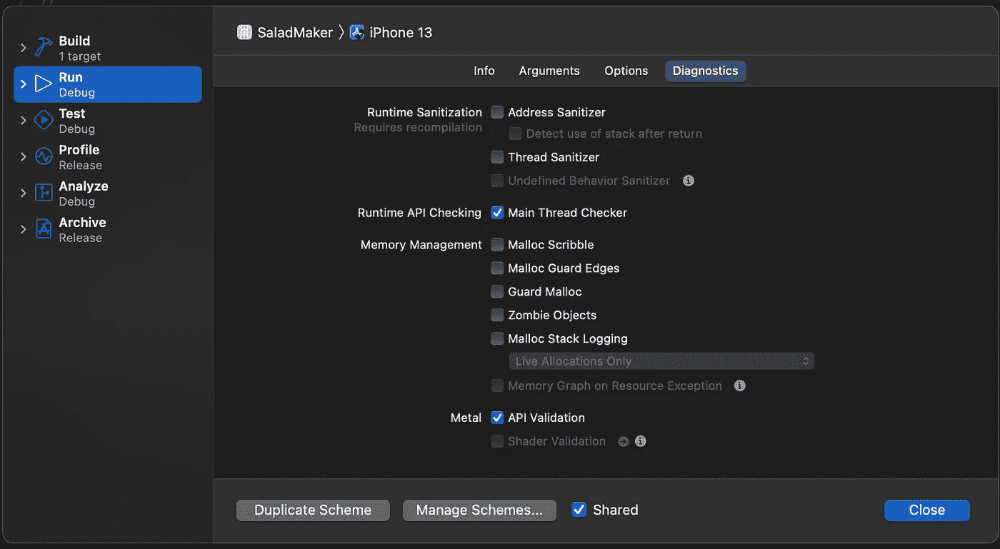
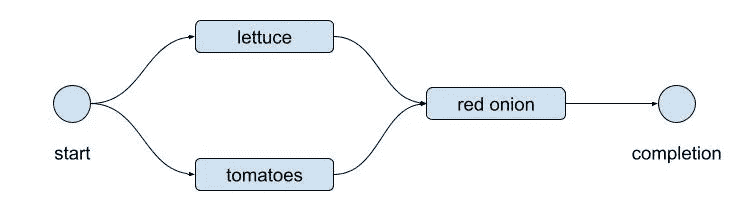

# iOS 和 Swift 并发性指南

> 原文：<https://betterprogramming.pub/concurrency-in-ios-and-swift-guide-50443ce5b0f5>

## DispatchQueue、Operation 和 OperationQueues 以及 Swift 并发性的比较


Jonathan Chng 在 [Unsplash](https://unsplash.com?utm_source=medium&utm_medium=referral) 上的照片

你的应用程序会因为用户界面时不时被冻结而遭受损失吗？你的应用程序会因为没有响应而被系统杀死吗？

出现上述情况的应用程序可能是由于您的应用程序在负责响应用户界面交互的同一线程中执行繁重和/或长时间的任务。

在这篇文章中，我将介绍如何解决这些问题。这个帖子不是教程。我已经涵盖了这里的大部分内容，我会在单独的帖子中引用教程。

# 你的应用为什么会死机？

假设你正在从一个网络服务器获取图像，这可能需要几秒钟的时间。当你的应用程序的进程等待接收图像时，它不会响应用户的交互。


在他们的点击被处理之前，用户可能会感觉应用程序“没有反应”几秒钟。

# 什么是进程和线程？

假设用户在主屏幕上。用户点击你的应用。这会告诉 iOS 启动您的应用程序。在这种情况下，iOS 将为你的应用程序创建一个新的**进程**，并用它创建一个**线程**。


流程是程序的一个实例——在本例中是您的应用程序。在 iOS 中，你只能运行一个应用实例。

其他操作系统可能允许运行一个应用程序的多个实例。对于每个进程或实例，操作系统将把你的程序从磁盘加载到内存中。


iOS 中的每个 app 进程都是用一个线程启动的。这就是所谓的主线程或 UI 线程。其他线程可以由您的应用程序或程序创建。线程共享相同的内存空间。

线程是一系列指令。你的程序向线程发送指令。这些被排队并执行先来先服务，或者更普遍地被称为先进先出(FIFO)。

# 如何解决冻结 app 问题？

冻结应用程序问题的解决方案是将繁重或长时间运行的任务卸载到新线程中。通过将任务卸载到一个新线程中，释放了 UI 线程，以继续响应用户与 UI 的交互。



委派任务并继续执行自己的任务，直到委派的任务返回结果，这种行为称为异步执行任务。在任务执行之前，我们不会等待阻塞。等待任务被执行，然后再继续我们自己的任务，这就是所谓的同步。



那么如何才能在 Swift 和 iOS 中的其他线程上执行代码呢？以下是 iOS 和 Swift 的原生可能性:

1.  中央车站调度
2.  操作和操作队列
3.  快速并发

GCD 在 iOS 中已经存在很久了。操作和操作队列建立在 GCD 之上，并简化了它的一些缺点，我们将在这一节中看到。

Swift 并发是最近推出的，它简化了并发任务的执行。你不需要知道 GCD 和，Operation 和 OperationQueues。但是，只有 iOS 13 或更高版本才支持 Swift 并发。还需要 Xcode 13.2 或更高版本。

请注意，这篇文章的目的是了解不同的选项并进行比较。

# 如何使用大中央调度

使用[大中央调度](https://developer.apple.com/documentation/DISPATCH)的主要方式是通过其 API 接口 [DispatchQueue](https://developer.apple.com/documentation/dispatch/dispatchqueue) 。一个[调度队列](https://developer.apple.com/documentation/dispatch/dispatchqueue)不是一个线程。它只是一个队列。任务被添加到队列中。然后 [GCD](https://developer.apple.com/documentation/DISPATCH) 将选择最老的任务，并首先执行它。

基本上是先来先服务的原则；技术上称为先进先出或 FIFO。线程在可用时由系统关联到队列。

有两种类型的队列:

1.  串行队列
2.  并发队列

对于在主/UI 线程上执行所有任务的用户界面交互，还有一个默认的调度队列。这个线程被称为[主队列](https://developer.apple.com/documentation/dispatch/dispatchqueue/1781006-main) ( `DispatchQueue.main`)，它在应用程序启动时提供。主队列类型是串行。

## 串行队列

串行队列是一个接一个地执行任务的队列，并且只有在前一个任务已经完成时才执行。

要创建串行队列，请执行以下操作:

```
**let** queue = DispatchQueue(label: "my_serial_queue")
```

默认情况下，当您创建队列时，它被配置为串行执行。



前一任务完成时执行的任务

## 并发队列

并发队列一个接一个地执行任务，而不等待前一个任务完成。这并不意味着所有任务都将一次性执行。任务的执行将基于系统资源或线程池中的可用线程。

要创建并发队列，请执行以下操作:

```
**let** queue = DispatchQueue(label: "my_concurrent_queue", attributes: .concurrent)
```


多个任务正在同时执行

## 如何在[调度队列](https://developer.apple.com/documentation/dispatch/dispatchqueue)上执行任务

为了推动任务在[分派队列](https://developer.apple.com/documentation/dispatch/dispatchqueue)上执行，我们需要在闭包中包含要执行的代码。

```
let taskToPerform = {
    // do something
}
```

`[DispatchQueues](https://developer.apple.com/documentation/dispatch/dispatchqueue)`允许我们执行任务[异步](https://developer.apple.com/documentation/dispatch/dispatchqueue/2016103-async)和[同步](https://developer.apple.com/documentation/dispatch/dispatchqueue/1452870-sync)。

如前所述, [async](https://developer.apple.com/documentation/dispatch/dispatchqueue/2016103-async) 或 asynchronous 会把要执行的任务放入队列，并继续执行下一段代码。

```
let taskToPerform = {
    print("2\. This will print second")
    // do something
}queue.**async**(execute: taskToPerform)print("1\. This will print first")
```

但是，`[sync](https://developer.apple.com/documentation/dispatch/dispatchqueue/1452870-sync)`或 synchronous 会将任务放入[队列](https://developer.apple.com/documentation/dispatch/dispatchqueue)中，等待任务执行完毕后再继续执行下一行代码。

```
let taskToPerform = {
    print("1\. This will print first")
    // do something
}queue.**sync**(execute: taskToPerform)print("2\. This will print second")
```

## 如何用在非主队列中执行的任务的结果更新 UI

所有 UI 更新都必须在主队列上执行。那么，如何从在另一个队列中工作的任务执行 UI 更新呢？



如何在 UI 线程上执行任务？

在非主队列中，您可以使用`DispatchQueue.main`调用主队列:

```
let taskToPerform = {
    // do something
    **DispatchQueue.main.async {**
        **// update UI**
    **}**
}mySerialQueue.async(execute: taskToPerform)
```

来自后台(非主)队列的任何 UI 更新都可能失败，并导致意外行为。Xcode 包含并启用了一个“主线程检查器”，它将检查来自后台线程的 UI 更新，并在调试时抛出异常。



运行时 API 检查“主线程检查器”选项已启用

## 如何按顺序执行多个异步任务

如果我们需要按顺序执行异步任务呢？假设我们要准备一份沙拉，需要按以下顺序执行:

1.  加入生菜
2.  加入西红柿
3.  加入红洋葱
4.  加入甜玉米
5.  加入金枪鱼和葵花籽油

对于 DispatchQueue，它看起来会像下面这样:

```
queue.async {
    // prepare lettuce
    queue.async {
        // prepare tomatoes
        queue.async {
            // prepare red onion
            queue.async {
                // prepare sweetcorn
                queue.async {
                    // prepare tuna
                    // completed salad!
                }
            }
        }
    }
}
```

以上`tomatoes`准备工作*依赖于`lettuce`的完成*。红洋葱依赖于番茄等的制作。

随着我们向沙拉中添加更多的配料，我们的代码会变得非常嵌套。这个问题也被称为“[末日金字塔](https://en.wikipedia.org/wiki/Pyramid_of_doom_(programming))”。代码很难遵循，因此也很难改变。

## 使用 DispatchGroup 并发执行任务并完成任务

如果我们想同时执行多个任务呢？如果我们想根据上一节准备沙拉，而不考虑准备的顺序，该怎么办？

我们可以在并发队列中异步准备所有配料:

```
concurrentQueue.async { /* prepare lettuce */ }
concurrentQueue.async { /* prepare tomatoes */ }
concurrentQueue.async { /* prepare red onion */ }
concurrentQueue.async { /* prepare sweetcorn */ }
concurrentQueue.async { /* prepare tuna */ }
```

然而，当所有的配料都准备好了，可以端上沙拉的时候，我们怎么才能得到通知呢？通过使用`[DispatchGroup](https://developer.apple.com/documentation/dispatch/dispatchgroup)`。

`[DispatchGroup](https://developer.apple.com/documentation/dispatch/dispatchgroup)`是`[Dispatch](https://developer.apple.com/documentation/DISPATCH)`框架中的一个工具，它允许我们在所有指定的任务都执行完毕时得到通知。以下是如何使用`[DispatchGroup](https://developer.apple.com/documentation/dispatch/dispatchgroup)`的示例:

```
**let** dispatchGroup = DispatchGroup()dispatchGroup.enter()
concurrentQueue.async {
    /* prepare lettuce */
    dispatchGroup.leave()
}dispatchGroup.enter()
concurrentQueue.async {
    /* prepare tomatoes */
    dispatchGroup.leave()
}... // enter and leave for each ingredientdispatchGroup.notify(queue: .main, execute: { /* serve salad bowl */ })
```

你可以在我的博客中了解更多关于`[DispatchGroup](https://developer.apple.com/documentation/dispatch/dispatchgroup)`的信息:

[](https://anuragajwani.medium.com/how-to-perform-parallel-asynchronous-operations-with-dispatchgroup-3c112deda62c) [## 如何使用 DispatchGroup 执行并行异步操作

### 了解如何将多个并行 URL 请求作为一个操作来触发

anuragajwani.medium.com](https://anuragajwani.medium.com/how-to-perform-parallel-asynchronous-operations-with-dispatchgroup-3c112deda62c) 

# 如何使用操作和操作队列

一个[操作](https://developer.apple.com/documentation/foundation/operation)仅仅是一个要执行的任务。[操作队列](https://developer.apple.com/documentation/foundation/operationqueue)类似于[分派队列](https://developer.apple.com/documentation/dispatch/dispatchqueue)。

```
**let** taskToPerform = BlockOperation {
    // do something
}
**let** operationQueue = OperationQueue()
operationQueue.addOperation(taskToPerform)
```

那么为什么拥有并使用 [OperationQueue 的](https://developer.apple.com/documentation/foundation/operationqueue)？他们有几个优势。但是，对于本文的范围，值得强调的是，它们允许管理要执行的任务之间的依赖关系:

```
let prepareLettuceTask = BlockOperation {
    // prepare lettuce
}
let prepareTomatoesTask = BlockOperation {
    // prepare tomatoes
}**prepareTomatoesTask.addDependency(prepareLettuceTask)**let operationQueue = OperationQueue()
let operationsToPerform = [prepareLettuceTask, prepareTomatoesTask]
operationQueue.addOperations(operationsToPerform, waitUntilFinished: false)
```

您也可以同时执行以下操作:

```
let prepareLettuceTask = BlockOperation {
    // prepare lettuce
}
let prepareTomatoesTask = BlockOperation {
    // prepare tomatoes
}let operationQueue = OperationQueue()
**operationQueue.maxConcurrentOperationCount = 2** let operationsToPerform = [prepareLettuceTask, prepareTomatoesTask]
operationQueue.addOperations(operationsToPerform, waitUntilFinished: false)
```

注意上面我们已经指定了并发操作的最大数量。如果未指定，它将使用默认值，该值将根据系统的可用资源而变化。另外，请注意，除了没有声明依赖关系之外，代码与前面的示例非常相似。

此外，编写和管理更复杂的操作也更容易。假设您想同时准备生菜和西红柿。但是，只有在这两个操作完成后，您才需要准备红洋葱:

```
let prepareLettuceTask = BlockOperation {
    // prepare lettuce
}
let prepareTomatoesTask = BlockOperation {
    // prepare tomatoes
}
let prepareRedOnionTask = BlockOperation {
    // prepare red onions
}**prepareRedOnionTask.addDependency(prepareLettuceTask)
prepareRedOnionTask.addDependency(prepareTomatoesTask)**let operationQueue = OperationQueue()
operationQueue.maxConcurrentOperationCount = 2
let operationsToPerform = [prepareLettuceTask, prepareTomatoesTask, prepareRedOnionTask]
operationQueue.addOperations(operationsToPerform, waitUntilFinished: false)
```

在上面的场景中，队列将并行或同时执行生菜和西红柿准备。一旦这两个操作完成，队列将执行红洋葱准备。



# 如何使用 Swift 并发

Swift 并发功能最近已经发布。这些功能从 Swift 5.5 开始提供，从 iOS 13 也可以使用。

Swift 并发特性旨在修复当前使用 [DispatchQueue 的](https://developer.apple.com/documentation/dispatch/dispatchqueue)和[操作](https://developer.apple.com/documentation/foundation/operation)和[操作 Queue 的](https://developer.apple.com/documentation/foundation/operationqueue)进行并发的多种问题。我们将通过例子揭示其中的一些。

让我们回到制作沙拉的例子。假设我们有一个带有 make 函数的`SaladMaker`类:

```
class SaladMaker {
    func make(onCompletion completionHandler: () -> Void) {
        ...
    }
}
```

假设我们需要按顺序做沙拉。下面是一个使用 [DispatchQueue 的](https://developer.apple.com/documentation/dispatch/dispatchqueue)的例子:

```
class SaladMaker {
    func make(onCompletion completionHandler: () -> Void) {
        queue.async {
            // prepare lettuce
            queue.async {
                // prepare tomatoes
                queue.async {
                    // prepare red onion
                    queue.async {
                        // prepare sweetcorn
                        queue.async {
                            // prepare tuna
                            **completionHandler()**
                        }
                    }
                }
            }
        }
    }
}
```

这里有两个主要问题值得强调:

1.  末日金字塔(嵌套闭包)
2.  你很容易忘记调用`completionHandler`而没有注意到

对于 Swift 并发，上面的代码将如下所示:

```
**struct** Salad {
    **func** addIngredient(_ ingredient: Ingredient) {
        ...
    }
}**class** SaladMaker {
    **func** make() **async** -> Salad {
        **let** salad = Salad()
        **let** lettuce = **await** **self**.prepareLettuce()
        salad.addIngredient(lettuce)
        **let** tomatoes = **await** **self**.prepareTomatoes()
        salad.addIngredient(tomatoes)
        **let** redOnion = **await** **self**.prepareRedOnion()
        salad.addIngredient(redOnion)
        **let** sweetcorn = **await** **self**.prepareSweetcorn()
        salad.addIngredient(sweetcorn)
        **let** tuna = **await** **self**.prepareTuna()
        salad.addIngredient(tuna)
        **return** salad
    } **private** **func** prepareLettuce() **async** -> Ingredient {
        ...
    } **private** **func** prepareTomatoes() **async** -> Ingredient {
        ...
    } **private** **func** prepareRedOnion() **async** -> Ingredient {
        ...
    } **private** **func** prepareSweetcorn() **async** -> Ingredient {
        ...
    } **private** **func** prepareTuna() **async** -> Ingredient {
        ...
    }
}
```

上面的代码看起来更接近我们的同步代码。可读性得到了提高。此外，Swift 编译器能够检查返回值。

Swift 并发不仅使异步代码的编码和调试变得更加容易，而且它也是从平台中抽象出来的。[调度队列的](https://developer.apple.com/documentation/dispatch/dispatchqueue)和[操作](https://developer.apple.com/documentation/foundation/operation)和[操作队列的](https://developer.apple.com/documentation/foundation/operationqueue)依赖于平台。因此，借助 [Swift Concurrency](https://docs.swift.org/swift-book/LanguageGuide/Concurrency.html) ，将您的 Swift 代码从一个平台移植到另一个平台(即 Linux)变得可能且更容易。

要通过教程了解更多关于 Swift Concurrency 的信息，您可以阅读我的博文:

[](https://anuragajwani.medium.com/introduction-to-concurrency-swift-with-async-and-await-1d3b03226585) [## 带异步和等待的并发 Swift 简介

### 了解如何使用 Swift 并发功能

anuragajwani.medium.com](https://anuragajwani.medium.com/introduction-to-concurrency-swift-with-async-and-await-1d3b03226585) 

# 最后的想法

iOS 和 Swift 中的并发性已经很多年没有出现大的变化了。

我欢迎 Swift 5.5 中新增的 [Swift 并发](https://docs.swift.org/swift-book/LanguageGuide/Concurrency.html)功能。快速并发无疑是必由之路。

然而，仅在 iOS 13 或更新版本上提供支持的警告使得这些功能对于我正在维护和工作的当前产品尚不可用。

我期待着有一天我可以在我从事的项目中实现这些功能！

```
**Want to Connect With the Author?**For more on iOS development follow me on [Twitter](https://twitter.com/anuragajwani?source=post_page---------------------------)
```