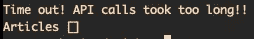
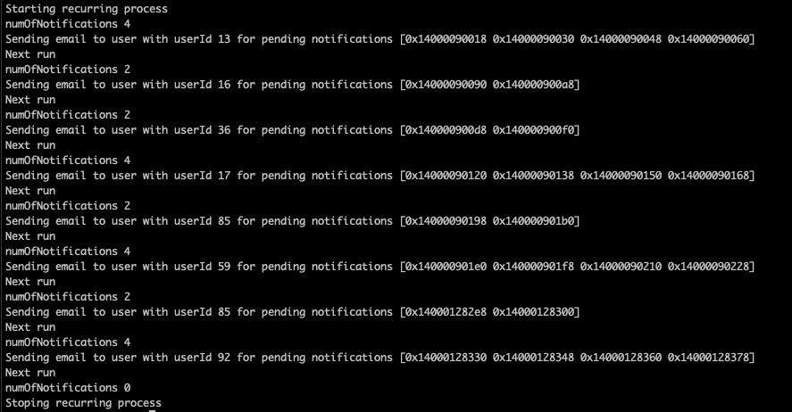

# 通过 Select、Goroutines 和 Channels 掌握 Go 中的并发性

> 原文：<https://betterprogramming.pub/concurrency-with-select-goroutines-and-channels-9786e0c6be3c>

## 编写并发代码


作者图片

在本文中，我们将讨论如何在 Golang 中结合 select、goroutines 和 channels 来构建并发程序。

我建议先阅读这两篇文章，熟悉并发性、通道和 goroutines 的概念。

*   [Golang、Goroutines 和 Channels 中的并发性解释](https://levelup.gitconnected.com/concurrency-in-golang-goroutines-and-channels-explained-55ddb5e1881)
*   [使用 GoLang 并发处理文件](/file-processing-using-concurrency-with-golang-9e08920fab63)

# 挑选

从 Go tour 文档中:

> “`select`语句让一个 goroutine 等待多个通信操作。
> 
> 一个`select`阻塞，直到它的一个案例可以运行，然后它执行那个案例。如果多个都准备好了，它会随机选择一个。"

## API 服务器响应

我们将研究如何使用`select`从最快的 API 调用中获取响应。让我们深入一些代码来理解`select`及其强大的特性。

上面的实现着重强调了 select 将如何等待，直到它的一个案例运行。

在这个例子中，理解不同的部分很重要，所以让我们一个一个地看。

在我们查看选择逻辑之前，让我们检查一下 API 调用是如何进行的。

`Function`结构代表一个单一的 API 调用，它的属性是一个函数`f`，它接受一个类型为`News`的通道，注意这个函数的签名是如何强制这个通道被当作一个`send-only`通道，第二个属性是一个类型为`News`的通道，一旦 API 调用被执行，响应被解析，这个通道将被用来发送结果。

结构是保存文章的对象，以及它们来自哪个源。

在第 43 行，我们初始化了一片`Function`，有两个元素，第一个有`googleNews`函数并使用`google`通道，第二个使用`freeNews`函数并使用`free`通道。

因为两个 API 调用都将获取新闻，所以通道是相同类型的，但是每个函数有一个通道。

在第 69 行和第 102 行，我们有这两个 API 的实现。每个都向各自的 URL 发出 HTTP 请求并解析响应，一旦完成，新闻就通过各自的通道发送出去。

现在让我们来关注一下`quickestApiResponse`方法。该方法的目的是将文章变量设置为最快的 API 的响应。在第 54 行，通过调用`Run`方法来执行每个函数。此方法在函数上启动一个新的 goroutine，并传递通道。需要注意的是，这些 API 调用需要在单独的 goroutine 中运行，因为我们不想顺序运行它们。

然后，选择将等待`google`或`free`通道发送响应。一旦任何 API 调用通过各自的通道发送响应，select 将执行该情况下的代码并忽略另一个。这将有效地将文章设置为来自最快 API 调用的响应。

让我们运行程序来查看输出:


API 服务器响应输出

那辆`FreeNewsApi`跑得更快了！。

这个逻辑可以应用于许多其他用例，允许程序运行多个 goroutines，使用通道进行通信，并使用 select 来等待它们。

在这个例子中我们可以实现的另一件事是强制某种超时，如果 API 调用超过了限制，我们就让文章为空。下面的代码通过向选择中添加一个案例来实现这一点。

`time.After`返回一个`time.Time`类型的通道，一旦指定的时间过去，它将发送当前时间。请注意，这里我们没有将该通道的值赋给变量，这是因为我们不关心通道将发送的数据，我们只关心信号的接收。如果我们在两个 API 上都休眠三秒钟，我们将看到超时的情况被执行，而其他两个情况被忽略。



API 服务器响应超时

## 超时的上下文

上下文几乎总是出现在程序中，我们可以使用上下文对象为特定的高开销任务设置超时。下面的例子展示了如何使用`context.WithTimeout`来限制程序等待一个昂贵任务响应的时间。

上面的例子使用`context.Background()`作为父上下文，但是在更真实的设置中，上下文已经存在了。超时上下文返回一个上下文，当指定的持续时间过去时，该上下文将通过`ctx.Done`通道发送一个信号。

在第 13 行，一个昂贵的任务在一个单独的 goroutine 中运行，上下文和信号通道作为参数传递。昂贵的任务休眠 6 秒来模拟延迟，但是上下文超时 5 秒。

select 有两种情况，要么等待`ctx.Done`运行，要么等待昂贵的任务发送一个指示它已经完成的信号。

在这种情况下，运行此示例将产生以下输出:

```
Expensive task took too long to complete
```

## 运行循环流程

让我们看看如何使用`select`来运行一个循环流程。对于该计划，我们将有以下场景:

该程序需要让我们通过任何函数作为循环过程，当该过程应该开始运行时，以及每次运行之间的间隔时间。

下面我们有了初始代码，让我们来看看:

上面的代码反映了我们想要运行的任务。我们有两个主要功能`collectNewUsersNotifications`和`handlePendingUsersNotifications`。第一个是为了收集所有新用户通知，理想的实现是这个函数在数据库中寻找未读通知，但是为了这个例子，我们模拟为某些用户获取随机通知。

通知是使用只有两个字段的`Notification`结构创建的，一个用于内容，一个用于用户 id。

collect 函数使用`PendingUserNotifications`类型来存储通知。这个类型是一个映射，其中键是一个表示用户 id 的整数，值是一个片`Notification`。

在我们收集了所有的通知之后，我们希望使用`handlePendingUserNotifications`函数来遍历通知，并对每个通知运行一个处理函数。在我们处理每个用户的通知后，它们将从地图中删除。我们将在这种情况下使用的处理程序是`sendUserBatchNotificationsEmail`。它的目的是向用户发送一封包含所有待定通知的电子邮件，以便他们可以查看。

现在让我们关注如何使用`select`以循环方式运行这个任务。正如我之前提到的，我们必须考虑以下几点:

*   允许通过一个间隔时间
*   允许传递流程的开始时间
*   允许呼叫者在需要时取消/停止循环过程

以下代码显示了如何实现这一点:

我们引入了一个新的结构来表示一个循环过程`RecurringProcess`。此结构包含以下字段:

*   `name` —流程的名称
*   `interval` —每次运行之间的间隔时间
*   `startTime` —流程开始的时间
*   `handler` —每次运行时调用的处理函数
*   `stop` —停止进程的通道

在`pendingNotificationsProcess`函数中，我们分别在第 30 行和第 31 行初始化一个新的循环流程和通知。我们将使用的处理函数是一个内部同时具有`collectNewUsersNotifications`和`handlePendingUsersNotifications`函数的函数。注意这里我们将流程传递给了`handlePendingUsersNotifications`,因为需要它来停止流程。

我们还指定了间隔和开始时间。

然后我们调用`createRecurringProcess`，这个函数创建循环流程并启动它。让我们关注第 88 行，这里我们使用一个 goroutine 来启动这个过程。

在第 40 行中，我们通过从 stop 通道读取来阻塞主 goroutine，这意味着主 goroutine 将被阻塞，直到有消息被发送到该通道。

让我们看看第 93 行的`Start`函数，它包含了运行循环过程的所有逻辑。

该功能使用`startTicker`变量，通过开始时间启动循环过程。如果开始时间已经过去，该过程将立即开始。

当指定的持续时间过去后,`time.NewTimer`将在其通道上发送当前时间，这将允许我们开始该过程。这就是为什么第一种情况是选择等待通道接收信号。

我们在第 95 行还有一个`ticker`变量，它是一个`time.Ticker`。go 中的收报机将在指定的时间间隔在通道上发送滴答。一旦`startTicker.C`通道发送了信号，我们在第 106 行给`ticker`变量分配一个带有间隔的新跑马灯，并且调用处理函数。

在此之后，`ticker`将在第二个选择案例上开始接收滴答，并且每次它接收一个滴答时，也会调用处理函数。

在 select 的最后一种情况下，我们通过返回来等待，直到发出停止进程的信号。

注意`select`是如何在无限`for`循环中的。这是因为我们希望一直循环下去，直到其中一个案例显式地中断循环。每次我们收到一个 tick，第二个 case 将被执行，然后它将再次进入同一个循环，select 将再次等待它的一些 case 运行。

为了停止这个过程，我们在第 55 行添加了一些逻辑，我们计算通知的数量，如果在任何时候都没有未决的通知，程序就会取消这个过程。`Cancel`功能关闭停止通道，程序结束。

让我们运行这个程序，看看它是如何工作的:



程序输出

太好了，程序按预期运行。这只是如何运行循环流程的一个示例。这可以是实现更复杂的东西的基础代码。你可以用`select`构建复杂的程序。

## 结论

构建并发程序在开始时可能具有挑战性，尤其是当您努力理解 goroutines、channels 和 select 是如何工作的时候。

我希望通过这篇文章，您不会感到困惑，并且您已经找到了一些可以使用`select`的用例。

*感谢您的阅读，敬请期待更多内容。*