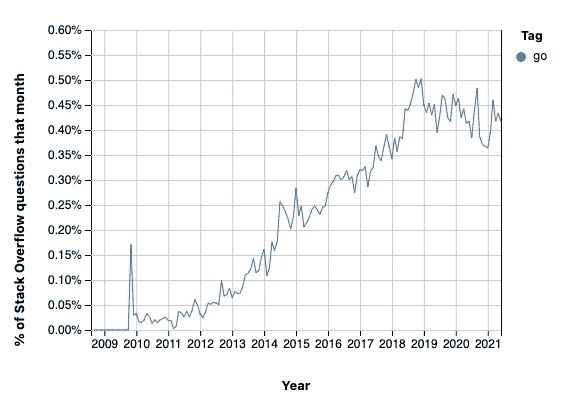
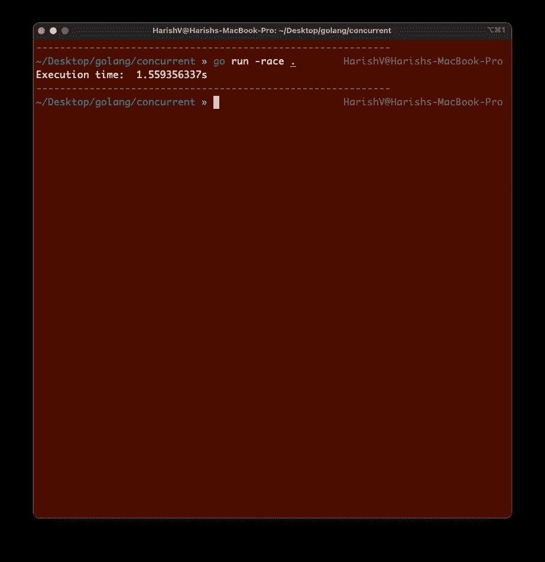

# Go 中的并发 API 调用和竞争条件

> 原文：<https://betterprogramming.pub/concurrent-api-calls-and-race-conditions-in-go-d59e0fe023d1>

## 使用 Goroutines 进行并发编程的快速示例

照片由 [Austris Augusts](https://unsplash.com/@austris_a?utm_source=medium&utm_medium=referral) 在 [Unsplash](https://unsplash.com?utm_source=medium&utm_medium=referral) 上拍摄

Golang(或 Go)于 2009 年首次发布，至今已有一段时间。

随着时间的推移，它变得越来越流行。至少这是我从栈溢出趋势中看到的，这是一个很好的衡量我们的开发者社区对技术/库/框架等的参与程度的方法。

Go 由 Google 开发，旨在帮助并发编程变得更容易、更安全、更高效。[文档](https://medium.com/u/907a2ba198a8#Map)中所述:

> " Map 类似于 Go map[interface{}]interface{}，但对于多个 goroutines 的并发使用是安全的，无需额外的锁定或协调。加载、存储和删除在分摊的常数时间内运行。

让我们更新我们的函数来使用它。

现在，用`go run -race .`再次运行我们的程序，我们看不到任何错误。

**注意:**为了清楚起见，我把函数中的`fmt.Printf`语句注释掉了。

# 完整的代码

这是我们迄今为止编写的所有三个主要函数的完整代码:

# 结论

是的，在 Go 程序中利用并发性就是这么简单！而且结果不言自明，尤其是当我们在处理大量的异步操作比如网络调用的时候。

考虑使用 Go 惊人、简单、高效的 Goroutines 来实现你的目标。同时，要注意比赛条件。使用 Go 内置的比赛检测工具来检查你的代码。

如果你准备开始用 Go 创建自己的 API，[伊恩·邓肯](https://medium.com/u/6ae6d826295c?source=post_page-----d59e0fe023d1--------------------------------)有一个很棒的教程[在这里](https://medium.com/the-andela-way/build-a-restful-json-api-with-golang-85a83420c9da)你可以在那里构建一个 RESTful JSON API。

那都是乡亲；编码快乐！