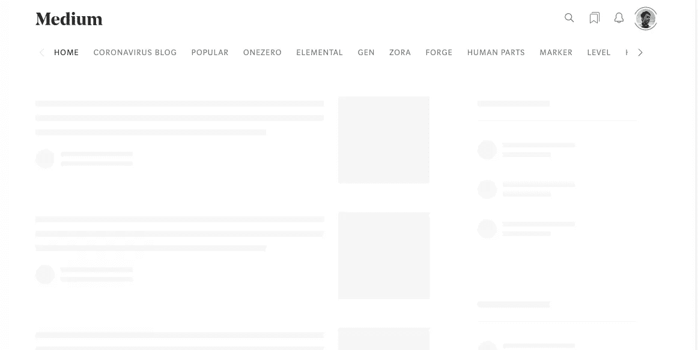
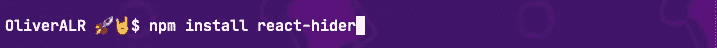
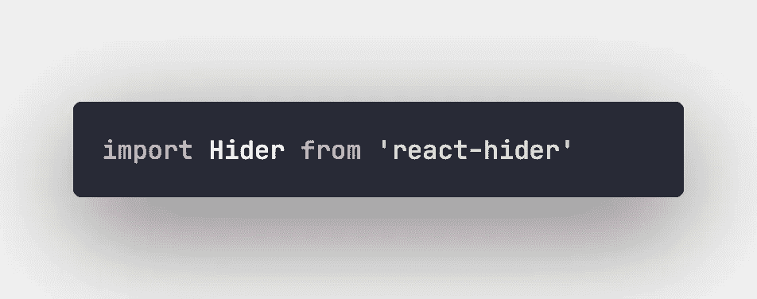
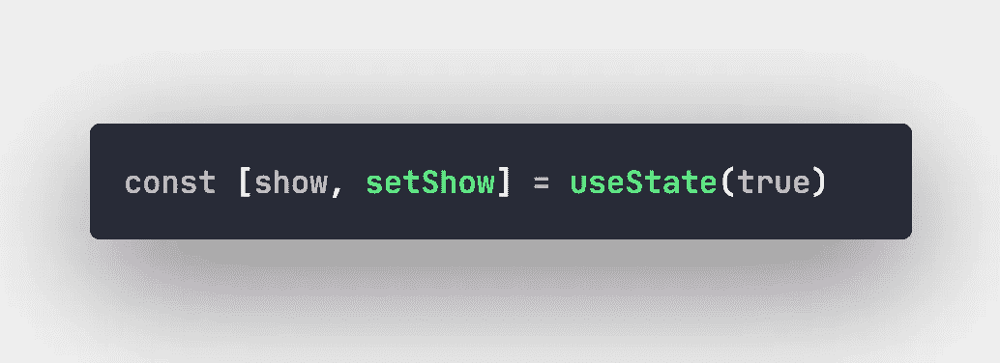
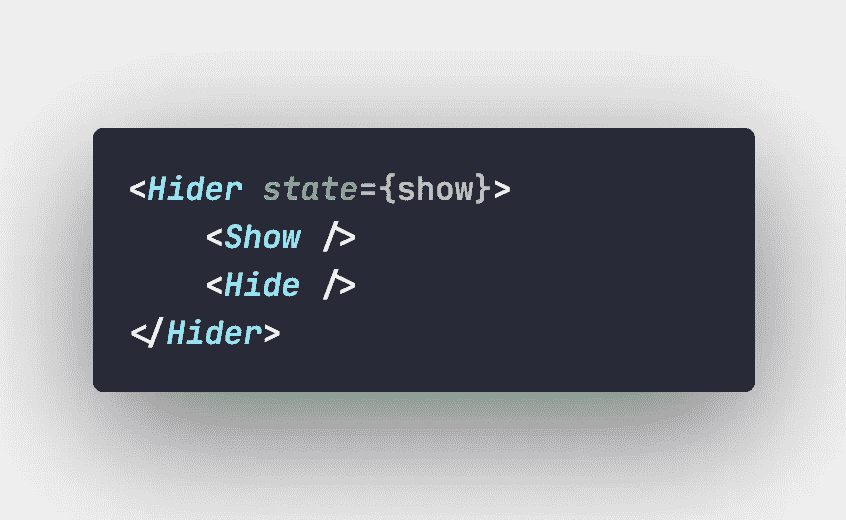

# 使用 React Hider 的条件渲染

> 原文：<https://betterprogramming.pub/conditional-rendering-with-react-hider-b2b7d101f42e>

## 基于条件渲染基础的极简主义库

Artur Rutkowski 在 [Unsplash](https://unsplash.com?utm_source=medium&utm_medium=referral) 上拍摄的照片。

> “在 React 中，您可以创建不同的组件来封装您需要的行为。然后，根据应用程序的状态，您可以只呈现其中的一部分。— [React 的官方文档](https://reactjs.org/docs/conditional-rendering.html)

# **什么是条件渲染？**

使用 React 时，有时需要显示或隐藏组件的内容。比如你加载 Medium，Twitter，或者 Airbnb 这样的网站，看到的是骨架而不是内容。或者，您可能已经在加载组件之前看过加载器动画。这是因为网站需要加载、获取或请求任何资源，同时它会向您显示表示加载状态的框架或动画。

显示内容加载前的框架的媒体。

这是最常见的例子，但当您需要隐藏或显示在任何事件或副作用后需要解锁的内容时，条件呈现真的很有帮助。如果您需要在任何组件完成其获取/请求过程之前显示加载程序，或者您希望在不重新呈现整个窗口或修改复杂状态的情况下提取视图内的元素，条件呈现也很有帮助。

# 好吧，但是我的代码现在看起来又奇怪又冗长

当您在组件内部实现这个特性时，您会发现实现它的不同方法。第一种方法是使用`if` / `else`语句，使用一个布尔值来决定应该渲染什么或者不渲染什么，但有时这并不是一个真正好的解决方案，因为条件语句可能会重新渲染整个组件。如果这与生命周期方法有关，您会发现这种实现不是很有益。

另一个问题是，即使你不把你的 UI 元素包装在一个单独的组件中，由于使用了花括号、条件的`&&`操作符，甚至内联的`if` / `else`语句语法(条件的三元操作符)，这也会产生可读性较差的组件。

这就是我创造 [React Hider](https://github.com/OliverALR/react-hider) 的原因。

# **一言以蔽之反应迟钝**

React Hider 是一个极简主义的库，可以用来使条件渲染更简单，代码更干净。由于只有一个组件为您进行条件呈现，它提高了生产率，节省了阅读或创建代码的时间。

入门相当简单。只需通过 NPM 安装库:

将`Hider`导入到您想要的任何预配置的 React 项目中:

使用该组件也很简单。首先，根据组件的需求设置初始布尔状态:

现在是时候使用`Hider`组件来包装您需要显示/隐藏的组件了。第一个需要是显示的组件，第二个需要是隐藏的组件。之后，只需将之前声明的实际布尔状态提供给`Hider`内部的 state prop:

我需要说明的是，这个库能够显示/隐藏单个子组件，因为 Hider 也是基于 React 的条件操作符`&&`的。你只需要担心哪些元素需要渲染，哪些不需要渲染。

# 你完了！

这就是在任何未来项目中使用 React Hider 所需要知道的一切。

感谢阅读。请随意投稿。