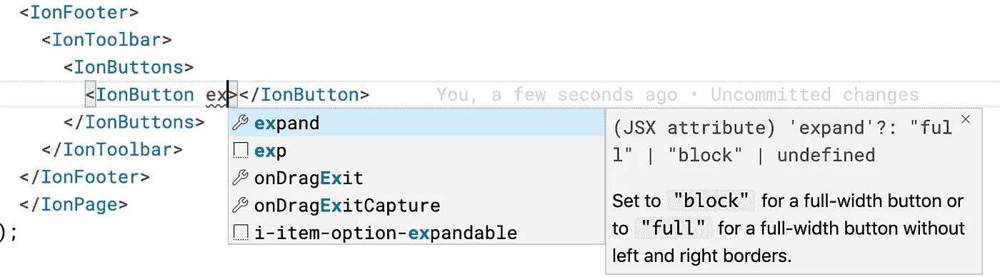

# 一个不情愿的离子反应迷的自白

> 原文：<https://betterprogramming.pub/confessions-of-a-reluctant-ionic-react-fan-9a3d16e61a11>

## 被一个有角度的显影器


照片由[阿萨瓦·图尔西](https://unsplash.com/@atharva_tulsi?utm_source=medium&utm_medium=referral)在 [Unsplash](https://unsplash.com?utm_source=medium&utm_medium=referral) 上拍摄

当一个致力于 Angular 的开发人员在开发 Ionic 应用程序的同时进行 React 实验时，会发生什么情况？它会有好的结果，还是会导致灾难？

碰巧的是，我在新年假期做了同样的事情。我被要求想出一些样本问题来测试某人对离子的知识。“有棱角还是有反应？”我问。“两个都怎么样？”这是回答。

因此，我开始创造一些离子问题，基于我所面临的一些真实的问题，创造角度和反应的例子。这意味着至少要学习一些离子反应。这篇文章总结了一些令我惊喜的事情。

# 背景

首先，一点背景。熟悉我或我的作品的人都知道我是 Ionic 框架的超级粉丝。我在 Ionic 0.5 版本的时候就发现了它，当时我想用 Cordova 开发一个移动应用程序，但也使用 AngularJS。随着 Ionic 版本 2 进入青春期，它从 JavaScript 和 AngularJS 发展到 Angular 2 和 TypeScript。在版本 3 中，这种成熟一直延续到年轻的成年期，但是随着成年期的临近，大事情正在逼近。

# 框架不可知

Ionic 版本 4 正式引入了完全重写的组件。它们被实现为与框架无关的 web 组件，并用 Ionic 自己新创建的 Stencil 编译器编写。

Stencil 没有涉及太多的细节，它使得 Ionic 能够以一种允许重用的方式创建他们的整个组件库，而不用考虑 Ionic 开发者选择的框架。事实上，从版本 4 开始，Ionic 组件可以在没有框架的情况下使用！这是一个巨大的里程碑，并最终导致了 Ionic-React 库的创建(不久，还有 Ionic-Vue 库)。

# 实验

我决定创建两个全新的 Ionic 项目，这样我就可以确保我的问题有实际可行的答案。

# 这些项目

我基于 Ionic sidemenu 模板创建了两个相同的项目，一个使用 Ionic-Angular，另一个使用 Ionic-React，使用以下命令:

```
ionic start "SampleAngularApp" sidemenu --type=angularionic start "SampleReactApp" sidemenu --type=react
```

# 添加“帮助”页面

接下来，我想要一个空白页，可以用来快速放置组件。“很简单，”我想。我只需要在每个项目中运行`ionic generate`并创建一个“帮助”页面。

# 离子角度

在 Ionic-Angular 项目的目录中，我运行了以下命令:

```
ionic generate page helpCREATE src/app/help/help-routing.module.ts (339 bytes)
CREATE src/app/help/help.module.ts (458 bytes)
CREATE src/app/help/help.page.scss (0 bytes)
CREATE src/app/help/help.page.html (123 bytes)
CREATE src/app/help/help.page.spec.ts (633 bytes)
CREATE src/app/help/help.page.ts (248 bytes)
UPDATE src/app/app-routing.module.ts (1954 bytes)
```

那比我需要的多，但也够了。

# 离子反应

接下来，我从 Ionic-React 项目目录中运行相同的命令:

```
ionic generate page help[ERROR] Cannot perform generate for React projects.

Since you're using the React project type, this command won't work. The
Ionic CLI doesn't know how to generate framework components for React
projects.
```

很不幸。

我知道 Ionic CLI 在幕后将其大部分工作委托给 Angular CLI，但我认为它会对 React 提供一些脚手架支持。事实并非如此。在接下来的一个小时里，我花了大部分时间试图找出使用哪个 React CLI 命令来搭建一个新页面，却发现它并不存在。事实上，似乎没有标准的方法可以做到这一点。我的角度得意水平增加了一点。

那时，知道我只需要一个空白页，我复制了一份主页文件，并把它的内容删掉了。我花了一点时间才弄明白如何把它变成一个我可以导航的“页面”，但我最终让它工作了。

页面是单个的事实。tsx 文件，而不是一个 4-6 个文件的文件夹，我没有丢失。我欣赏这种简单性，尽管我应该注意到它似乎没有包括任何路由信息、单元测试或模块定义。除了单元测试，我不怀念那种复杂程度。

# 智能感知！

我选择添加的第一个东西是一个简单的按钮。我想在页脚创建一个块宽按钮，上面写着“点击我”。由于更熟悉 Ionic-Angular，我首先在那里实现了它。

```
<ion-footer>
  <ion-toolbar>
    <ion-button expand="block" size="large" color="dark">
      Click Me!
    </ion-button>
  </ion-toolbar>
</ion-footer>
```

然而，打开我的 Ionic-React 页面，我遇到了一个小小的绊脚石。没有一个标签名称是相同的。当我简单地将上面的代码复制并粘贴到我的 React 页面时，它并不喜欢。

就在那时，我注意到 React 页面中现有的 HTML 组件类似于 Angular 组件，但似乎都是 PascalCase(有时被误称为 CamelCase)而不是 kebob-case。这让我猜测我有正确的组件，但错误的外壳。

所以我在结束的`</IonContent>`标签后面添加了一个新行。我通过键入`<IonFo`开始创建一个页脚，代码编辑器提出为我完成标签`<IonFooter></IonFooter>`！这是什么巫毒妖术？我的 Ionic 页面的标记中的智能感知(代码完成)？除了一些 Ionic 特有的代码片段，这对我来说是全新的*。

几秒钟后，当我启动`<IonButton>`组件时，我的下一个惊喜出现了。IDE 不仅为我提供了开始和结束标记，想象一下当我收到一个包含所有标记属性及其文档的下拉列表时，我有多高兴。



哇！即使是最好的代码片段也不能提供这种级别的代码帮助。鉴于我很少记得所有有效的属性和值，这个特性本身就值得我为此付出所有的努力。

对我的按钮感到满意，我继续我的下一个组件，对我可能发现的其他乐趣感到兴奋。

# 陈述性与命令性

当我从 Ionic v3 和 v4 更新一个项目时，我遇到的一个问题是关于`ToastController.create`函数的一个愚蠢的小问题。新版本返回一个承诺，而我忘记了`await`它。考虑到这将成为一个体面的“这个代码有什么问题”的问题，我在 Ionic-Angular 中创建了这个小例子。

```
ngOnInit() {
  this.presentToast();
}async presentToast() {
  const toast = await this.toastController.create({
    message: 'Your settings have been saved.',
    duration: 2000
  });
  toast.present();
}
```

现在我需要创建一个 React 版本。这个计划的问题是离子反应中没有 T2。事实上，React 没有这些控制器类。快速浏览 Ionic Component 文档向我展示了正确的方法。

```
<IonToast
  isOpen={showToast}
  onDidDismiss={() => setShowToast(false)}
  message="Your settings have been saved."
  duration={2000}
/>
```

注意，React 版本主要是声明性的。我没有像在 Angular 中那样将一个控制器注入到我的组件类中，而是简单地声明了一个带有适当绑定到局部状态变量的属性的`<IonToast>`标签。

我最后用一个加载控件做了一些非常类似的事情。角度代码应该看起来很熟悉，因为它几乎与 Toast 代码相同。

```
async ngOnInit() {
  const loading = await this.ionLoading.create(
    {
      duration: 5000,
      message: 'Please wait',
      translucent: true
    }
  );
  await loading.present();
}
```

`LoadingController`被注入到组件类的构造函数中，然后在`ngOnInit`函数中快速显示。

可以预见，React 代码也类似于`<IonToast>`标记。

```
<IonLoading isOpen={true}
  animated={true}
  duration={5000}></IonLoading>
```

同样，显示加载组件所需的代码/标记数量比角度代码要简洁得多，这几乎是荒谬的。

我想知道我还会错过什么。

# 更简单的模板

我的下一个，也是最后一个例子，是离子模态分量。要在 Ionic-Angular 中创建并呈现一个模态对话框，您需要将`ModalController`注入到您的组件中，然后编写一些代码来显示它并处理它的事件。

```
async presentModal() {
  const modal = await this.modalController.create({
    component: ModalComponent,
    componentProps: { value: 123 }
  }); await modal.present(); const data = await modal.onDidDismiss();
  console.log(data);
}
```

我有意省略了调用`presentModal`函数的代码，这相当琐碎。重要的是我在上面忽略的另一件事:注意传入`create`函数的`ModalComponent`？它定义了关于模型内容的一切。这是在哪里定义的？

事实证明，我必须创建一个完全独立的角度组件(`ng generate component ...`)，以及它的所有辅助文件。如果您正在创建一个大型的、独立的、单元可测试的组件，并且您碰巧希望它显示为一个模态对话框，那么这是有意义的。如果你想要简单的，太糟糕了。你仍然需要通过仪式。当然，你可以走捷径，比如内嵌样式和模板。您也可以跳过单元测试，这似乎是 React 代码中的默认设置。但是上面的命令性`ModalController`代码是无法回避的。**

另一方面，React 代码非常简单。

```
<IonModal isOpen={showModal}>
  <p>This is modal content</p>
  <IonButton onClick={() => setShowModal(false)}>
    Close Modal
  </IonButton>
</IonModal>
```

这完全是在显示它的页面中定义的，尽管我可以创建一个单独的组件并导入它。关键是，走哪条路完全是我的选择。

# 结论

关于 Ionic-React 还有很多探索要做，但我对目前所见印象深刻。如果我发现了新的金块，我可以随时回来把它们添加到这个帖子里。

# 标记中的脚本

我仍然不关心 React 工作背后的整个前提。我被教导要分离我的顾虑。我的 HTML 标记中的任何非平凡的逻辑都让我恼火，这是我可能永远也无法克服的。也就是说，我欣赏 Ionic-React 提供的一些好处，并承认它提供的一些声明性隐喻优于命令性角度代码。

# 未来会怎样

幸运的是，这些信息都不会让你对所谓的 Ionic-React 的优越性感到气馁。Ionic 的首席执行官 Max Lynch 最近表示，Ionic-Angular 库将很快更新，以支持更具声明性的语法。因此，如果你是一个 Angular 开发人员，像我一样，你应该很快就能利用这一点。现在，您可以沉浸在有棱角的缺陷中，对您的组件进行单元测试，并满怀信心地分离您的关注点。

*实际上，在我还在 ASP.NET 的时候，这种事情很常见。我已经完全忘记了 IDE 为我做这件事的乐趣。

**在 Ionic 6 中，`<ion-modal>`角度组件现在更具声明性，很像`<IonModal>`反应组件。

# 👉想要更多像这样的内容来提高你的技术和专业技能吗？

请在 https://walkingriver.gumroad.com[的](https://walkingriver.gumroad.com)看看我收藏的书籍和课程，或者注册我的电子邮件列表📱