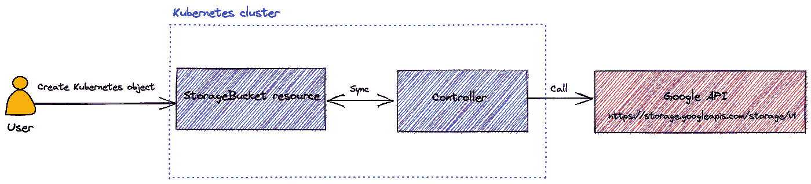
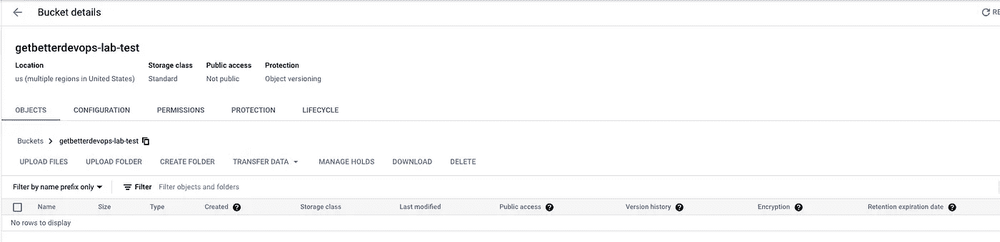

# 配置连接器——将您的 Google 云资源部署为任何其他 Kubernetes 对象

> 原文：<https://betterprogramming.pub/config-connector-deploy-your-google-cloud-resources-as-any-other-kubernetes-objects-d494f98c89c3>

## 需要管理混合配置？配置连接器是给你的！


阿莫克兰·艾特-卡茨在 [Unsplash](https://unsplash.com/?utm_source=unsplash&utm_medium=referral&utm_content=creditCopyText) 上拍摄的照片

很多时候，我们在 Kubernetes 中部署的应用程序使用 Google 托管的服务，如 CloudSQL for relational databases 或 PubSub。这些服务由基础设施作为代码工具来管理，例如 Terraform。这通常意味着管理基础设施和应用程序的不同周期。

Kubernetes 允许您通过 API 对象的集合来定义资源。这个集合可以通过添加自定义资源和控制器来扩展。

读完这篇文章，你会知道以下几点:

*   什么是配置连接器，它能为您提供什么帮助
*   如何在您的 Google Kubernetes 引擎(GKE)集群上部署
*   如何在任何 Kubernetes 发行版上部署配置连接器
*   如何像其他普通的 Kubernetes 对象一样部署 Google 云资源

# 什么是配置连接器

Config connector 是 Kubernetes 的开源插件。它部署控制器和自定义资源定义(CRD):

*   CRDs 允许您用想要的设置来描述资源
*   控制器读取 CRD，并知道如何与 Google APIs 通信来管理它们

下图显示了在创建存储桶的情况下配置连接器的工作方式:



配置连接器如何与 CRDs 一起工作

> 部署存储包时，配置连接器控制器会检测资源。根据其状态，控制器知道如何使用您想要的设置来管理(创建/删除/更新)存储桶。

正如您所看到的，使用配置连接器，您可以解决混合配置的问题。例如，您可以添加存储桶和应用程序清单。不需要额外的工具来部署您的应用程序所需的东西！

配置连接器可以为您带来其他优势，例如:

*   利用 IAM 资源进行更精细的 RBAC 管理
*   用于可观察性的事件和用于降低复杂性的期望状态管理
*   单一来源的配置和所需的状态管理降低了复杂性
*   松散耦合依赖关系的最终一致性

# 如何在 GKE 上配置配置连接器

通过插件在 GKE 上配置连接器是最简单的解决方案。唯一的条件是在 GKE 集群上启用工作负载身份。它允许您的 GKE 集群模拟身份和访问管理(IAM)服务帐户来访问 Google 云服务。

使用以下命令在集群上启用工作负载标识:

```
$ gcloud container node-pools update <NODE_POOL> \
    --workload-metadata=<GKE_METADATA> \
    --cluster <CLUSTER_NAME>
```

在集群上启用配置连接器:

```
$ gcloud container clusters update <CLUSTER_NAME> \
    --update-addons ConfigConnector=ENABLED
```

为配置连接器创建服务帐户:

```
$ gcloud iam service-accounts create <SERVICE_ACCOUNT_NAME>
```

授予 IAM 服务帐户对项目的提升权限:

```
$ gcloud projects add-iam-policy-binding PROJECT_ID \
    --member="serviceAccount:SERVICE_ACCOUNT_NAME@PROJECT_ID.iam.gserviceaccount.com" \
    --role="roles/editor"
```

为配置连接器在 IAM 服务帐户和预定义的 Kubernetes 服务帐户之间创建 IAM 策略绑定:

```
$ gcloud iam service-accounts add-iam-policy-binding \
SERVICE_ACCOUNT_NAME@PROJECT_ID.iam.gserviceaccount.com \
    --member="serviceAccount:PROJECT_ID.svc.id.goog[cnrm-system/cnrm-controller-manager]" \
    --role="roles/iam.workloadIdentityUser"
```

确保名称空间`cnrm-system`中的配置连接器准备就绪:

```
$ kubectl wait -n cnrm-system \
      --for=condition=Ready pod --all
```

如果配置连接器安装正确，输出类似于以下内容:

```
pod/cnrm-controller-manager-0 condition met
```

创建以下配置以将 Google 和 Kubernetes 服务帐户映射在一起:

```
# configconnector.yaml
apiVersion: core.cnrm.cloud.google.com/v1beta1
kind: ConfigConnector
metadata:
  # the name is restricted to ensure that there is only one
  # ConfigConnector resource installed in your cluster
  name: configconnector.core.cnrm.cloud.google.com
spec:
 mode: cluster
 googleServiceAccount: "SERVICE_ACCOUNT_NAME@PROJECT_ID.iam.gserviceaccount.com"
```

使用以下命令应用配置:

```
$ kubectl apply -f configconnector.yaml
```

# 如何在其他 Kubernetes 发行版上配置配置连接器

除了 GKE 之外，您是否还使用其他方式来运行您的 Kubernetes 集群？可以通过官方操作符使用配置连接器。

配置连接器在创建资源之前需要创建 Kubernetes 角色的权限。使用以下命令检查是否可行:

```
$ kubectl auth can-i create roles
```

如果输出是`no`，在您的集群中创建一个`ClusterRoleBinding`，允许您创建角色:

```
$ kubectl create clusterrolebinding cluster-admin-binding \
    --clusterrole cluster-admin \
    --user <ACCOUNT_EMAIL>
```

创建服务帐户:

```
$ gcloud iam service-accounts create <SERVICE_ACCOUNT_NAME>
```

授予 IAM 服务帐户对项目的提升权限:

```
$ gcloud projects add-iam-policy-binding PROJECT_ID \
    --member="serviceAccount:SERVICE_ACCOUNT_NAME@PROJECT_ID.iam.gserviceaccount.com" \
    --role="roles/owner"
```

创建服务帐户密钥并将其凭据导出到文件:

```
$ gcloud iam service-accounts keys create --iam-account \
    SERVICE_ACCOUNT_NAME@PROJECT_ID.iam.gserviceaccount.com key.json
```

创建`cnrm-system`名称空间:

```
$ kubectl create namespace cnrm-system
```

将密钥的凭据作为机密导入:

```
$ kubectl create secret generic SECRET_NAME \
    --from-file key.json \
    --namespace cnrm-system
```

从系统中删除凭据:

```
$ rm key.json
```

下载最新的配置连接器操作员档案:

```
$ gsutil cp gs://configconnector-operator/latest/release-bundle.tar.gz release-bundle.tar.gz
```

提取存档文件:

```
tar zxvf release-bundle.tar.gz
```

在集群上安装配置连接器操作符:

```
$ kubectl apply -f operator-system/configconnector-operator.yaml
```

检查配置连接器的安装:

```
$ kubectl wait -n cnrm-system \
      --for=condition=Ready pod --all
```

输出类似于以下内容:

```
pod/cnrm-controller-manager-0 condition met
```

通过操作员配置配置连接器:

```
apiVersion: core.cnrm.cloud.google.com/v1beta1
kind: ConfigConnector
metadata:
  # the name is restricted to ensure that there is only ConfigConnector
  # instance installed in your cluster
  name: configconnector.core.cnrm.cloud.google.com
spec:
 mode: cluster
 credentialSecretName: SECRET_NAME
```

将配置应用到您的群集:

```
$ kubectl apply -f configconnector.yaml
```

# 使用配置连接器部署您的第一个 Google 资源

现在，您已经在 Kubernetes 集群上配置了 Config Connector，让我们来练习一下。作为第一步，您将看到如何使用 Config Connector 部署存储桶！

从[文档](https://cloud.google.com/config-connector/docs/reference/resource-docs/storage/storagebucket)中，您可以根据自己的意愿配置资源定义。下面是名为`storage-bucket.yaml`的铲斗配置示例:

在您的 Kubernetes 集群中应用配置:

```
$ kubeapply -f storage-bucket.yaml
```

您可以列出存储桶资源的信息:

```
$ kubectl get StorageBucketNAME                       AGE     READY   STATUS     STATUS AGEgetbetterdevops-lab-test   3m54s   True    UpToDate   2m20s
```

存储桶在 Google 控制台中可见:



当`cnrm.cloud.google.com/force-destroy` 设置为`true`时，删除 Kubernetes 资源时，存储桶也被删除:

```
$ kubectl delete -f storage-bucket.yaml
```

该存储桶现在在 GCP 被删除了！

# 结论

现在您知道了 Config connector 如何解决您的应用程序所需的 Google 基础设施依赖性。你可以在 GKE 上通过插件添加配置连接器，或者通过官方运营商添加另一个 Kubernetes 发行版。

安装后，您可以像定义其他 Kubernetes 资源一样定义 Google 资源。它允许你将谷歌资源添加到你的舵轮图表中来一起部署它！

通过最后一个存储桶示例，您可以了解如何使用配置连接器。您现在可以使用配置连接器来解决您的需求了！