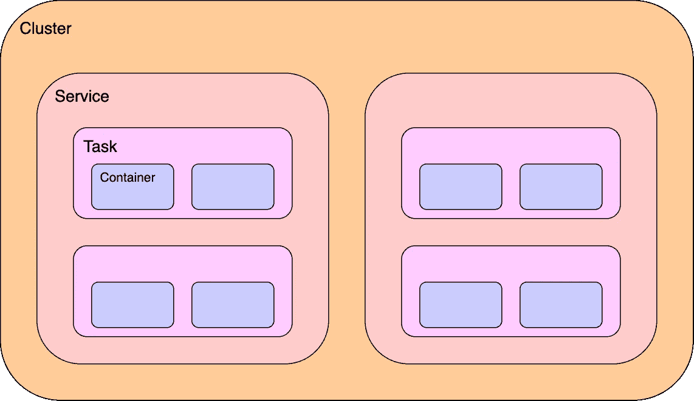
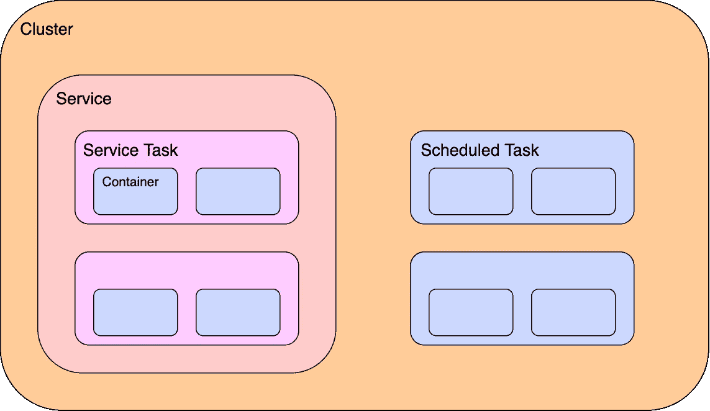
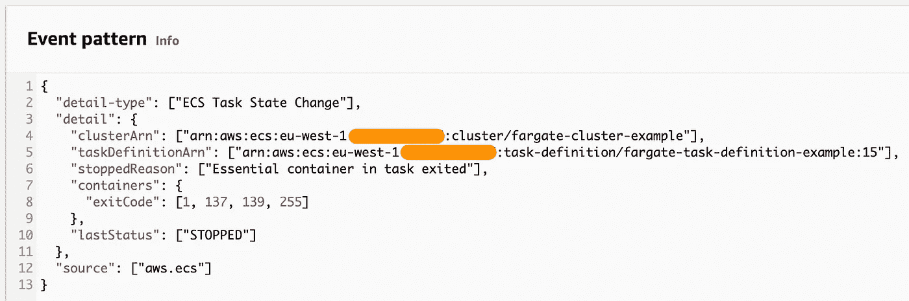

# 配置 ECS 任务失败警报

> 原文：<https://betterprogramming.pub/configure-ecs-task-failure-alerts-1e3c93cbf10a>

## 使用 Amazon EventBridge 设置执行失败通知

由 [Ales Krivec](https://unsplash.com/@aleskrivec?utm_source=medium&utm_medium=referral) 在 [Unsplash](https://unsplash.com?utm_source=medium&utm_medium=referral) 上拍摄的照片

作为亚马逊网络服务(AWS)中的一项流行服务，[弹性容器服务](https://aws.amazon.com/ecs/) (ECS)允许我们在云中运行容器化的应用程序。概括地说，ECS 由三种主要资源组成:

1.  [任务定义](https://docs.aws.amazon.com/AmazonECS/latest/developerguide/task_definitions.html)运行一个或多个容器
2.  [执行一个或多个任务定义实例的服务](https://docs.aws.amazon.com/AmazonECS/latest/developerguide/ecs_services.html)
3.  [集群](https://docs.aws.amazon.com/AmazonECS/latest/developerguide/clusters.html)将服务和任务组合在一起

作者提供的 ECS 图表

如果我们想在 ECS 中托管一个应用程序，我们可以在集群中提供一个服务，尤其是在我们需要高可用性的情况下。对于 ECS 来说，这是一种特别常见的模式。然而，我们可以采用不同的方法，特别是当我们想不经常运行一个任务的时候。在这种情况下，我们可以考虑[预定的 ECS 任务](https://docs.aws.amazon.com/AmazonECS/latest/developerguide/scheduled_tasks.html)。由 Amazon [EventBridge](https://aws.amazon.com/eventbridge/) 规则调用的计划任务不由服务管理。

作者提供的 ECS 图表

按照这种计划的任务模式，我们失去了许多现成的专门为 ECS 服务定制的 [Amazon CloudWatch 指标](https://docs.aws.amazon.com/AmazonECS/latest/userguide/cloudwatch-metrics.html)。此外，对于任务执行失败的计数没有预定义的指标，那么我们如何为这样的事件配置警报呢？

让我们首先解释我们如何为服务中失败的任务配置警报。之后，让我们讨论一下为什么它是次优的，为什么它不适用于预定的任务。让我们用一个使用 [AWS 云开发套件](https://aws.amazon.com/cdk/) (CDK)的工作示例来提出一个更好的解决方案，它可以适用于所有任务，不管它们是否属于服务。

# 服务中任务执行失败的警报

当一个任务在一个服务中运行时，我们使用前面提到的所有三种资源类型，因为任务和服务必须在一个集群中进行分组。ECS 的默认[云观察指标](https://docs.aws.amazon.com/AmazonECS/latest/userguide/cloudwatch-metrics.html)依赖于两个维度:`ClusterName`和`ServiceName`。每当我们想要在服务任务上配置警报时，我们使用这些维度来确保警报适合正确的任务实例。

通常，一个服务将承载一个或多个健康的任务(尽管所需的计数可以设置为 0)。为了对此进行监控，我们[使用预先存在的`CPUUtilization`和`MemoryUtilization`度量来绘制正在运行的任务](https://docs.aws.amazon.com/AmazonECS/latest/userguide/cloudwatch-metrics.html#cw_running_task_count])的数量。如果正在运行的任务数量低于预期，这是一个很好的迹象，表明有问题，我们可以设置警报来提醒我们这种情况。请记住，在部署更新期间，新任务是在旧任务被拆除之前提供的，因此我们不希望我们的服务任务总数在任何阶段都低于通常的数量。

虽然这对服务很有用，但我们不能将相同的解决方案应用于计划任务。这是因为计划任务不属于服务，根据定义，它们没有稳定的运行计数——我们预计这将随着时间的推移而波动，取决于我们调用这些任务的频率以及它们运行的时间。

此外，这种警报策略存在延迟，因为 CloudWatch 会等到配置的评估期过去后才会发出警报。如果我们希望缩短故障发生和抛出警报之间的时间，该怎么办？

# 使用 EventBridge 发出任务执行失败警报

转到 Amazon EventBridge，这个服务不仅调用预定的任务，而且还可以[管理任务状态变化事件](https://docs.aws.amazon.com/AmazonECS/latest/userguide/ecs_cwe_events.html#ecs_task_events)。当任务中的容器终止时，会创建一个事件。我们可以使用 EventBridge 来检测这些事件，并在事件匹配给定模式时触发下游操作。例如，我们可以在 EventBridge 中配置一个新规则来检测容器何时停止并报告一个[常见故障退出代码](https://aws.amazon.com/premiumsupport/knowledge-center/ecs-task-stopped/) : 1、137、139 或 255。

根据此标准筛选的事件模式需要几个详细信息:

*   ECS 集群[亚马逊资源名称](https://docs.aws.amazon.com/general/latest/gr/aws-arns-and-namespaces.html) (ARN)
*   任务定义 ARN
*   任务停止的原因(`Essential container in task exited`)
*   上次任务状态匹配`STOPPED`
*   一个或多个上述常见故障退出代码

提供了这些细节后，EventBridge 模式如下所示:

作者提供的 EventBridge 控制台截图

然后，新配置的规则可以采取措施，使用 [EventBridge 目标](https://docs.aws.amazon.com/eventbridge/latest/userguide/eb-targets.html)通知我们任务状态的变化。这可以采取多种形式，比如通过[简单通知服务](https://aws.amazon.com/sns/) (SNS)发送电子邮件通知，或者通过 [API 目的地](https://docs.aws.amazon.com/eventbridge/latest/userguide/eb-api-destinations.html)发送 RESTful API 请求。

请注意，如果将此规则应用于服务中的任务，它将不会检测部署更新期间终止的任务。在这种情况下，停止的原因是“由部署启动的扩展活动”，这与我们的事件模式不匹配。因此，应用它是安全的，不用担心在每次任务定义更新时出现警告。

# AWS CDK 的工作事件桥解决方案

鉴于上述建议，让我们演示一个我们将与 CDK 一起构建和部署的工作警报机制。我们将为一个计划的 ECS 任务提供一个 EventBridge 规则，每当任务执行失败并出现一个常见退出代码时，该规则会通过电子邮件通知我们。GitHub 上有完整的解决方案[，但是我们将在这里浏览每个部分，并进一步详细解释它们是如何结合在一起的。](https://github.com/rrhodes/aws-ecs-scheduled-task-alerts)

作者的架构图

我们首先从一个 [ECS 群集](https://docs.aws.amazon.com/cdk/api/v2/docs/aws-cdk-lib.aws_ecs.Cluster.html)开始。这是所有任务所必需的，不管它们是否属于某个服务。我们将为此示例提供一个 [Fargate](https://aws.amazon.com/fargate/) 任务，这需要我们设置`enableFargateCapacityProviders`。

接下来，我们定义[任务定义](https://docs.aws.amazon.com/cdk/api/v2/docs/aws-cdk-lib.aws_ecs.FargateTaskDefinition.html)。假设我们使用 Fargate 启动类型，我们需要一个[执行角色](https://docs.aws.amazon.com/AmazonECS/latest/developerguide/task_execution_IAM_role.html),它由 ECS 承担，并通过应用一个 AWS 管理的服务角色来授予所有需要的权限。

现在，我们需要一个容器来托管任务中的应用程序。假设我们有一个 Docker 文件，并且应用程序代码已经存在于当前目录中(例如，参见 [GitHub 存储库](https://github.com/rrhodes/aws-ecs-scheduled-task-alerts))，我们在该目录下提供一个新的 [Docker 图像资产](https://docs.aws.amazon.com/cdk/api/v2/docs/aws-cdk-lib.aws_ecr_assets.DockerImageAsset.html)，并将其传递给 [addContainer 方法](https://docs.aws.amazon.com/cdk/api/v2/docs/aws-cdk-lib.aws_ecs.FargateTaskDefinition.html#addwbrcontainerid-props)。AWS CloudWatch 的[日志驱动程序](https://docs.aws.amazon.com/AmazonECS/latest/developerguide/using_awslogs.html)在这里是可选的，但是对于查看应用程序生成的任何日志非常有用。

配置好所有 ECS 基础架构后，让我们配置一个 EventBridge 规则来调用该任务。CDK [为我们提供了开箱即用的功能](https://docs.aws.amazon.com/cdk/api/v2/docs/aws-cdk-lib.aws_ecs_patterns.ScheduledFargateTask.html)(❤CDK)。为了便于测试，我们的任务被配置为使用最新的 Fargate 平台版本每分钟启动一次。

现在我们想要复制前面共享的 EventBridge 任务模式，用于检测执行失败事件。这有点麻烦——给出了一个注释来证明每个列出的故障退出代码。

这让我们决定如何最好地通知任务失败。对于这个例子，让我们向一个 [SNS 主题](https://docs.aws.amazon.com/cdk/api/v2/docs/aws-cdk-lib.aws_sns.Topic.html)提交匹配的事件，并为通知设置一个[电子邮件订阅](https://docs.aws.amazon.com/cdk/api/v2/docs/aws-cdk-lib.aws_sns.Subscription.html)。可以使用`ALERT_EMAIL_ADDRESS`环境变量设置收件人地址。

这就结束了我们的 CDK 解决方案。在我们将这些资源部署到 AWS 之后，我们的调度任务应该每分钟调用一次，并立即生效。只要任务在执行过程中失败，并出现匹配的退出状态代码，电子邮件地址收件人就会收到任务失败的通知。

请注意，该设置不应该无限期运行，否则，任务将每分钟都在加速运行，并可能向我们的电子邮件收件箱发送失败通知消息。当不再需要时，请记住将其拆除，或者至少禁用 EventBridge 调用规则。

# 资源

ECS 任务的警报是我在过去几年从事 AWS 工作期间考虑过几次的事情。因为我最近重温了这个问题，所以觉得这是一个值得与大家分享的话题。以下内容是本文的重要参考资料:

*   [计划 ECS 任务](https://docs.aws.amazon.com/AmazonECS/latest/developerguide/scheduled_tasks.html)和[状态变化事件](https://docs.aws.amazon.com/AmazonECS/latest/userguide/ecs_cwe_events.html#ecs_task_events)的 AWS 文档
*   [支持页面](https://aws.amazon.com/premiumsupport/knowledge-center/ecs-task-stopped/)解释了 ECS 任务可能停止的原因
*   AWS CDK 的 [API 参考](https://docs.aws.amazon.com/cdk/api/v2/docs/aws-construct-library.html)
*   我的 [GitHub 存储库](https://github.com/rrhodes/aws-ecs-scheduled-task-alerts)托管工作中的 CDK 解决方案

我希望这篇文章对任何使用 ECS 的人来说都是有用的。如果你遵循相似的模式，或者采取完全不同的策略，一定要让我知道！如果能听听其他人是如何配置他们的任务通知的，那就太好了。