# 如何在 macOS 上配置 Firebase 模拟器？

> 原文：<https://betterprogramming.pub/configure-firebase-emulators-cf68f4da387d>

## 安装和运行 Firebase 模拟器的屏幕截图指南

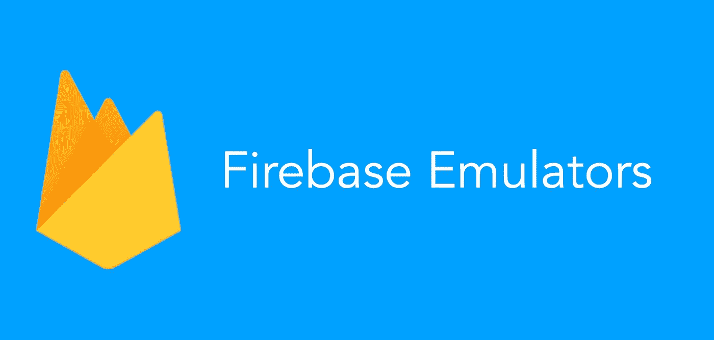

作者照片。

# 什么是 Firebase 模拟器？

它是由 Firebase 组成的工具集合，比如 Firestore、实时数据库、云功能等。

Firebase 模拟器精确地模仿了 Firebase 服务的行为，就在您的本地机器上。这意味着您可以将您的应用程序直接连接到这些仿真器来执行集成测试或 QA，而无需接触生产数据。

例如，您可以将您的应用程序连接到 Firestore 模拟器，以便在测试中安全地读写文档。这些写入可以触发云函数仿真器中的函数。但是，当模拟器不可用或未配置时，您的应用程序仍将继续与生产 Firebase 服务通信。

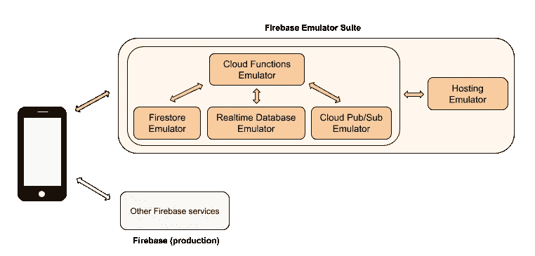

照片来自[燃料库](https://firebase.google.com/docs/emulator-suite)。

# 什么时候应该使用？

Firebase 模拟器有助于本地开发、原型开发和持续集成工作流。

## 注意

如果你计划在本地网络中部署一个 Firebase 模拟器，然后将它作为应用程序的服务，你*可以*这样做，但是 Firebase 不推荐这样做:

> “不要试图将这些模拟器用作 Firebase 服务的“自托管”版本。它们是为了准确性而构建的，而不是为了性能或安全性，不适合在生产中使用。”— [Firebase 的官方文档](https://firebase.google.com/docs/emulator-suite)

闲聊够了。让我们安装一些 Firebase 模拟器。

# 装置

打开终端，安装/升级 Firebase CLI。

*   使用`curl -sL firebase.tools | bash`安装。
*   使用`curl -sL firebase.tools | upgrade=true | bash`升级。

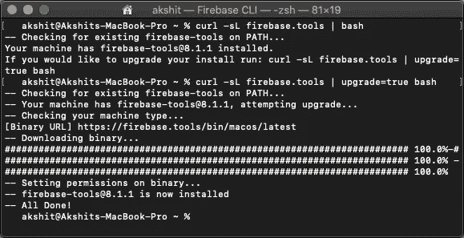

安装/升级 Firebase CLI

# 初始化 Firebase 项目

在终端中，`cd`到你选择的文件夹中，专门为这个 Firebase 项目创建一个新文件夹。

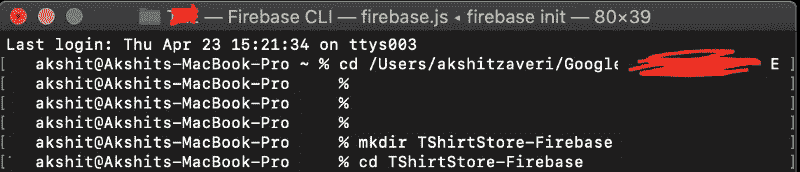

在`TShirtStore-Firebase`文件夹中运行以下命令:

```
Firebase init
```

*注意:按<空格键>选择，使用<上/下>箭头键上/下移动。*

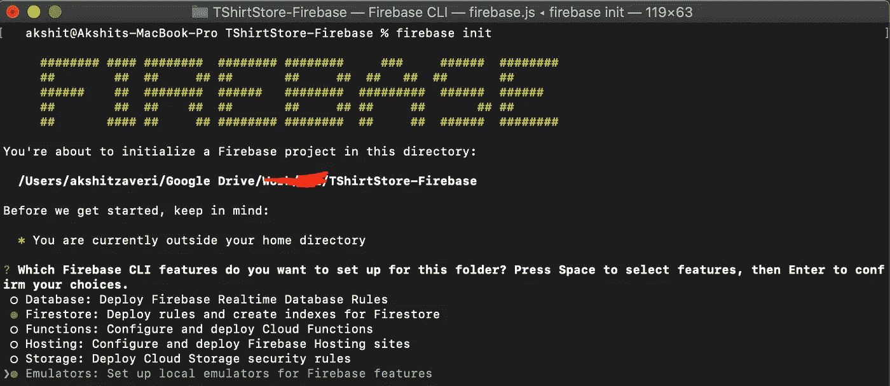

正在初始化 Firebase 项目

我只选择了 Firestore 和模拟器，正如你在上面看到的。现在，点击回车键并选择“使用现有项目”

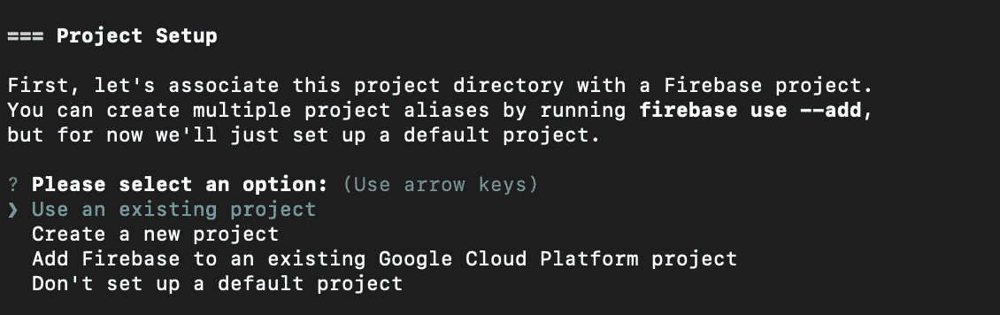

选择 Firebase 项目

现在，使用<up>键查看您的 Firebase 项目，并点击 enter。</up>

一旦您选择了 Firebase 项目，CLI 将询问您几个问题(取决于您之前选择的 CLI 功能)。我更喜欢保留默认的名字，对所有的问题都按回车键。

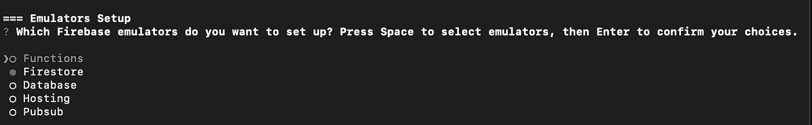

Firebase 仿真器选择

从列表中选择(使用空格键)Firestore，然后按 enter 键。更多的问题出现了。

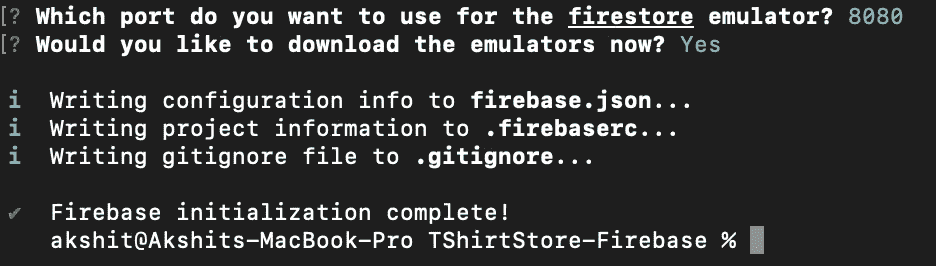

Firebase 模拟器安装完成

一旦达到这一步，您就可以打开 Firebase 项目文件夹并检查文件。它应该看起来像这样:

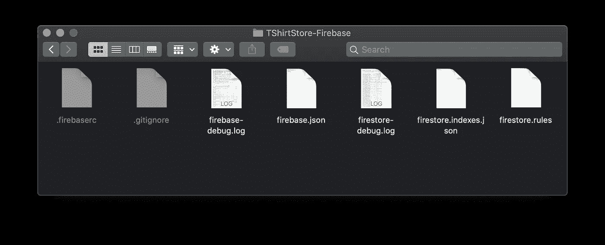

最后，我们已经完成了 Firebase 模拟器的设置。现在，让我们通过在终端中运行下面的命令来运行模拟器:

```
firebase emulators:start
```

注意:我们需要在 Firebase 项目目录中运行这个命令。

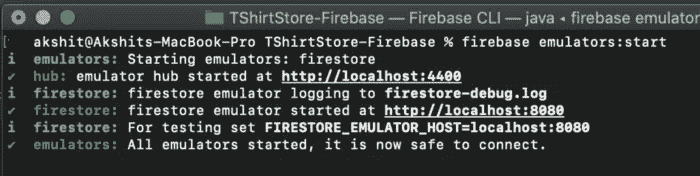

如果你看到类似上面的日志，那么恭喜你。我们已经成功启动了 Firebase 模拟器。

有一种方法可以通过在浏览器中运行 [http://localhost:8080](http://localhost:8080) 来验证 Firestore。您应该会在浏览器窗口中看到“Ok”字样。

*注意:如果我们早些时候选择了不同的端口，那么这将略有不同。*

提示:链接也打印在日志中。

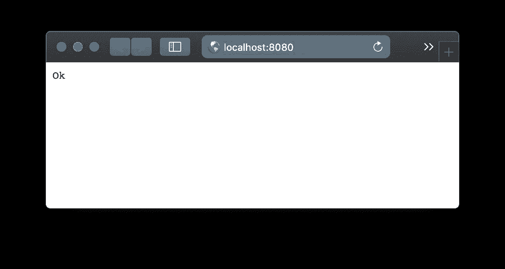

保持终端运行。如果您关闭它，模拟器服务将关闭。

感谢您的阅读。如果您有任何问题，请发表评论。