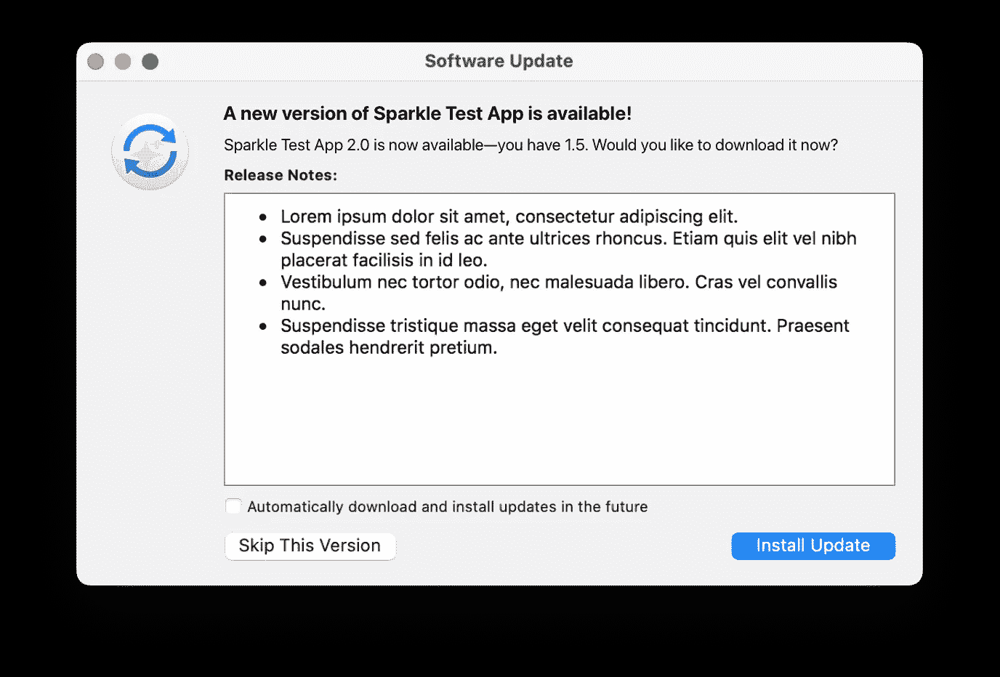
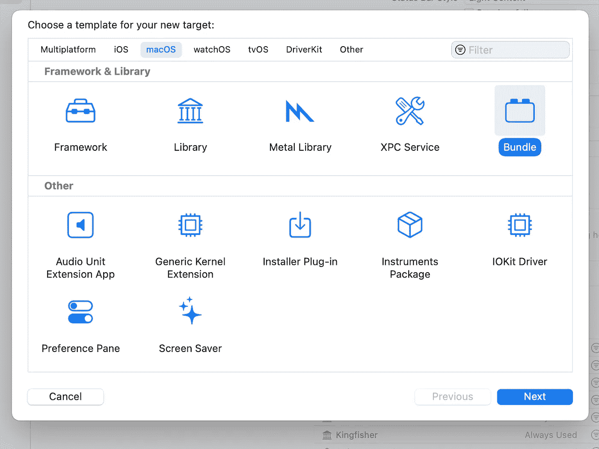
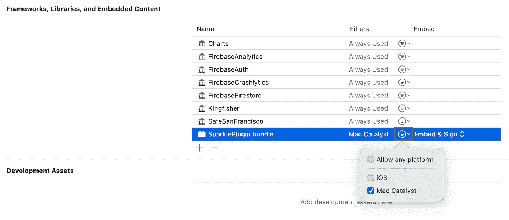
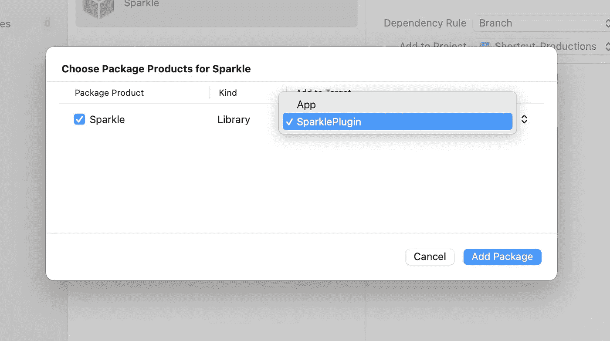
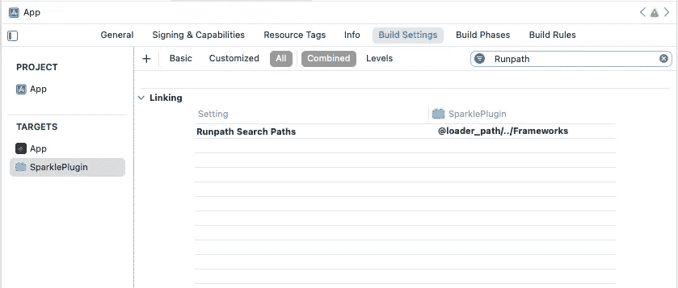
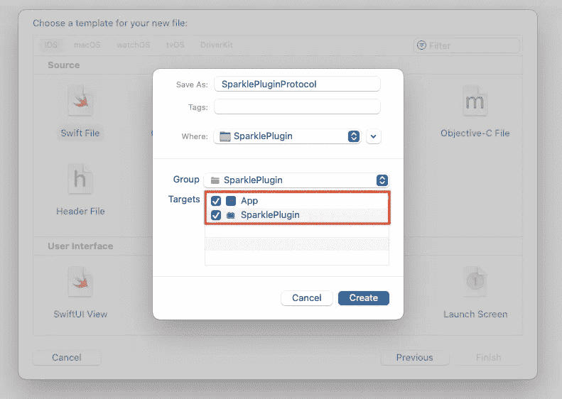
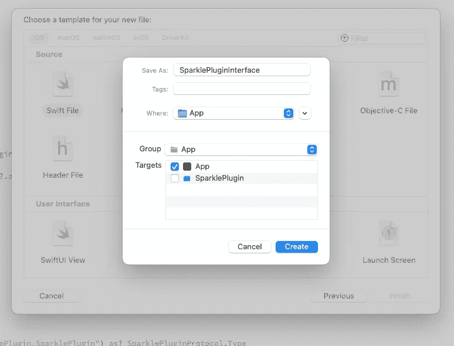
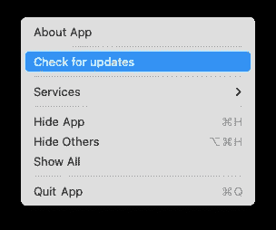

# 使用 Sparkle 为 Mac Catalyst 应用配置应用更新

> 原文：<https://betterprogramming.pub/configuring-app-updates-for-mac-catalyst-apps-with-sparkle-beef7a90a515>

## 让我们在应用商店之外发布应用


Sparkle 是一个开源框架，用于在不通过 App Store 发布应用程序时将应用程序更新集成到 Mac 应用程序中。它非常灵活，允许您以简单的方式将自动更新推送到您的应用程序。很可能你已经在你使用的许多应用程序中看到过 Sparkle 例如，它被用于 *Docker* 、 *Arc、Hex friend*、 *Rectangle、*和无数其他应用程序中。



Sparkle 的主要特点之一是易于实施。在常规的 Cocoa 应用程序中，您可以支持应用程序更新，而无需一行代码。

幸运的是，Sparkle 也可以在 Catalyst 应用中工作，但是需要一些额外的工作来启动和运行。

# **1。创建一个捆绑包**

Sparkle 框架需要能够与 AppKit 对话，因此如果设置在我们的主应用程序中，它将无法正常工作。因此，我们需要制作一个可以访问 AppKit APIs 的 bundle。

在 Xcode 中为 macOS 创建一个新的目标，在`Framework & Library`下选择`Bundle`。我称它为“火花插件”。



接下来，进入你的项目设置，将这个包添加到你的主应用程序的`Frameworks, Libraries, and Embedded Content`下。

确保通过按下过滤器下拉菜单并选择仅`Mac Catalyst`来`Embed & Sign`并仅使捆绑包在 macOS 上可用。



## **2。添加闪耀框架**

现在，我们可以将 Sparkle 作为一个依赖项包含在新创建的包中。选择`File` > `Add packages…`，使用`https://github.com/sparkle-project/Sparkle`作为包 URL。

当提示选择软件包产品时，记得选择您创建的软件包作为目标。



因为我们正在将 Sparkle 添加到我们的捆绑包中，并从我们的主应用程序加载捆绑包，所以应用程序将在我们的应用程序的`/Frameworks`目录中寻找 Sparkle 框架，而不是我们的捆绑包的`/Frameworks`中它实际所在的位置——导致出现带有消息`Library not loaded: @rpath/Sparkle.framework/Versions/B/Sparkle`的`NSExecutableLinkError (3588)`。

要解决这个问题，进入包的构建设置，搜索“Runpath 搜索路径”并添加`@loader_path/../Frameworks`。



# **3。实现对 Sparkle API 的调用**

接下来，我们可以开始实现调用，让 Sparkle 寻找更新。

在此之前，我们的主应用程序需要与我们的 Sparkle bundle 进行对话。这可以使用协议来完成。

为您的捆绑包在组中创建一个新的 Swift 文件，并确保将该文件添加到您的应用程序目标和捆绑包目标中。我将协议命名为`SparklePluginProtocol`。



用一个`init()`和一个启动更新程序的方法`startUpdater()`填充它。

注意，bundles 只能加载暴露给 Objective-C 的类，所以我们需要使我们的协议符合`NSObjectProtocol`来声明这个类是一个 NSObject，并使用`@objc(SparklePluginProtocol)`进行注释，以便在运行时以 Objective-C 友好的方式声明协议的名称。

```
/* SparklePluginProtocol.swift */

@objc(SparklePluginProtocol)
protocol SparklePluginProtocol: NSObjectProtocol {
    init()

    func startUpdater()
}
```

接下来，创建一个仅对 Sparkle 插件目标可用的新文件。

这将用于实现协议的类，并且是负责对 Sparkle 进行 API 调用的类。

回想一下，该类需要向 Objective-C 公开，因此也从 NSObject 继承。

在初始化器中，创建一个新的`SPUStandardUpdaterController`，同时确保`startingUpdater`是`false`，以防止我们在主应用程序中加载包时控制器启动。

相反，我们将创建一个方法，在正确的时刻从我们的`AppDelegate`启动更新程序:

```
/* SparklePlugin.swift */

import Sparkle

@objc
final class SparklePlugin: NSObject, SparklePluginProtocol {

    private let updaterController: SPUStandardUpdaterController

    override init() {

        updaterController = SPUStandardUpdaterController(
            startingUpdater: false,
            updaterDelegate: nil,
            userDriverDelegate: nil
        )

    }

    func startUpdater() {
        updaterController.startUpdater()
    }

}
```

# **4。创建一个与捆绑包通信的接口**

回到我们的主应用程序，只为您的应用程序目标创建一个新文件，该文件将包含加载软件包的代码，并通过我们刚刚制定的协议调用 Sparkle APIs。



从加载包开始，创建一个新的结构，并通过将它包装在`#if targetEnvironment(macCatalyst)`中确保它只在 Mac Catalyst 中可用。

由于加载包可能会失败，我们创建了一个可选的初始化器，如果成功的话，就将`sparklePlugin`设置为静态函数`loadSparklePlugin()`的结果。

```
/* SparklePluginInterface.swift */

#if targetEnvironment(macCatalyst)
struct SparklePluginInterface {

    private let sparklePlugin: SparklePluginProtocol

    init?() {
        guard let sparklePlugin = Self.loadSparklePlugin() else {
            return nil
        }

        self.sparklePlugin = sparklePlugin
    }
}
#endif
```

加载插件的过程如下。如果加载包失败，程序将仅由于`assertionFailure()`而在`DEBUG`暂停。

```
/* SparklePluginInterface.swift */

private static func loadSparklePlugin() -> SparklePluginProtocol? {
    guard
        let bundleUrl = Bundle.main.builtInPlugInsURL?.appendingPathComponent("SparklePlugin.bundle"),
        let bundle = Bundle(url: bundleUrl)
    else {
        return nil
    }

    do {
        try bundle.loadAndReturnError()
    } catch {
        print(error)
        assertionFailure()
        return nil
    }

    guard
        let SparklePlugin = bundle.classNamed("SparklePlugin.SparklePlugin") as? SparklePluginProtocol.Type
    else {
        return nil
    }

    return SparklePlugin.init()
}
```

最后，我们可以添加一个方法来启动更新程序:

```
/* SparklePluginInterface.swift */

func startUpdater() {
  sparklePlugin.startUpdater()
}
```

产生接口的完整代码:

```
/* SparklePluginInterface.swift */

#if targetEnvironment(macCatalyst)
struct SparklePluginInterface {

    private let sparklePlugin: SparklePluginProtocol

    init?() {
        guard let sparklePlugin = Self.loadSparklePlugin() else {
            return nil
        }

        self.sparklePlugin = sparklePlugin
    }

    func startUpdater() {
        sparklePlugin.startUpdater()
    }

}

extension SparklePluginInterface {
    private static func loadSparklePlugin() -> SparklePluginProtocol? {
        guard
            let bundleUrl = Bundle.main.builtInPlugInsURL?.appendingPathComponent("SparklePlugin.bundle"),
            let bundle = Bundle(url: bundleUrl)
        else {
            return nil
        }

        do {
            try bundle.loadAndReturnError()
        } catch {
            print(error)
            assertionFailure()
            return nil
        }

        guard
            let SparklePlugin = bundle.classNamed("SparklePlugin.SparklePlugin") as? SparklePluginProtocol.Type
        else {
            return nil
        }

        return SparklePlugin.init()
    }
}

#endif
```

# **5。在 AppDelegate 中启动 Sparkle**

接下来，您可以启动 Sparkle 并查看更新。

在 AppDelegate 中初始化 Sparkle 接口，并在 AppDelegate 的`didFinishLaunchingWithOptions`方法中运行`startUpdater()`。

```
/* AppDelegate.swift */

#if targetEnvironment(macCatalyst)
let sparkleInterface = SparklePluginInterface()
#endif

func application(_ application: UIApplication, didFinishLaunchingWithOptions launchOptions: [UIApplication.LaunchOptionsKey: Any]?) -> Bool {

    // Setup sparkle
    #if targetEnvironment(macCatalyst)
    sparkleInterface?.startUpdater()
    #endif

    return true
}
```

# 6。配置闪耀设置

最后，可以在你的主 App 的`Info.plist`中配置 Sparkle。您需要在`SUFeedURL`键下提供一个到 appcast 流的 URL，您的更新驻留在该流中。

Sparkle 还需要一个公钥来检查`SUPublicEDKey`密钥下的更新签名。有关更多信息，请参见 [Sparkle 的文档](https://sparkle-project.org/documentation/#3-segue-for-security-concerns)，特别是步骤 3–6。

您可以根据自己的喜好定制 Sparkle，并添加更多功能。

一个常见的附加功能是为用户创建一个菜单项来手动检查更新。



从我们的 AppDelegate 开始，在`buildMenu`方法中添加一个新的应用程序菜单项。

```
/* AppDelegate.swift */

override func buildMenu(with builder: UIMenuBuilder) {
    super.buildMenu(with: builder)

    guard builder.system == UIMenuSystem.main else { return }

    // Add `Check for updates`
    #if targetEnvironment(macCatalyst)
    if let appMenu = builder.menu(for: .application) {
        let checkForUpdatesItem = UICommand(title: "Check for updates", action: #selector(didPressCheckForUpdates(sender:)))
        var children = appMenu.children
        children.insert(checkForUpdatesItem, at: 1)
        let menu = UIMenu(title: appMenu.title, image: appMenu.image, identifier: appMenu.identifier, options: appMenu.options, children: children)
        builder.replace(menu: .application, with: menu)
    }
    #endif
}

#if targetEnvironment(macCatalyst)
@objc
func didPressCheckForUpdates(sender: Any?) {
    sparkleInterface?.checkForUpdates(sender: sender)
}
#endif
```

接下来，在 SparklePluginInterface 中添加一个方法，将消息转发给插件。

```
/* SparklePluginInterface.swift */

struct SparklePluginInterface {

    /* ... */

    func checkForUpdates(sender: Any?) {
        sparklePlugin.checkForUpdates(sender: sender)
    }
}
```

在包中，添加一个`checkForUpdates(sender:)`方法，并在您的`SparklePlugin`类中实现。

```
/* SparklePluginProtocol.swift */ 

@objc(SparklePluginProtocol)
protocol SparklePluginProtocol: NSObjectProtocol {

    /* ... */

    func checkForUpdates(sender: Any?)
}
```

```
/* SparklePlugin.swift */

@objc
final class SparklePlugin: NSObject, SparklePluginProtocol {

    private let updaterController: SPUStandardUpdaterController

    /* ... */

    func checkForUpdates(sender: Any?) {
        updaterController.checkForUpdates(sender)
    }

}
```

这是实现对 Sparkle 的新调用时的一般方法:

*   在包中的 SparklePlugin 类中实现对 Sparkle 的调用。
*   将方法描述添加到 SparklePluginProtocol 中。
*   向 SparklePluginInterface 添加一个方法，将调用转发到您的 bundle。

恭喜你。您已成功将 Sparkle 应用更新添加到您的 Mac Catalyst 应用。

与普通的 Cocoa 应用程序相比，Mac Catalyst 应用程序中的过程更加繁琐，因为它需要为框架创建一个单独的包来与 AppKit 进行对话。