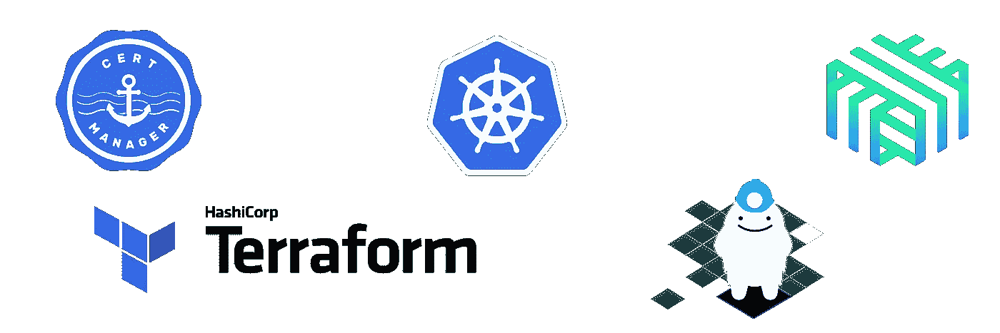

# 使用 Terraform 通过证书管理器配置 Linkerd mTLS

> 原文：<https://betterprogramming.pub/configuring-linkerd-mtls-with-cert-manager-using-terraform-2ee1c0aa6991>

## 保护 Kubernetes 集群中的项目



前几天我写了关于使用 terraform 为 ingress-nginx 设置基本 auth 的文章。我想提供更多的背景知识，并写一系列的帖子，对我们正在做的一些工作提供更多的见解。我们希望加强我们 kubernetes 集群的安全性，并决定为我们集群中的所有点对点通信引入 [mTLS 流量加密](https://www.cloudflare.com/learning/access-management/what-is-mutual-tls/)。

[](https://medium.com/@aliabbasjaffri_/adding-basic-auth-to-ingress-nginx-using-terraform-c9c09f857378) [## 使用 Terraform 向 Ingress-Nginx 添加 basic-auth

### 使用 terraform 创建 ingress-nginx 资源时需要注意什么

medium.com](https://medium.com/@aliabbasjaffri_/adding-basic-auth-to-ingress-nginx-using-terraform-c9c09f857378) 

我们需要两个工具来完成这项任务:一个是发布和管理 [TLS 证书的服务](https://www.digicert.com/how-tls-ssl-certificates-work)，另一个是用于 kubernetes 集群的[服务网格，以在集群内实施加密网络。第一个工具的明显选择是著名的](https://linkerd.io/what-is-a-service-mesh/) [cert-manager](https://cert-manager.io/) ，它可以在 Kubernetes 集群中发布和管理证书。我们在选择 [istio](https://istio.io/) 还是 [linkerd](https://linkerd.io/) 来完成服务网格的任务上有些分歧。

[](https://istio.io/) [## 伊斯迪奥

### 一个可观察性、深度安全性和管理的服务网格，可加快部署周期。

istio.io](https://istio.io/) [](https://linkerd.io/) [## 世界上最轻、最快的服务网。

### Linkerd 为您的 Kubernetes 堆栈增加了重要的安全性、可观察性和可靠性，而无需更改任何代码。

linkerd.io](https://linkerd.io/) 

我们回去更好地理解我们的需求；我们希望我们的集群中有一个服务网格，允许我们在集群中建立加密通信。我们利用 Azure CNI 的力量在我们的集群中做其他网络配置的繁重工作。`linkerd`从此成为[outir ghter winner](https://linkerd.io/faq/#what-s-the-difference-between-linkerd-and-istio)，因为我们不需要全面的服务网格部署。根据[浮力](https://buoyant.io/)、`linkerd`背后团队的说法，`linkerd`也因用[锈语](https://www.rust-lang.org/)实现而成为两个中速度更快的[。](https://buoyant.io/linkerd-vs-istio)


linkerd 对 istio

为了建立这种关系，我们必须让`cert-manager`和`linkerd`互相合作。为了这篇文章，我们将使用自签名证书来启动加密链。我们首先创建`cert-manager`，以便`issuer`和`certificate`资源就位，然后我们创建`linkerd`。这两个资源都可以通过 kubernetes 中的`helm`图表使用 [hashicorp helm provider](https://registry.terraform.io/providers/hashicorp/helm/latest/docs) 创建。流程如下:

*   创建`cert-manager`

头盔释放的地形代码。我们将把它作为一个模块来减少我们所有舵图的代码混乱。

cert_manager helm_release 的 terragrunt 配置

*   `terragrunt apply -auto-approve`将生成一个名称空间`cert-manager`，其中包含运行`cert-manager`舵图所需的资源。
*   现在我们已经有了拼图的一部分，我们可以专注于创建带有自动旋转控制平面 TLS 的 [linkerd。](https://linkerd.io/2.11/tasks/automatically-rotating-control-plane-tls-credentials/)
*   使用 [hashicorp tls 提供商](https://registry.terraform.io/providers/hashicorp/tls/latest/docs)生成私钥和自签名 tls ca-certificate。这将作为认证授权，稍后 pods 将使用它来生成客户端证书，以加密它们的通信。

生成私钥和自签名 ca-cert

自签名 ca-cert 的 terragrunt 配置

*   使用[hashi corp kubernetes provider](https://registry.terraform.io/providers/hashicorp/kubernetes/latest)为`linkerd`及其所有资源创建名称空间

定义一个包含所有 linkerd 资源的 kubernetes 名称空间

linkerd 命名空间的 terragrunt 配置。所有这些注释和标签都来自 linkerd.io

*   在`linkerd`名称空间中创建一个秘密，将`ca-cert`存储为`tls`秘密。这个秘密将被`cert-manager`和`Certificate`资源用来生成客户端证书。

在 linkerd 名称空间中创建一个 kubernetes secret 来包含 ca-cert 密钥和 crt

```
cert_secret = {
  type = "kubernetes.io/tls"
  name = "linkerd-trust-anchor"
  namespace = "linkerd"
  data = {
  "tls.key": "${tls_self_signed_cert.self_signed_certificate.ca_key}",
  "tls.crt": "${tls_self_signed_cert.self_signed_certificate.ca_pem}"
  }
}# Somehow i couldn't create an embed gist here. I believe its
# because medium is trying to protect our secrets.
# this is the terragrunt configuration for our kubernetes secret
```

*   生成由`cert-manager`用来生成证书的`Issuer`资源。

证书管理器发行者的 kubernetes 清单。我们必须通过 manifest 的方式，因为还没有 cert-manager 的提供者。

*   接下来我们需要创建`Certificate`资源，它使用这个`Issuer`来生成所需的证书。

Linkerd 使用来自 secret 的 ca-cert 凭证作为信任锚生成证书的证书资源

*   在`terraform`文件中创建一个`locals`块，将`identityTrustAnchorsPEM`添加到`linkerd`的`values.yaml`文件中。

从已经创建的包含 ca-cert 的机密中获取数据并配置 linkerd helm chart

*   接下来是`linkerd` helm-chart，它现在有一个自签名证书，自签名 ca-cert 作为信任锚来生成证书。

将 helm_release 资源作为模块重用并为 linkerd 配置它

用于创建 linkerd 舵图的 linkerd terragrunt 配置

这将在 Kubernetes 中生成`cert-manager`和`linkerd`舵图，但是您的 pods 名称空间不会与每个加密的进行通信。您需要[向 pod /名称空间](https://linkerd.io/2.11/tasks/adding-your-service/)添加以下注释，以便让`linkerd`加密通信交换。

```
linkerd.io/inject: enabled
```