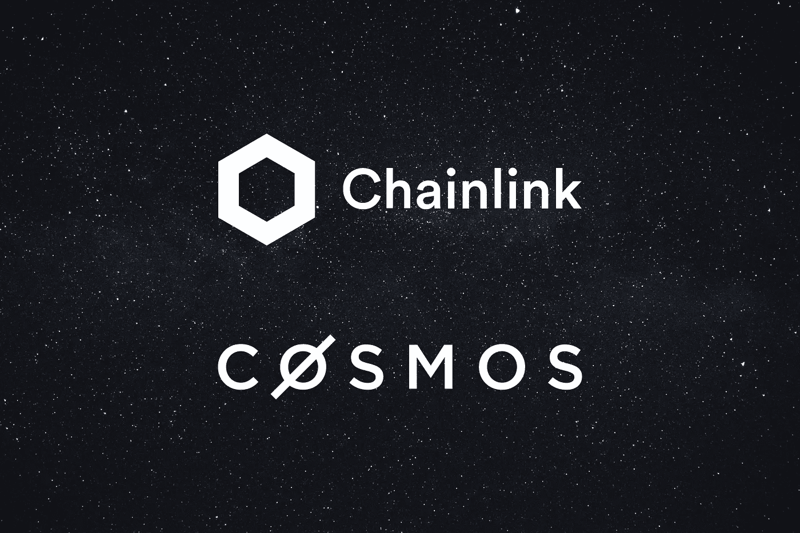
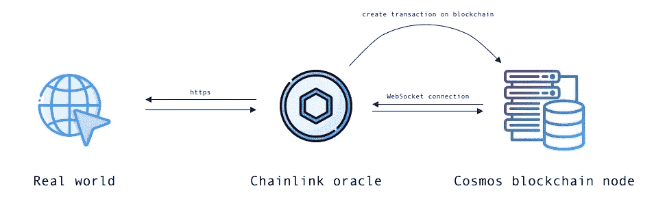
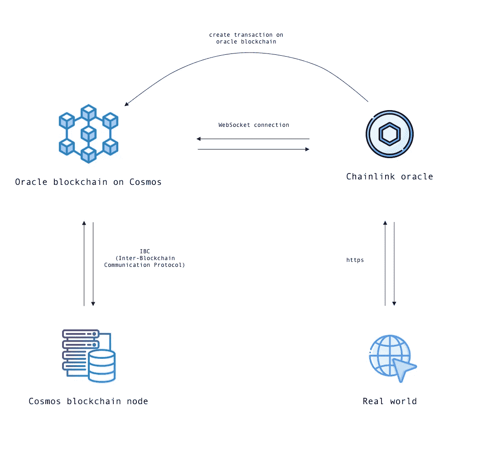
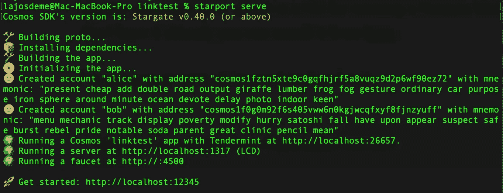
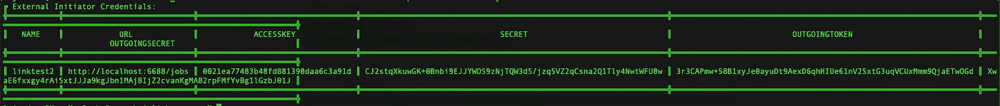
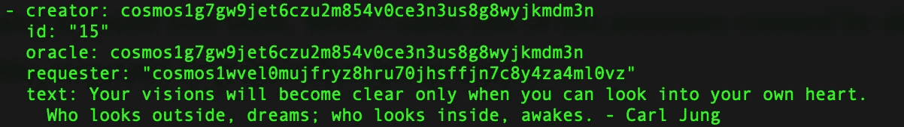

# 将 Chainlink Oracle 连接到 Cosmos 区块链

> 原文：<https://betterprogramming.pub/connect-a-chainlink-oracle-to-a-cosmos-blockchain-d7934d75bae5>

## 走在技术的前沿



图片由作者提供。

区块链 oracle 是第三方/分散数据服务，为智能合同和区块链提供链外数据。它弥合了区块链封闭的确定性系统与现实世界之间的差距。如果作为区块链社区，我们的目标是广泛采用这项技术，那么 oracle networks 就是不可或缺的。

神谕的主要问题在于，它们不是区块链共识机制的一部分，因此不在区块链公共基础设施提供的基本安全保障之内。

[Chainlink](https://chain.link/) 是目前的行业标准，在构建针对 oracle 问题的强大解决方案方面处于领先地位。

> "试图在没有神谕的情况下签订明智的合同，就像试图穿着裤子做爱一样."—查尔斯·霍金森

[Cosmos](https://cosmos.network/) 是一个伟大的开源框架，用于构建特定应用、多资产、利益相关(PoS)的区块链。每个 Cosmos 应用都运行在 [Tendermint Core](https://tendermint.com/core/) 上，这是一个生产就绪的 PoS 共识引擎。

特定于应用程序意味着 Cosmos 抛弃了虚拟机区块链范式(如以太坊)，其中状态机可以解释图灵完成程序(也称为智能合同)。也就是说，你可以用智能合约实现你自己的区块链，比如 [Ethermint](https://github.com/cosmos/ethermint) 。

Chainlink 目前最广泛地用于以太坊智能合约，整个过程——过于简化——以如下方式工作。

您的智能协定与另一个智能协定(称为 oracle 协定)进行交易，后者发出一个事件，链外 Chainlink 节点订阅该事件。当事件被记录时，它会离线执行一些工作，并使用所执行工作的结果调用 oracle contract 上的一个函数。最后，oracle 契约用离线接收的数据调用客户机契约上的回调函数。

从这个描述中，我们可以清楚地看到，智能合同是整个过程中的关键。您的契约不与任何链外 API 或资源通信，只与另一个智能契约通信。

那么，在没有智能合约的情况下，如何用特定于应用程序的区块链实现 oracles 呢？嗯，老实说，我不确定。我所知道的唯一一个做类似事情的项目是 [Kava Blockchain，它将 Chainlink price oracles 集成到他们的系统中](https://medium.com/kava-labs/bringing-chainlink-oracles-to-cosmos-24e7ec7f006d)。他们基本上有一个白名单甲骨文的选择，可以张贴价格数据链。当他们平台的用户需要价格数据时，他们可以向商店查询所有价格数据或 oracles 发布的所有价格的中间价格。

据我从[公告](https://blog.chain.link/chainsafe-receives-grant-to-natively-integrate-chainlink-into-cosmos-sdk/)中了解到的，Chainsafe 的目标是建立一个模块来完成类似的事情。

在我思考这个问题的短暂时间里，我想到了两个解决方案。我确信有更好的方法从技术上解决这个问题，所以请随意将本文的评论部分作为集思广益的中心。

# 选项 1

一种解决方案是 oracle 节点的操作员在特定于应用程序的区块链上创建一个钱包。然后，它使用 WebSockets 来侦听涉及该地址的事务。当它记录这样一个事务时，它执行一些离线工作，一旦完成，它就把一个事务发送到前一个事务起源的地址。

它将允许根据需要启动 oracle 请求，Oracle 将能够执行任何工作——不仅仅是发布价格数据。

目前，这可以通过使用 Chainlink oracle 来实现。甲骨文运营商可以在区块链上注册钱包，并使用[外部启动器](https://docs.chain.link/docs/external-initiators-introduction/)和[外部适配器](https://docs.chain.link/docs/external-adapters/)提供服务。



作者图片

# 选项 2

第二个更可靠的选择是在 Cosmos 上创建一个 oracle 专用的区块链，作为 Chainlink 节点和 Cosmos 生态系统之间的通信点。它会将所有的 Chainlink APIs 暴露给每一个用 Cosmos 构建的区块链。我们甚至可以在 oracle 区块链中构建安全机制来验证离线数据的完整性。

听起来对宇宙生态系统来说是一件非常有价值的事情，不是吗？这样的事情怎么可能完成？

oracle 区块链使用第一种解决方案，这意味着 oracle 将使用 WebSockets 订阅来自其他 Cosmos 区块链的 Oracle 区块链上的事务事件。这些事件包含让 oracle 节点决定必须执行什么作业的信息。成功执行后，从 oracle 区块链向请求作业的客户机区块链发出一个事务。

最近推出的[区块链间通信协议(IBC)](https://docs.cosmos.network/master/ibc/overview.html) 让这变得可行。简而言之，这是一个协议，允许端到端的，可靠的，认证的通信之间的宇宙区块链。任何宇宙区块链将能够实现协议，以沟通与甲骨文区块链。



作者图片

显然，我不打算在本文中实现选项 2，因为它需要大量的计划、架构和编程，并且会消耗一个中等作者可以从读者那里期待的大约一千倍的注意力。

然而，我确实有计划让这成为现实，所以请留意我的更新，或者如果你感兴趣的话，请与我保持联系。

我们将在下面的段落中实现选项 1:旋转一个基本的宇宙区块链，并使用 Chainlink 从互联网上获取随机报价。

为了将本文保持在合理的长度，我们将编写的代码有意地最小化，并且仅用于说明我上面谈到的概念。

有相当多的步骤，有相当多的代码，我们必须写这一切工作。我知道这很复杂，但我们处在科技的前沿，所以请跟着我。这是值得的。

我们必须:

*   在 Cosmos 上创建一个简单但有效的区块链。地址将能够存储和检索随机报价。除了在这里作为一个例子，它没有什么用处。
*   创建一个 Chainlink 外部启动器，它将侦听区块链上的事务并触发 oracle。
*   创建一个 Chainlink 外部适配器，它将从一个公共 API 获取随机报价，并将其发送回我们的链。

现在是时候卷起袖子，戴上安全帽，开始工作了！

# 创建区块链

我实现了一个功能最少的区块链，用于向 oracle 请求报价和创建报价。下面，我将展示如何从头开始的基础知识，但我不会解释我是如何构建整个示例应用程序的，因为这不是本文的重点。

如果您想直接进入代码，您可以在这里查看整个 GitHub repo:

[](https://github.com/lajosdeme/Chainlink-Cosmos) [## lajosdeme/Chainlink-Cosmos

### 示范如何将 oracle 链接到 Cosmos 区块链的示例项目。这个存储库是…

github.com](https://github.com/lajosdeme/Chainlink-Cosmos) 

让我们从创造一个宇宙区块链开始。最简单的方法是使用`starport`工具。如果你还没有，你可以从 [GitHub](https://github.com/tendermint/starport) 安装。

我将打开我的终端并运行:

```
starport app github.com/lajosdeme/linktest
```

这就创建了一个名为`linktest`的 Cosmos 应用。你可以`cd`进入`linktest`文件夹并运行`starport serve`来构建并运行你的区块链。您将看到类似这样的内容:



作者图片

这个区块链目前没做什么。基本上，它所做的就是运行 Tendermint 共识引擎，并提供最少的功能来处理地址之间的事务。在一个真实的项目中，您现在可以开始实现您的应用程序的业务逻辑。

从上面的终端输出中，我们可以看到我们可以在`26657`端口上与 Tendermint 交互。我们的共识引擎发出不同的事件，我们可以通过 WebSocket 订阅它们。让我们用命令行和 [Postman](https://www.postman.com/) 来说明这是如何工作的，然后我们可以继续实现 Chainlink 外部启动器。

打开 Postman，然后点击文件->新建-> WebSocket 请求。在顶部输入`ws://localhost:26657`，点击`Connect`。现在让我们订阅所有的事务事件。在消息字段中粘贴以下内容，然后点击`Send`:

```
{
   “jsonrpc”: “2.0”,
   “method”: “subscribe”,
   “id”: 0,
   “params”: {
      “query”:”tm.event = ‘Tx’”
   }
}
```

就是这样。我们有一个 WebSocket 连接到我们的共识引擎。现在，通过将交易从我们的一个帐户发送到另一个帐户来测试一切是否正常。下面是我们需要的命令:

```
linktestd tx bank send <SENDER_ADDRESS> <RECIPIENT_ADDRESS> <AMOUNT>
```

例如，对我来说，上面看起来是这样的，带有真实值:

```
linktestd tx bank send cosmos1fztn5xte9c0gqfhjrf5a8vuqz9d2p6wf90ez72 cosmos1f0g0m92f6s405vww6n0kgjwcqfxyf8fjnzyuff 10token
```

让我们回到 Postman，在那里我们可以看到事务已经被记录。我们的外部启动器将做同样的事情，并在 oracle 节点上触发一个作业。

# 创建 Chainlink 外部启动器

[外部启动器](https://docs.chain.link/docs/external-initiators-introduction/)是使 Chainlink 节点区块链不可知的秘密汁液(即，可用于任何区块链)。

> “外部启动器允许根据某些外部条件启动节点中的作业。创建外部启动器并将其添加到 Chainlink 节点的能力支持与区块链无关的跨链兼容性。”— [链环文件](https://docs.chain.link/docs/external-initiators-introduction/)

虽然您可以按照代码进行操作，但是如果您还希望能够运行和测试它，您应该在本地或云中设置一个 Chainlink 节点，或者访问一个将为您运行它的节点。要设置本地节点，请遵循本教程[中的](https://www.youtube.com/watch?v=ZB3GLtQvgME)。一旦有了节点，打开`.env`文件并确保它包含以下内容，以便禁用以太坊并启用外部启动器:

```
ETH_CHAIN_ID=0
ETH_DISABLED=true
FEATURE_EXTERNAL_INITIATORS=true
```

现在，登录到您的节点的管理设置，以便您能够添加启动器:

```
chainlink admin login
```

现在您可以注册它:

```
chainlink initiators create linktest http://localhost:6688/jobs
```

这将创建一个名为`linktest`的启动器，使用默认端点来访问 Chainlink 节点作业。输出将是这样的:



这里的名称是 linktest2，因为我以前为本教程创建了 linktest。

您应该复制并保存这些值，因为我们将需要它们。

现在用`chainlink node start`开始你的 Chainlink 节点，在你的浏览器中前往`localhost:6688`。登录并选择顶部导航栏中的“桥梁”。然后点击“新桥”，输入一个名字(我的名字叫`link-ea`)和一个网址，如果你继续关注的话，应该是`http://localhost:3000`。您可以暂时将最低付款和确认金额设置为零。单击“创建桥”

> "通过创建桥类型，外部适配器被添加到 Chainlink 节点。桥定义任务的名称和外部适配器的 URL。当接收到不是核心适配器之一的任务类型时，节点将利用到外部适配器的桥来搜索具有该名称的桥类型。— [链环文件](https://docs.chain.link/docs/node-operators/)

现在转到顶部栏中的“工作”，选择“新工作”，并将其粘贴到“工作说明”中:

```
{
  “name”: “LINK-EA”,
  “initiators”: [
     {
       “type”: “external”,
       “params”: {
       “name”: “linktest”,
       “body”: {
          “endpoint”: “random”
        }
      }
    }
  ],
  “tasks”: [
    {
      “type”: “link-ea”
    }
  ]
}
```

这告诉 Chainlink 我们想要运行一个由名为`linktest`的外部启动器触发的作业，并且应该调用`link-ea`桥。一旦创建了作业，如果您打开它，您将在名称下看到一个 ID。我们也需要那个，所以把它放在身边。

我们要做的最后一件事是在本地为我们的外部适配器设置一个 [Postgres](https://www.postgresql.org/) 数据库。如果你不知道如何做到这一点，在我上面链接的 Chainlink 节点教程中有解释。

现在，我们可以创建实际的外部启动器。这只是一个简单的 WebSocket 服务器，你可以用任何编程语言来构建它，但我将在 Go 中构建它，因为我真的很喜欢这种语言。

首先，创建一个名为`external-initiator`的项目，并在项目根目录中定义一个`.env`文件。现在我们必须将上面保存的值添加到我们的`.env`文件中(它们是有序的)。

```
EI_DATABASEURL=<external initiator postgres db url>
EI_CHAINLINKURL=localhost:6688
EI_IC_ACCESSKEY=<ACCESSKEY saved above>
EI_IC_SECRET=<SECRET saved above>
EI_CI_ACCESSKEY=<OUTGOINGTOKEN saved above>
EI_CI_SECRET=<OUTGOINGSECRET saved above>
JOB_ID=<Chainlink Job ID>
```

现在让我们看看 WebSocket 客户端的代码:

这为外部启动器完成了大部分工作。还有一些其他文件，所以你应该检查一下[的回购](https://github.com/lajosdeme/Chainlink-Cosmos/tree/main/external-initiator)以了解全貌。

这里，我们有一个保存端点的`WebSocket`结构和一个表示连接的`wsConn`结构。

我们在`WebSocket`上定义了一个`Connect`方法，正如它的名字所说——建立连接。

我们在订阅事务事件的`wsConn`上定义了一个`Subscribe`方法，当它记录一个事务事件时，它获取请求者的地址并检查事件类型是否为`RequestQuote`。我们只需要这种类型的事件，因为这是我们知道 oracle 必须执行某项工作的方式。然后，它调用一个名为`startJob`的函数，该函数将触发 Chainlink oracle 上的作业。

我们已经完成了第二步。我们有一个正常运行的区块链，我们正在顺利地把一个神谕连接到它上面。干得好！我们继续吧！

# 创建链节外部适配器

外部适配器是能够用 oracle 调用我们喜欢的任何 API 的关键。我们将使用 JavaScript 构建我们的适配器，因为一方面，这几乎是标准的实现方式(尽管您也可以轻松地使用 Go 或 Python)。另一方面，以后我们将希望能够签署交易并向我们的区块链广播交易，而 Cosmos 可以为我们自动生成这样做所需的 JavaScript 代码。

> “外部适配器是 Chainlink 实现自定义计算和专用 API 轻松集成的方式。外部适配器是 Chainlink 节点的核心通过其 API 与简单的 JSON 规范进行通信的服务。— [链环文件](https://docs.chain.link/docs/external-adapters/)

首先创建一个文件夹(我的叫做`link-ea`)和`npm init`。我们将使用几个软件包，所以让我们安装它们:

*   `[@chainlink/external-adapter](https://www.npmjs.com/package/@chainlink/external-adapter)`:创建外部启动器的辅助包。
*   `@cosmjs/proto-signing`和`@cosmjs/stargate`:这两个将帮助我们与宇宙区块链互动。
*   `[express](https://expressjs.com/)`和`[dotenv](https://www.npmjs.com/package/dotenv)`:这两个包和 Lady Gaga 一样出名。他们将在网络和环境变量方面帮助我们。

还记得我告诉过你保存第一次运行区块链时为你生成的地址助记符吗？现在我们需要其中一个。创建一个`.env`文件，用名称`MNEMONIC`和`ORACLE_ADDRESS`复制到那里(如果没有保存，就用`starport serve --reset-once`生成新账户)。

现在是时候生成与我们的区块链交互的代码了。在区块链文件夹中运行以下命令:

```
starport serve --rebuild-proto-once
```

在这之后，您应该会在`./vue/src/store`路径上看到一个名为`generated`的文件夹。这包含生成的代码。我们将只需要这些文件中的一些，也必须做一些轻微的修改，以便能够在我们的应用程序中使用它们。我不想偏离这篇文章的主题太多，所以如果你还在继续，就从[我的回购](https://github.com/lajosdeme/Chainlink-Cosmos/tree/main/link-ea/services/cosmos)中获取它们。

一旦我们有了这个，我们就可以设置 API 来签名并向我们的区块链广播交易。

在顶部，我们需要几样东西:

*   `DirectSecp256k1HdWallet`将从助记符中为我们生成一个钱包。
*   `assertIsBroadcastTxSuccess`将帮助我们验证我们的交易已被签署和广播。
*   `MsgCreateQuote`是为我们生成的一个对象。它提供了创建和编码自定义事务消息的接口和方法。
*   `txClient`将用于签署和广播交易。

我们用`signAndBroadcast`方法创建一个带有`main`属性的`API`类。我们的 API 目前只包含这个函数，但是这个设计使得以后的更新很容易。

`signAndBroadcast`方法接受 oracle 地址、请求报价的帐户地址和报价文本。它根据我们的助记符(存储在我们的`.env`文件中)创建一个钱包，并使用该钱包创建一个交易客户端(`txClient`)。然后，我们使用之前需要的`MsgCreateQuote`对象的`fromJSON`方法，并将其传递给`txClient`方法来创建消息。之后，我们在客户端调用`signAndBroadcast`并使用`assertIsBroadcastTxSuccess`来检查是否一切顺利。

除此之外，我们还有两个重要的文件(我不会在这里粘贴它们的代码)。一个叫做`[index.js](https://github.com/lajosdeme/Chainlink-Cosmos/blob/main/link-ea/index.js)`，它定义了一个`createRequest`函数，该函数将验证来自外部发起者的 API 请求的主体，并为随机报价发出实际的第三方 API 请求。

另一个被称为`[app.js](https://github.com/lajosdeme/Chainlink-Cosmos/blob/main/link-ea/app.js)`，它启动我们的服务器并调用`createRequest`。

# 把所有的放在一起

我们完了！现在是时候带它去兜风了，看看我们是否做对了一切。让我们逐一启动所有流程:

*   `chainlink node start`运行链节节点。
*   `starport serve`经营宇宙区块链。
*   运行外部启动器文件夹中的`go build`，然后运行`external-initiator`。
*   `node app.js`启动外部适配器。

现在，使用以下信息向 oracle 发出报价请求:

```
linktestd tx linktest request-quote cosmos1g7gw9jet6czu2m854v0ce3n3us8g8wyjkmdm3n --from alice
```

将行`cosmos1g...`替换为您自己的 oracle 地址，并从您想要的任何帐户发送。这里，我使用默认创建的一个帐户作为请求者，另一个作为 oracle。

现在，您应该观察每个终端窗口中的日志，以了解各个进程正在做的工作。

一切完成后，可以用`linktestd q linktest list-quote`查询报价。你应该看到你的 oracle 在外链上发布的第一个随机报价。



作者图片

# 结论

如果你正在读这篇文章，那么这篇又长又高技术含量的文章的结尾写得非常好。去喝杯咖啡吧。你应得的。

我们刚刚将一个应用专用的宇宙区块链连接到现实世界，并能够通过使用 Chainlink oracle 安全地获取外部数据。我还制定了一个计划，如何创建一个 oracle 区块链来处理 Cosmos 上的链上/链下数据传输，并与 Chainlink 和其他区块链进行安全通信。

Chainlink 和 Cosmos 都是令人惊叹的技术，有着宏伟的愿景，我对此非常兴奋。我不能等到它们成为现实。区块链技术有可能让世界变得更加平等和安全。重要的是要记住，我们今天构建的技术将塑造我们孩子明天的生活，所以我们明智地选择我们的努力方向是至关重要的。总的来说，我认为 Chainlink、Cosmos 和整个区块链生态系统就是其中的一些地方。

感谢您阅读本文。我希望你觉得它有价值。如果您想保持联系，请直接联系我或简单地关注我，这样您就不会错过我发布的关于区块链、软件开发、技术或哲学的文章。