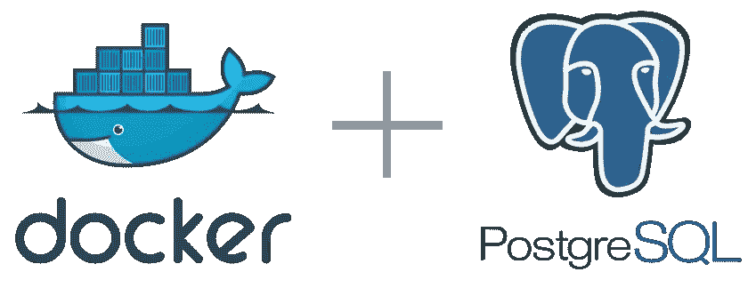
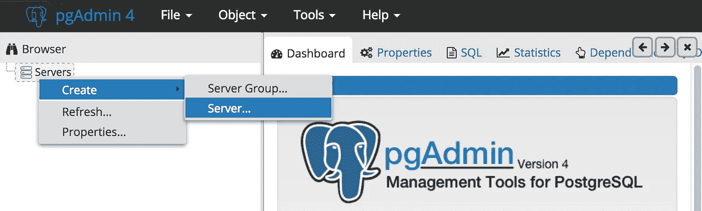
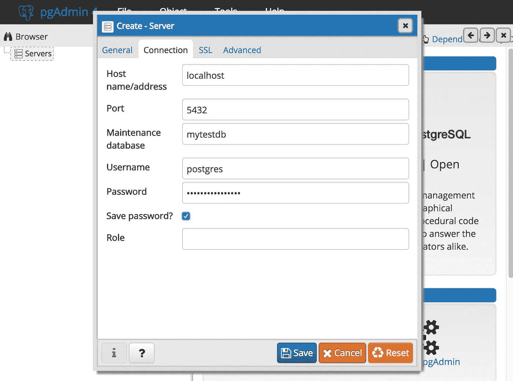

# 从本地机器连接到 Docker 中的 PostgreSQL 数据库

> 原文：<https://betterprogramming.pub/connect-from-local-machine-to-postgresql-docker-container-f785f00461a7>

## 一个简单的方法让你开始使用 Docker



Docker 使得构建 PostgreSQL 数据库管理系统变得非常容易。使用以下命令，可以在服务器或本地计算机上启动 PostgreSQL Docker 容器:

```
$ docker run -d -p 5432:5432 --name my-postgres -e POSTGRES_PASSWORD=mysecretpassword postgres
```

该命令将启动一个 PostgreSQL 数据库，并使用以下模式映射端口:`-p <host_port>:<container_port>`。
我们容器的端口 5432 将被映射到我们主机或服务器的端口 5432 上。

访问主机或服务器上的容器。我们将在 PostgreSQL 容器中创建一个数据库。

```
$ docker exec -it my-postgres bash
```

现在你在你的容器里面。我们可以访问 postgres 并创建数据库。

```
root@cb9222b1f718:/# psql -U postgres
psql (10.3 (Debian 10.3-1.pgdg90+1))
Type "help" for help.postgres=# CREATE DATABASE mytestdb;
CREATE DATABASE
postgres=#\q
```

我们完了。您可以退出您的容器(`\q`)并转到您的本地机器。这里您需要安装一些 PostgreSQL 客户端工具:

*   PSQL (CLI)
*   PgAdmin
*   …

我的 PostgreSQL 容器在我的本地机器上运行，这解释了为什么我要连接本地主机。如果它运行在特定的服务器上，请使用您的服务器 IP。(对于 Windows docker-machine，您可能需要使用 192.168.99.100)。

```
$ psql -h localhost -p 5432 -U postgres -W                       Password for user postgres:                       
psql (9.5.5, server 10.3 (Debian 10.3-1.pgdg90+1))                       WARNING: psql major version 9.5, server major version 10\.                                Some psql features might not work.                       
Type "help" for help.                                               postgres=# \l
                                 List of databases
   Name    |  Owner   | Encoding |  Collate   |   Ctype    |  
-----------+----------+----------+------------+------------+
 mytestdb  | postgres | UTF8     | en_US.utf8 | en_US.utf8 |
 postgres  | postgres | UTF8     | en_US.utf8 | en_US.utf8 |
 template0 | postgres | UTF8     | en_US.utf8 | en_US.utf8 |
           |          |          |            |            |
 template1 | postgres | UTF8     | en_US.utf8 | en_US.utf8 | 
           |          |          |            |            | 
(4 rows)
```

通过身份验证后，您将看到 mytestdb 在可用数据库列表中。现在你可以使用`\c`连接你的数据库。

对于像 PgAdmin 这样的工具，您可以定义您的连接。此外，如果您的容器在其他地方运行，您必须用您的服务器 IP 替换 localhost。



创建服务器连接



定义您的联系

保存连接，就可以连接到运行在 PostgreSQL Docker 容器中的数据库了！


这个帖子是基于一个流行的[所以我给的答案](https://stackoverflow.com/questions/37694987/connecting-to-postgresql-in-a-docker-container-from-outside/37704532#37704532)。希望有帮助！

[](https://www.buymeacoffee.com/dZb8fLN)

如果真的对你有帮助…:)