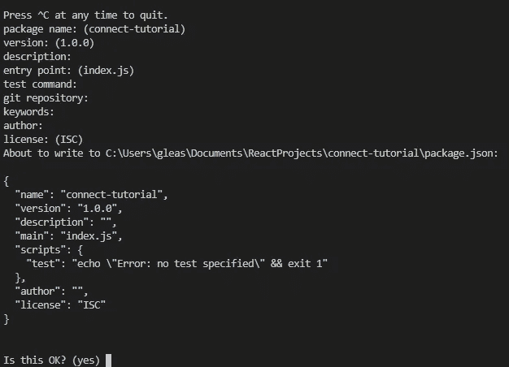
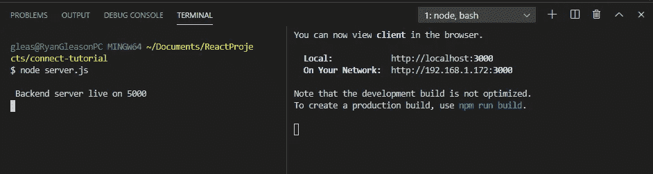
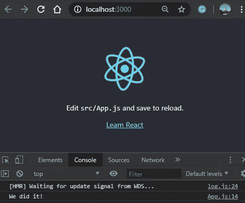

# 使用 axios 连接 Express 和 React 应用程序

> 原文：<https://betterprogramming.pub/connect-your-express-and-react-applications-using-axios-c35723b6d667>

## 把你的前端和后端结合在一起


克里斯·利维拉尼在 [Unsplash](https://unsplash.com/s/photos/client-and-server?utm_source=unsplash&utm_medium=referral&utm_content=creditCopyText) 上的照片

正在寻找将客户端 React 应用程序连接到服务器端 Express 应用程序的方法吗？不要再找了！

我们将使用一个简单的 [axios](https://github.com/axios/axios) 请求来弥合前端和后端之间的差距。

本教程假设您已经安装了 Node.js。如果没有，我创建了下面的教程来帮助你完成这个过程: [*我的 Node.js 环境设置*](https://medium.com/better-programming/my-node-js-mongodb-atlas-rest-api-environment-setup-71923cfbc98c) 。作为本教程的先决条件，您只需要 Node.js 部分。

让我们从头开始。

# 目标

通过 axios API 请求将 React 前端应用程序与 Express 后端应用程序连接起来

# 工具

我们将使用以下工具来帮助我们实现目标:

*   React —我们将在本教程中使用的前端库。 [Create-react-app](https://github.com/facebook/create-react-app) 让我们能够快速启动并运行。
*   Express.js —用于构建 web 应用程序和 API 的 Node.js 框架。
*   Axios — [一个 npm 库](https://www.npmjs.com/package/axios)。用于浏览器和 Node.js 的基于 promise 的 HTTP 客户端
*   CORS——一个国家预防机制图书馆。用于实现跨来源资源共享的 Express 中间件。

# 创建后端

我们将创建一个新目录来存放我们的整个项目。姑且称之为`connect-tutorial`。

```
mkdir connect-tutorial
```

现在，让我们在这里初始化我们的节点服务器。使用以下命令:

```
npm init
```



对于他们问你的所有不同问题，请随意接受默认设置。

让我们现在安装`express`和`cors`。我们需要添加`cors`来允许我们的 axios 请求从前端传递到后端。

```
npm i --save express cors
```

并添加我们的`server.js`文件:

```
touch server.js
```

让我们给`server.js`添加以下代码。这是我们激活启用 CORS(跨源资源共享)的 Express 服务器所需的最低要求:

server.js

如果您在运行`node server.js`之后转到 localhost:5000，您应该会看到这个 JSON:


现在，让它出现在 React 应用程序的控制台中。

# 设置我们的前端

现在让我们在`connect-tutorial`目录中创建 React 应用程序。点击`Ctrl-c`终止后端服务器。我们将命名我们的 React 项目为`client`。

```
npx create-react-app client
```

`cd client`我们将安装一个模块来帮助我们提出 API 请求:

```
npm i --save axios
```

现在，让我们将下面的代码添加到`App.js`中。其中大部分是 React 样板代码。您只需要担心添加 axios 请求:

App.js

在`client`文件夹中运行`npm start`，在`connect-tutorial`目录中运行`node server.js`。



此消息现在将出现在您的控制台中。我们之前看到的相同消息，但是现在在客户端服务器上。



放松点。我们已经将前端 React 应用程序连接到后端 Express 应用程序。

如果您有任何问题、意见或顾虑，请在评论区告诉我。